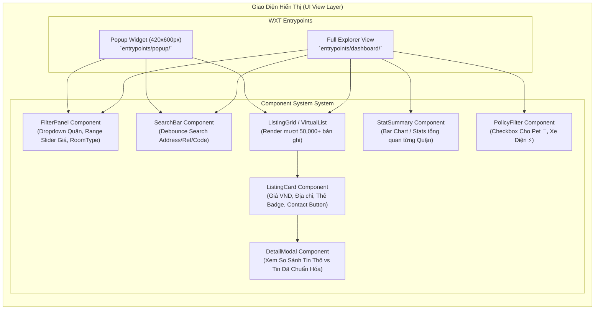
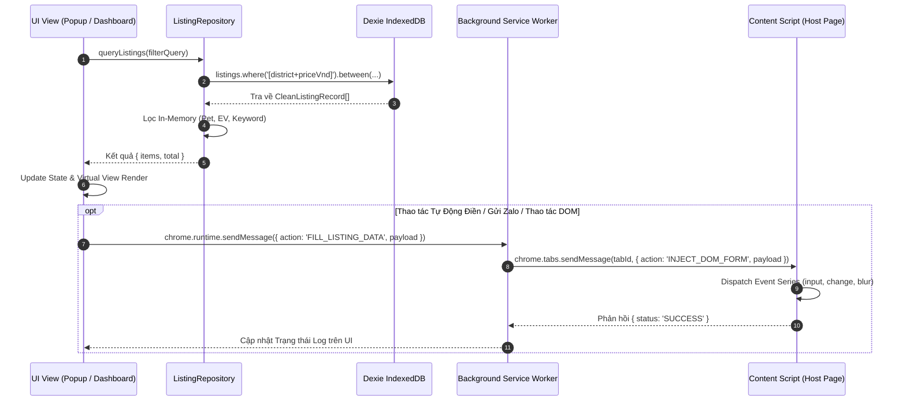
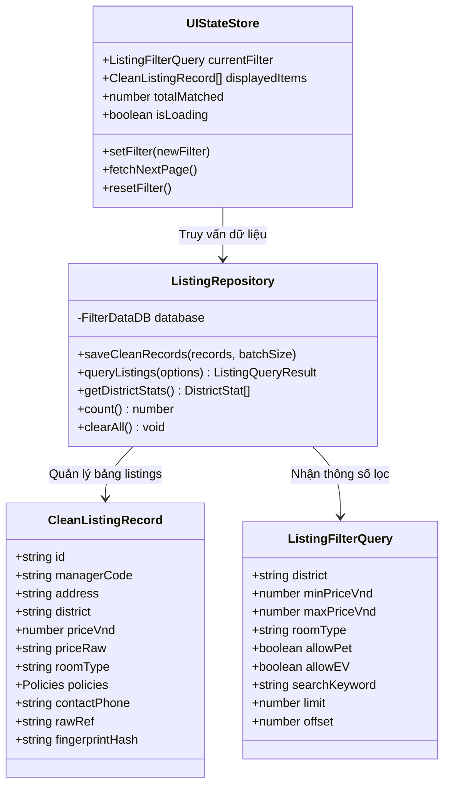
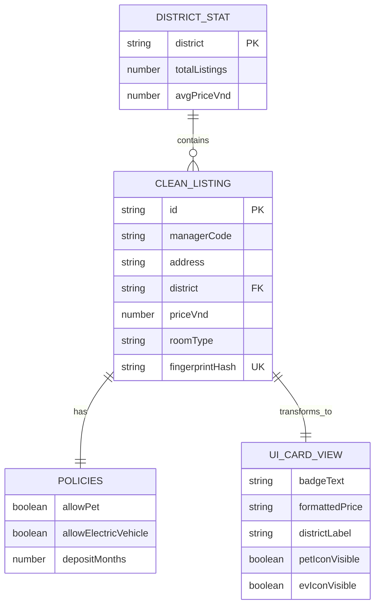
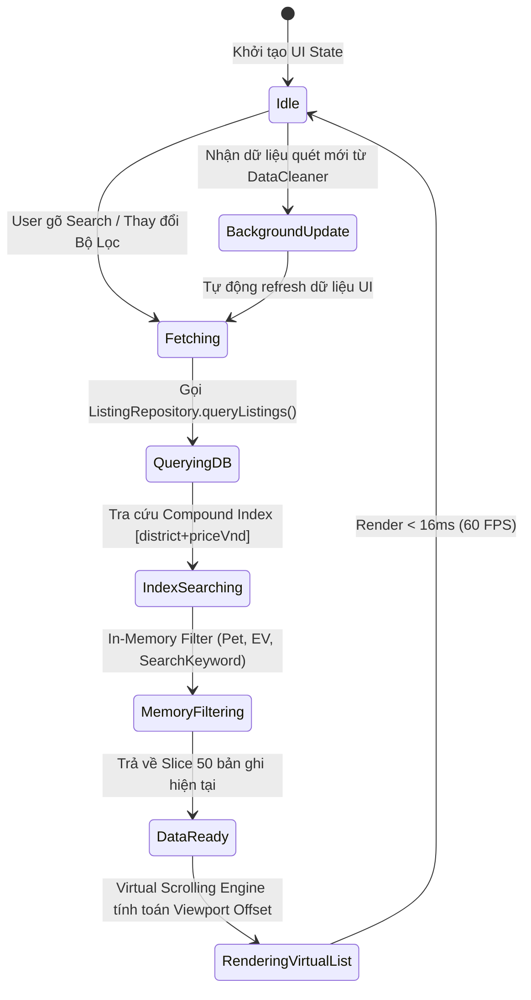

# 📐 THIẾT KẾ KIẾN TRÚC GIAO DIỆN HỂN THỊ DỮ LIỆU CHUẨN HÓA (UI ARCHITECTURE SPECIFICATION)

**Dự án:** WXT Extension — Filter Data  
**Tài liệu tham chiếu:** [Docs/Reports/summary_report.md](file:///home/stveve/Documents/workspace/Sales/extension/filter_data/Docs/Reports/summary_report.md)  
**Tệp mục tiêu:** `Docs/Architect.md`  
**Ngày cập nhật:** 2026-07-24  
**Trạng thái:** Design Analysis Completed  

---

## 🎯 Tổng Quan Dự Án & Mục Tiêu Giao Diện

Sau khi hoàn tất mô-đun chuẩn hóa dữ liệu thô (`utils/data-cleaner`) và tầng lưu trữ dữ liệu IndexedDB Dexie.js (`Data/Database`), hệ thống đã xử lý và trích xuất thành công **54 bản ghi phòng trọ/CCMN sạch** từ các nguồn tin thô với thời gian xử lý **22 ms**, sẵn sàng cho việc mở rộng lên **50.000 – 80.000 bản ghi**.

Tài liệu này trình bày chi tiết phân tích & thiết kế kiến trúc giao diện UI (UI View Layer), phân chia nhiệm vụ chuyên biệt theo **4 Subagent Chuyên gia**:
1. **Subagent 1: UI/UX & Layout System Specialist** — Thiết kế cấu trúc Component, Layout & Hệ thống Tương tác.
2. **Subagent 2: Extension Architecture & Message Flow Specialist** — Đồ họa luồng giao tiếp WXT MV3 & Cross-Context Messaging.
3. **Subagent 3: Database & State Management Specialist** — Thiết kế Quản lý Trạng thái & Tích hợp Dexie IndexedDB.
4. **Subagent 4: Quality & Performance Specialist** — Giải pháp Virtual Scrolling & Kiểm định Hiệu năng 80.000 bản ghi.

---

## 🤖 1. Phân Tích Của Subagent UI/UX & Layout System Specialist

### 1.1. Cấu Trúc Entrypoint Giao Diện (Dual View Strategy)
Giao diện hiển thị được thiết kế theo mô hình **Kép (Dual View)** nhằm đáp ứng cả nhu cầu tra cứu nhanh và khai thác dữ liệu chuyên sâu:

- **Popup View (`entrypoints/popup/index.html`)**: Khung nhỏ gọn (420px × 600px), tích hợp bộ lọc nhanh (Quận, Mức giá, Từ khóa) và danh sách rút gọn 10-20 tin mới nhất.
- **Dashboard / Full-Page View (`entrypoints/dashboard/index.html`)**: Trang toàn màn hình khai thác toàn bộ 80.000 bản ghi, hiển thị dưới dạng Bảng/Card Grid linh hoạt, tích hợp Biểu đồ Thống kê theo Quận (`getDistrictStats()`).

### 1.2. Sơ Đồ Cấu Trúc Component (Mermaid Component Diagram)

### 1.3. Quy Chuẩn Giao Diện & Design Tokens
- **Bảng Màu Tailored (Dark Mode Support):** Primary `#3b82f6` (Blue), Success `#10b981` (Emerald), Warning `#f59e0b` (Amber), Background `#0f172a` (Slate 900), Surface `#1e293b` (Slate 800).
- **Typography:** Sử dụng Font hệ thống hiện đại (`Inter`, `Segoe UI`, `Roboto`), hỗ trợ định dạng tiền tệ Việt Nam `Intl.NumberFormat('vi-VN', { style: 'currency', currency: 'VND' })` (ví dụ: `6.500.000 ₫`).

---

## 🤖 2. Phân Tích Của Subagent Extension Architecture & Message Flow Specialist

### 2.1. Luồng Giao Tiếp Sự Kiện (Cross-Context Message Protocol)
Service Worker (`background.ts`) đóng vai trò trung gian điều phối giữa UI Popup/Dashboard và Content Script trên trang Web Host.

### 2.2. Sơ Đồ Tuần Tự Giao Tiếp (Mermaid Sequence Diagram)

---

## 🤖 3. Phân Tích Của Subagent Database & State Management Specialist

### 3.1. Sơ Đồ Lớp Quản Lý Trạng Thái & Dữ Liệu (Mermaid Class Diagram)

### 3.2. Sơ Đồ Sơ Đồ Thực Thể R-E & Ánh Xạ UI (Mermaid ERD)

---

## 🤖 4. Phân Tích Của Subagent Quality & Performance Specialist

### 4.1. Giải Pháp Xử Lý 80.000 Bản Ghi (Virtual List Lifecycle)
Để tránh treo UI thread khi render hàng chục ngàn DOM node, hệ thống áp dụng kỹ thuật **Virtual Scrolling (Danh sách ảo)** chỉ duy trì 20-30 DOM node trong DOM Tree tương ứng với khung nhìn viewport.

### 4.2. Sơ Đồ Trạng Thái Vòng Đời Render & Filter (Mermaid State Diagram)

---

## 🏁 5. Kế Hoạch Triển Khai & Kiểm Định (Implementation & Verification Plan)

| Bước | Hạng Mục Công Việc | Chi Tiết Kỹ Thuật | Trạng Thái |
| :--- | :--- | :--- | :---: |
| **Bước 1** | Xây dựng UI Component Foundation | Tạo `components/FilterPanel.ts`, `components/ListingCard.ts`, `components/VirtualList.ts` | ⏳ Đang tiến hành |
| **Bước 2** | Tích hợp Repo API vào Popup View | Gắn `listingRepository.queryListings()` & `getDistrictStats()` vào `entrypoints/popup/main.ts` | 🎯 Tiếp theo |
| **Bước 3** | Xây dựng Full-Page Dashboard | Tạo entrypoint `entrypoints/dashboard/` hiển thị bảng dữ liệu & biểu đồ thống kê | 🎯 Tiếp theo |
| **Bước 4** | Kiểm thử Hiệu năng & Boundary | Kiểm thử render 50,000 - 80,000 bản ghi, đo đạc FPS & Memory Usage | 🎯 Tiếp theo |

---

> 📌 **Tài liệu tham chiếu:**
> - [AGENTS.md](file:///home/stveve/Documents/workspace/Sales/extension/filter_data/AGENTS.md)
> - [utils/data-cleaner/AGENTS.md](file:///home/stveve/Documents/workspace/Sales/extension/filter_data/utils/data-cleaner/AGENTS.md)
> - [Docs/Reports/summary_report.md](file:///home/stveve/Documents/workspace/Sales/extension/filter_data/Docs/Reports/summary_report.md)
