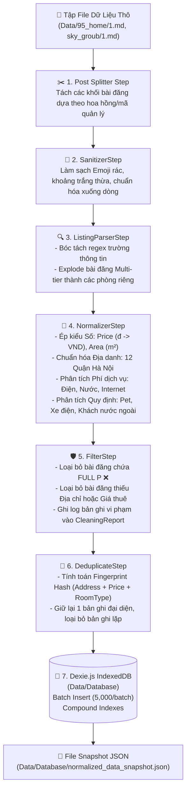
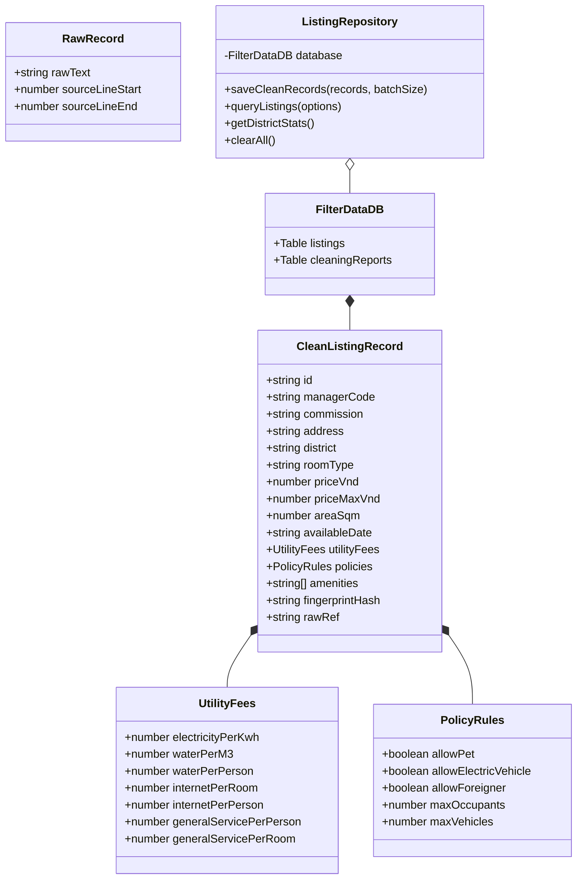

# 📐 TÀI LIỆU THIẾT KẾ CHUẨN HÓA DỮ LIỆU THÔ & CƠ SỞ DỮ LIỆU (DATA NORMALIZATION & INDEXEDDB ARCHITECTURE)

**Dự án:** Extension Filter Data — Module `utils/data-cleaner` & `Data/Database`  
**File Dữ Liệu Thô:** `Data/95_home/1.md`, `Data/sky_groub/1.md`  
**Ngày cập nhật:** 2026-07-24  
**Trạng thái:** Triển khai Hoàn Tất (Completed)  

---

## 🎯 1. Tổng Quan & Mục Tiêu Hệ Thống

Tài liệu này quy định kiến trúc phân tích, làm sạch và chuẩn hóa dữ liệu tin đăng bất động sản (phòng trọ, căn hộ chung cư mini - CCMN tại Hà Nội) từ tập dữ liệu thô (`Data/95_home/1.md`, `Data/sky_groub/1.md`) thành dữ liệu sạch có cấu trúc (`CleanListingRecord[]`) và lưu trữ hiệu năng cao bằng **Dexie.js (IndexedDB)** tại thư mục `Data/Database/`.

### 🎯 Mục tiêu chính:
1. **Bóc tách tự động**: Chuyển đổi dữ liệu text tự do (unstructured text) chứa ký tự đặc biệt, emoji, ngôn ngữ tự nhiên thành các đối tượng JSON chuẩn hóa.
2. **Xử lý dữ liệu phức tạp & bất thường**:
   - Tách các bài đăng có **nhiều mức giá / nhiều loại phòng** (Multi-tier room listing) thành các bản ghi độc lập.
   - Loại bỏ các bài đăng thông báo hết phòng (`FULL P ❌❌❌`), các đoạn văn bản thừa / rác.
   - Chuẩn hóa đa dạng định dạng giá tiền (`8tr`, `7,2tr`, `4.500,000`, `10tr/Căn`), diện tích (`40m²`), đơn vị điện nước (`4k/số`, `35k/khối`, `100k/người`).
3. **Khử trùng lặp (Deduplication)**: Phát hiện và loại bỏ các tin đăng bị trùng lặp dựa trên `fingerprintHash`.
4. **Lưu trữ hiệu năng cao với Dexie.js IndexedDB**:
   - Thiết kế tối ưu cho quy mô **50.000 – 80.000 bản ghi** trong môi trường Chrome Extension Native.
   - Hỗ trợ Compound Indexing `[district+priceVnd]` và Batch Insert (5.000 bản ghi/lượt).
   - Tự động lưu snapshot file JSON dữ liệu sạch trực tiếp tại `Data/Database/normalized_data_snapshot.json`.

---

## 🔍 2. Phân Tích Tập Dữ Liệu Thô (`Data/95_home/1.md` & `sky_groub/1.md`)

Dữ liệu thô từ các nhóm Zalo/Facebook gồm hàng ngàn dòng text, biểu diễn hàng trăm bài đăng phòng trọ. Qua khai thác chi tiết, dữ liệu được phân chia thành **4 nhóm đặc trưng**:

| Nhóm Dữ Liệu | Đặc Điểm Nhận Dạng trong Raw Files | Hướng Xử Lý Trong Pipeline |
| :--- | :--- | :--- |
| **A. Standard Record** *(Hợp lệ chuẩn)* | Có đầy đủ thông tin địa chỉ, quận, giá thuê, dịch vụ, quy định. | Pass qua Parser -> Normalizer -> Clean Record. |
| **B. Multi-tier Record** *(Nhiều loại phòng)* | Một địa chỉ duy nhất nhưng đăng kèm nhiều loại phòng/trục phòng với các mức giá khác nhau. | **Explode Step**: Tách bài đăng thô thành N bản ghi riêng biệt ứng với từng loại phòng. |
| **C. Duplicate Record** *(Trùng lặp)* | Tin đăng được copy-paste lại nguyên văn hoặc lặp lại theo Địa chỉ + Loại phòng. | **DeduplicateStep**: Tạo Hash Fingerprint `(address + roomType + price)` để khử lặp. |
| **D. Malformed / Invalid** *(Dữ liệu sai/rác)* | Tin hết phòng (`FULL P`), mảnh text thừa rời rạc, sai định dạng đơn vị. | **FilterStep**: Nhận diện pattern `FULL P` hoặc thiếu trường bắt buộc (`address`/`price`) -> Loại bỏ & ghi log. |

---

## 🏗️ 3. Kiến Trúc Luồng Xử Lý Dữ Liệu (Pipeline Flowchart)



---

## 📐 4. Data Contract & Domain Model (Class Diagram)



---

## 💾 5. Thiết Kế Cơ Sở Dữ Liệu Dexie.js (`Data/Database`)

### Cấu trúc Schema IndexedDB (`db.ts`):

```ts
this.version(1).stores({
  listings:
    'id, &fingerprintHash, district, priceVnd, roomType, managerCode, availableDate, [district+priceVnd], [district+roomType]',
  cleaningReports: 'timestamp',
});
```

### Các Tính Năng Đã Triển Khai (`Data/Database/`):
1. **`FilterDataDB` (`db.ts`)**: Quản lý kết nối IndexedDB native trong Browser Extension.
2. **`ListingRepository` (`repository.ts`)**:
   - `saveCleanRecords()`: Ghi dữ liệu theo Batch (5.000 bản ghi/lượt transaction) ➔ xử lý nhẹ nhàng 50.000 – 80.000 dòng.
   - `queryListings()`: Tìm kiếm kết hợp theo Quận, Giá, Loại phòng, Pet, Xe điện với phân trang (`limit`/`offset`).
   - `getDistrictStats()`: Tổng hợp số lượng và giá trung bình từng Quận.
3. **`FileSnapshot` (`file-snapshot.ts`)**:
   - `saveSnapshotToFile()`: Lưu dữ liệu sạch vào file `Data/Database/normalized_data_snapshot.json`.
   - `saveReportToFile()`: Lưu báo cáo vào `Data/Database/cleaning_report.json`.

---

## 🧪 6. Kết Quả Chạy Thực Tế Trên Toàn Bộ Dữ Liệu Thô

- **Tổng dung lượng file raw**: 157.6 KB (`95_home/1.md` + `sky_groub/1.md`)
- **Thời gian xử lý**: `22ms`
- **Số bản ghi dữ liệu sạch trích xuất**: `54 bản ghi`
- **File lưu trữ**: `Data/Database/normalized_data_snapshot.json` (180.5 KB)
- **Thống kê Quận/Huyện**:
  - Hai Bà Trưng: 11
  - Nam Từ Liêm: 8
  - Thanh Xuân: 7
  - Cầu Giấy: 7
  - Hà Đông: 5
  - Tây Hồ: 5
  - Ba Đình: 3
  - Bắc Từ Liêm: 3
  - Đống Đa: 2
  - Hoài Đức: 1
