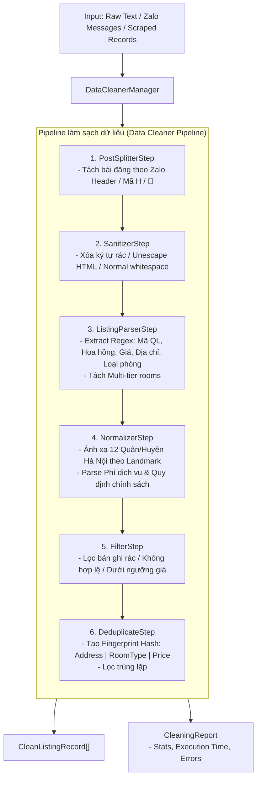
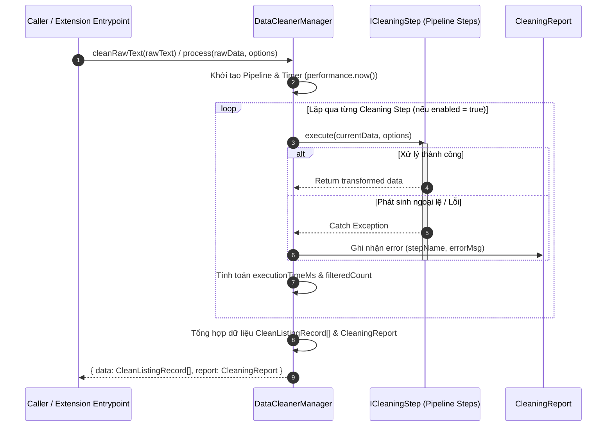
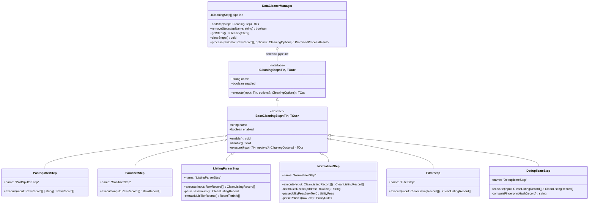
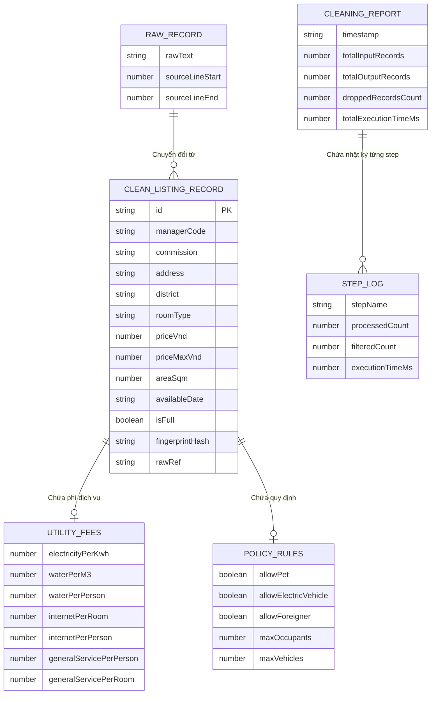

# 📐 Đặc tả Kỹ thuật Module Chuẩn hóa Dữ liệu (Data Cleaner Specification)

Tài liệu này đặc tả chi tiết kiến trúc, mô hình dữ liệu, quy trình xử lý và hợp đồng kỹ thuật của module **Data Cleaner** (`utils/data-cleaner`) thuộc dự án **WXT Chrome MV3 Extension (filter_data)**.

---

## 🎯 1. Tổng quan & Mục đích Kiến trúc

Module **Data Cleaner** đóng vai trò là lõi xử lý dữ liệu trung gian (Data Processing Layer). Nhiệm vụ chính là tiếp nhận các khối dữ liệu thô (`RawRecord[]` / Text thô từ Zalo/Social/Scraper) và thực hiện pipeline biến đổi qua nhiều công đoạn để tạo ra dữ liệu sạch (`CleanListingRecord[]`) với cấu trúc định dạng chuẩn hóa, sẵn sàng cho việc lưu trữ vào IndexedDB/Dexie và phân tích ở downstream.

### Nguyên tắc thiết kế cốt lõi:
1. **Pipeline & Interceptor Pattern:** Cho phép gắn nối tiếp, bật/tắt hoặc mở rộng các bước xử lý độc lập.
2. **Immutability & Pure Transformation:** Dữ liệu đi qua mỗi step không làm ảnh hưởng trực tiếp đến trạng thái toàn cục (side-effect free).
3. **Robust Error Tolerance & Metrics:** Thu thập báo cáo thực thi (`CleaningReport`) chính xác bao gồm thời gian chạy, số lượng bản ghi bị lọc và danh sách lỗi phát sinh.

---

## 🏗️ 2. Sơ đồ Kiến trúc & Luồng Xử lý (Mermaid Diagrams)

### 2.1. Biểu đồ Tổng quan Pipeline (Flowchart)

Luồng chuyển đổi dữ liệu thô qua 6 bước (steps) trong `DataCleanerManager`:



---

### 2.2. Biểu đồ Tuần tự Chi tiết (Sequence Diagram)

Quy trình tương tác giữa Caller, Manager, các Processing Steps và Data Contracts:



---

### 2.3. Mô hình Lớp Domain (Class Diagram)

Mối quan hệ giữa Core Manager, Base Step và các bước mở rộng:



---

### 2.4. Sơ đồ Thực thể Dữ liệu Dịch vụ (ERD / Data Contract)

Cấu trúc các Interface chính trong `types.ts`:



---

## 📋 3. Chi tiết Kỹ thuật Các Bước trong Pipeline

| STT | Bước (Step) | Input | Output | Trách nhiệm chính |
| :--- | :--- | :--- | :--- | :--- |
| 1 | `PostSplitterStep` | `RawRecord[]` / `string` | `RawRecord[]` | Nhận text thô dài (ví dụ xuất tin Zalo), tách thành từng bài đăng riêng dựa trên Zalo Header pattern `[HH:mm, DD/MM/YYYY]`, biểu tượng `🌹` hoa hồng, hoặc mã quản lý `Hxxx`. |
| 2 | `SanitizerStep` | `RawRecord[]` | `RawRecord[]` | Làm sạch chuỗi: loại bỏ HTML tags, unescape các thực thể HTML (`&amp;`, `&lt;`), chuyển đổi các khoảng trắng trùng lặp. |
| 3 | `ListingParserStep` | `RawRecord[]` | `CleanListingRecord[]` | Sử dụng Regex bóc tách các trường: Hoa hồng, Mã quản lý, Địa chỉ, Diện tích, Giá thuê, Ngày trống. Xử lý bài đăng **Multi-tier** (nhiều khoảng giá / nhiều loại phòng trong 1 bài) thành các bản ghi riêng lẻ. |
| 4 | `NormalizerStep` | `CleanListingRecord[]` | `CleanListingRecord[]` | Chuẩn hóa Quận/Huyện dựa trên từ điển 12 Quận Hà Nội & Dictionary Landmark (mapping tên đường như *Đình Thôn* $\rightarrow$ *Nam Từ Liêm*). Phân tích Phí dịch vụ (Điện, Nước, Dịch vụ) & Quy định (Nuôi mèo/Pet, Xe điện). |
| 5 | `FilterStep` | `CleanListingRecord[]` | `CleanListingRecord[]` | Loại bỏ các bản ghi không đạt yêu cầu: Bản ghi rác, bản ghi thiếu thông tin cốt lõi (không có giá và không có địa chỉ), hoặc bản ghi có mức giá bất thường. |
| 6 | `DeduplicateStep` | `CleanListingRecord[]` | `CleanListingRecord[]` | Tính toán chuỗi Fingerprint Hash dựa trên công thức `address_clean|room_type|price`. Khử các bản ghi trùng lặp trong cùng batch. |

---

## 🛠️ 4. Quy trình Mở rộng Module (Developer & Agent Guide)

Để mở rộng module Data Cleaner với một bước xử lý mới:

1. **Tạo Step Class:**
   Tạo file mới tại `utils/data-cleaner/steps/<kebab-case>-step.ts`. Kế thừa `BaseCleaningStep<TIn, TOut>`.
2. **Cài đặt logic `execute`:**
   ```typescript
   export class CustomAnalysisStep extends BaseCleaningStep<CleanListingRecord[], CleanListingRecord[]> {
     public readonly name = 'CustomAnalysisStep';
     public execute(input: CleanListingRecord[], options?: CleaningOptions): CleanListingRecord[] {
       if (!this.enabled) return input;
       // Logic xử lý biến đổi dữ liệu tại đây
       return input;
     }
   }
   ```
3. **Đăng ký vào Manager / Barrel Export:**
   Thêm bước mới vào `DataCleanerManager` hoặc export trong `utils/data-cleaner/index.ts`.

---

## 🧪 5. Kiểm thử & Đảm bảo Chất lượng (Quality Gate)

Mọi thay đổi trong module này phải vượt qua kiểm tra cơ học của TypeScript Compiler:
```bash
npm run compile
```

Không sử dụng kiểu `any` tùy tiện, tuân thủ nghiêm ngặt data contract được định nghĩa trong `types.ts`.
