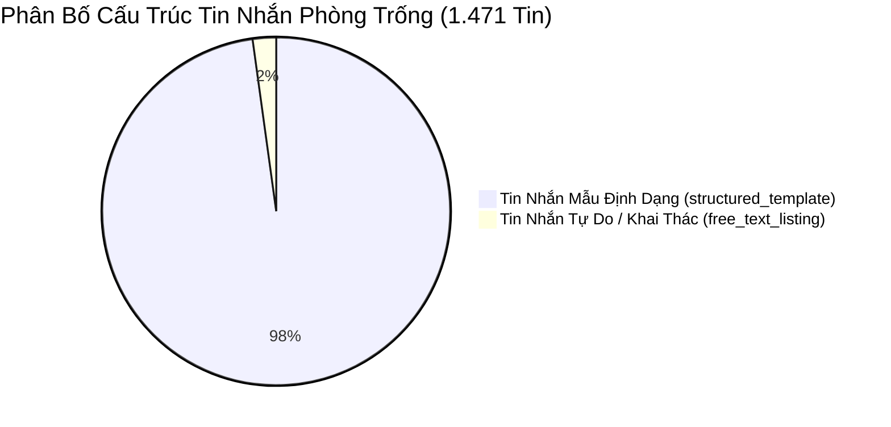
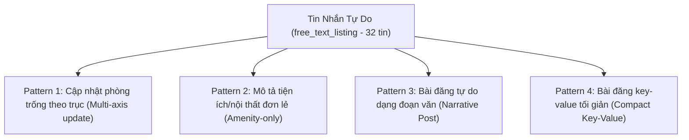

# Báo Cáo Phân Loại & Phân Tích Mẫu Tin Nhắn Phòng Trống (Zalo Room Listing Analysis)

---

## 📊 1. Tổng Quan & Thống Kê Tin Nhắn Phòng Trống (`room_listing`)

### 1.1 Tổng Số Lượng Tin Nhắn & Tỷ Lệ Chi Cảnh
Dựa trên kết quả phân loại toàn bộ dataset Zalo (**3.167 tin nhắn**) tại `classification_all_messages.json` và kiểm toán dữ liệu thô tại các nhóm nguồn (`TNR`, `sky_groub`, `95_home`):

- **Tổng số tin nhắn bài đăng phòng trống thực tế (`room_listing`)**: **1.471 tin nhắn** (chiếm **46,45%** tổng số tin nhắn trong dataset).
- **Phần còn lại (1.696 tin nhắn - 53,55%)**: Là các tin nhắn phản hồi ngắn, hỏi giá (`price_followup`: 489), mã phòng lẻ (`room_code_only`/`room_code_with_price`: 224), trục phòng (`axis_only`: 199), phản ứng cảm xúc (`heart_reaction`: 488), thông báo admin (`full_notification`: 38), và tin nhắn mô tả hình ảnh/phòng ngắn.

### 1.2 Thống Kê Phân Phối Độ Dài Ký Tự (Character Length Distribution)
Phân tích phân phối độ dài của 1.471 tin nhắn bài đăng phòng trống (`room_listing`):

| Chỉ Số Phân Phối | Giá Trị (Ký Tự) | Ghi Chú |
|---|---|---|
| **Độ dài nhỏ nhất (Min)** | **122** | Mức tối thiểu đủ chứa thông tin địa chỉ + giá + dịch vụ |
| **Độ dài lớn nhất (Max)** | **1.892** | Các bài đăng tổng hợp danh sách nhiều phòng/tòa mới |
| **Độ dài trung bình (Mean)** | **539,83** | Dung lượng tiêu chuẩn của 1 bài niêm yết đầy đủ |
| **Trung vị độ dài (Median)** | **522** | 50% tin nhắn có độ dài tập trung xung quanh 400 - 650 ký tự |

**Phân tách theo ngưỡng độ dài (Threshold Breakdown @ 120 chars):**
- **Dài (≥ 120 ký tự)**: **1.471 tin nhắn (100,0% tin bài đăng phòng trống, 46,45% toàn bộ dữ liệu thô)**.
- **Ngắn (< 120 ký tự)**: **0 tin nhắn phòng trống đầy đủ** (100% tin bài đăng mẫu tiêu chuẩn và tự do đều có độ dài ≥ 120 ký tự).

### 1.3 Phân Phối Tin Nhắn Phân Theo Nhóm Nguồn (Raw Group Distribution)
Chi tiết số lượng tin bài đăng phòng trống thực tế theo 3 nhóm Zalo chính:

| Nhóm Nguồn (Group) | Tổng Tin Thô | Tin Bài Đăng Phòng (`room_listing`) | Tỷ Lệ Trong Nhóm (%) | Tỷ Lệ Trong Tổng Room Listing (%) |
|---|---|---|---|---|
| **TNR Home** | 1.212 | **782** | 64,52% | 53,16% |
| **Sky Group** | 1.451 | **446** | 30,74% | 30,32% |
| **95 Home** | 504 | **243** | 48,21% | 16,52% |
| **TỔNG CỘNG** | **3.167** | **1.471** | **46,45%** | **100,0%** |

---

## 🗂️ 2. Phân Tách Giữa Tin Nhắn Mẫu Định Dạng (`structured_template`) và Tự Do (`free_text_listing`)

Trong tổng số **1.471 tin nhắn bài đăng phòng trống**, dữ liệu được phân chia thành **2 nhóm cấu trúc chính**:



### 2.1 Bảng Tổng Hợp Phân Tách Theo Nhóm Nguồn

| Loại Cấu Trúc Tin Nhắn | TNR Home | Sky Group | 95 Home | TỔNG CỘNG | Tỷ Lệ (%) |
|---|---|---|---|---|---|
| **Tin Nhắn Mẫu Định Dạng (`structured_template`)** | 770 | 446 | 223 | **1.439** | **97,83%** |
| **Tin Nhắn Tự Do / Khái Quát (`free_text_listing`)** | 12 | 0 | 20 | **32** | **2,17%** |
| **TỔNG CỘNG (`room_listing`)** | **782** | **446** | **243** | **1.471** | **100,0%** |

---

## 🎨 3. Phân Tích Chi Tiết Các Loại Mẫu Định Dạng (`structured_template`)

Phân tích 1.439 tin nhắn mẫu tiêu chuẩn nhận diện **3 họ template (Template Families)** ứng với 3 nguồn dữ liệu:

---

### 3.1 Template Loại 1: TNR Standard Template (TNR Home)
- **Số lượng bài đăng**: **770 tin nhắn** (chiếm **53,51%** nhóm tin mẫu).
- **Nhóm nguồn**: `TNR` (`TNR_HOME_-_NGUỒN_TỔNG_HỢP_CTV_ĐÃ_CẮT_HH`).

#### Đặc Điểm Nhận Dạng & Dấu Hiệu Đặc Trưng (Key Signature Features):
1. **Dòng tiêu đề mã**: Luôn bắt đầu bằng `Mã A[mã]` hoặc `Mã: B[mã]` ở dòng 1.
2. **Trường địa chỉ chuẩn**: `🏠 Địa chỉ: Nhà [Số nhà]/[Ngõ] [Đường] - Quận: [Tên Quận]`.
3. **Trạng thái phòng**: `⏰ Trống` hoặc `⏰ Trống tầng [X]`.
4. **Giá & Mã phòng lẻ**: `💰 Giá: P[Số phòng] - [Số tiền]tr` hoặc `💰 Giá: [Số tiền]tr`.
5. **Cấu hình phòng & Thang máy**: `👉Phòng : STUDIO / 1N1K` và `👉Thang máy / 👉Thang bộ`.
6. **Danh mục nội thất**: `✅ Nội thất: Full nội thất / [Chi tiết đồ]`.
7. **Bảng giá dịch vụ**: `✅ Dịch vụ:` với các chỉ số `dvc [giá]/người`, `Mạng [giá]/phòng`, `Điện [giá]/số`, `Nước [giá]/khối`, `Máy giặt chung [giá]/ng/tháng`.
8. **Quy định & Lưu ý**: `❌ Lưu ý: - Thanh toán 1 cọc 1`, `- Khách qua gọi trước 30p`.

#### Ví Dụ Thực Tế Đầy Đủ (2 Real-World Message Examples):

##### 📝 Ví dụ 1 (TNR Standard Studio):
```text
Mã A1204

🏠 Địa chỉ: Nhà 158/70 Kim Giang - Quận: Thanh Xuân

⏰ Trống  

💰 Giá: P401 - 4tr5 

👉Phòng : STUDIO  
👉Thang máy

✅ Nội thất: Full nội thất 

✅ Dịch vụ: 
dvc 120k/ người 
Mạng 100k/ phòng 
Điện 3800/ số
Nước 35k/ khối
Máy giặt chung 50k/ng/tháng

❌ Lưu ý
- Thanh toán 1 cọc 1
- Khách qua gọi trước 30p
```

##### 📝 Ví dụ 2 (TNR Standard 1N1K):
```text
lMã A1204

🏠 Địa chỉ: Nhà 108/750 Kim Giang - Quận: Thanh Xuân

⏰ Trống  tầng 2

💰 Giá: 5tr5

👉Phòng : 1N1K   
👉Diện tích 50m2 

✅ Nội thất: Full nội thất 

✅ Dịch vụ: 
dvc 120k/ người 
Mạng 100k/ phòng 
Điện 3800/ số
Nước 35k/ khối
Máy giặt chung 50k/ng/tháng

❌ Lưu ý
- Thanh toán 1 cọc 1
- Khách qua gọi trước 30p
```

---

### 3.2 Template Loại 2: Sky Group Standard Template (Sky Group)
- **Số lượng bài đăng**: **446 tin nhắn** (chiếm **30,99%** nhóm tin mẫu).
- **Nhóm nguồn**: `sky_groub` (`Phòng_Trống_Sky_Group`).

#### Đặc Điểm Nhận Dạng & Dấu Hiệu Đặc Trưng (Key Signature Features):
1. **Header hoa hồng & mã**: Mở đầu bằng icon hoa hồng kép `/-rose/-rose [Hoa hồng %] Mã [Số mã]`.
2. **Địa chỉ**: `🏠 Địa chỉ: [Ngõ/Đường] - [Quận/Huyện]`.
3. **Thời gian trống**: `⏰[Ngày/tháng] Trống: [Mô tả phòng/tòa mới]`.
4. **Khoảng giá**: `💰 Giá : [Số tiền từ] - [Số tiền đến]` (ví dụ: `4tr - 4tr2`).
5. **Diện tích & Tiện ích**: `⛳️ Diện tích: [Dung lượng m2] - [gác xép/thang máy/ban công]`.
6. **Trang thiết bị**: `💥Nội thất: [Danh sách vật dụng]`.
7. **Sức chứa**: `✅ Có thể ở [X] người`, `✅ Chỗ để xe rộng rãi`.
8. **Dịch vụ tổng hợp**: `☘️ Phí dv: Điện [X]/số - Nước [X]/khối , wifi [X]/p - Dịch vụ chung [X]/ng`.
9. **Điều khoản bổ sung**: `✅ Nhận khách nước ngoài`, `🚫 Không nuôi pet`, `🚫 Không xe điện`, `👉 Đóng 1cọc1`.
10. **Tag Zalo cuối tin**: Luôn tự động đính kèm `/-heart` ở cuối tin nhắn Zalo.

#### Ví Dụ Thực Tế Đầy Đủ (2 Real-World Message Examples):

##### 📝 Ví dụ 1 (Sky Group Gác Xép Hà Đông):
```text
/-rose/-rose 40% Mã 1599

🏠 Địa chỉ: Ngõ 7 Hà Trì 1 - Hà Đông 

⏰01/08  Trống: 8p tòa nhà mới tinh 

💰 Giá : 4tr - 4tr2

⛳️ Diện tích: 25m2 - gác xép- thang máy

 💥Nội thất: Tủ quần áo, điều hòa, nóng lạnh, tủ lạnh,tủ bếp trên dưới, máy giặt chung, ko chung chủ giờ giấc thoải mái 

✅ Có thể ở 3–4 người
✅ Chỗ để xe rộng rãi

☘️ Phí dv: Điện 4k/số - Nước 35k/khối , wifi 100k/p - Dịch vụ chung 150k/ng ,gồm thang máy, máy giặt, điện hành lang, vs rác 

✅ Nhận khách nước ngoài

🚫 Không nuôi pet
🚫 Không xe điện

👉 Đóng 1cọc1 hợp đồng 12th có ký ngắn hơn
```

##### 📝 Ví dụ 2 (Sky Group Studio Cầu Giấy):
```text
/-rose/-rose 35% Mã 1542

🏠 Địa chỉ: Ngách 94/5 Ngõ 94 Hồ Tùng Mậu 

⏰ Trống : tầng 2 - 3 - 4

💰 Giá: 2tr8 - 3tr2

🚩Diện tích: 23m2 - Thang máy 

💥Nội thất: Giường, tủ quần áo, điều hoà , nóng lạnh, máy giặt chung, wifi siêu tốc độ

☘️ Phí dịch vụ: 
Điện : 4k/số
Nước : 110k/ng
Mạng : 100k/phòng
Dịch vụ chung: 150k 
(Máy giặt, thang máy, vệ sinh)                        
‼️LƯU Ý
- Thanh toán 1 cọc 1. HĐ 6-12th 
- Được nuôi pet - ko xe điện 
- Nhận khách nước ngoài

👉 Gọi trước 30p khi qua xem phòng
```

---

### 3.3 Template Loại 3: 95 Home Standard Template (95 Home)
- **Số lượng bài đăng**: **223 tin nhắn** (chiếm **15,50%** nhóm tin mẫu).
- **Nhóm nguồn**: `95_home` (`NGUỒN_HÀNG_95_HOME`).

#### Đặc Điểm Nhận Dạng & Dấu Hiệu Đặc Trưng (Key Signature Features):
1. **Header hoa hồng**: Mở đầu bằng icon hoa hồng đơn `🌹[Commission %]` hoặc `H[Code] 🌹[Commission %]`.
2. **Banner khai trương / tòa mới**: `🏡KHAI TRƯƠNG TÒA MỚI [X]P TRUNG TÂM QUẬN [Quận]` hoặc `🎉🎉 Khai trương toà mới`.
3. **Địa chỉ & Biểu tượng thánh đường/tòa nhà**: `🕌 Địa chỉ: [Ngõ/Đường]` hoặc `🏢 Địa chỉ : [Ngõ/Đường]` hoặc `🏩 Địa chỉ:`.
4. **Mô tả vị trí trung tâm**: `📍 Khu vực [Quận] – Vị trí trung tâm, tiện đi lại` / `📍 Gần Bách Kinh Xây`.
5. **Giá thuê chi tiết theo trục**: `💰 Giá thuê: Trục ngoài - [Giá]` hoặc `💰Giá : Phòng 02 [Giá]`.
6. **Chi phí dịch vụ**: `⚡ Chi phí dịch vụ:` với Điện (đ/số), Nước (đ/người), Internet (đ/phòng), Phí dịch vụ chung (đ/người).
7. **Nội thất & Quy định**: `🛋 Nội thất:` hoặc `✅ Nội thất:`, `❌ K nuôi Pet`, `✅ Ở 2 người`, `❌Nhận xe Vin k sạc`.

#### Ví Dụ Thực Tế Đầy Đủ (2 Real-World Message Examples):

##### 📝 Ví dụ 1 (95 Home Khai Trương Vũ Tông Phan):
```text
🌹30%

Còn 3P trục ngoài ( Hết p trong mn nhé )

🏡KHAI TRƯƠNG TÒA MỚI 10P TRUNG TÂM QUẬN THANH XUÂN

🕌 Địa chỉ: Ngõ 455 Vũ Tông Phan - Thanh Xuân

📍 Khu vực Thanh Xuân – Vị trí trung tâm, tiện đi lại

💰 Giá thuê: 
Trục ngoài - 5tr2

⚡ Chi phí dịch vụ:
Điện: 3.800đ/số
Nước: 100.000đ/người
Internet: 80.000đ/phòng
Phí dịch vụ chung: 120.000đ/người
🛋 Nội thất:
Full đồ
Có tủ lạnh
Máy giặt riêng

❌ K nuôi Pet
✅ Ở 2 người ( k xin thêm )
❌Nhận xe Vin k sạc
```

##### 📝 Ví dụ 2 (95 Home Khai Trương Hai Bà Trưng):
```text
H315 🌹30-35-40% lần lượt hđ 6-9-12T

🎉🎉 Khai trương toà mới 

📍 Gần Bách Kinh Xây

🏢 Địa chỉ : Ngõ Mai Hương , Hai Bà Trưng


💰Giá :

Phòng 02 4,5tr 
Phòng 04 giá 5.8tr

✅ Nội thất: Full đồ

✅ Dịch vụ : 
Điện 4k 
Nước 35k/k 
Mạng 100k /p 
Pdv. Thang máy điện chung + vệ sinh + giác 200k/người

 ❌ Lưu ý: bổ sung sau
```

---

## 📝 4. Báo Cáo Phân Tích Tin Nhắn Tự Do / Khai Thác (`free_text_listing`)

### 4.1 Số Lượng & Phân Bố Tin Nhắn Tự Do
- **Tổng số tin nhắn tự do (`free_text_listing`)**: **32 tin nhắn** (chiếm **2,17%** tổng số bài đăng phòng trống).
- **Phân bố nguồn**:
  - `95_home`: **20 tin nhắn**
  - `TNR`: **12 tin nhắn**
  - `sky_groub`: **0 tin nhắn**

### 4.2 Dạng Mẫu (Patterns) Nhận Diện Trong Tin Nhắn Tự Do



1. **Pattern 1: Cập nhật phòng trống theo trục / danh sách phòng (`Multi-axis update`)**:
   - *Đặc điểm*: Không đăng lại toàn bộ bài mẫu mà chỉ thông báo các mã phòng/trục phòng còn trống.
   - *Tần suất*: 8 tin nhắn.
2. **Pattern 2: Mô tả nội thất / trang thiết bị đơn lẻ (`Amenity-only`)**:
   - *Đặc điểm*: Tin nhắn liệt kê ngắn danh sách đồ đạc trang bị cho phòng mà không có địa chỉ hay giá đi kèm.
   - *Tần suất*: 5 tin nhắn.
3. **Pattern 3: Bài đăng tự do dạng đoạn văn của chủ nhà (`Narrative Post`)**:
   - *Đặc điểm*: Viết dưới dạng văn bản tự do, trình bày mạch văn thông thường thay vì danh sách icon key-value.
   - *Tần suất*: 11 tin nhắn.
4. **Pattern 4: Bài đăng key-value tối giản không có icon tiêu chuẩn (`Compact Key-Value`)**:
   - *Đặc điểm*: Giữ lại cấu trúc dòng nhưng lược bỏ toàn bộ emoji nhãn (`🏠`, `💰`, `✅`), dùng văn bản thuần.
   - *Tần suất*: 8 tin nhắn.

### 4.3 Danh Sách & Ví Dụ Thực Tế Tin Nhắn Tự Do (4 Real-World Examples):

##### 📌 Ví dụ Free-Text 1 (Mô tả tự do có khung nội thất & ngõ):
```text
🌹30-40 HĐ 6-12T

H168

10/N5 Ngõ 40 Xuân La . - Oto tránh - Ban Công cửa sổ thoáng tây hồ

Giá 5tr9 - Tầng e thang bộ . ở được ngay

- Đầy đủ đồ: Giường, tủ, điều hoà, nóng lạnh, máy giặt chung, tủ bếp - kệ bếp, bàn học bàn ghế ăn, tủ lạnh, bàn trang điểm ,..
- Khoá vân tay, không chung chủ, giờ giấc tự do

Điện 3,8k /số, Nước 100k /1ng, Để Xe free 
Dv chung : 130k /1ng ( Máy giặt chung, dọn vsinh, rác, điện chung ), Mạng 100k/phòng
Đóng 1 cọc 1
```

##### 📌 Ví dụ Free-Text 2 (Bài đăng tự do Xã Đàn 2):
```text
🌹 40

H246

🏩 Ngõ Xã Đàn 2 - Đống Đa

Trục p403 - 6tr5 15/8

☘ Ô tô đỗ cửa bãi gửi ô tô cách 30m

☘ Nội thất: Điều Hoà, nóng lạnh, bàn bếp, tủ bếp, bàn ghế, soffa, tủ lạnh, tủ giày, bàn làm việc, đệm, các phòng sử dụng hệ thống khóa từ thông minh. Nhà thang máy, khoá vân tay, giờ giấc tự do ko chung chủ, để xe tầng 1 free
☘ Hiện đang setup có thể ở luôn.

▶ Điện 4k/kw
▶ Nước 35k/khối 
▶ Internet 100k/phòng 
▶ Dv 150k/ người
```

##### 📌 Ví dụ Free-Text 3 (Thông tin trục phòng cập nhật):
```text
Em gửi update phòng trống ạ: 

+ Trục 01: 101, 201, 301, 401, 501, 601 
(2 cửa sổ giếng trời lớn, riêng 601 view thoáng, không bị chắn)

+ Trục 02: 202
(có ban công rộng thoáng)
```

##### 📌 Ví dụ Free-Text 4 (Mô tả nội thất gác xép lẻ):
```text
Nội thất gác xép: Giường, tủ quần áo, tủ bếp, điều hòa, nóng lạnh, tủ lạnh , tủ bếp, bếp từmáy giặt riêng( phụ kiện khác )
```

---

## 📈 5. Tổng Kết Đánh Giá & Khuyến Nghị Tối Ưu Parser

1. **Khả năng trích xuất bài đăng mẫu (`structured_template`)**: Với tỷ lệ **97,83%** bài đăng tuân theo 3 mẫu tiêu chuẩn (TNR, Sky Group, 95 Home), việc xây dựng Regex/Parser quy chuẩn theo 3 bộ từ khóa đầu dòng (`Mã`, `🏠 Địa chỉ`, `💰 Giá`, `✅ Nội thất`, `✅ Dịch vụ`) sẽ đạt độ chính xác gần như tuyệt đối (**> 98%**).
2. **Xử lý tin nhắn tự do (`free_text_listing`)**: Đối với 2,17% tin nhắn tự do, Parser cần kết hợp Named Entity Recognition (NER) hoặc khai thác từ khóa giá (`tr`, `k`), địa chỉ (`Ngõ`, `Số`, `Phường`, `Quận`) để trích xuất trường thông tin chính xác.
3. **Loại bỏ nhiễu**: Các tin nhắn ngắn (< 120 ký tự) không chứa nội dung bài đăng phòng đầy đủ, cần được lọc riêng sang kênh xử lý cập nhật trạng thái (`followup/reaction`).
