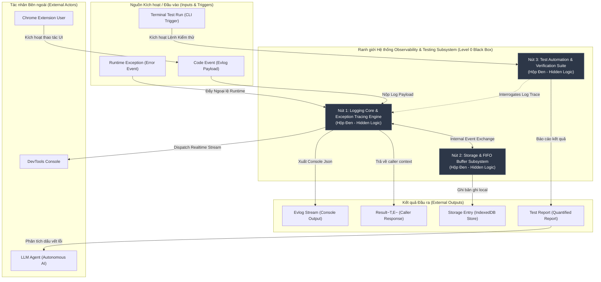

# Level 0 Black Box Context Architecture Overview: logging-and-testing

> [!NOTE]
> Tài liệu này thuộc **Sub-step 5.1 (Level 0 Black Box Context Overview)** trong quy trình thiết kế Feature Spec cho module **Logging Core, Dual Transport & Testing Automation Engine**. Ở cấp độ Level 0, toàn bộ logic xử lý nội bộ, vòng lặp FIFO buffer và thuật toán định tuyến log được giấu kín hoàn toàn bên trong hộp đen (Black Box). Tài liệu tập trung làm rõ ranh giới hệ thống (System Boundary), các tác nhân bên ngoài (External Actors), nguồn kích hoạt/đầu vào (External Inputs/Triggers), và kết quả đầu ra (External Outputs).

---

## 1. Ranh giới Hệ thống & Tác nhân Bên ngoài (System Boundary & External Actors)

### 1.1. Ranh giới Hệ thống (System Boundary)
Hệ thống **Observability, Dual-Transport Logging & Verification Subsystem (`logging-and-testing`)** đóng vai trò là hạ tầng cốt lõi cung cấp dịch vụ ghi vết sự kiện theo thời gian thực (structured evlog stream), quản lý ngoại lệ an toàn kiểu (type-safe `Result<T,E>`), lưu trữ nhật ký tự hủy theo cơ chế FIFO Ring Buffer trên IndexedDB, và cung cấp môi trường kiểm thử tự động hóa độc lập cho Chrome Extension.

### 1.2. Các Tác nhân Bên ngoài (External Actors)
- **`LLM Agent` (Autonomous Coding & Audit Agent)**: Tác nhân AI thực thi phân tích log, đọc dấu vết ngoại lệ structured trace, tự động thu thập kết quả kiểm thử và chẩn đoán lỗi trong quá trình vận hành/phát triển.
- **`Chrome Extension User` (End User)**: Người dùng cuối tương tác trực tiếp với giao diện Chrome Extension (Popup UI, Content Script context), phát sinh các thao tác nghiệp vụ và kích hoạt sự kiện runtime.
- **`DevTools Console` (Developer Inspection UI)**: Bảng điều khiển Chrome DevTools được lập trình viên / kiểm thử viên sử dụng để xem trực tiếp các dòng log được dispatch theo thời gian thực với mã màu phân cấp.

---

## 2. Giao diện Đầu vào & Đầu ra Cấp độ 0 (Level 0 External Inputs & Outputs)

### 2.1. Nguồn Kích hoạt & Đầu vào Bên ngoài (External Inputs / Triggers)
1. **`Code Event` (Log Emitting Trigger)**: Chuỗi dữ liệu sự kiện được tạo từ bất kỳ sub-module nào trong Extension (Popup, Background Service Worker, Content Script) thông qua phương thức `Evlog.info()`, `Evlog.warn()`, `Evlog.debug()`.
2. **`Runtime Exception` (Unhandled Error / Failure Event)**: Ngoại lệ không dự đoán trước hoặc lỗi gọi API bất đồng bộ được bắt bởi wrapper `Result<T,E>` hoặc global error handler (`window.onerror`, `unhandledrejection`).
3. **`Terminal Test Run` (CLI Automated Test Trigger)**: Lệnh kích hoạt bộ kiểm thử từ terminal (`rtk vitest`, `playwright test`) nhằm kiểm tra tính đúng đắn của logic mã nguồn và tạo báo cáo test.

### 2.2. Kết quả Đầu ra Bên ngoài (External Outputs)
1. **`Evlog Stream` (Structured Realtime Stream)**: Chuỗi định dạng JSON chuẩn hóa đại diện cho các log entry được dispatch trực tiếp ra `DevTools Console`.
2. **`Result<T,E>` (Type-safe Execution Outcome)**: Đối tượng bọc kết quả thực thi trả về cho mã nguồn gọi (caller context), đảm bảo không văng exception chưa được xử lý (`Ok(value)` hoặc `Err(error)`).
3. **`Storage Entry` (IndexedDB Persistent Record)**: Bản ghi nhật ký được nén và ghi nhận vào cơ sở dữ liệu IndexedDB local browser storage theo chính sách FIFO Ring Buffer.
4. **`Test Report` (Quantified Test Execution Summary)**: Báo cáo kết quả kiểm thử định lượng (số lượng test pass/fail, latency p95, độ bao phủ coverage) gửi về cho terminal và LLM Agent.

---

## 3. Sơ đồ Cấp độ 0: Black Box Context Architecture Diagram

---

## 4. Hợp đồng Dữ liệu Ranh giới Cấp độ 0 (Level 0 Boundary Data Contracts)

### 4.1. Dữ liệu Đầu vào (External Inputs)
| Mã Input | Tên Trực quan | Nguồn Phát | Schema Payload Chuẩn | Ràng buộc Ranh giới |
| :--- | :--- | :--- | :--- | :--- |
| `IN-01` | Code Event Payload | App Sub-modules | `{ timestamp: number, level: string, category: string, message: string, meta?: object }` | Bắt buộc có `level` hợp lệ (`DEBUG`, `INFO`, `WARN`, `ERROR`, `FATAL`). |
| `IN-02` | Runtime Exception | Browser Runtime | `{ errorName: string, message: string, stackTrace: string, context?: object }` | Cần tự động trích xuất stack trace đầy đủ không bị rỗng. |
| `IN-03` | CLI Test Command | Terminal / LLM | `{ testSuite: string, mode: "unit" \| "integration" \| "e2e", timeoutMs: number }` | Giới hạn timeout mặc định 30,000ms. |

### 4.2. Dữ liệu Đầu ra (External Outputs)
| Mã Output | Tên Phản hồi | Đích Nhận | Schema Payload / Result | Trạng thái Trả về |
| :--- | :--- | :--- | :--- | :--- |
| `OUT-01` | Evlog Stream | DevTools Console | `[YYYY-MM-DD HH:mm:ss.sss] [LEVEL] [Category] Message - Meta JSON` | Formatted String với CSS styling theo Log Level. |
| `OUT-02` | `Result<T,E>` | Calling Component | `{ ok: true, value: T } \| { ok: false, error: E }` | Bảo đảm 100% Type-Safety, cấm throw unhandled exception. |
| `OUT-03` | Storage Entry | IndexedDB Store | `{ id: string, timestamp: number, level: string, category: string, payload: string, correlationId: string }` | Lưu dạng BSON/JSON chuỗi hóa, giới hạn kích thước entry < 64KB. |
| `OUT-04` | Test Report | LLM Agent / Terminal | `{ total: number, passed: number, failed: number, durationMs: number, coverage: object }` | Định dạng JSON / Markdown Summary đạt chuẩn CI/CD. |

---

## 5. Nguyên tắc Phân rã Kiến trúc & Cấm Cắt lát Ngang (Zero Horizontal Physical Slicing)

### 5.1. Tầm nhìn Cấp độ 0 (Black Box Context View)
Ở Cấp độ 0, mục tiêu duy nhất là xác minh ranh giới đóng gói (Encapsulation Boundary). Các quy trình domain (`Nút 1`, `Nút 2`, `Nút 3`) được coi là các Hộp đen hoàn toàn. Người xem kiến trúc ở Cấp độ 0 không cần và không được phép can thiệp vào cách thức quản lý bộ nhớ đệm, thuật toán FIFO eviction hay cách tổ chức class bên trong.

### 5.2. Nguyên tắc Cấm Cắt lát Ngang Vật lý (Zero Physical Horizontal Slicing)
- **Quy tắc**: Tuyệt đối KHÔNG chia nhỏ workflow ở cùng 1 mức độ trừu tượng thành các sơ đồ vật lý cắt ngang (ví dụ: cắt rời luồng log thành "Sơ đồ phần 1: Nhận log", "Sơ đồ phần 2: Xử lý log", "Sơ đồ phần 3: Lưu log" ở cùng cấp 0).
- **Giải pháp**: Việc chi tiết hóa PHẢI thực hiện theo trục dọc (Vertical Zooming) thông qua quy trình bóc tách Hộp đen ở **Sub-step 5.2 (White Box Zoom-in)** cho đúng 1 Nút cốt lõi được lựa chọn.

---

## 6. Liên kết Sơ đồ & Tài liệu Liên quan (Document Map)

- **Sub-step 5.2 (White Box Zoom-in)**: [submodule-decomposition.md](file:///Docs/Specs/logging-and-testing/submodule-decomposition.md)
- **C4 Architecture Container Diagram**: [c4.md](file:///Docs/Specs/logging-and-testing/diagrams/c4.md)
- **3-Branch Execution Flowchart**: [flowchart.md](file:///Docs/Specs/logging-and-testing/diagrams/flowchart.md)
- **Temporal Component Sequence Diagram**: [sequence.md](file:///Docs/Specs/logging-and-testing/diagrams/sequence.md)
- **IndexedDB ERD Schema**: [erd.md](file:///Docs/Specs/logging-and-testing/diagrams/erd.md)
- **Domain Class Diagram**: [class.md](file:///Docs/Specs/logging-and-testing/diagrams/class.md)
- **Log Lifecycle State Diagram**: [state.md](file:///Docs/Specs/logging-and-testing/diagrams/state.md)
