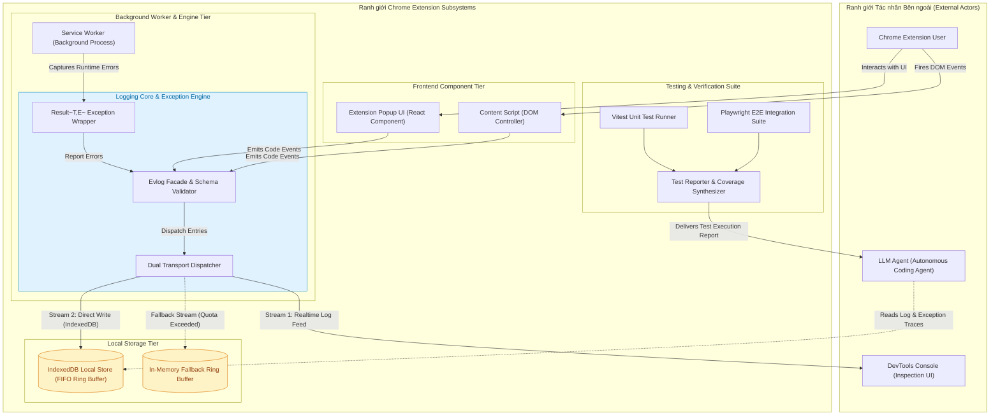

# C4 Container & Architecture Overview Diagram: logging-and-testing

> [!NOTE]
> Sơ đồ C4 Container biểu diễn ranh giới kiến trúc cấp độ Container cho module **Logging Core, Dual Transport & Testing Automation Engine**. Để bảo đảm tính tương thích 100% với tất cả trình xem Markdown (VS Code, GitHub, Antigravity IDE), sơ đồ sử dụng cú pháp `flowchart TB` kết hợp với các `subgraph` đóng vai trò Container Boundaries.

---

## 1. Ngữ cảnh & Phạm vi Nghiệp vụ
- **Mục tiêu**: Cung cấp cái nhìn tổng quan về ranh giới hạ tầng Observability, cơ chế ghi log song song (Dual Transport), lưu trữ IndexedDB địa phương và tích hợp bộ kiểm thử tự động.
- **Tác nhân tham gia (Actors)**: `Chrome Extension User`, `LLM Agent (Autonomous AI)`, `DevTools Console`.
- **Ranh giới xử lý**: Ranh giới Extension Core (Popup, Content Script, Service Worker) và Ranh giới Storage/Testing Subsystem.

---

## 2. Sơ đồ Mermaid

---

## 3. Hợp đồng Dữ liệu Ranh giới (Data Contracts)

### 3.1. Dữ liệu Đầu vào (Inputs / Triggers)
| ID | Tên Trực quan | Nguồn phát | Schema DTO / Payload | Ràng buộc / Rules |
| :--- | :--- | :--- | :--- | :--- |
| `C4-IN-01` | Log Emission Event | UI / Background | `{ level: string, category: string, message: string, meta?: object }` | Level bắt buộc nằm trong Enum `LogLevel`. |
| `C4-IN-02` | Unhandled Error Event | Window / Service Worker | `{ name: string, message: string, stack: string }` | Stack trace không được vượt quá 10KB. |

### 3.2. Dữ liệu Đầu ra (Outputs / Responses)
| ID | Tên Phản hồi | Đích nhận | Schema DTO / Payload | Trạng thái Trả về |
| :--- | :--- | :--- | :--- | :--- |
| `C4-OUT-01` | Formatted Log Stream | DevTools Console | `[HH:mm:ss] [LEVEL] [Category] Message` | Styled log output với CSS color format. |
| `C4-OUT-02` | Persisted Log Record | IndexedDB | `{ id: string, timestamp: number, payload: string }` | Successful transaction commit. |

---

## 4. Kho Dữ liệu & Quản lý Trạng thái (Data Stores & State)
| ID Kho | Tên Kho Dữ liệu | Loại Storage | Entity / Schema Key | Giao thức / Thao tác |
| :--- | :--- | :--- | :--- | :--- |
| `DS-01` | `agentic_logs` | IndexedDB Object Store | `AgenticLogEntry` | Async Transaction (`readwrite`) |
| `DS-02` | `log_buffer_mem` | In-Memory Array | `CircularArray<AgenticLogEntry>` | Memory Access (Fast Fallback) |

---

## 5. Xử lý Ngoại lệ & Kịch bản Lỗi (Exception Handling)
| Mã Lỗi | Kịch bản Lỗi / Trigger | Luồng Xử lý Phục hồi (Recovery Flow) | Trạng thái Cuối cùng |
| :--- | :--- | :--- | :--- |
| `ERR-C4-01` | IndexedDB Quota Exceeded | Chuyển luồng ghi log sang `Store_MemoryBuffer` & phát tín hiệu xả FIFO | Degraded Mode (Memory Only) |
| `ERR-C4-02` | Service Worker Inactive | Cache log tạm thời tại LocalStorage trước khi background worker re-wake | Recovered on SW Wakeup |

---

## 6. Giải thích Lý do Thiết kế & Phân rã (Architecture & Rationale)
- **Lý do phân rã**: Tách biệt hoàn toàn phần tiếp nhận log (`Evlog`), phân phát (`Dispatcher`), lưu trữ (`IndexedDB`) và bộ runner kiểm thử (`Vitest/Playwright`) để đảm bảo không gây gián đoạn UI thread của Extension.
- **Đánh đổi Kiến trúc (Trade-offs)**: Sử dụng Dual Transport tăng nhẹ CPU overhead (khoảng 2-5ms mỗi batch), nhưng đảm bảo cả lập trình viên và LLM Agent đều có thể quan sát hệ thống ở thời gian thực.
