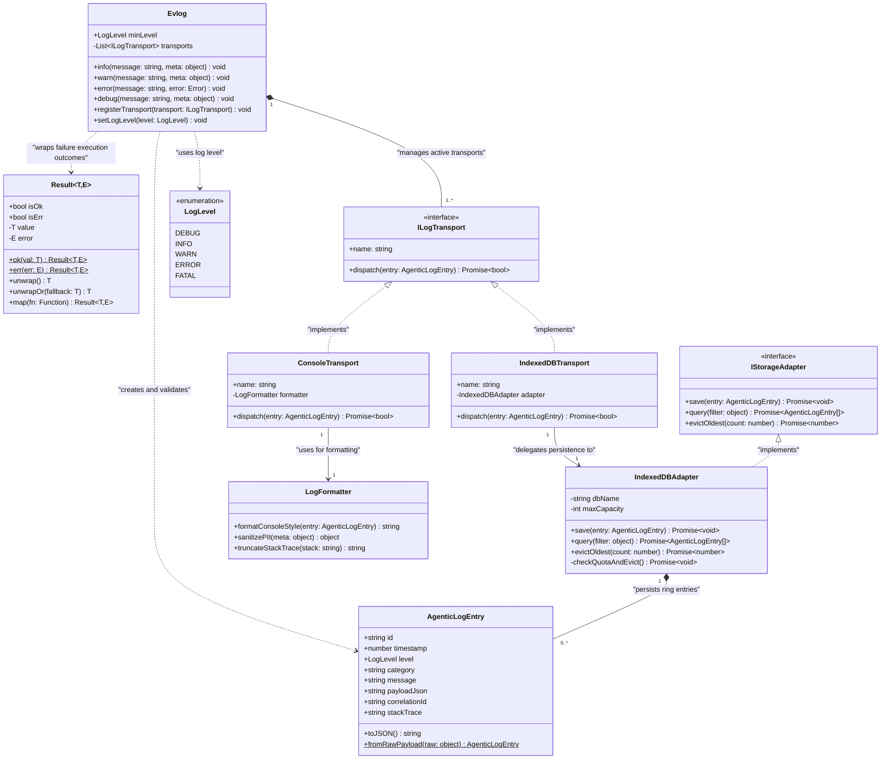

# Domain Entity & Class Diagram: logging-and-testing

> [!NOTE]
> Sơ đồ Class Diagram thể hiện thiết kế hướng đối tượng (OOP Domain Model) cho hạ tầng Observability & Testing. Sơ đồ mô hình hóa các lớp cốt lõi (`Evlog`, `AgenticLogEntry`, `Result~T,E~`, `IndexedDBAdapter`, `LogFormatter`, `ConsoleTransport`). Cú pháp Generics sử dụng tilde đơn `~T~` theo đúng chuẩn Mermaid syntax, tuyệt đối không lồng 2 cấp tilde.

---

## 1. Ngữ cảnh & Phạm vi Nghiệp vụ
- **Mục tiêu**: Định nghĩa các Interface, Abstract Classes, Data Entities, Value Objects và các mối quan hệ kế thừa (`extends`), thực thi (`implements`), sở hữu (`composition`) và phụ thuộc (`dependency`).
- **Tác nhân tham gia (Actors)**: Developer, Extension Core Modules, Class Design Architecture.
- **Ranh giới xử lý**: Codebase Architecture Level (TypeScript Domain Classes).

---

## 2. Sơ đồ Mermaid

---

## 3. Hợp đồng Dữ liệu Ranh giới (Data Contracts)

### 3.1. Dữ liệu Đầu vào (Inputs / Triggers)
| ID | Tên Trực quan | Nguồn phát | Schema DTO / Payload | Ràng buộc / Rules |
| :--- | :--- | :--- | :--- | :--- |
| `CLS-IN-01` | Method Invocations | App Domain | `(message: string, meta?: object)` | String message không rỗng. |

### 3.2. Dữ liệu Đầu ra (Outputs / Responses)
| ID | Tên Phản hồi | Đích nhận | Schema DTO / Payload | Trạng thái Trả về |
| :--- | :--- | :--- | :--- | :--- |
| `CLS-OUT-01` | Class Instance | Factory / Caller | `Result<T,E>` | Đối tượng Result không mutable. |

---

## 4. Kho Dữ liệu & Quản lý Trạng thái (Data Stores & State)
| ID Kho | Tên Kho Dữ liệu | Loại Storage | Entity / Schema Key | Giao thức / Thao tác |
| :--- | :--- | :--- | :--- | :--- |
| `DS-CLS-01` | Private Class State | In-Memory RAM | `Evlog.transports` | Static Collection |

---

## 5. Xử lý Ngoại lệ & Kịch bản Lỗi (Exception Handling)
| Mã Lỗi | Kịch bản Lỗi / Trigger | Luồng Xử lý Phục hồi (Recovery Flow) | Trạng thái Cuối cùng |
| :--- | :--- | :--- | :--- |
| `ERR-CLS-01` | `unwrap()` gọi trên `Result Err` | Ném ra `ResultUnwrapError` có kèm theo cause error gốc | Controlled Crash with Diagnostics |

---

## 6. Giải thích Lý do Thiết kế & Phân rã (Architecture & Rationale)
- **Lý do phân rã**: Áp dụng nguyên lý Dependency Inversion Principle (DIP) của SOLID: `Evlog` phụ thuộc vào Interface `ILogTransport` thay vì phụ thuộc trực tiếp vào `IndexedDBAdapter`. Điều này giúp việc bổ sung các transport mới (ví dụ `RemoteHttpTransport`) trở nên cực kỳ linh hoạt mà không cần sửa đổi core code.
- **Đánh đổi Kiến trúc (Trade-offs)**: Sử dụng Mẫu `Result<T,E>` đòi hỏi mã nguồn ở mọi nơi phải kiểm tra `.isOk` hoặc `.isErr` trước khi truy cập dữ liệu, loại bỏ hoàn toàn `NullPointerException` và `Unhandled Exception` rủi ro.
