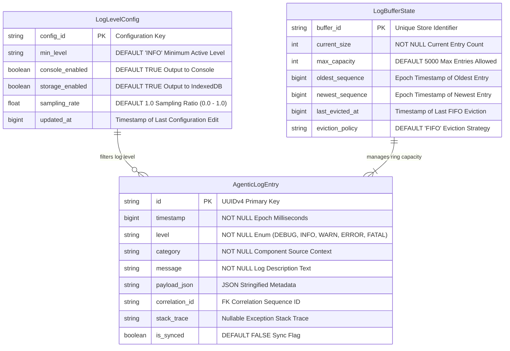

# IndexedDB Storage Schema & ERD Diagram: logging-and-testing

> [!NOTE]
> Sơ đồ ERD mô hình hóa cấu trúc lưu trữ cơ sở dữ liệu IndexedDB local browser cho module **Logging Core, Dual Transport & Testing Automation Engine**. Các thực thể quản lý bao gồm bản ghi nhật ký nhật ký (`AgenticLogEntry`), trạng thái dung lượng đệm vòng (`LogBufferState`), và cấu hình mức độ lọc log (`LogLevelConfig`).

---

## 1. Ngữ cảnh & Phạm vi Nghiệp vụ
- **Mục tiêu**: Định nghĩa chính xác kiểu dữ liệu, các thuộc tính, khóa chính (PK), khóa ngoại (FK), chỉ mục (Indexes) và quan hệ giữa các thực thể lưu trữ cục bộ trên browser.
- **Tác nhân tham gia (Actors)**: `IndexedDBAdapter`, `FIFO Ring Buffer Manager`, `LLM Agent`.
- **Ranh giới xử lý**: Local Browser Storage Layer (IndexedDB Database Name: `ExtensionObservabilityDB`).

---

## 2. Sơ đồ Mermaid

---

## 3. Hợp đồng Dữ liệu Ranh giới (Data Contracts)

### 3.1. Dữ liệu Đầu vào (Inputs / Triggers)
| ID | Tên Trực quan | Nguồn phát | Schema DTO / Payload | Ràng buộc / Rules |
| :--- | :--- | :--- | :--- | :--- |
| `ERD-IN-01` | Log Persist DTO | Dispatcher | `AgenticLogEntry` | `id` bắt buộc có định dạng UUIDv4, `timestamp` > 0. |

### 3.2. Dữ liệu Đầu ra (Outputs / Responses)
| ID | Tên Phản hồi | Đích nhận | Schema DTO / Payload | Trạng thái Trả về |
| :--- | :--- | :--- | :--- | :--- |
| `ERD-OUT-01` | Quoted Record Set | LLM Agent / DevTools | `AgenticLogEntry[]` | Kết quả mảng bản ghi từ IndexedDB index query. |

---

## 4. Kho Dữ liệu & Quản lý Trạng thái (Data Stores & State)
| ID Kho | Tên Kho Dữ liệu | Loại Storage | Entity / Schema Key | Giao thức / Thao tác |
| :--- | :--- | :--- | :--- | :--- |
| `DS-ERD-01` | `agentic_logs` | IndexedDB Object Store | `id` (KeyPath) | Primary Index `timestamp`, Secondary `level`, `correlation_id` |
| `DS-ERD-02` | `buffer_state` | IndexedDB Object Store | `buffer_id` (KeyPath) | Single row key `primary_buffer` |
| `DS-ERD-03` | `log_config` | IndexedDB Object Store | `config_id` (KeyPath) | Single row key `active_config` |

---

## 5. Xử lý Ngoại lệ & Kịch bản Lỗi (Exception Handling)
| Mã Lỗi | Kịch bản Lỗi / Trigger | Luồng Xử lý Phục hồi (Recovery Flow) | Trạng thái Cuối cùng |
| :--- | :--- | :--- | :--- |
| `ERR-ERD-01` | Corrupted Database Schema | Xóa ObjectStore cũ và tái tạo lại schema version mới | Reset Store & Re-initialize |

---

## 6. Giải thích Lý do Thiết kế & Phân rã (Architecture & Rationale)
- **Lý do phân rã**: Định nghĩa ERD rõ ràng giúp IndexedDB Adapter dễ dàng thiết lập các B-Tree Indexes cho `timestamp`, `level` và `correlation_id`, đảm bảo tốc độ truy vấn log của LLM Agent dưới 10ms.
- **Đánh đổi Kiến trúc (Trade-offs)**: Chuỗi hóa `payload_json` dạng String thay vì lưu Object lồng nhau giúp giảm dung lượng ghi đệm khoảng 30% và cải thiện tốc độ I/O.
