# 3-Branch Execution Logic Flowchart: logging-and-testing

> [!NOTE]
> Sơ đồ Flowchart mô tả chi tiết thuật toán xử lý và luồng điều khiển cho **Logging Core & Exception Tracing Engine** với đầy đủ 3 nhánh thực thi độc lập: **Happy Path (Luồng chính)**, **Clarification/Toggle Path (Luồng tùy chỉnh cấu hình)**, và **Exception/Fallback Path (Luồng xử lý lỗi & phục hồi)**.

---

## 1. Ngữ cảnh & Phạm vi Nghiệp vụ
- **Mục tiêu**: Làm rõ đường đi của một thông điệp log từ khi phát sinh cho đến khi được kiểm định, phân phát ra Console, bọc ngoại lệ bằng `Result<T,E>` và lưu trữ bền vững vào IndexedDB.
- **Tác nhân tham gia (Actors)**: App Sub-modules, Evlog Validator, Dual Transport Dispatcher, Ring Buffer Manager, DevTools Console, Local IndexedDB.
- **Ranh giới xử lý**: Nội bộ Tiến trình con 1.1 -> 1.4 của Nút 1.

---

## 2. Sơ đồ Mermaid

```mermaid
---
config:
  theme: default
  look: classic
---
flowchart TD
    %% Entry Point
    Start(["Bắt đầu: App phát sinh Log / Exception Event"]) --> InputType{"Loại Event đầu vào?"}

    %% Branch Selection
    InputType -->|"1. Standard Log Event"| Branch_Happy["Happy Path: Emitting Code Event"]
    InputType -->|"2. Config Toggle Event"| Branch_Toggle["Toggle Path: Update Log Threshold"]
    InputType -->|"3. Unhandled Error Event"| Branch_Exception["Exception Path: Runtime Error Captured"]

    %% ==========================================
    %% NHÁNH 1: HAPPY PATH (Standard Evlog Flow)
    %% ==========================================
    Branch_Happy --> ParsePayload["Parse Payload & Extract Metadata"]
    ParsePayload --> ScrubPII["Sanitize Sensitive Fields (Scrub Password/Tokens)"]
    ScrubPII --> AttachContext["Attach Correlation ID & Timestamp"]
    AttachContext --> ValidateSchema{"Payload đạt chuẩn Schema (Size < 64KB)?"}

    ValidateSchema -->|"Có (Pass)"| CheckLogLevel{"Log Level >= Current Config Threshold?"}

    CheckLogLevel -->|"Có (Log Accepted)"| Dispatcher[["Dual Transport Dispatcher"]]
    
    %% Dual Transport Splits
    Dispatcher --> ForkTransport{"Phân phát Song song (Dual Transport)"}
    
    ForkTransport -->|"Console Transport"| FormatANSI["Format Log với Color & Stack Trace"]
    FormatANSI --> DevToolsOutput["Emit Output sang DevTools Console"]
    
    ForkTransport -->|"Storage Transport"| CheckBufferCap{"Storage Capacity >= MAX_CAPACITY?"}
    
    CheckBufferCap -->|"Chưa đầy (Cap OK)"| WriteIndexedDB[("Ghi Record vào IndexedDB Store")]
    CheckBufferCap -->|"Đã đầy (Threshold Exceeded)"| TriggerFIFO["Execute FIFO Eviction (Delete oldest N entries)"]
    TriggerFIFO --> WriteIndexedDB
    
    WriteIndexedDB --> EndHappy(["Kết thúc: Log Event được xử lý thành công"])
    DevToolsOutput --> EndHappy

    %% ==========================================
    %% NHÁNH 2: CLARIFICATION / TOGGLE PATH
    %% ==========================================
    Branch_Toggle --> ReadNewConfig["Đọc cấu hình LogLevelConfig mới"]
    ReadNewConfig --> ValidateConfig{"Min Level & Capacity hợp lệ?"}

    ValidateConfig -->|"Không hợp lệ"| RevertConfig["Revert về Cấu hình Mặc định (INFO / 5000 entries)"]
    RevertConfig --> EmitToggleWarn["Emit Cảnh báo Config Invalid ra Console"]
    EmitToggleWarn --> EndToggle(["Kết thúc: Áp dụng Cấu hình Fallback"])

    ValidateConfig -->|"Hợp lệ"| UpdateState["Cập nhật Trạng thái LogLevelConfig vào Cache"]
    UpdateState --> PersistConfig[("Lưu Cấu hình mới vào Storage")]
    PersistConfig --> BroadcastChange["Broadcast sự kiện ConfigChanged đến các Components"]
    BroadcastChange --> EndToggleSuccess(["Kết thúc: Cấu hình mới có hiệu lực"])

    %% ==========================================
    %% NHÁNH 3: EXCEPTION & FALLBACK PATH
    %% ==========================================
    Branch_Exception --> ExtractStackTrace["Trích xuất Error Name, Message & Symbol Stack Trace"]
    ExtractStackTrace --> WrapResultErr["Gói ngoại lệ vào đối tượng Result Err~E~"]
    
    ValidateSchema -->|"Không (Schema Fail / Size > 64KB)"| HandleSchemaError["Tạo Trạng thái Result Err(PayloadInvalid)"]
    HandleSchemaError --> WrapResultErr

    WrapResultErr --> SynthesizeErrorLog["Tổng hợp Error Payload mức FATAL/ERROR"]
    SynthesizeErrorLog --> CheckStorageHealth{"IndexedDB sẵn sàng & không bị Quota Error?"}

    CheckStorageHealth -->|"DB OK"| Dispatcher
    CheckStorageHealth -->|"Lỗi DB / QuotaExceededError"| FallbackMemory[("Ghi tạm vào In-Memory Fallback Buffer")]

    FallbackMemory --> AlertDevTools["Hiển thị Cảnh báo Storage Degradation trên Console"]
    AlertDevTools --> EndExceptionDegraded(["Kết thúc: Phục hồi ở Chế độ Degraded"])

    CheckLogLevel -->|"Không (Filtered Out)"| EndFiltered(["Kết thúc: Log bị Lọc bỏ"])

    %% Styling
    style Start fill:#90EE90,stroke:#333,stroke-width:2px
    style EndHappy fill:#90EE90,stroke:#333,stroke-width:2px
    style EndToggleSuccess fill:#90EE90,stroke:#333,stroke-width:2px
    style EndToggle fill:#FFD700,stroke:#333,stroke-width:2px
    style EndExceptionDegraded fill:#FF6B6B,stroke:#333,stroke-width:2px
    style EndFiltered fill:#cbd5e1,stroke:#333,stroke-width:1px
    style WriteIndexedDB fill:#fef3c7,stroke:#d97706,stroke-width:2px
    style FallbackMemory fill:#fee2e2,stroke:#dc2626,stroke-width:2px
```

---

## 3. Hợp đồng Dữ liệu Ranh giới (Data Contracts)

### 3.1. Dữ liệu Đầu vào (Inputs / Triggers)
| ID | Tên Trực quan | Nguồn phát | Schema DTO / Payload | Ràng buộc / Rules |
| :--- | :--- | :--- | :--- | :--- |
| `FLOW-IN-01` | Code Event | Sub-modules | `{ level: string, category: string, message: string }` | Level bắt buộc nằm trong enum `LogLevel`. |
| `FLOW-IN-02` | Config Toggle | DevTools / UI | `{ minLevel: string, maxCapacity: number }` | `maxCapacity` từ 100 đến 50,000. |

### 3.2. Dữ liệu Đầu ra (Outputs / Responses)
| ID | Tên Phản hồi | Đích nhận | Schema DTO / Payload | Trạng thái Trả về |
| :--- | :--- | :--- | :--- | :--- |
| `FLOW-OUT-01` | Dispatch Result | Caller Context | `Result<void, LogError>` | `Ok` khi ghi xong hoặc `Err` nếu payload sai schema. |
| `FLOW-OUT-02` | Storage Record | IndexedDB | `AgenticLogEntry` | Object store ID được cấp phát ngẫu nhiên UUIDv4. |

---

## 4. Kho Dữ liệu & Quản lý Trạng thái (Data Stores & State)
| ID Kho | Tên Kho Dữ liệu | Loại Storage | Entity / Schema Key | Giao thức / Thao tác |
| :--- | :--- | :--- | :--- | :--- |
| `DS-FL-01` | `agentic_logs` | IndexedDB Store | `AgenticLogEntry` | Append & FIFO Delete |
| `DS-FL-02` | `log_config` | Chrome Storage Local | `LogLevelConfig` | Read / Write Configuration |

---

## 5. Xử lý Ngoại lệ & Kịch bản Lỗi (Exception Handling)
| Mã Lỗi | Kịch bản Lỗi / Trigger | Luồng Xử lý Phục hồi (Recovery Flow) | Trạng thái Cuối cùng |
| :--- | :--- | :--- | :--- |
| `ERR-FLOW-01` | Payload PayloadTooLarge (>64KB) | Bỏ bớt thuộc tính `meta` phụ, cắt ngắn message về 1000 ký tự | Recovered with Truncated Log |
| `ERR-FLOW-02` | QuotaExceededError IndexedDB | Tự động kích hoạt FIFO eviction xóa 20% log cũ nhất và ghi lại | Recovered with Eviction |

---

## 6. Giải thích Lý do Thiết kế & Phân rã (Architecture & Rationale)
- **Lý do phân rã**: Minh bạch hóa toàn bộ các nhánh rẽ điều kiện (Decision Points), giúp lập trình viên kiểm thử dễ dàng tra cứu kịch bản Happy Path vs Exception Flow.
- **Đánh đổi Kiến trúc (Trade-offs)**: Việc thực hiện PII scrubbing và schema validation tăng nhẹ latency phát log (~0.5ms), nhưng loại bỏ hoàn toàn nguy cơ rò rỉ thông tin bảo mật vào log file.
