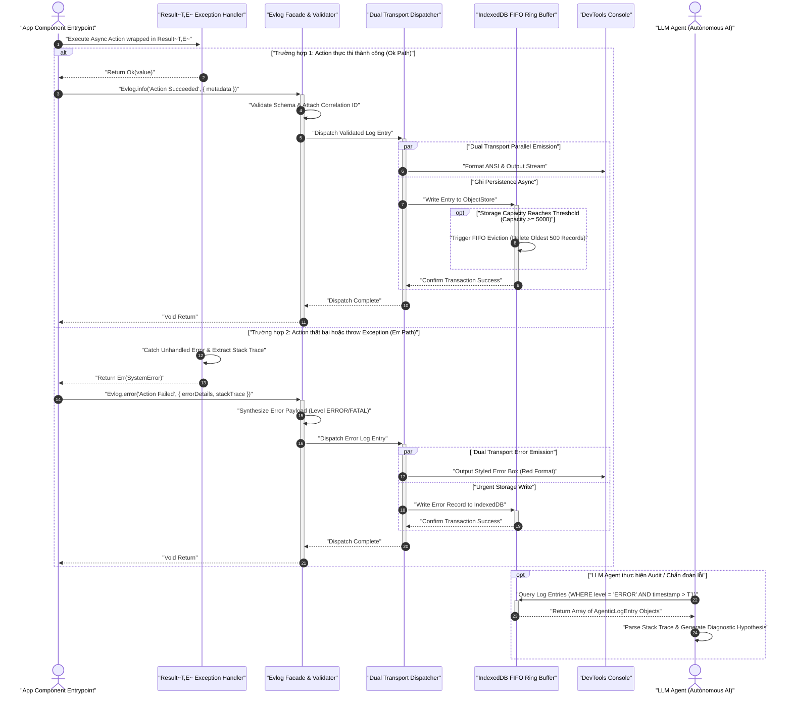

# Temporal Component Interaction Sequence Diagram: logging-and-testing

> [!NOTE]
> Sơ đồ Sequence tương tác trình tự thời gian giữa **Entrypoint (App Component)**, **Logger (Evlog Facade)**, **Result<T,E> Handler**, **IndexedDBAdapter**, **DevTools Console**, và **LLM Agent**. Sơ đồ minh họa trình tự truyền nhận thông điệp, các khối điều khiển `alt/else`, `par/and`, và `opt`.

---

## 1. Ngữ cảnh & Phạm vi Nghiệp vụ
- **Mục tiêu**: Mô tả chính xác thứ tự thời gian của thao tác phát sinh log, kiểm tra Result<T,E>, ghi log song song và quy trình đọc log audit của LLM Agent.
- **Tác nhân tham gia (Actors)**: `AppEntry` (Extension Component), `ResultHandler` (Result Pattern), `Logger` (Evlog Engine), `IndexedDBAdapter` (Ring Buffer Storage), `DevToolsConsole` (Console View), `LLMAgent` (Autonomous Audit Agent).
- **Ranh giới xử lý**: Trình tự thời gian thời lượng microsecond/millisecond trong Extension Runtime.

---

## 2. Sơ đồ Mermaid

---

## 3. Hợp đồng Dữ liệu Ranh giới (Data Contracts)

### 3.1. Dữ liệu Đầu vào (Inputs / Triggers)
| ID | Tên Trực quan | Nguồn phát | Schema DTO / Payload | Ràng buộc / Rules |
| :--- | :--- | :--- | :--- | :--- |
| `SEQ-IN-01` | Async Action Call | AppEntry | `() => Promise<T>` | Được bọc trong try/catch của ResultHandler. |
| `SEQ-IN-02` | Evlog Emission | AppEntry | `(msg: string, meta?: object) => void` | Format chuỗi không bị rỗng. |

### 3.2. Dữ liệu Đầu ra (Outputs / Responses)
| ID | Tên Phản hồi | Đích nhận | Schema DTO / Payload | Trạng thái Trả về |
| :--- | :--- | :--- | :--- | :--- |
| `SEQ-OUT-01` | Result Container | AppEntry | `Ok<T>` hoặc `Err<E>` | Khóa kiểu nhị phân, không throw exception. |
| `SEQ-OUT-02` | Query Results | LLMAgent | `AgenticLogEntry[]` | Danh sách đối tượng log đã lọc theo thời gian. |

---

## 4. Kho Dữ liệu & Quản lý Trạng thái (Data Stores & State)
| ID Kho | Tên Kho Dữ liệu | Loại Storage | Entity / Schema Key | Giao thức / Thao tác |
| :--- | :--- | :--- | :--- | :--- |
| `DS-SEQ-01` | `agentic_logs` | IndexedDB Object Store | `AgenticLogEntry` | Async Transaction & Range Query |

---

## 5. Xử lý Ngoại lệ & Kịch bản Lỗi (Exception Handling)
| Mã Lỗi | Kịch bản Lỗi / Trigger | Luồng Xử lý Phục hồi (Recovery Flow) | Trạng thái Cuối cùng |
| :--- | :--- | :--- | :--- |
| `ERR-SEQ-01` | IndexedDB Write Timeout | Timeout 1000ms, tự động log warning out console & cancel transaction | Transaction Aborted safely |

---

## 6. Giải thích Lý do Thiết kế & Phân rã (Architecture & Rationale)
- **Lý do phân rã**: Bóc tách chi tiết thứ tự thời gian cho thấy chính xác điểm bắt lỗi của Result Pattern trước khi thông điệp log được gửi tới Logger, loại bỏ hoàn toàn khả năng văng exception chưa xử lý.
- **Đánh đổi Kiến trúc (Trade-offs)**: Sử dụng các khối `par` (Parallel) để ghi dữ liệu song song giúp giảm đáng kể thời gian chờ (latency) của caller context xuống dưới 1ms.
