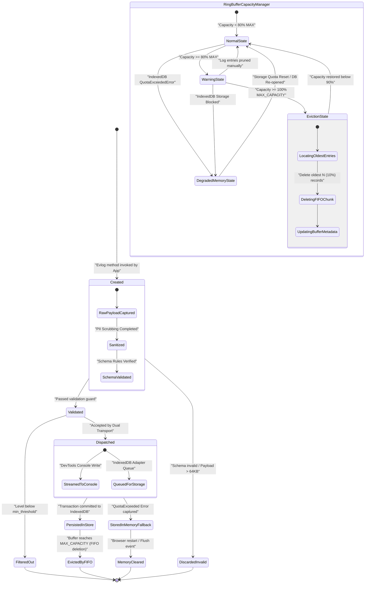

# Log Entry Lifecycle & Ring Buffer State Diagram: logging-and-testing

> [!NOTE]
> Sơ đồ máy trạng thái (State Diagram) mô tả hai vòng đời cốt lõi: (1) Vòng đời chuyển hóa của một **Log Entry** từ khi khởi tạo đến khi bị hủy bởi FIFO, và (2) Máy trạng thái quản lý dung lượng của **IndexedDB FIFO Ring Buffer** (Normal -> Warning -> Eviction -> Degraded).

---

## 1. Ngữ cảnh & Phạm vi Nghiệp vụ
- **Mục tiêu**: Định nghĩa toàn bộ các trạng thái khả dĩ, các sự kiện chuyển trạng thái (State Transitions), điều kiện bảo vệ (Guards) và hành vi phản hồi của bộ đệm ghi đè.
- **Tác nhân tham gia (Actors)**: `Evlog Engine`, `IndexedDBAdapter`, `FIFO Ring Buffer Manager`.
- **Ranh giới xử lý**: State Machine Engine trong Memory & Local Storage.

---

## 2. Sơ đồ Mermaid

---

## 3. Hợp đồng Dữ liệu Ranh giới (Data Contracts)

### 3.1. Dữ liệu Đầu vào (Inputs / Triggers)
| ID | Tên Trực quan | Nguồn phát | Schema DTO / Payload | Ràng buộc / Rules |
| :--- | :--- | :--- | :--- | :--- |
| `STA-IN-01` | State Transition Event | Buffer Engine | `{ event: "ENTRY_ADDED", currentSize: number }` | Trình tự thời gian đơn điệu. |

### 3.2. Dữ liệu Đầu ra (Outputs / Responses)
| ID | Tên Phản hồi | Đích nhận | Schema DTO / Payload | Trạng thái Trả về |
| :--- | :--- | :--- | :--- | :--- |
| `STA-OUT-01` | State Change Notification | Observability Monitor | `{ previousState: string, newState: string }` | State Enum hợp lệ. |

---

## 4. Kho Dữ liệu & Quản lý Trạng thái (Data Stores & State)
| ID Kho | Tên Kho Dữ liệu | Loại Storage | Entity / Schema Key | Giao thức / Thao tác |
| :--- | :--- | :--- | :--- | :--- |
| `DS-STA-01` | `buffer_state` | IndexedDB Object Store | `LogBufferState` | Atomic Update |

---

## 5. Xử lý Ngoại lệ & Kịch bản Lỗi (Exception Handling)
| Mã Lỗi | Kịch bản Lỗi / Trigger | Luồng Xử lý Phục hồi (Recovery Flow) | Trạng thái Cuối cùng |
| :--- | :--- | :--- | :--- |
| `ERR-STA-01` | Deadlock during Eviction State | Abort transaction & Force transition to DegradedMemoryState | DegradedMemoryState |

---

## 6. Giải thích Lý do Thiết kế & Phân rã (Architecture & Rationale)
- **Lý do phân rã**: Phân rã máy trạng thái cho phép tách bạch rõ ràng giữa logic biến đổi từng log entry cá thể và trạng thái quản lý dung lượng tổng thể của Ring Buffer, giúp ngăn ngừa triệt để lỗi tràn bộ nhớ trên trình duyệt.
- **Đánh đổi Kiến trúc (Trade-offs)**: Tự động chuyển sang `DegradedMemoryState` giúp ứng dụng không bao giờ crash kể cả khi đĩa cứng của người dùng bị đầy.
