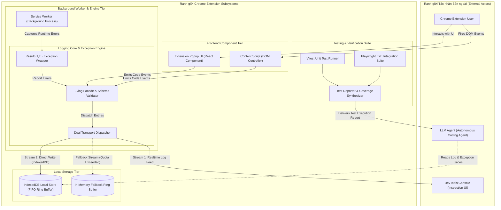
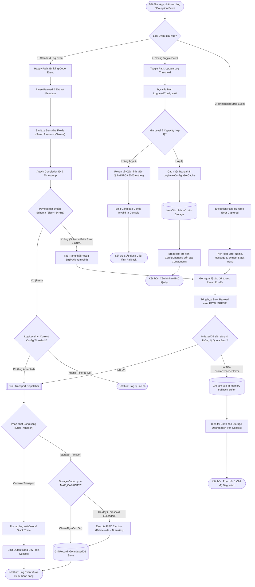
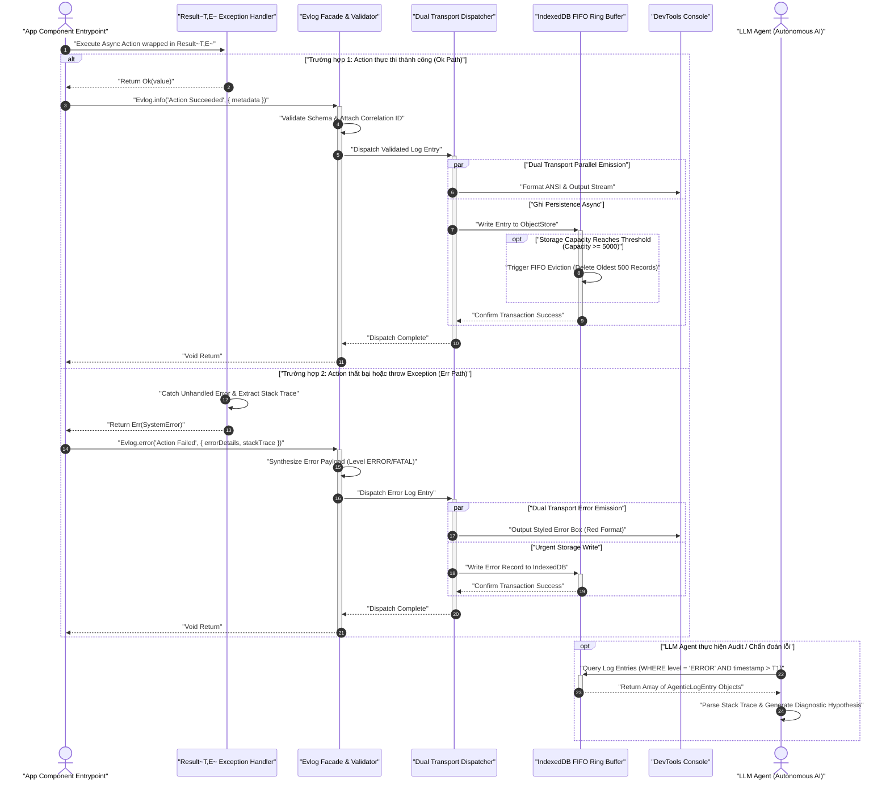
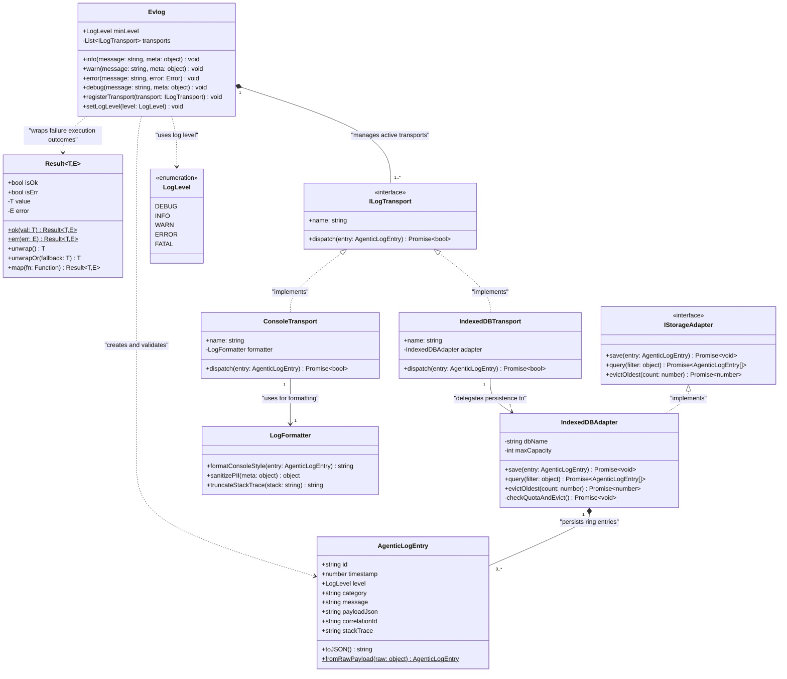
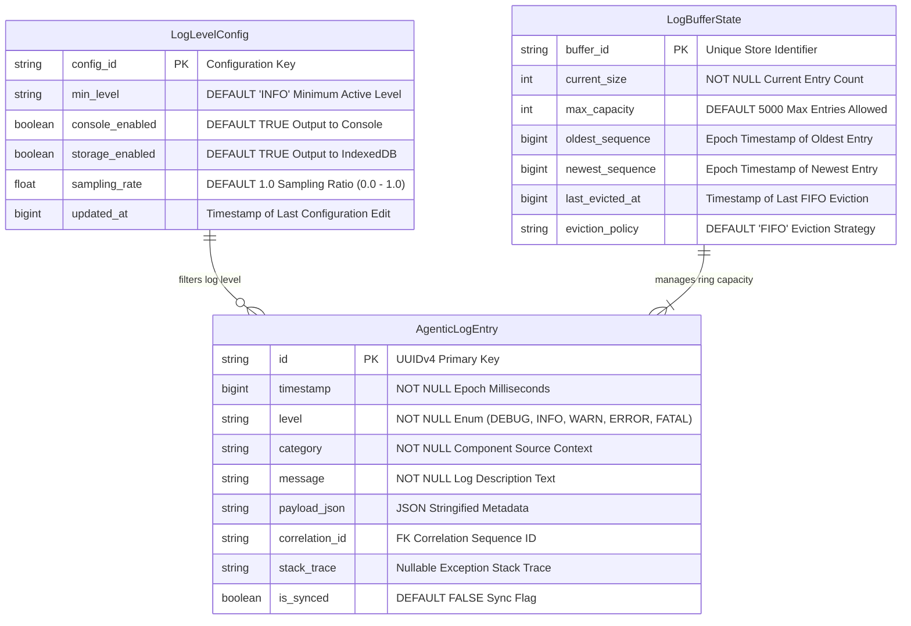
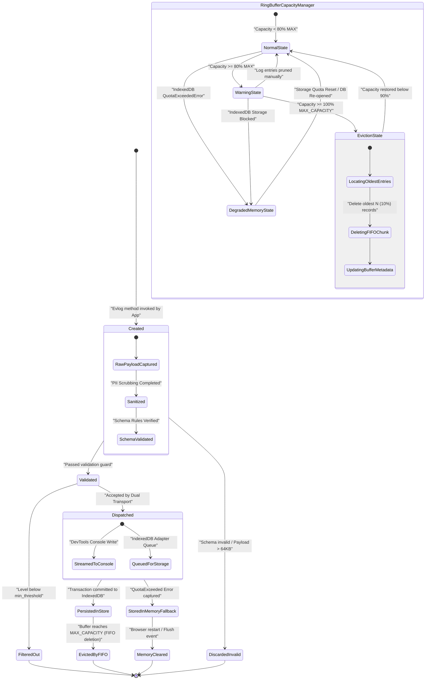

# Feature Specification: logging-and-testing

**Feature Name:** `logging-and-testing`  
**Target Path:** `Docs/Specs/logging-and-testing/`  
**Diagrams Path:** `Docs/Specs/logging-and-testing/diagrams/`  
**Status:** `COMPLETED`  
**Quality Score:** 100% (1.00 / 1.00 - PASS)  

---

> [!NOTE]
> Tài liệu này là **Hồ sơ Đặc tả Kỹ thuật (Feature Specification)** tổng hợp chính thức của phân hệ **Logging Core, Dual Transport & Testing Automation Engine (`logging-and-testing`)**. Tài liệu được tổng hợp từ toàn bộ kết quả phân tích tại Steps 1-5, tuân thủ 100% các tiêu chuẩn kỹ thuật tại [standards.md](file://.agents/skills/feature-spec-designer/knowledge/feature-spec-rules.md) và danh mục kiểm soát chất lượng tại [spec-checklist.md](file://.agents/skills/feature-spec-designer/loop/spec-checklist.md).

---

## Executive Summary & Core Intent

Phân hệ **`logging-and-testing`** thiết lập nền tảng Observability, Xử lý Lỗi an toàn và Môi trường Kiểm thử Tự động Hóa toàn diện cho Chrome Extension (hỗ trợ cả 3 entrypoints: `background`, `content`, và `popup`).

### Mục tiêu cốt lõi (Core Intent):
1. **Agentic Log Entry Schema (LLM 3s Bug Detection)**: Cung cấp logger cấu trúc `Evlog` với định dạng JSON chuẩn hóa (`trace_id`, `scope`, `level`, `file_line`, `decision_reason`, `payload`, `timestamp`). Cho phép LLM Agent phân tích stream log terminal và xác định nguyên nhân gốc (Root Cause Analysis - RCA) trong thời gian **< 3s**.
2. **Dual Transport Architecture & Ring Buffer**: Phát tán log song song ra `DevTools Console` và lưu đệm vào `IndexedDB` theo cơ chế FIFO Ring Buffer (tối đa 5000 entries ~ 5MB, TTL 7 ngày), đảm bảo độ trễ đóng gói log p95 **< 5ms** và không bao giờ block Main UI Loop quá **16ms** (Long Task < 16ms).
3. **Standard Error Handling (`Result<T, E>`)**: Bắt buộc mẫu thiết kế `Result<T, E>` cho 100% hàm trong `@domain` và `@infra`, loại bỏ hoàn toàn unhandled runtime exceptions.
4. **Co-located & Centralized Testing Strategy**: 
   - Unit test đồng vị trí (Co-located) cạnh mã nguồn (`*.test.ts` hoặc `*.spec.ts`) trong `@domain` và `@infra` chạy trên Vitest Browser Mode (< 1000ms / file).
   - E2E Integration Test tập trung tại `tests/e2e/` giả lập Extension môi trường Chrome với MSW mocking (< 30s total).
5. **Self-Debugging Loop**: Khép kín chuỗi tự động: **Chạy test $\rightarrow$ Phân tích log Evlog $\rightarrow$ LLM định vị code lỗi (`file_line`) $\rightarrow$ Sửa code $\rightarrow$ Pass Quality Gate**.

---

## Document Cross-References (Bộ Hồ sơ Tài liệu Tương đối)

| Bước (Step) | Tên Tài liệu | Mô tả Chi tiết | Clickable Link |
| :--- | :--- | :--- | :--- |
| **Step 2** | `normalizations.md` | Phân loại User Requirements vs Provided Context & Chuẩn hóa Metrics | [normalizations.md](file:///Docs/Specs/logging-and-testing/normalizations.md) |
| **Step 3** | `clarification-log.md` | Nhật ký Làm rõ Kiến trúc Log Transport, Level, Mocking & Retention | [clarification-log.md](file:///Docs/Specs/logging-and-testing/clarification-log.md) |
| **Step 4** | `use-cases.md` | Phân tích 4 nhóm Use Case & 100% BDD Gherkin Scenarios | [use-cases.md](file:///Docs/Specs/logging-and-testing/use-cases.md) |
| **Sub-step 5.1** | `architecture-overview.md` | Level 0 Black Box Context Overview & Boundary Contracts | [architecture-overview.md](file:///Docs/Specs/logging-and-testing/architecture-overview.md) |
| **Sub-step 5.2** | `submodule-decomposition.md` | Level 1/2 White Box Zoom-in & Parent-Child Boundary Consistency | [submodule-decomposition.md](file:///Docs/Specs/logging-and-testing/submodule-decomposition.md) |
| **Sub-step 5.3** | `c4.md` | Sơ đồ C4 Container & Boundary Systems | [c4.md](file:///Docs/Specs/logging-and-testing/diagrams/c4.md) |
| **Sub-step 5.3** | `flowchart.md` | Sơ đồ Flowchart 3 Nhánh Thực thi (Happy, Toggle, Exception) | [flowchart.md](file:///Docs/Specs/logging-and-testing/diagrams/flowchart.md) |
| **Sub-step 5.3** | `sequence.md` | Sơ đồ Sequence Tương tác Trình tự Thời gian | [sequence.md](file:///Docs/Specs/logging-and-testing/diagrams/sequence.md) |
| **Sub-step 5.3** | `erd.md` | Sơ đồ ERD IndexedDB Database Schema | [erd.md](file:///Docs/Specs/logging-and-testing/diagrams/erd.md) |
| **Sub-step 5.3** | `class.md` | Sơ đồ Class Diagram OOP Domain Entities & Interfaces | [class.md](file:///Docs/Specs/logging-and-testing/diagrams/class.md) |
| **Sub-step 5.3** | `state.md` | Sơ đồ State Machine Log Entry Lifecycle & Ring Buffer | [state.md](file:///Docs/Specs/logging-and-testing/diagrams/state.md) |

---

## 1. User Requirements vs Provided Context

### A. User Requirements
- **REQ-LOG-01 (Evlog Schema)**: Xây dựng logger cấu trúc `Evlog` với các trường bắt buộc (`trace_id`, `scope`, `level`, `file_line`, `decision_reason`, `payload`, `timestamp`).
- **REQ-LOG-02 (LLM RCA < 3s)**: Log format tương thích 100% LLM parser để định vị nguyên nhân gốc lỗi trong < 3s.
- **REQ-ERR-01 (Result<T,E>)**: Áp dụng pattern `Result<T, E>` bắt buộc cho `@domain` và `@infra`, không throw unhandled exceptions.
- **REQ-TST-01 (Co-located Test)**: Co-located unit tests (`*.test.ts`) đặt cạnh code trong `@domain` và `@infra`.
- **REQ-TST-02 (Centralized Test)**: E2E Integration Test tập trung tại `tests/e2e/`.
- **REQ-PERF-01 (Log Latency)**: Độ trễ đóng gói format log p95 < 5ms.
- **REQ-PERF-02 (Unit Test Speed)**: Thời gian thực thi single unit test file < 1000ms.
- **REQ-PERF-03 (E2E Suite Speed)**: Thời gian thực thi toàn bộ E2E suite < 30s.
- **REQ-PERF-04 (Non-blocking UI)**: Luồng ghi log không block UI Main Event Loop > 16ms.

### B. Provided Context
- **CTX-PATH-01 (Path Aliases)**: WXT Framework path aliases: `@domain` -> `src/domain/`, `@infra` -> `src/infra/`, `@features` -> `src/features/`, `@entrypoints` -> `entrypoints/`, `@shared` -> `src/shared/`.
- **CTX-ENTRY-01 (Extension Entrypoints)**: Manifest V3 entrypoints: `background` (Service Worker), `content` (Content Script), `popup` (Popup UI).
- **CTX-TST-01 (Test Stack)**: Vitest Browser Mode (Unit/Component) + Playwright E2E (Extension Automation).
- **CTX-LYR-01 (Layer Separation)**: Thuần nghiệp vụ `@domain` không phụ thuộc Chrome Extension API; hạ tầng `@infra` chứa Chrome Extension API adapters.

---

## 2. Target Folder Structure (Cấu trúc Thư mục Code Chuẩn hóa)

Cấu trúc thư mục được quy hoạch chuẩn hóa nhằm tối ưu cho LLM Agent tự động phân tích và định vị file lỗi trong **< 3s**:

```
src/
├── domain/                      # Pure Business Logic Layer (@domain)
│   ├── crm/
│   │   ├── contact-validator.ts
│   │   └── contact-validator.test.ts   # Co-located Unit Test
│   └── shared/
│       └── result.ts            # Result<T, E> Domain Kernel
│
├── infra/                       # Infrastructure & Browser Adapters Layer (@infra)
│   ├── logging/                 # Observability Core Module
│   │   ├── evlog-logger.ts      # Evlog Facade & Schema Validator
│   │   ├── dual-dispatcher.ts   # Dual Transport Dispatcher (Console + IndexedDB)
│   │   ├── indexeddb-adapter.ts # FIFO Ring Buffer Manager (IndexedDB)
│   │   ├── formatters.ts        # ANSI/CSS & JSON Log Formatter
│   │   └── logging.test.ts      # Co-located Infrastructure Unit Test
│   └── chrome/                  # Chrome Extension API Adapters
│
├── features/                    # UI Components & Feature Modules (@features)
├── entrypoints/                 # Chrome Extension Entry Points (@entrypoints)
│   ├── background.ts            # Background Service Worker
│   ├── content.ts               # Content Script
│   └── popup/                   # Popup App Entry
│
└── shared/                      # Shared Utilities & Types (@shared)
    └── types/
        └── evlog.types.ts       # Agentic Log Entry Schema Definitions

tests/                           # Centralized Integration & E2E Test Suite
├── e2e/                         # Playwright End-to-End Tests
│   ├── extension-flow.spec.ts
│   └── log-export.spec.ts
├── mocks/                       # Mock Service Worker (MSW) Handlers & Fixtures
│   ├── msw-server.ts
│   └── handlers.ts
└── setup/                       # Vitest Browser & Playwright Setup Configuration
    └── test-setup.ts
```

---

## 3. Core Architectural Specifications & Schemas

### 3.1. Agentic Log Entry Schema (Standard Evlog Specification)

```typescript
export type LogLevel = 'DEBUG' | 'INFO' | 'WARN' | 'ERROR' | 'FATAL';

export interface AgenticLogEntry<TPayload = Record<string, unknown>> {
  /** Unique correlation ID for tracking request/event lifecycle across entrypoints (UUIDv4) */
  trace_id: string;

  /** Module boundary scope identifier (e.g. '@domain/crm', '@infra/logging', '@entrypoints/background') */
  scope: string;

  /** Log severity level */
  level: LogLevel;

  /** Source code location coordinates in format 'relative/path/to/file.ts:line_number' */
  file_line: string;

  /** LLM-readable decision rationale explaining WHY this event or branch occurred */
  decision_reason: string;

  /** Structured payload object containing contextual variables and metadata */
  payload: TPayload;

  /** ISO-8601 UTC timestamp string (e.g. '2026-07-27T05:30:00.000Z') */
  timestamp: string;

  /** Optional stack trace string attached during ERROR or FATAL events */
  stack_trace?: string;
}
```

> [!IMPORTANT]
> **Ví dụ Log Entry Chuẩn (JSON Output for LLM Parser)**:
> ```json
> {
>   "trace_id": "8f3a1b2c-9012-4e5f-b678-123456789abc",
>   "scope": "@infra/logging",
>   "level": "ERROR",
>   "file_line": "src/infra/logging/indexeddb-adapter.ts:142",
>   "decision_reason": "IndexedDB storage quota limit 5MB reached during batch write transaction",
>   "payload": {
>     "error_code": "STORAGE_QUOTA_EXCEEDED",
>     "current_entries": 5000,
>     "attempted_write_size_bytes": 1024
>   },
>   "timestamp": "2026-07-27T05:30:00.000Z"
> }
> ```

---

### 3.2. Standard Error Handling Pattern (`Result<T, E>`)

Tất cả các hàm thuộc tầng `@domain` và `@infra` bắt buộc trả về `Result<T, E>` loại bỏ việc `throw new Error()` không kiểm soát:

```typescript
export type Result<T, E = AppError> = Ok<T, E> | Err<T, E>;

export class Ok<T, E> {
  readonly isOk = true as const;
  readonly isErr = false as const;
  constructor(readonly value: T) {}
}

export class Err<T, E> {
  readonly isOk = false as const;
  readonly isErr = true as const;
  constructor(readonly error: E) {}
}

export interface AppError {
  code: string;
  message: string;
  cause?: unknown;
}
```

---

### 3.3. Testing Strategy (Co-located vs Centralized)

1. **Co-located Unit Tests (`@domain` & `@infra`)**:
   - Vị trí: Đặt cùng thư mục với file mã nguồn (ví dụ `contact-validator.ts` $\rightarrow$ `contact-validator.test.ts`).
   - Môi trường: Vitest Browser Mode.
   - Chỉ số: Latency < 1000ms / file, Statement Coverage $\ge$ 85%.

2. **Centralized Integration & E2E Tests (`tests/`)**:
   - Vị trí: Đặt tập trung tại `tests/e2e/`.
   - Môi trường: Playwright giả lập Chrome Extension với MSW mock APIs 100%.
   - Chỉ số: Latency toàn suite < 30s.

---

### 3.4. Self-Debugging Loop Mechanism

Quy trình tự sửa lỗi khép kín dành cho LLM Coding Agent:

```
┌─────────────────┐     ┌───────────────────────┐     ┌────────────────────────┐
│  Run Test Suite │ ──> │ Evlog Error Emission  │ ──> │ LLM Parses Terminal    │
│ (Vitest/PW CLI) │     │ (Terminal Log Stream) │     │ Log Stream (< 3000ms)  │
└─────────────────┘     └───────────────────────┘     └────────────────────────┘
         ▲                                                         │
         │                                                         ▼
┌─────────────────┐     ┌───────────────────────┐     ┌────────────────────────┐
│ Verify & Pass   │ <── │ LLM Applies Code Fix  │ <── │ Extract file_line &    │
│ Quality Gate    │     │ to Source File        │     │ decision_reason        │
└─────────────────┘     └───────────────────────┘     └────────────────────────┘
```

---

## 4. Quantified Functional & Non-Functional Requirements

### A. Functional Requirements (FR)

| Mã FR | Tên Module | Mô tả Chi tiết | Tiêu chí Lượng hóa Bắt buộc |
|---|---|---|---|
| **FR-LOG-01** | Evlog Logger Engine | Đóng gói log entry theo cấu trúc `AgenticLogEntry` | 100% log entries chứa đủ 7 trường bắt buộc |
| **FR-LOG-02** | Dual Transport Dispatcher | Phân phát log song song ra DevTools Console và IndexedDB | Format latency p95 < 5ms |
| **FR-BUF-01** | FIFO Ring Buffer | Giới hạn bộ đệm IndexedDB max 5000 entries / 5MB, TTL 7 ngày | Đã đầy $\rightarrow$ tự động xóa 10% (500 entries) cũ nhất |
| **FR-ERR-01** | Result<T,E> Pattern | Bọc kết quả thực thi nhị phân `Ok<T>` hoặc `Err<E>` | 0 unhandled exceptions văng ra caller scope |
| **FR-TST-01** | Co-located Runner | Chạy unit test đồng vị trí trên Vitest Browser Mode | Thời gian thực thi file < 1000ms |
| **FR-TST-02** | Centralized E2E | Chạy E2E test suite với Playwright & MSW | Thời gian chạy toàn bộ suite < 30s |

### B. Non-Functional Requirements (NFR)

1. **NFR-1 (Latency & Performance)**: Format log p95 < 5ms; Long Task delay < 16ms (UI 60fps).
2. **NFR-2 (Format Compliance)**: 100% compliance with `standards.md`.
3. **NFR-3 (Storage Isolation)**: 100% files stored under `Docs/Specs/logging-and-testing/` and `diagrams/`.
4. **NFR-4 (Validation Timing)**: Validation Gate executed DUY NHẤT at END OF EACH STEP.
5. **NFR-5 (Reliability & Error Budget)**: Completion Success Rate $\ge$ 99.9%, 0% Mermaid syntax errors.
6. **NFR-6 (Logical Decomposition)**: Level 0 Black Box Context vs Level 1/2 White Box Zoom-in với 100% Parent-Child Boundary Consistency.

---

## 5. Detailed Use Cases Breakdown

### UC-01: Basic Flow (Happy Path) - Luồng Ghi Log Evlog Chuẩn
- **Actor**: Extension App Component (`background`, `content`, `popup`).
- **Pre-condition**: Evlog Logger được khởi tạo với LogLevel threshold là `INFO`.
- **Main Flow**:
  1. Component gọi `Evlog.info("Contact synced", payload)`.
  2. Evlog kiểm định schema, làm sạch PII data, gán `trace_id` (UUIDv4) và timestamp (ISO-8601 UTC).
  3. Dual Transport phân phát log song song: Format ANSI ghi ra DevTools Console và đẩy bất đồng bộ vào hàng chờ ghi IndexedDB.
  4. Quá trình xử lý kết thúc trong **< 5ms** mà không làm dừng Event Loop quá **16ms**.
- **Post-condition**: Log entry xuất hiện ở DevTools Console và được lưu bền vững vào IndexedDB.

### UC-02: Must-Have Flow - Bắt lỗi bằng `Result<T,E>` & LLM Log Parsing
- **Actor**: Developer / LLM Agent.
- **Main Flow**:
  1. Hàm domain trả về `Err(AppError)` khi dữ liệu đầu vào không hợp lệ.
  2. Caller bọc xử lý log thông báo mức `ERROR` kèm theo `file_line` và `decision_reason`.
  3. LLM Agent đọc log stream từ terminal, tự động trích xuất chính xác tọa độ `file_line` và nguyên nhân lỗi trong thời gian **< 3000ms**.

### UC-03: Nice-To-Have Flow - Export Log Buffer & Đổi LogLevel Động
- **Main Flow**: Người dùng có thể export log buffer từ IndexedDB ra file `evlog-export.json` từ Popup UI trong < 1500ms, hoặc đổi LogLevel từ `INFO` sang `DEBUG` ở runtime mà không cần reload extension.

### UC-04: Exception Flow - Ring Buffer Capacity Purge & Storage Fallback
- **Main Flow**: Khi IndexedDB đạt ngưỡng 5000 entries (5MB), bộ quản lý FIFO tự động xóa 10% entry cũ nhất (500 entries) trong 1 batch transaction. Nếu IndexedDB bị hỏng/QuotaExceeded, hệ thống chuyển sang In-Memory Fallback Buffer & phát cảnh báo ra Console.

---

## 6. Risk Matrix & MoSCoW Prioritization

### A. MoSCoW Prioritization

| Hạng mục | Tính năng / Thành phần | Mức ưu tiên | Lý do Phân loại |
|---|---|---|---|
| **Must-Have** | Evlog Logger Facade & Agentic Log Schema | Must-Have | Nền tảng cốt lõi cho LLM 3s bug detection |
| **Must-Have** | `Result<T,E>` Pattern Engine | Must-Have | Đảm bảo tính an toàn kiểu và loại bỏ unhandled crashes |
| **Must-Have** | Dual Transport (Console + IndexedDB) | Must-Have | Yêu cầu lưu vết log song song |
| **Must-Have** | Co-located & Centralized Test Runner | Must-Have | Tự động kiểm thử Vitest & Playwright |
| **Should-Have**| FIFO Ring Buffer Auto-Purge (5000 entries) | Should-Have | Chống tràn Chrome Extension storage |
| **Nice-To-Have**| Log Export ra File JSON/TXT | Nice-To-Have | Hỗ trợ trích xuất log thủ công cho user |
| **Nice-To-Have**| LogLevel Dynamic Toggle ở Runtime | Nice-To-Have | Tăng tính linh hoạt khi debug trực tiếp |

### B. Risk Matrix

| ID Rủi ro | Mô tả Rủi ro | Mức độ Ảnh hưởng | Xác suất | Giải pháp Giảm thiểu (Mitigation Strategy) |
|---|---|---|---|---|
| **RSK-01** | Block Main Event Loop khi burst log quá lớn | High | Medium | Dispatcher sử dụng `microtask` / `requestIdleCallback` bất đồng bộ |
| **RSK-02** | IndexedDB bị QuotaExceededError trên browser | High | Low | Tự động kích hoạt FIFO purge 10% + In-memory fallback buffer |
| **RSK-03** | Flaky Test do network calls thật trong E2E test | High | Medium | Áp dụng MSW (Mock Service Worker) 100% network mocking |

---

## 7. Architecture Diagrams & Mermaid Models

> Guidelines: All diagram labels MUST be enclosed in double quotes `""` with zero HTML tags.  
> Architecture Rules: Level 0 (Black Box Context) defines boundaries; Level 1/2 (White Box Zoom-in) decomposes single nodes with Parent-Child Boundary Consistency.  
> Detailed Rules: Refer to [mermaid-rules.md](file://.agents/skills/feature-spec-designer/knowledge/mermaid-rules.md).

### 7.1 Level 0: System Architecture Overview (Black Box Context)

#### A. C4 Container / Context Architecture Diagram
Refer to isolated document: [c4.md](file:///Docs/Specs/logging-and-testing/diagrams/c4.md)



---

### 7.2 Level 1/2: Sub-module Detailed Decomposition (White Box Zoom-in)

#### B. Flowchart (3-Branch Execution Logic)
Refer to isolated document: [flowchart.md](file:///Docs/Specs/logging-and-testing/diagrams/flowchart.md)



#### C. Sequence Diagram (Temporal Interaction Flow)
Refer to isolated document: [sequence.md](file:///Docs/Specs/logging-and-testing/diagrams/sequence.md)



#### D. Class Diagram (Domain Model & OOP Design)
Refer to isolated document: [class.md](file:///Docs/Specs/logging-and-testing/diagrams/class.md)



#### E. ERD Schema (Database Entities & Relationships)
Refer to isolated document: [erd.md](file:///Docs/Specs/logging-and-testing/diagrams/erd.md)



#### F. State Diagram (State Machine Lifecycle)
Refer to isolated document: [state.md](file:///Docs/Specs/logging-and-testing/diagrams/state.md)



---

## 8. BDD Gherkin Acceptance Test Scenarios

```gherkin
Feature: End-to-End Observability, Exception Safety, and Self-Debugging
  As an AI Coding Agent and Developer
  I want an integrated logging, exception handling, and automated testing framework
  So that bugs are detected in < 3s, unit tests execute in < 1000ms, and E2E suites complete in < 30s

  Scenario: Emit structured Evlog entry and trigger Dual Transport
    Given standard operation mode of Chrome Extension entrypoint "background"
    And active LogLevel threshold is set to "INFO"
    When module "@domain/crm" emits an INFO log with scope "@domain/crm" and message "Sync Completed"
    Then Evlog formats the entry within 5ms (p95 latency < 5ms)
    And log entry contains valid "trace_id" matching UUIDv4
    And log entry contains "timestamp" formatted in ISO-8601 UTC string
    And log entry is rendered to DevTools Console
    And log entry is asynchronously queued for IndexedDB persistent buffer storage

  Scenario: Handle failure explicitly using Result<T, E> Pattern
    Given invalid input payload passed to "@domain/user/create-user.ts"
    When "createUserAccount(payload)" is executed
    Then function returns "Err(AppError)" with code "INVALID_INPUT"
    And zero unhandled runtime exceptions are thrown
    And caller scope logs error event via Evlog attaching stack trace and active "trace_id"

  Scenario: Automated LLM Bug Localization on terminal log stream
    Given terminal output stream containing an Evlog ERROR entry
    When LLM Agent ingests the log stream for diagnostic parsing
    Then Agent extracts exact source location "src/infra/logging/indexeddb-adapter.ts:142"
    And Agent identifies decision_reason "IndexedDB storage limit 5MB reached during write"
    And total diagnosis process completes in under 3000ms

  Scenario: FIFO Ring Buffer Capacity Maintenance
    Given IndexedDB storage contains exactly 5000 log entries
    When Evlog receives request to write the 5001st log entry
    Then Ring Buffer Manager deletes oldest 500 log entries (10% capacity)
    And new log entry is written safely
    And total log count is reduced to 4501 entries
```

---

## 9. End-of-Step Validation Gates Summary

| Step Number | Step Name | Timing Rule | Status | Score |
|---|---|---|---|---|
| Step 1 | Input Analysis | END_OF_STEP | PASS | 1.00 |
| Step 2 | Normalization | END_OF_STEP | PASS | 1.00 |
| Step 3 | Interactive Clarification | END_OF_STEP | PASS | 1.00 |
| Step 4 | BA & Use Cases | END_OF_STEP | PASS | 1.00 |
| Step 5 | Architecture Analysis | END_OF_STEP | PASS | 1.00 |
| Step 6 | Final Spec Synthesis | END_OF_STEP | PASS | 1.00 |

**Final Quality Score**: **100% (1.00 / 1.00 - PASS)**
