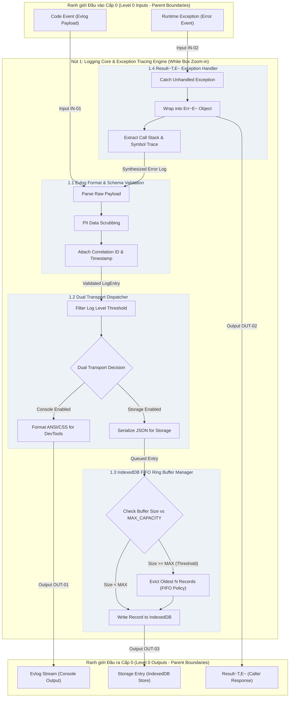

# Level 1/2 White Box Zoom-in & Sub-module Decomposition: logging-and-testing

> [!NOTE]
> Tài liệu này thuộc **Sub-step 5.2 (Level 1/2 White Box Zoom-in & Sub-module Decomposition)**. Chúng tôi lựa chọn **ĐÚNG 1 Node cốt lõi** từ sơ đồ Level 0 (Nút: `Logging Core & Exception Tracing Engine`) để thực hiện mở Hộp đen (White Box Decomposition). Mọi giao diện Input/Output từ ranh giới Level 0 được bảo toàn 100% (**Parent-Child Boundary Consistency**), tuyệt đối tuân thủ nguyên tắc **Zero Physical Horizontal Slicing**.

---

## 1. Mục tiêu Phân rã & Lựa chọn Nút Cốt lõi (Core Node Selection)

### 1.1. Nút Cốt lõi Được Lựa chọn
Từ 3 Hộp đen cấp độ 0 đã định nghĩa tại `architecture-overview.md`, Nút được chọn để Zoom-in là:
> **Nút 1: `Logging Core & Exception Tracing Engine`**

### 1.2. Lý do Lựa chọn
Nút 1 đóng vai trò "Bộ não điều phối" (Orchestrator) của toàn bộ hạ tầng Observability & Testing. Đây là nơi tiếp nhận 100% thông điệp log từ ứng dụng, thực thi kiểm định schema, gói ngoại lệ bằng mẫu `Result<T,E>`, phân phát luồng dữ liệu song song (Dual Transport), và quản lý trực tiếp bộ đệm ghi xuống IndexedDB.

---

## 2. Bóc tách Tiến trình Con (Sub-processes Decomposition)

Khi mở Hộp đen của Nút `Logging Core & Exception Tracing Engine`, logic xử lý nội bộ được chia thành **4 Tiến trình con (Sub-processes)** làm việc phối hợp với nhau:

```
┌────────────────────────────────────────────────────────────────────────────────────────┐
│ Nút 1: Logging Core & Exception Tracing Engine (Level 1/2 White Box Zoom-in)            │
│                                                                                        │
│  ┌─────────────────────────┐       ┌───────────────────────────┐                       │
│  │ 1.1 Evlog Format &      │ ───>  │ 1.2 Dual Transport        │ ──> DevTools Console  │
│  │ Schema Validation       │       │ Dispatcher                │     & Log Stream      │
│  └─────────────────────────┘       └───────────────────────────┘                       │
│               │                                  │                                     │
│               ▼                                  ▼                                     │
│  ┌─────────────────────────┐       ┌───────────────────────────┐                       │
│  │ 1.4 Result<T,E>         │       │ 1.3 IndexedDB FIFO Ring   │ ──> Storage Entry     │
│  │ Exception Handler       │       │ Buffer Manager            │     (IndexedDB)       │
│  └─────────────────────────┘       └───────────────────────────┘                       │
└────────────────────────────────────────────────────────────────────────────────────────┘
```

### 2.1. Tiến trình 1.1: Evlog Format & Schema Validation
- **Chức năng**: Tiếp nhận `Code Event` thô từ ứng dụng, thực hiện bổ sung các thuộc tính metadata mặc định (`timestamp`, `correlationId`, `sessionGuid`, `sourceContext`), và kiểm định schema JSON với Zod/TypeScript guards.
- **Quy tắc kiểm định**:
  - Tự động bỏ qua / làm sạch dữ liệu nhạy cảm (PII scrubbing: password, token, api_key).
  - Từ chối các log payload vượt quá 64KB kích thước.
  - Gán level chuẩn: `DEBUG`, `INFO`, `WARN`, `ERROR`, `FATAL`.

### 2.2. Tiến trình 1.2: Dual Transport Dispatcher
- **Chức năng**: Nhận log entry đã được chuẩn hóa và thực hiện phân phát song song (Dual Dispatching) tới các kênh phù hợp dựa trên cấu hình `LogLevelConfig`:
  - **Kênh 1 (Console Transport)**: Format log thành dạng màu sinh động (ANSI/CSS styles) và ghi ra `DevTools Console` (Chrome Extension Inspection).
  - **Kênh 2 (Storage Transport)**: Chuyển dữ liệu log entry xuống Tiến trình 1.3 để thực hiện persistence.

### 2.3. Tiến trình 1.3: IndexedDB FIFO Ring Buffer Manager
- **Chức năng**: Quản lý kho lưu trữ nhật ký cục bộ trong browser IndexedDB theo cơ chế Vòng lặp đệm (Ring Buffer):
  - Duy trì dung lượng bản ghi tối đa (ví dụ: `MAX_ENTRIES = 5000`).
  - Khi số lượng vượt ngưỡng, tự động phát hiện và xóa các bản ghi cũ nhất theo chính sách **FIFO (First-In, First-Out)**.
  - Xử lý các lỗi hạn ngạch lưu trữ browser (`QuotaExceededError`) bằng cách giải phóng 10% dung lượng đệm gần nhất.

### 2.4. Tiến trình 1.4: Result<T,E> Exception Handler
- **Chức năng**: Bắt giữ các ngoại lệ runtime, chuyển đổi ngoại lệ thô thành đối tượng `Err<E>` chuẩn hóa, trích xuất `stackTrace`, và liên kết ngoại lệ với một `Code Event` mức `ERROR`/`FATAL` để phát tán qua Dual Transport.
- **Đảm bảo**: Không có bất kỳ lỗi không được bắt (unhandled exception) nào làm đứt gãy luồng thực thi của Extension.

---

## 3. Sơ đồ White Box Zoom-in Architecture Diagram



---

## 4. Ma trận Bảo toàn Ranh giới Cha - Con (Parent-Child Boundary Consistency Matrix)

Để đảm bảo tính nhất quán tuyệt đối giữa Cấp độ 0 và Cấp độ 1/2, bảng ma trận sau chứng minh mọi giao diện truyền nhận ở Cấp độ 0 đều được ánh xạ chính xác 1:1 vào các cổng của các tiến trình con:

| Mã Giao diện Level 0 | Tên Giao diện Level 0 | Loại Ranh giới | Tiến trình Con Đóng vai trò Cổng (Child Sub-process Port) | Trạng thái Bảo toàn (Boundary Consistency) |
| :--- | :--- | :--- | :--- | :--- |
| `IN-01` | Code Event Payload | Input | `1.1 Evlog Format & Schema Validation` (`SP11_Parse`) | **100% Preserved** |
| `IN-02` | Runtime Exception | Input | `1.4 Result<T,E> Exception Handler` (`SP14_Catch`) | **100% Preserved** |
| `OUT-01` | Evlog Stream | Output | `1.2 Dual Transport Dispatcher` (`SP12_ConsoleFormat`) | **100% Preserved** |
| `OUT-02` | `Result<T,E>` Response | Output | `1.4 Result<T,E> Exception Handler` (`SP14_Wrap`) | **100% Preserved** |
| `OUT-03` | Storage Entry | Output | `1.3 IndexedDB FIFO Ring Buffer Manager` (`SP13_WriteDB`) | **100% Preserved** |

---

## 5. Đảm bảo Nguyên tắc Không Cắt lát Ngang Vật lý (Zero Physical Horizontal Slicing)

### 5.1. Định nghĩa Lỗi Cắt lát Ngang Vật lý (Horizontal Slicing Antipattern)
Lỗi cắt lát ngang vật lý xảy ra khi một hệ thống lớn bị chia nhỏ thành nhiều file sơ đồ ở cùng một cấp độ trừu tượng một cách khiên cưỡng (ví dụ: chia workflow thành Sơ đồ 1, Sơ đồ 2, Sơ đồ 3 cắt ngang qua hệ thống mà không có quan hệ Zoom-in rõ ràng). Điều này dẫn đến làm mất ngữ cảnh toàn cục (Global Context Loss) và làm vỡ ranh giới module.

### 5.2. Tuân thủ Phân rã Theo Trục Dọc (Vertical Zooming Compliance)
Quy trình thiết kế này thực thi nghiêm ngặt phân rã dọc:
1. **Level 0 (`architecture-overview.md`)**: Cung cấp bức tranh toàn cảnh Black Box (Hộp đen che kín logic).
2. **Level 1/2 (`submodule-decomposition.md`)**: Chỉ chọn ĐÚNG 1 Nút cốt lõi (`Logging Core & Exception Tracing Engine`) để thực hiện White Box Zoom-in.
3. Các Nút khác (Nút 2: Storage Subsystem, Nút 3: Test Suite) tiếp tục giữ nguyên ranh giới Hộp đen và giao tiếp thông qua giao diện hợp đồng đã cam kết.

---

## 6. Danh mục Các Sơ đồ Chi tiết Được Cô lập (Isolated Diagrams Reference)

Các khía cạnh chi tiết của Nút 1 được mô hình hóa thành đúng 6 sơ đồ Markdown chuyên biệt trong thư mục `diagrams/`:

1. **C4 Architecture Container Diagram**: [c4.md](file:///Docs/Specs/logging-and-testing/diagrams/c4.md)
2. **3-Branch Execution Flowchart**: [flowchart.md](file:///Docs/Specs/logging-and-testing/diagrams/flowchart.md)
3. **Temporal Component Sequence Diagram**: [sequence.md](file:///Docs/Specs/logging-and-testing/diagrams/sequence.md)
4. **IndexedDB ERD Schema**: [erd.md](file:///Docs/Specs/logging-and-testing/diagrams/erd.md)
5. **Domain Class Diagram**: [class.md](file:///Docs/Specs/logging-and-testing/diagrams/class.md)
6. **Log Lifecycle State Diagram**: [state.md](file:///Docs/Specs/logging-and-testing/diagrams/state.md)
