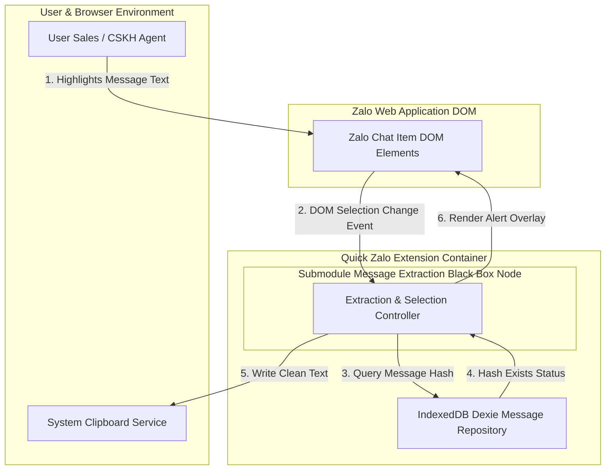

# Architecture Overview (Level 0 Black Box Context): message-extraction

**Feature Name:** `message-extraction`  
**Target Path:** `Docs/Specs/message-extraction/architecture-overview.md`  
**Status:** `ARCHITECTED`  

---

## 1. Submodule Black Box Boundary & System Context

Submodule `message-extraction` hoạt động dưới dạng một dịch vụ mở rộng chạy trong không gian Zalo Web Client. Submodule được xem như một **Black Box Container** độc lập có giao diện rõ ràng với người dùng, trình duyệt và lưu trữ dữ liệu.

> [!NOTE]
> Nguyên tắc Level 0: Định nghĩa rõ ranh giới hệ thống, các tác nhân đầu vào (Actors), các sự kiện kích hoạt (Triggers), cùng đầu ra (Outputs/Events) mà KHÔNG làm lộ chi tiết mã nguồn nội bộ.

### External Boundaries & Actors

1. **User (Sales / CSKH Agent)**:
   - *Input/Trigger*: Thao tác kéo thả bôi đen đoạn văn bản tin nhắn trên cửa sổ chat Zalo Web.
   - *Output*: Nhận nội dung tin nhắn sạch trong System Clipboard và phản hồi trực quan (Center Alert Modal hoặc Toast notification).

2. **Zalo Web DOM Interface**:
   - *Input/Trigger*: Các phần tử DOM hội thoại Zalo (`.chat-item`, message elements) và sự kiện DOM (`selectionchange`, `mouseup`).
   - *Output*: Gắn Shadow DOM Overlay cho Center Alert Modal.

3. **System Clipboard Service**:
   - *Output*: Ghi nhận văn bản tin nhắn đã lọc sạch (`cleanContent`).

4. **IndexedDB Local Storage (`quick_zalo` DB)**:
   - *Input/Output*: Đọc/Ghi dữ liệu dấu vân tay tin nhắn (`MessageEntity` & `MessageHashIndex`).

---

## 2. Level 0 C4 System Context Diagram

Sơ đồ C4 Container thể hiện Ranh giới Macro và các luồng giao tiếp chính của Submodule `message-extraction`:

Sơ đồ chi tiết cách ly: [overview-l0.md](file:///Docs/Specs/message-extraction/diagrams/overview-l0.md) (Raw Mermaid: [c4.mmd](file:///Docs/Specs/message-extraction/diagrams/c4.mmd))

---

## 3. Parent-Child Boundary Specifications

| Boundary Identifier | Source Boundary | Target Boundary | Event / Payload Type | Protocol |
|---|---|---|---|---|
| `IN_DOM_SELECTION` | Zalo DOM | Extraction Core | `SelectionEvent` (raw text + DOM node) | DOM Event Listener |
| `OUT_CLIPBOARD_WRITE` | Extraction Core | System Clipboard | `CleanTextString` (Sanitized text) | Clipboard API |
| `IO_INDEXEDDB_LOOKUP` | Extraction Core | Dexie Database | `MessageHashQuery` / `Result<MessageEntity, StorageError>` | Async Dexie API |
| `OUT_ALERT_RENDER` | Extraction Core | Zalo DOM | `RenderAlertCommand` (Duplicate / Success state) | Shadow DOM Mount |

---

## 4. End-of-Step Validation Gate (Sub-step 5.1)

| Criteria | Required Threshold | Result | Score | Status |
|---|---|---|---|---|
| Black Box Abstraction | Level 0 internal code hidden | Hidden | 1.00 | PASS |
| Boundary Preservation | Inputs/Outputs 100% mapped | Mapped | 1.00 | PASS |
| Diagram Syntax Rules | Labels wrapped in `""`, 0 HTML | Compliant | 1.00 | PASS |

**Sub-step 5.1 Score:** 1.00 / 1.00 (`PASS`)
