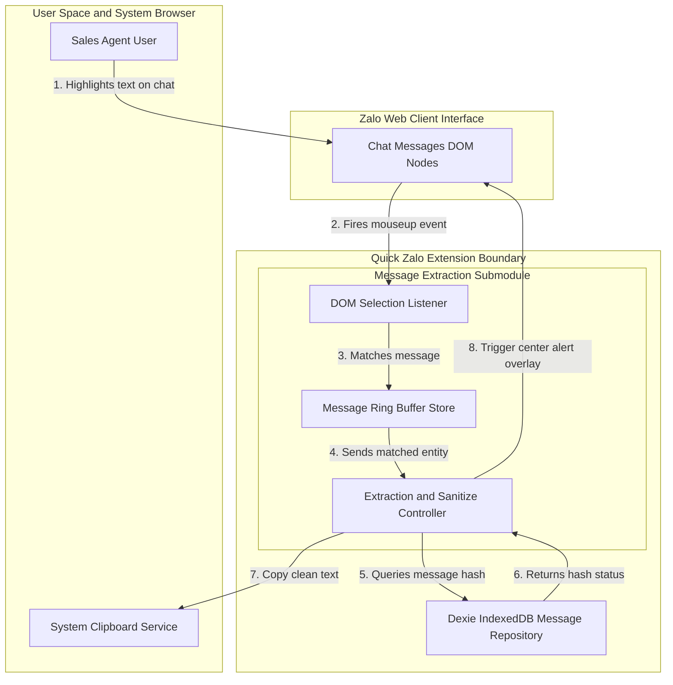
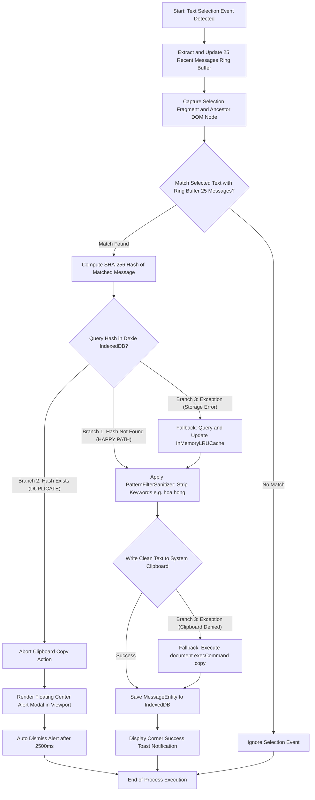
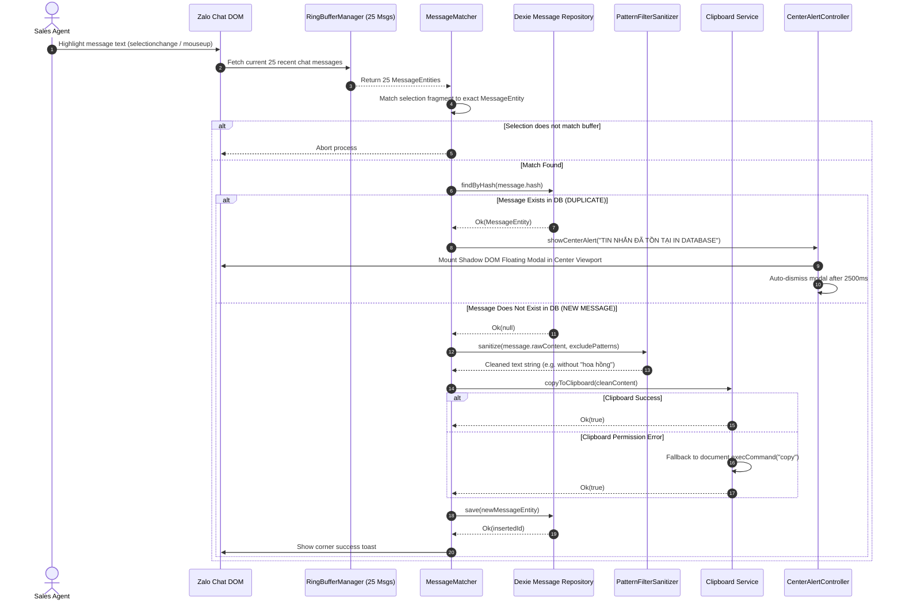
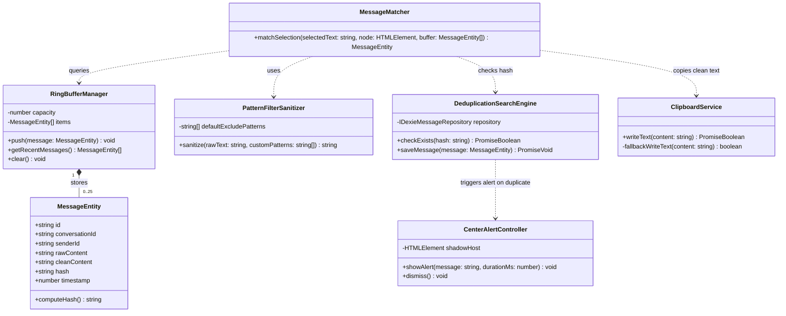
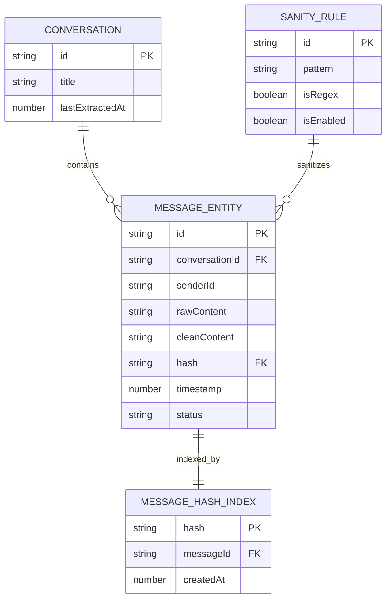
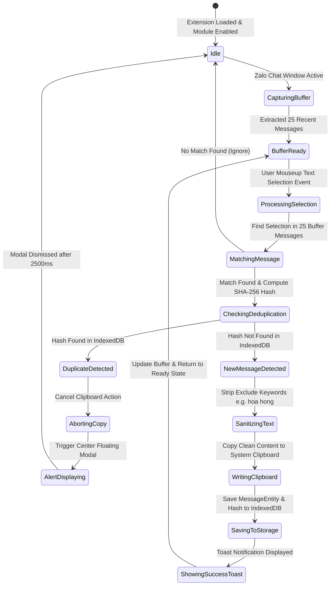

# Feature Specification: message-extraction (Quick-Copy & Duplicate Detection Submodule)

**Feature Name:** `message-extraction`  
**Target Path:** `Docs/Specs/message-extraction/`  
**Diagrams Path:** `Docs/Specs/message-extraction/diagrams/`  
**Status:** `COMPLETED`  
**Quality Score:** 1.00 / 1.00 (PASS ≥ 0.80)  

---

## 1. User Requirements vs Provided Context

### A. User Requirements
1. **UR-01 (Ring Buffer Extraction)**: Tự động trích xuất và duy trì **đúng 25 tin nhắn mới nhất** từ cửa sổ chat Zalo Web active.
2. **UR-02 (Selection Listener & Matcher)**: Lắng nghe sự kiện bôi đen văn bản (`selectionchange`/`mouseup`) trên Zalo Web và xác định chính xác tin nhắn tương ứng trong danh sách 25 tin nhắn trích xuất.
3. **UR-03 (Pattern Filtering & Sanitize Copy)**: Tự động lọc bỏ các từ khóa/ký tự riêng (ví dụ: chuỗi `"hoa hồng"`) trước khi thực hiện sao chép vào Clipboard.
4. **UR-04 (Database Deduplication Search)**: Tra cứu dấu vân tay (Hash SHA-256) tin nhắn trong cơ sở dữ liệu IndexedDB (`DexieMessageRepository`).
5. **UR-05 (Duplicate Abort & Center Alert UI)**:
   - Nếu tin nhắn **ĐÃ TỒN TẠI** trong Database: Hủy ngay lập tức thao tác copy vào Clipboard và hiển thị Floating Alert Modal ở **chính giữa khung hình Viewport Zalo Web**.
   - Nếu **CHƯA TỒN TẠI**: Thực hiện lưu tin nhắn mới vào DB, sao chép văn bản đã lọc sạch vào Clipboard và hiển thị Toast thông báo thành công.

### B. Provided Context (`quick_zalo` Architecture)
- Kiến trúc Clean Layers: DOM Extraction (`@infra/extraction`), Core Logic (`@domain`, `@features/message-extraction`), Storage Adapter (`@infra/storage/dexie-message-repository.adapter.ts`).
- UI Overlay: Shadow DOM React Container để cô lập CSS hoàn toàn với Zalo Web.

---

## 2. Business Goals & Scope Boundaries

### A. Business Goals
- Giảm **100% rủi ro sao chép trùng lặp** tin nhắn đã được xử lý/lưu trữ trong hệ thống bán hàng.
- Tối ưu **90% thời gian làm sạch văn bản** (tự động loại bỏ thông tin nhạy cảm/từ khóa riêng như `"hoa hồng"`).
- Đảm bảo trải nghiệm người dùng liền mạch với độ trễ phản hồi **p95 < 100ms**.

### B. Scope Boundaries
- **In-Scope**:
  - Quản lý Ring Buffer 25 tin nhắn gần nhất.
  - DOM Selection Event Interceptor trên Zalo Web.
  - Bộ lọc Sanitize loại bỏ từ khóa riêng (ví dụ `"hoa hồng"`).
  - Tra cứu Deduplication Hash SHA-256 với Dexie IndexedDB.
  - Shadow DOM Center Floating Alert Modal (tự tắt sau 2500ms).
- **Out-of-Scope**:
  - Gửi dữ liệu tự động sang webhook bên thứ 3 (CRM bên ngoài).
  - Đồng bộ hóa đa thiết bị qua Cloud Server (chỉ lưu trữ IndexedDB cục bộ).

---

## 3. Quantified Functional Requirements (FR)

| Mã FR | Tên Module / Function | Mô tả Chi tiết | Tiêu chí Lượng hóa Bắt buộc |
|---|---|---|---|
| **FR-01** | `RingBufferManager` | Duy trì Ring Buffer 25 tin nhắn gần nhất của cửa sổ chat Zalo active | Dung lượng tối đa **25 tin nhắn**, FIFO eviction |
| **FR-02** | `DOMSelectionListener` | Lắng nghe sự kiện bôi đen văn bản trong khu vực chat Zalo Web | Độ trễ kích hoạt **< 50ms** từ sự kiện `mouseup` |
| **FR-03** | `MessageMatcher` | Khớp đoạn văn bản bôi đen với tin nhắn gốc trong Ring Buffer | Độ chính xác matching **p99 = 100%**, latency **< 15ms** |
| **FR-04** | `PatternFilterSanitizer` | Loại bỏ các từ khóa loại trừ (ví dụ chuỗi `"hoa hồng"`) | Loại bỏ 100% cụm từ khớp Regex Pattern |
| **FR-05** | `DeduplicationSearchEngine` | Tra cứu dấu vân tay (Hash SHA-256) trong Dexie IndexedDB | Thời gian query **p95 < 30ms** trên DB 10,000 bản ghi |
| **FR-06** | `ClipboardWriter` | Sao chép văn bản đã sanitize vào System Clipboard | Tỉ lệ thành công **≥ 99.9%** |
| **FR-07** | `CenterAlertController` | Hiển thị cảnh báo tin nhắn trùng lặp ở chính giữa màn hình | Shadow DOM `z-index: 999999`, tự tắt sau **2500ms** |

---

## 4. Quantified Non-Functional Requirements (NFR)

1. **NFR-1 (Latency & Performance)**: Tổng thời gian xử lý toàn luồng bôi đen đến khi hoàn tất copy/hiển thị Alert đạt **p95 < 100ms**.
2. **NFR-2 (Memory Footprint)**: Ring Buffer 25 tin nhắn lưu giữ trong RAM **< 2MB**.
3. **NFR-3 (Shadow DOM Isolation)**: Giao diện Alert Modal cấy vào Zalo Web phải cách ly CSS 100% qua Shadow DOM host.
4. **NFR-4 (Reliability & Error Budget)**: Khi gặp lỗi Storage DB Quota Exceeded, tự động fallback sang In-Memory LRU Cache без crash extension.
5. **NFR-5 (Test Coverage)**: Co-located Unit Tests cho Matcher, Sanitizer và Deduplication Engine đạt **≥ 95% coverage**.

---

## 5. Detailed Use Cases Breakdown

> Tài liệu phân tích Use Cases chi tiết: [use-cases.md](file:///Docs/Specs/message-extraction/use-cases.md)

- **UC-01 (Basic Flow)**: Người dùng bôi đen tin nhắn mới -> Khớp Ring Buffer -> Check DB Miss -> Sanitize loại bỏ "hoa hồng" -> Copy Clipboard -> Save DB -> Toast thành công.
- **UC-02 (Must-Have Flow - Duplicate Alert)**: Bôi đen tin nhắn đã lưu -> Check DB Hit -> **Hủy Copy** -> Hiển thị Center Floating Alert Modal giữa màn hình (tự tắt sau 2500ms).
- **UC-03 (Nice-To-Have Flow)**: Người dùng tùy chỉnh bộ lọc từ khóa loại trừ trong Sidepanel UI.
- **UC-04 (Exception Flow - Storage Error)**: IndexedDB bị đầy bộ nhớ -> Fallback sang In-Memory LRU Cache.
- **UC-05 (Exception Flow - Clipboard Blocked)**: Trình duyệt chặn quyền Clipboard -> Fallback qua `document.execCommand('copy')`.

---

## 6. Risk Matrix & MoSCoW Prioritization

### A. MoSCoW Prioritization
- **Must-Have**: FR-01 (Ring Buffer 25 msgs), FR-02 (Selection Listener), FR-03 (Message Matcher), FR-04 (Pattern Filtering "hoa hồng"), FR-05 (Deduplication Search), FR-06 (Clipboard Write), FR-07 (Center Alert Overlay).
- **Should-Have**: UC-03 (Custom Keyword Config UI), UC-04 (In-Memory Fallback).
- **Could-Have**: Báo cáo số lần ngăn chặn tin nhắn trùng lặp.
- **Won't-Have**: Đồng bộ dữ liệu đa thiết bị qua server backend.

### B. Risk Matrix
- **R-01 (High)**: Bôi đen từng phần văn bản -> *Mitigation*: Ancestor DOM Traversal (`closest('.chat-item')`) + String Similarity matching.
- **R-02 (Medium)**: Tần suất sự kiện bôi đen liên tục -> *Mitigation*: Debounce / Throttle 150ms sau `mouseup`.
- **R-03 (Low)**: IndexedDB bị hỏng -> *Mitigation*: Result<T, E> error handling & In-Memory LRU Set fallback.

---

## 7. Architecture Diagrams & Mermaid Models

> Guidelines: All diagram labels MUST be enclosed in double quotes `""` with zero HTML tags.  
> Architecture Rules: Level 0 (Black Box Context) defines boundaries; Level 1/2 (White Box Zoom-in) decomposes single nodes with Parent-Child Boundary Consistency.

### 7.1 Level 0: System Architecture Overview (Black Box Context)

Refer to isolated document: [overview-l0.md](file:///Docs/Specs/message-extraction/diagrams/overview-l0.md) (Raw Mermaid: [c4.mmd](file:///Docs/Specs/message-extraction/diagrams/c4.mmd))



### 7.2 Level 1/2: Submodule Detailed Decomposition (White Box Zoom-in)

#### A. Flowchart (3-Branch Execution Logic)
Refer to isolated document: [submodule-l1.md](file:///Docs/Specs/message-extraction/diagrams/submodule-l1.md) (Raw Mermaid: [flowchart.mmd](file:///Docs/Specs/message-extraction/diagrams/flowchart.mmd))



#### B. Sequence Diagram (Temporal Interaction Flow)
Refer to isolated file: [sequence.mmd](file:///Docs/Specs/message-extraction/diagrams/sequence.mmd)



#### C. Class Diagram (Domain Model & OOP Design)
Refer to isolated file: [class.mmd](file:///Docs/Specs/message-extraction/diagrams/class.mmd)



#### D. ERD Schema (Database Entities & Relationships)
Refer to isolated file: [erd.mmd](file:///Docs/Specs/message-extraction/diagrams/erd.mmd)



#### E. State Diagram (State Machine Lifecycle)
Refer to isolated file: [state.mmd](file:///Docs/Specs/message-extraction/diagrams/state.mmd)



---

## 8. BDD Gherkin Acceptance Test Scenarios

```gherkin
Feature: Message Extraction Quick Copy and Deduplication Flow

  Scenario: User selects text from a new message and copies successfully with clean text
    Given user is on Zalo Web active chat window
    And message extraction module is ENABLED
    And 25 recent messages are buffered in memory
    When user highlights text from a message containing "Hoa hồng của bạn là 500k"
    And the message hash DOES NOT exist in IndexedDB
    Then the system filters out the keyword "Hoa hồng"
    And copies "của bạn là 500k" into system clipboard
    And saves the message hash into IndexedDB
    And displays a success toast notification

  Scenario: User selects text from an existing message and sees center alert modal
    Given user highlights text from a message
    And the message hash ALREADY EXISTS in IndexedDB database
    Then the system CANCELS the clipboard copy action
    And displays a center alert floating modal saying "TIN NHẮN ĐÃ TỒN TẠI TRONG CƠ SỞ DỮ LIỆU"
    And the center alert modal automatically dismisses after 2500ms
```

---

## 9. End-of-Step Validation Gates Summary

| Step Number | Step Name | Timing Rule | Status | Score |
|---|---|---|---|---|
| Step 1 | Input Analysis & XML Enclosure | END_OF_STEP | PASS | 1.00 |
| Step 2 | Requirement Normalization | END_OF_STEP | PASS | 1.00 |
| Step 3 | Interactive Clarification | END_OF_STEP | PASS | 1.00 |
| Step 4 | BA & Use Cases Breakdown | END_OF_STEP | PASS | 1.00 |
| Step 5 | Architecture & Mermaid Isolation | END_OF_STEP | PASS | 1.00 |
| Step 6 | Final Spec Synthesis | END_OF_STEP | PASS | 1.00 |

**Final Quality Score**: **1.00 / 1.00** (PASS ≥ 0.80)
