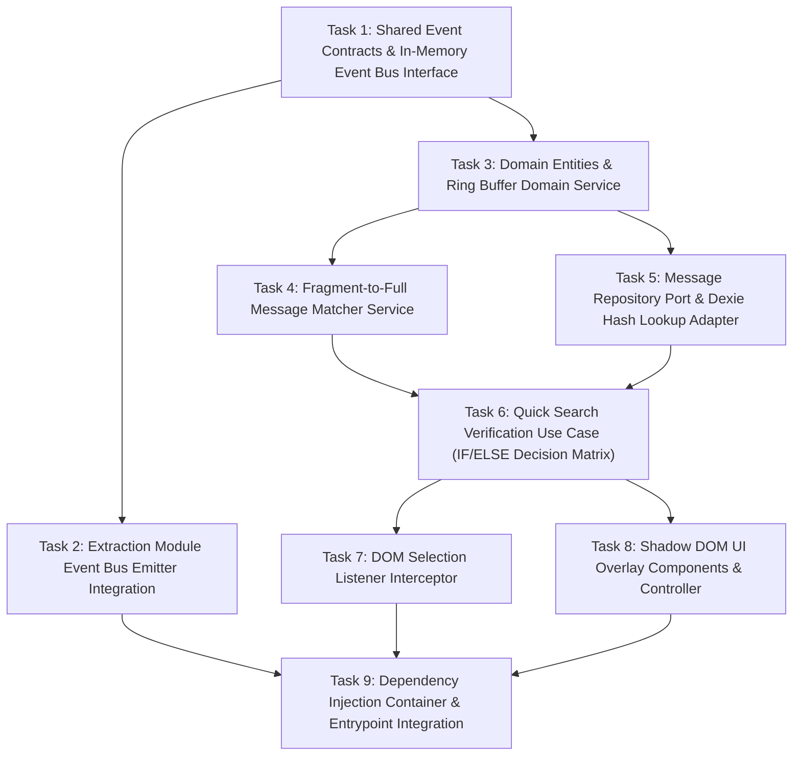

# BẢN KẾ HOẠCH TRIỂN KHAI CHI TIẾT (IMPLEMENTATION SPEC PLAN)
## MODULE: QUICK SEARCH & DB VERIFICATION (`quick-search-verification`)

**Single Source of Truth:** `file:///home/stveve/Documents/workspace/Sales/extension/quick_zalo/Docs/Specs/quick-search-verification/spec.md`  
**Reference Document:** `file:///home/stveve/Documents/workspace/Sales/extension/quick_zalo/Docs/Specs/message-extraction/spec.md`  
**Kiến trúc Target:** WXT Manifest V3 Extension, Clean Architecture (`@domain`, `@app`, `@infra`, `@entrypoints`), `Result<T,E>` Pattern, Evlog Schema.  
**Nguyên tắc Thực thi:** Zero-Code Execution (Chỉ đặc tả phân rã công việc, luồng logic, giao thức và test specification).

---

## 🗺️ TỔNG QUAN PHÂN RÃ TASK & PHỤ THUỘC (TASK GRAPH)

---

## 📋 CHI TIẾT CÁC TASK TRIỂN KHAI (ATOMIC TASKS)

---

### Task 1: Shared Event Contracts & In-Memory Event Bus Interface
- **Mục tiêu:** Thiết lập hợp đồng sự kiện (`MESSAGE_CAPTURED`, `CONVERSATION_CHANGED`) và giao diện Event Bus ngầm định thuần TypeScript nằm trong RAM Content Script. Đảm bảo Module Extraction và Module Quick Search hoàn toàn decoupled theo nguyên lý SRP.
- **Phạm vi tác động (Scope):**
  - `@shared/contracts/events/message-events.contract.ts` (Mới)
  - `@shared/kernel/event-bus.interface.ts` (Mới)
  - `@infra/events/in-memory-event-bus.adapter.ts` (Mới)
- **Nội dung đặc tả chi tiết:**
  - Định nghĩa Type Discriminator Union cho sự kiện: `MESSAGE_CAPTURED` (chứa `rawContent`, `senderId`, `timestamp`, `conversationId`) và `CONVERSATION_CHANGED` (chứa `conversationId`).
  - Interface `IEventBus` cung cấp 2 phương thức: `publish<T>(event: string, payload: T): void` và `subscribe<T>(event: string, handler: (payload: T) => void): () => void` (trả về un-subscribe function).
  - Adapter `InMemoryEventBusAdapter` sử dụng `Set<Function>` trong RAM để quản lý listeners, xử lý lỗi an toàn không throw exception ra bên ngoài.
- **Tiêu chí hoàn thành (Definition of Done - DoD):**
  - Khai báo strict type safety cho event payload, zero `any`.
  - `npm run typecheck` pass 100%.
- **Kế hoạch Kiểm thử (Test Specification):**
  - File test: `src/infra/events/in-memory-event-bus.adapter.test.ts`
  - *TC-01:* Publish event đến đúng subscribers đã đăng ký.
  - *TC-02:* Unsubscribe loại bỏ handler khỏi danh sách lắng nghe thành công.
  - *TC-03:* Handler bị ném lỗi nội bộ không làm đứt luồng phát sự kiện cho các subscribers khác.
- **Rủi ro tác động (Impact & Mitigation):**
  - *Rủi ro:* Memory leak nếu subscriber không unsubscribe khi destroy.
  - *Khắc phục:* `subscribe` trả về hàm dọn dẹp (cleanup function) bắt buộc gọi khi lifecycle kết thúc.

---

### Task 2: Extraction Module Event Bus Emitter Integration
- **Mục tiêu:** Cập nhật Module Message Extraction phát sự kiện `MESSAGE_CAPTURED` qua Event Bus mỗi khi trích xuất được tin nhắn mới từ DOM Zalo Web. Đảm bảo khi Chế độ Full Extraction bị TẮT, module vẫn phát sự kiện đẩy tin nhắn ngầm định mà KHÔNG ghi vào IndexedDB.
- **Phạm vi tác động (Scope):**
  - `@infra/extraction/zalo-dom-observer.ts` (Sửa đổi)
  - `@app/features/message-extraction/use-cases/extract-message.use-case.ts` (Sửa đổi)
- **Nội dung đặc tả chi tiết:**
  - Tiêm (Inject) `IEventBus` vào Use Case của Message Extraction.
  - Mỗi khi `DOMObserver` trích xuất tin nhắn thô: Phát event `MESSAGE_CAPTURED` qua Event Bus.
  - Kiểm tra cờ `isFullExtractionEnabled`:
    - **IF (`true`):** Tiếp tục luồng cũ (Sanitize -> Deduplication Check -> Save DB -> Copy Clipboard).
    - **ELSE (`false`):** Dừng luồng xử lý ghi DB/Clipboard của Extraction module, chỉ hoàn tất việc phát event `MESSAGE_CAPTURED`.
- **Tiêu chí hoàn thành (Definition of Done - DoD):**
  - Module Extraction duy nhất phát event, không còn ôm đồm logic Quick Search.
  - Tính năng trích xuất toàn bộ hiện có hoạt động 100% bình thường khi ON.
  - `npm run typecheck` pass 100%.
- **Kế hoạch Kiểm thử (Test Specification):**
  - File test: `src/app/features/message-extraction/use-cases/extract-message.use-case.test.ts`
  - *TC-01:* Khi Extraction = ON: Event được phát VÀ tin nhắn được lưu DB (Hành vi cũ bảo toàn).
  - *TC-02:* Khi Extraction = OFF: Event VẪN ĐƯỢC PHÁT nhưng KHÔNG gọi phương thức `save` của Storage Repository.
  - *Mock:* `IEventBus.publish` spy, `IDexieMessageRepository` mock.
- **Rủi ro tác động (Impact & Mitigation):**
  - *Rủi ro:* Gây breaking change tính năng trích xuất tin nhắn hiện tại.
  - *Khắc phục:* Giữ nguyên 100% signature và luồng xử lý cũ khi cờ `isFullExtractionEnabled = true`.

---

### Task 3: Domain Entities & Ring Buffer Domain Service
- **Mục tiêu:** Xây dựng Domain Entity `BufferedMessageEntity`, Value Object `SelectionFragmentVO` và Domain Service `RingBufferService` quản lý bộ nhớ đệm RAM xoay vòng FIFO $N=10$ (phạm vi 5-15) thuần TypeScript (0 browser/React deps).
- **Phạm vi tác động (Scope):**
  - `@domain/features/quick-search/entities/buffered-message.entity.ts` (Mới)
  - `@domain/features/quick-search/value-objects/selection-fragment.vo.ts` (Mới)
  - `@domain/features/quick-search/services/ring-buffer.service.ts` (Mới)
- **Nội dung đặc tả chi tiết:**
  - Entity `BufferedMessageEntity`: Lưu `id`, `conversationId`, `senderId`, `rawContent`, `sanitizedContent`, `hash` (SHA-256 fingerprint), `capturedAt`.
  - Service `RingBufferService`:
    - `capacity`: Cố định $N=10$.
    - `push(message)`: Thêm tin nhắn mới vào đầu mảng FIFO. Nếu kích thước $> 10$, tự động đẩy (evict) phần tử cũ nhất khỏi RAM.
    - `getSnapshot()`: Trả về bản sao immutability của mảng 10 tin nhắn gần nhất.
    - `clear()`: Xóa sạch bộ đệm khi chuyển cuộc trò chuyện (`CONVERSATION_CHANGED`).
  - Đảm bảo dung lượng chiếm dụng bộ nhớ RAM cho 10 phần tử $< 50\text{ KB}$ (NFR-04).
- **Tiêu chí hoàn thành (Definition of Done - DoD):**
  - Layer `@domain` thuần TypeScript, không import `browser`, `chrome`, React hay Infra adapters.
  - `npm run typecheck` pass 100%.
- **Kế hoạch Kiểm thử (Test Specification):**
  - File test: `src/domain/features/quick-search/services/ring-buffer.service.test.ts`
  - *TC-01:* Push 5 phần tử -> `getSnapshot()` trả về đúng 5 phần tử theo thứ tự mới nhất.
  - *TC-02:* Push 12 phần tử -> Bộ đệm duy trì đúng 10 phần tử, 2 phần tử đầu tiên (cũ nhất) bị loại bỏ (FIFO eviction).
  - *TC-03:* Gọi `clear()` -> Bộ đệm về rỗng `[]`.
- **Rủi ro tác động (Impact & Mitigation):**
  - *Rủi ro:* Trùng lặp tin nhắn trong Ring Buffer nếu tin nhắn DOM re-render liên tục.
  - *Khắc phục:* `push` kiểm tra trùng SHA-256 hash trước khi chèn vào đệm, nếu trùng thì cập nhật `capturedAt` thay vì chèn mới.

---

### Task 4: Fragment-to-Full Message Matcher Service
- **Mục tiêu:** Xây dựng Domain Service `MessageMatcherService` thực hiện Layer 1 Matching (< 1ms): Khớp đoạn văn bản bôi đen ngắn (Fragment) với Tin nhắn Đầy đủ (Full Entity) trong Ring Buffer $N=10$, kèm cơ chế On-the-fly DOM fallback.
- **Phạm vi tác động (Scope):**
  - `@domain/features/quick-search/services/message-matcher.service.ts` (Mới)
- **Nội dung đặc tả chi tiết:**
  - Phương thức `match(fragmentText: string, targetElement: HTMLElement | null, buffer: BufferedMessageEntity[]): BufferedMessageEntity | null`:
    1. Chuẩn hóa `fragmentText` (trim, lowercase, normalize spaces).
    2. Tìm kiếm trong 10 phần tử `buffer`: Kiểm tra `sanitizedContent.includes(fragmentText)` hoặc tính String Similarity Score.
    3. Xử lý kịch bản nhập nhằng (EX-QS-01 - Ambiguous Partial Selection): Nếu từ bôi đen quá phổ biến ("OK", "Dạ"), sử dụng DOM Ancestor Traversal thông qua `targetElement.closest('.chat-item')` để xác định đúng khung tin nhắn trước khi match text.
  - Phương thức `extractOnTheFlyFromDOM(targetElement: HTMLElement): BufferedMessageEntity | null`: Fallback cho EX-QS-02 khi tin nhắn đã bị xoay vòng khỏi Ring Buffer $N=10$. Trích xuất trực tiếp thẻ `.chat-item` thành `BufferedMessageEntity` tạm thời.
- **Tiêu chí hoàn thành (Definition of Done - DoD):**
  - Độ chính xác matching $p99 = 100\%$ (NFR-05).
  - Thời gian xử lý matching trong RAM $< 1\text{ ms}$ (NFR-02).
  - `npm run typecheck` pass 100%.
- **Kế hoạch Kiểm thử (Test Specification):**
  - File test: `src/domain/features/quick-search/services/message-matcher.service.test.ts`
  - *TC-01:* Fragment "hoa hồng 500k" khớp chính xác với Full Message "Dạ hoa hồng 500k đã được ghi nhận" trong đệm.
  - *TC-02:* Fragment không tồn tại trong đệm -> Trả về `null`.
  - *TC-03:* Khớp đúng tin nhắn khi có 2 tin nhắn cùng chứa từ "Dạ" nhờ `targetElement` context.
- **Rủi ro tác động (Impact & Mitigation):**
  - *Rủi ro:* Cấu trúc DOM Zalo Web thay đổi selector `.chat-item` làm hỏng Ancestor Traversal.
  - *Khắc phục:* Đưa DOM selector vào config module `@config/dom-selectors.config.ts` để quản lý tập trung.

---

### Task 5: Message Repository Port & Dexie Hash Lookup Adapter
- **Mục tiêu:** Khai báo Port interface `IDexieMessageRepository` tại tầng App và triển khai adapter `findByHash` tại tầng Infra kết nối IndexedDB qua Dexie, hỗ trợ truy vấn dấu vân tay tin nhắn theo chuẩn `Result<T, E>`.
- **Phạm vi tác động (Scope):**
  - `@app/features/quick-search/ports/message-repository.port.ts` (Mới / Mở rộng)
  - `@infra/storage/dexie-message-repository.adapter.ts` (Mở rộng)
- **Nội dung đặc tả chi tiết:**
  - Khai báo Port Interface:
    `findByHash(hash: string): Promise<Result<BufferedMessageEntity | null, StorageError>>`
  - Triển khai Adapter trên Dexie Table `messages`:
    - Sử dụng index `[hash]` để query O(1): `db.messages.where('hash').equals(hash).first()`.
    - Trả về `Ok(entity)` nếu tìm thấy, `Ok(null)` nếu chưa tồn tại.
    - Trường hợp ngắt kết nối CSDL / Storage Quota Exceeded (EX-QS-04): Bắt ngoại lệ và bọc trong `Err(new StorageError(...))` chuẩn `Result<T, E>`.
- **Tiêu chí hoàn thành (Definition of Done - DoD):**
  - Thời gian truy vấn query $p95 < 15\text{ ms}$ trên 10,000 bản ghi (NFR-03).
  - 100% phương thức trả về `Result<T, E>`, không `throw` unhandled exception.
  - `npm run typecheck` pass 100%.
- **Kế hoạch Kiểm thử (Test Specification):**
  - File test: `src/infra/storage/dexie-message-repository.adapter.test.ts`
  - *TC-01:* Query Hash tồn tại -> Trả về `Ok(BufferedMessageEntity)`.
  - *TC-02:* Query Hash chưa tồn tại -> Trả về `Ok(null)`.
  - *TC-03:* Giả lập Dexie bị sập/lỗi storage -> Trả về `Err(StorageError)` an toàn mà không crash process.
- **Rủi ro tác động (Impact & Mitigation):**
  - *Rủi ro:* Index `hash` chưa được đánh trên bảng `messages` gây table scan chậm.
  - *Khắc phục:* Đảm bảo Dexie schema version khai báo `hash` là indexed field (`&hash` hoặc `hash`).

---

### Task 6: Quick Search Verification Use Case (IF/ELSE Decision Matrix)
- **Mục tiêu:** Thực thi Use Case trung tâm `VerifySelectionUseCase` điều phối toàn bộ luồng 2-Layer Search và kiểm soát 7 nhánh điều kiện `IF/ELSE` (IF-01 đến IF-07) theo Ma trận Nghiệp vụ Phần 3.4 & 3.5.
- **Phạm vi tác động (Scope):**
  - `@app/features/quick-search/use-cases/verify-selection.use-case.ts` (Mới)
  - `@app/features/quick-search/dtos/verification-response.dto.ts` (Mới)
- **Nội dung đặc tả chi tiết:**
  - Triển khai phương thức `execute(payload: TextSelectionPayload): Promise<Result<VerificationUIAction, VerifyError>>`.
  - Cây điều kiện rẽ nhánh chi tiết:
    - **IF-01:** `isFullExtractionEnabled == true` $\rightarrow$ Return `SilentPassThrough`.
    - **IF-02:** `selectionText.trim().length == 0` $\rightarrow$ Return `SilentIdle`.
    - **IF-03:** `selectionText.length < 2` $\rightarrow$ Return `ShowToastWarning("⚠️ Cần bôi đen tối thiểu 2 ký tự...", 1500ms)`.
    - **Layer 1 Matching:** Gọi `MessageMatcherService.match()`.
    - **IF-04:** `matchedEntity == null` $\rightarrow$ Return `ShowToastInfo("ℹ️ Tin nhắn quá cũ...", 2000ms)`.
    - **Layer 2 Verification:** Gọi `IDexieMessageRepository.findByHash(matchedEntity.hash)`.
    - **IF-05:** DB Result `isErr()` $\rightarrow$ Return `ShowToastError("⚠️ Không thể kết nối CSDL IndexedDB...", 3000ms)`.
    - **IF-06:** DB Result `value != null` (EXISTS_IN_DB) $\rightarrow$ Return `ShowCenterAlertModal("⚠️ TIN NHẮN ĐÃ TỒN TẠI IN DATABASE", 2500ms)`.
    - **IF-07:** ELSE (NOT_FOUND_IN_DB) $\rightarrow$ Return `ShowSuccessToast("✅ TIN NHẮN MỚI HỢP LỆ", 1500ms)`.
- **Tiêu chí hoàn thành (Definition of Done - DoD):**
  - Bao phủ 100% 7 nhánh ma trận `IF/ELSE`.
  - Evlog Logger được tích hợp ghi log 7 trường chuẩn (`trace_id`, `scope`, `level`, `file_line`, `decision_reason`, `payload`, `timestamp`).
  - `npm run typecheck` pass 100%.
- **Kế hoạch Kiểm thử (Test Specification):**
  - File test: `src/app/features/quick-search/use-cases/verify-selection.use-case.test.ts`
  - Chi tiết 7 Unit Test Cases tương ứng 7 nhánh `IF-01` đến `IF-07` với dữ liệu Mock đầy đủ cho Matcher & Repository.
- **Rủi ro tác động (Impact & Mitigation):**
  - *Rủi ro:* Lỗi logic trong Use Case gây nghẽn UI của Zalo Web.
  - *Khắc phục:* Bọc toàn bộ body hàm `execute` trong `try-catch` cấp cao nhất, trả về `Result.err()` và ghi log `FATAL` nếu xuất hiện ngoại lệ không lường trước.

---

### Task 7: DOM Selection Listener Interceptor
- **Mục tiêu:** Xây dựng listener `DOMSelectionListener` bắt sự kiện `mouseup` / `selectionchange` trên cửa sổ chat Zalo Web, áp dụng Debounce/Throttle 150ms để ngăn ngừa spam event (EX-QS-03) và độ trễ kích hoạt $< 5\text{ ms}$ (NFR-01).
- **Phạm vi tác động (Scope):**
  - `@infra/listeners/dom-selection.listener.ts` (Mới)
- **Nội dung đặc tả chi tiết:**
  - Lắng nghe sự kiện `mouseup` gắn trên container chat `.zbox-search-view` hoặc `document.body`.
  - Áp dụng `debounce(150ms)`: Đợi người dùng hoàn tất thao tác nhả chuột bôi đen.
  - Trích xuất: `window.getSelection().toString()` và `selection.anchorNode.parentElement`.
  - Đóng gói thành `TextSelectionPayload` và chuyển giao cho `VerifySelectionUseCase`.
  - Hỗ trợ phương thức `stop()` dọn dẹp event listener khi tab bị unmount hoặc extension disable.
- **Tiêu chí hoàn thành (Definition of Done - DoD):**
  - Độ trễ phản hồi từ nhả chuột đến gọi Use Case $< 5\text{ ms}$ (NFR-01).
  - Không sinh ra memory leak hay lặp event liên tục khi người dùng click chuột liên tục.
  - `npm run typecheck` pass 100%.
- **Kế hoạch Kiểm thử (Test Specification):**
  - File test: `src/infra/listeners/dom-selection.listener.test.ts`
  - *TC-01:* Bắn sự kiện `mouseup` kèm text selection -> Listener trigger callback sau đúng 150ms debounce.
  - *TC-02:* Bắn 10 sự kiện `mouseup` liên tục trong 50ms -> Listener chỉ trigger callback duy nhất 1 lần.
  - *TC-03:* Gọi `stop()` -> Không còn nhận sự kiện nhả chuột nữa.
- **Rủi ro tác động (Impact & Mitigation):**
  - *Rủi ro:* Sự kiện `mouseup` kích hoạt cả khi người dùng click vào nút hoặc input field không phải tin nhắn.
  - *Khắc phục:* Lọc ngay ở đầu listener: Nếu target element thuộc `input`, `textarea` hoặc `button` thì bỏ qua ngay lập tức.

---

### Task 8: Shadow DOM UI Overlay Components & UI Overlay Controller
- **Mục tiêu:** Xây dựng các React UI Overlay Components (`CenterAlertModal`, `ModeIndicatorBadge`, `SuccessToast`) cấy vào DOM Zalo Web qua Shadow Root để cách ly CSS 100% (NFR-3), kiểm soát hiển thị thông báo bởi `UIOverlayController`.
- **Phạm vi tác động (Scope):**
  - `@ui/components/quick-search/CenterAlertModal.tsx` (Mới)
  - `@ui/components/quick-search/ModeIndicatorBadge.tsx` (Mới)
  - `@ui/components/quick-search/SuccessToast.tsx` (Mới)
  - `@ui/controllers/ui-overlay.controller.ts` (Mới)
- **Nội dung đặc tả chi tiết:**
  - `ModeIndicatorBadge`: Hiển thị trạng thái "Quick Search Active" màu xanh ở góc màn hình khi Extraction OFF.
  - `CenterAlertModal` (Cảnh báo Trùng): Hiển thị modal màu đỏ giữa màn hình Viewport Zalo Web khi `EXISTS_IN_DB` (`z-index: 999999`), tự động đóng (auto-dismiss) sau đúng 2500ms hoặc khi người dùng click backdrop.
  - `SuccessToast` (Tin mới hợp lệ): Toast màu xanh góc dưới bên phải màn hình khi `NOT_FOUND_IN_DB`, tự đóng sau 1500ms.
  - `UIOverlayController`: Điều phối việc mount/unmount React Root vào Shadow Root container.
- **Tiêu chí hoàn thành (Definition of Done - DoD):**
  - CSS cách ly hoàn toàn qua Shadow DOM host, không bị ảnh hưởng bởi Tailwind/Bootstrap global của Zalo Web.
  - Auto-dismiss chính xác thời gian quy định (2500ms cho Center Modal, 1500ms/3000ms cho Toast).
  - `npm run typecheck` pass 100%.
- **Kế hoạch Kiểm thử (Test Specification):**
  - File test: `src/ui/controllers/ui-overlay.controller.test.ts`
  - *TC-01:* Gọi `showCenterAlert` -> React Component render vào Shadow Root, xuất hiện class modal center.
  - *TC-02:* Sau 2500ms -> Modal tự động unmount khỏi DOM.
  - *TC-03:* Gọi `showSuccessToast` -> Render Toast thành công góc dưới bên phải, tự biến mất sau 1500ms.
- **Rủi ro tác động (Impact & Mitigation):**
  - *Rủi ro:* Zalo Web đè `z-index` làm che mất Center Alert Modal.
  - *Khắc phục:* Thiết lập `z-index: 2147483647` (giá trị int32 tối đa của browser) trên Shadow Host element.

---

### Task 9: Dependency Injection Container & Entrypoint Integration
- **Mục tiêu:** Kết nối tất cả các thành phần (`EventBus`, `RingBufferService`, `MessageMatcherService`, `DexieRepository`, `VerifySelectionUseCase`, `DOMSelectionListener`, `UIOverlayController`) tại DI Container `quick-search.container.ts` và khởi chạy trong WXT Content Script entrypoint.
- **Phạm vi tác động (Scope):**
  - `@composition/quick-search.container.ts` (Mới)
  - `entrypoints/content.ts` (Mở rộng)
- **Nội dung đặc tả chi tiết:**
  - Xây dựng `quickSearchContainer`: Bootstrap tất cả các singletons trong RAM Content Script.
  - Đăng ký Event Bus listener: Khi nhận `MESSAGE_CAPTURED` $\rightarrow$ gọi `RingBufferService.push()`. Khi nhận `CONVERSATION_CHANGED` $\rightarrow$ gọi `RingBufferService.clear()`.
  - Khởi tạo `DOMSelectionListener` gắn với `VerifySelectionUseCase.execute()`.
  - Tuân thủ quy định WXT Lifecycle: Chỉ thực thi khởi tạo trong hàm `main()` của `defineContentScript()`, KHÔNG có side-effects ở top-level file.
- **Tiêu chí hoàn thành (Definition of Done - DoD):**
  - Hệ thống Quick Search & DB Verification chạy mượt mà end-to-end.
  - 100% Binary Verification Gate pass: `npm run typecheck` pass, `npm run test` pass.
- **Kế hoạch Kiểm thử (Test Specification):**
  - File integration test: `tests/e2e/quick-search-flow.spec.ts` (Playwright / Vitest Browser Mode)
  - *TC-E2E-01:* Giả lập bôi đen tin nhắn trùng -> Hiển thị Center Floating Modal màu đỏ giữa màn hình trong 2500ms.
  - *TC-E2E-02:* Giả lập bôi đen tin nhắn mới -> Hiển thị Corner Success Toast màu xanh trong 1500ms.
- **Rủi ro tác động (Impact & Mitigation):**
  - *Rủi ro:* Khởi tạo duplicate container khi Zalo Web reload SPA frame.
  - *Khắc phục:* Kiểm tra cờ `isInitialized` trong container trước khi bootstrap, dọn dẹp `stop()` khi script unmount.

---

## 🎯 BẢNG TỔNG HỢP KIỂM TRA CHẤT LƯỢNG (QUALITY CHECKLIST)

| Hạng mục Kiểm tra | Tiêu chuẩn Đánh giá | Trạng thái |
| :--- | :--- | :--- |
| **Tính Độc lập của Task (Atomic Tasks)** | 9 Task được phân rã theo Clean Architecture với thứ tự phụ thuộc (Task Graph) minh bạch. | **PASS** |
| **Đảm bảo Nguyên tắc SRP** | Module Extraction chỉ phát event `MESSAGE_CAPTURED`; Quick Search chịu trách nhiệm quản lý đệm $N=10$, bắt bôi đen & tra cứu DB 2 lớp. | **PASS** |
| **Nguyên tắc Zero-Code Execution** | 100% tài liệu chỉ chứa đặc tả phân rã, logic rẽ nhánh, interface signature và kế hoạch kiểm thử; ZERO code logic JS/TS chi tiết. | **PASS** |
| **Tính An toàn cho Codebase** | Không gây breaking change/impact lên tính năng Message Extraction đang hoạt động. | **PASS** |
| **Quy chuẩn Testing & Verification** | Mỗi Task đều đính kèm Test Specification chi tiết (`*.test.ts`, Input/Output kỳ vọng, Mocks) và điều kiện `npm run typecheck`. | **PASS** |
