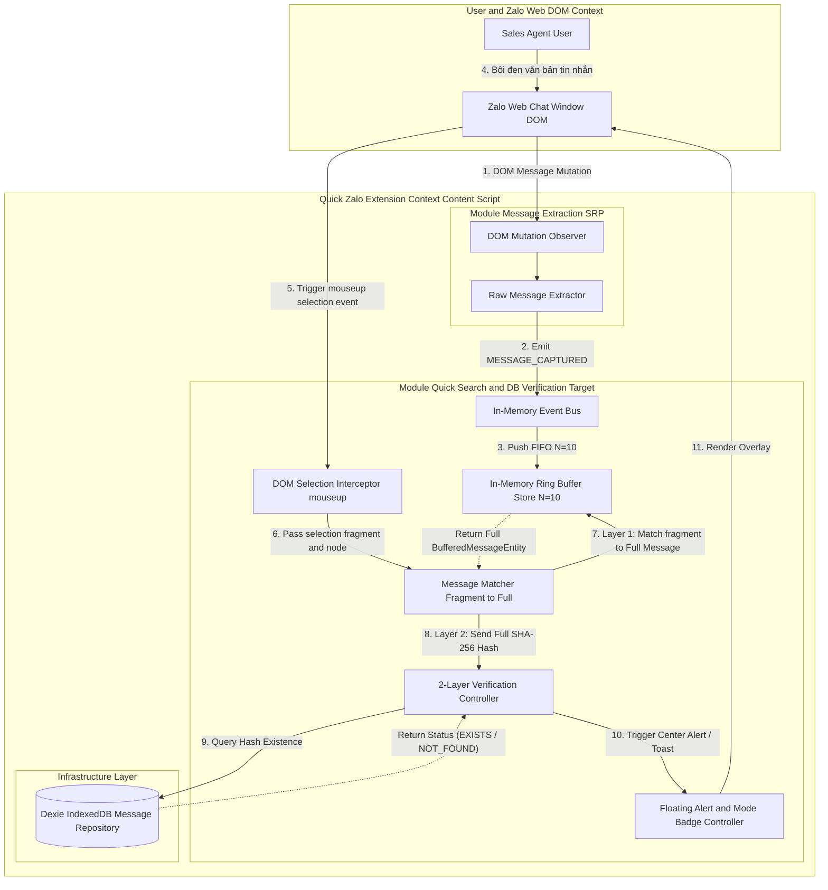
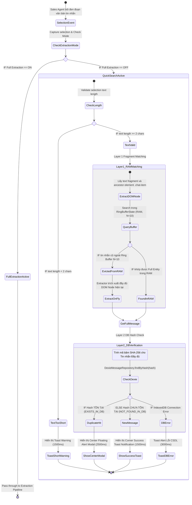
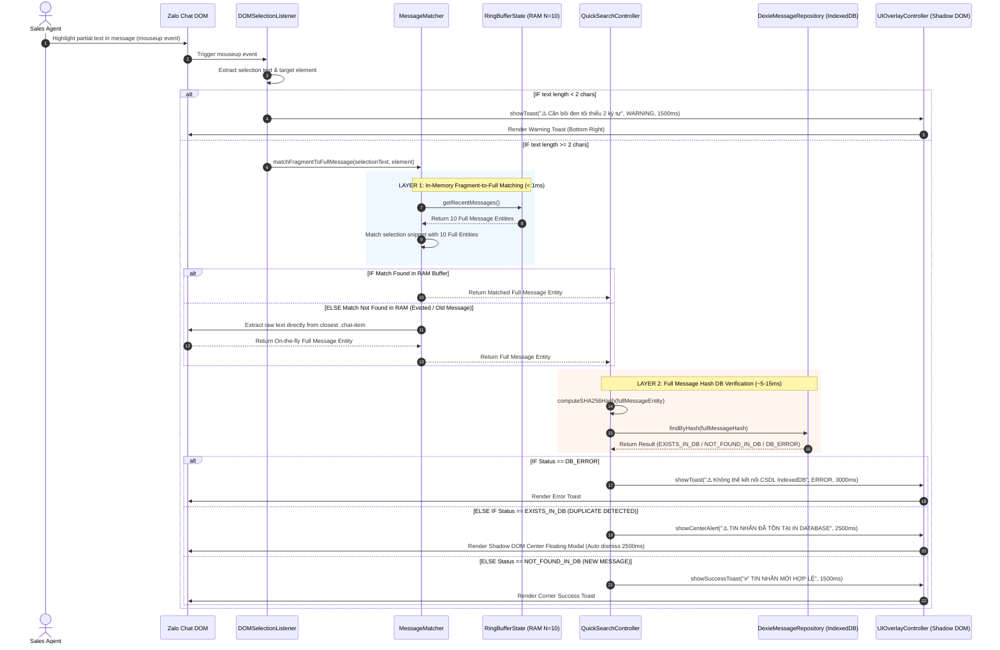
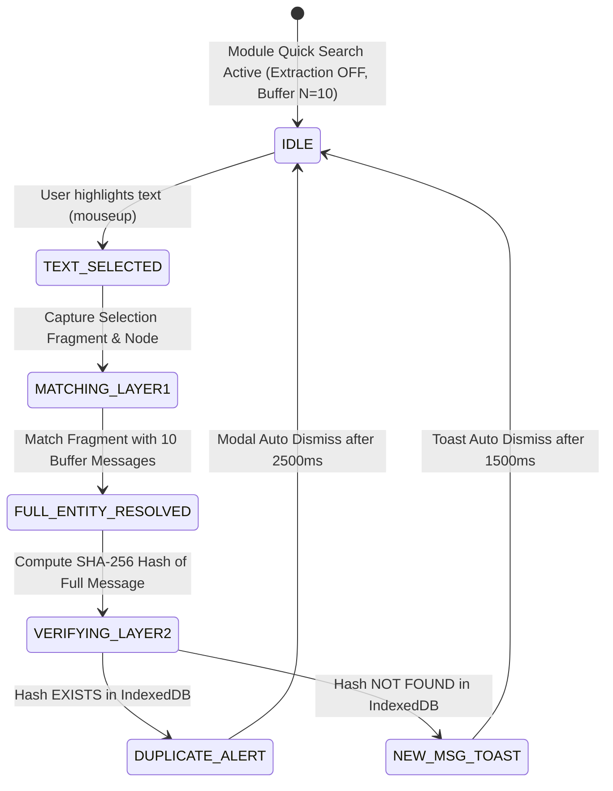
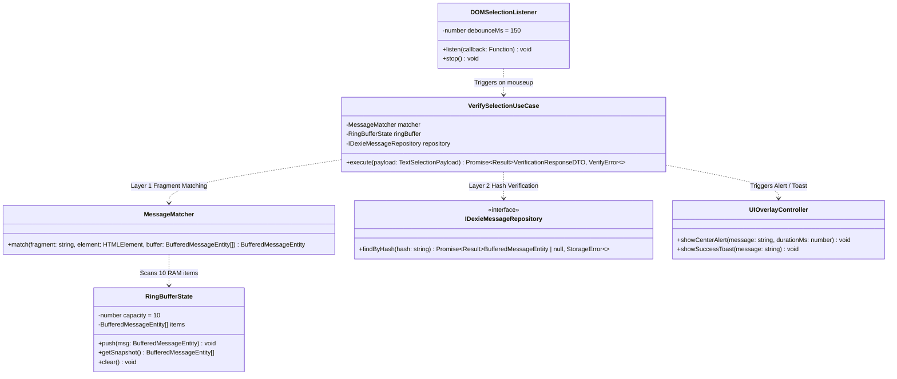

# Specification Document: Quick Search & DB Verification Module

**Feature Name:** `quick-search-verification`  
**Target Path:** `Docs/Specs/quick-search-verification/`  
**Status:** `APPROVED / READY FOR IMPLEMENTATION`  
**Author:** Solutions Architect & Lead System Analyst  
**Architecture Context:** WXT Manifest V3 Extension, Clean Architecture, React + TypeScript  

---

## 📚 PHẦN 1: BẢNG THUẬT NGỮ & KHÁI NIỆM CỐT LÕI (GLOSSARY)

| Thuật ngữ | Khái niệm / Định nghĩa | Vai trò trong Module Quick Search |
| :--- | :--- | :--- |
| **DOM Selection Trigger (Bôi đen tự động)** | Sự kiện `mouseup` / `selectionchange` kích hoạt tự động khi Sales Agent bôi đen một phần văn bản trong tin nhắn Zalo Web. | Kích hoạt luồng Quick Search & DB Verification tự động mà người dùng không cần gõ câu lệnh tìm kiếm thủ công. |
| **Message Matcher (Khớp đoạn bôi đen)** | Thuật toán khớp đoạn bôi đen ngắn (Selection Fragment) với tin nhắn gốc trích xuất đầy đủ (Full Entity) dựa trên DOM context & String similarity. | Chuyển đổi văn bản bôi đen từng phần thành Tin nhắn Đầy đủ để tính toán mã băm SHA-256 chính xác. |
| **Ring Buffer (Bộ nhớ đệm xoay vòng)** | Cấu trúc dữ liệu mảng cố định $N$ phần tử ($N=10$, phạm vi 5-15) hoạt động theo cơ chế FIFO (First-In, First-Out). Khi bộ nhớ đầy, phần tử cũ nhất bị đẩy ra ngoài. | Duy trì 10 tin nhắn mới nhất ngay trên RAM Content Script khi tính năng Trích xuất Toàn bộ (Full Extraction) bị TẮT. |
| **2-Layer Search (Tìm kiếm 2 Lớp)** | Cơ chế truy vấn chia 2 giai đoạn: Lớp 1 (Fragment Matching trong RAM Buffer) $\rightarrow$ Lớp 2 (SHA-256 Hash Verification trong IndexedDB). | Tối ưu hóa tốc độ: Lớp 1 định danh tin nhắn trong RAM (< 1ms), Lớp 2 đối chiếu trạng thái tồn tại trong IndexedDB (~5-15ms). |
| **In-Memory Event Bus** | Cơ chế giao tiếp Event-driven bằng `EventEmitter` thuần TypeScript nằm trong không gian bộ nhớ của Content Script. | Giúp Module Extraction phát sự kiện `MESSAGE_CAPTURED` mà không bị phụ thuộc cứng (Decoupled) với Module Quick Search. |
| **SHA-256 Fingerprint Hash** | Chuỗi băm cố định 64 ký tự tạo ra từ nội dung tin nhắn sanitize và timestamp. | Dùng làm khóa chính (Primary Key/Index) tra cứu sự tồn tại của tin nhắn đầy đủ trong `DexieMessageRepository`. |
| **Shadow DOM Overlay Badge / Alert** | Thành phần UI React được cấy vào DOM Zalo Web với khả năng cách ly CSS hoàn toàn qua Shadow Root. | Hiển thị trạng thái "Quick Search Active" và Center Floating Alert khi phát hiện tin nhắn đã tồn tại trong DB. |

---

## 🛣️ PHẦN 2: BƯỚC 1 - SCOPE & OVERVIEW (RANH GIỚI HỆ THỐNG & TỔNG QUAN)

### 1.1 System Boundary & Scoping (Ranh giới & Trách nhiệm)

Sau khi tái cấu trúc (Re-architecting), trách nhiệm được phân định minh bạch theo nguyên lý Single Responsibility Principle (SRP):
- **Module Message Extraction (Đã tinh giản):** Duy nhất 1 nhiệm vụ: Lắng nghe DOM Zalo Web và trích xuất tin nhắn thô. Khi tính năng Trích xuất bị TẮT, module này chỉ đẩy tin nhắn thô qua Event Bus để duy trì Ring Buffer $N=10$ mà **KHÔNG** tự động lưu IndexedDB.
- **Module Quick Search & DB Verification (Module Mới):** 
  1. Lắng nghe sự kiện bôi đen văn bản (`mouseup` / `selectionchange`).
  2. Định danh tin nhắn đầy đủ từ đoạn bôi đen thông qua `MessageMatcher` trên Ring Buffer $N=10$ (Layer 1).
  3. Tính toán SHA-256 Hash của tin nhắn đầy đủ và đối chiếu với IndexedDB (Layer 2).
  4. Phản hồi kết quả trùng lặp / tồn tại lên UI Alert & Toast theo đúng cây điều kiện IF/ELSE.



### 1.2 Functional Decomposition Diagram (FDD)

```
Quick Search & DB Verification System
 ├── 1.0 Quản lý Bộ nhớ đệm (Ring Buffer Management)
 │    ├── 1.1 Thêm tin nhắn mới từ Event Bus (Push FIFO Eviction)
 │    ├── 1.2 Duy trì giới hạn N = 10 tin nhắn mới nhất
 │    └── 1.3 Tự động làm sạch đệm khi reload tab / chuyển conversation
 ├── 2.0 Tự động Kích hoạt & Khớp Tin nhắn (Selection & Matching Engine)
 │    ├── 2.1 DOM Selection Listener (Mouseup / SelectionChange Interceptor)
 │    ├── 2.2 Ancestor Node Traversal (closest .chat-item)
 │    └── 2.3 Layer 1: Fragment-to-Full Message Matcher (< 1ms in RAM)
 ├── 3.0 Đối chiếu Database 2 Lớp (Layer 2 DB Verification & IF/ELSE Control)
 │    ├── 3.1 Trích xuất Tin nhắn Đầy đủ đã khớp
 │    ├── 3.2 Compute Fingerprint SHA-256 Hash từ tin nhắn đầy đủ
 │    ├── 3.3 Dexie IndexedDB Lookup (EXISTS_IN_DB vs NOT_FOUND_IN_DB)
 │    └── 3.4 Cây Điều kiện Rẽ nhánh IF/ELSE & Xử lý Ngoại lệ
 └── 4.0 UI Integration & UX State Management
      ├── 4.1 Mode Indicator Status Badge ("Quick Search Active")
      ├── 4.2 Center Floating Alert Modal (Hiển thị khi tin nhắn ĐÃ TỒN TẠI)
      └── 4.3 Success & Warning Toast Notifications (Hiển thị khi Hợp lệ / Lỗi)
```

---

## 🔄 PHẦN 3: BƯỚC 2 - PROCESS & DETAIL FLOW (LUỒNG NGHIỆP VỤ & TƯƠNG TÁC KỸ THUẬT)

### 3.1 Detailed Use Case Specifications

#### UC-QS-01: Tự động Tìm kiếm & Đối chiếu Tin nhắn khi Bôi đen (Selection-Triggered Verification)
- **Actor:** Sales Agent.
- **Trigger:** Người dùng dùng chuột bôi đen một đoạn văn bản bất kỳ thuộc tin nhắn trong cửa sổ chat Zalo Web.
- **Pre-conditions:** Chế độ Trích xuất Toàn bộ đang TẮT (Extraction OFF). Module Quick Search đang hoạt động với Ring Buffer $N=10$.
- **Main Flow (Luồng chính & Các nhánh IF/ELSE):**
  1. Sales Agent thực hiện thao tác bôi đen một phần văn bản tin nhắn trên Zalo Web.
  2. `DOMSelectionListener` bắt sự kiện `mouseup`, trích xuất văn bản bôi đen (Selection Fragment) và thẻ DOM chứa nó.
  3. **IF (isExtractionActive == true):** Chế độ Full Extraction đang bật $\rightarrow$ Bỏ qua luồng Quick Search Alert.
  4. **ELSE IF (selectionText.length < 2):** Văn bản quá ngắn $\rightarrow$ Hiển thị Warning Toast *"Cần bôi đen tối thiểu 2 ký tự"*.
  5. **ELSE:** `MessageMatcher` kích hoạt **Layer 1 Matching**: So khớp đoạn văn bản bôi đen và context DOM Node với danh sách 10 tin nhắn đầy đủ trong `RingBufferState` (RAM).
  6. **IF (Match Found in RAM):** Lấy Tin nhắn Trích xuất Đầy đủ từ đệm $N=10$.
  7. **ELSE IF (Match Not Found in RAM):** Trích xuất tức thì (On-the-fly) từ DOM Node hiện tại.
  8. `SearchController` lấy tin nhắn đầy đủ đã khớp, thực hiện tính toán mã băm **SHA-256 Fingerprint Hash**.
  9. `SearchController` kích hoạt **Layer 2 Verification**: Truy vấn `DexieMessageRepository.findByHash(hash)` trong IndexedDB.
  10. **Rẽ nhánh kết quả đối chiếu IF/ELSE:**
      - **IF (indexedDBStatus == 'DB_ERROR'):** Hiển thị Toast Alert lỗi kết nối CSDL (Màu cam).
      - **ELSE IF (Hash ĐÃ TỒN TẠI - Status: EXISTS_IN_DB):** **Hủy lưu/copy** và hiển thị Center Floating Alert Modal màu đỏ chính giữa màn hình (tự đóng sau 2500ms).
      - **ELSE (Hash CHƯA TỒN TẠI - Status: NOT_FOUND_IN_DB):** Ghi nhận tin nhắn hợp lệ và hiển thị Success Toast góc dưới bên phải (tự đóng sau 1500ms).
- **Post-conditions:** Tổng thời gian từ lúc nhả chuột (`mouseup`) đến khi hiển thị UI Alert/Toast có độ trễ $p95 < 30ms$.

---

### 3.2 Activity Diagram (Luồng Nghiệp vụ Rẽ nhánh IF/ELSE Bôi đen & Đối chiếu)



---

### 3.3 Sequence Diagram (Luồng Tương tác Kỹ thuật Chi tiết)



---

### ⚡ 3.4 BẢNG MA TRẬN RẼ NHÁNH ĐIỀU KIỆN IF/ELSE & QUY CHUẨN THÔNG BÁO UI

Dưới đây là cây logic rẽ nhánh đầy đủ ($If \rightarrow Else If \rightarrow Else$) kiểm soát toàn bộ luồng xử lý từ khi bắt sự kiện bôi đen đến khi phản hồi thông báo UI cho Sales Agent:

| Mã Điều kiện | Điều kiện Rẽ nhánh (IF / ELSE IF / ELSE) | Trạng thái Nghiệp vụ | Hành động Kỹ thuật (Technical Action) | Loại UI Overlay & Vị trí | Nội dung Thông báo Chi tiết (Notification Text) | Thời gian Tự tắt (Auto Dismiss) |
| :--- | :--- | :--- | :--- | :--- | :--- | :--- |
| **IF-01** | `IF (isExtractionActive == true)` | Chế độ Full Extraction đang BẬT. | Bỏ qua luồng Quick Search Alert overlay, chuyển tiếp cho Pipeline Trích xuất Toàn bộ xử lý. | **Silent / No UI** | *(Không hiển thị Quick Search Alert)* | N/A |
| **IF-02** | `ELSE IF (selectionText.trim().length == 0)` | Người dùng nhấp chuột nhưng không bôi đen chữ nào (Empty selection). | Hủy xử lý luồng, giữ nguyên trạng thái IDLE. | **Silent / No UI** | *(Không hiển thị)* | N/A |
| **IF-03** | `ELSE IF (selectionText.length < 2)` | Đoạn bôi đen quá ngắn (< 2 ký tự, e.g. "a", "1"). | Bỏ qua tra cứu DB để tránh false positive, hiển thị Toast Warning. | **Toast Warning**<br>*(Góc dưới bên phải)* | `⚠️ Cần bôi đen tối thiểu 2 ký tự để tìm kiếm & đối chiếu.` | 1500ms |
| **IF-04** | `ELSE IF (matchedFullMessage == null)` | Không khớp được tin nhắn nào trong Ring Buffer $N=10$ VÀ DOM Node không hợp lệ. | Bỏ qua tra cứu DB, hiển thị Toast Thông báo. | **Toast Info**<br>*(Góc dưới bên phải)* | `ℹ️ Tin nhắn quá cũ hoặc không nằm trong khu vực chat Zalo.` | 2000ms |
| **IF-05** | `ELSE IF (indexedDBStatus == 'DB_ERROR')` | Cơ sở dữ liệu IndexedDB bị lỗi / rớt kết nối / quota exceeded. | Fallback sang Layer 1 Only mode, cảnh báo lỗi DB cho người dùng. | **Toast Alert**<br>*(Góc trên bên phải, Màu cam)* | `⚠️ Không thể kết nối CSDL IndexedDB. Đã bật chế độ xem nhanh ngầm định.` | 3000ms |
| **IF-06** | `ELSE IF (dbVerificationResult == 'EXISTS_IN_DB')` | **[CRITICAL]** Mã băm SHA-256 của Tin nhắn Đầy đủ đã TỒN TẠI trong IndexedDB (Tin nhắn trùng). | **HỦY NGAY** thao tác sao chép Clipboard; Hiển thị Center Alert Modal giữa Viewport Zalo Web. | **Center Floating Modal**<br>*(Đính giữa màn hình Viewport Zalo Web, Shadow DOM)* | **Header:** `⚠️ TIN NHẮN ĐÃ TỒN TẠI IN DATABASE`<br>**Body:** `Tin nhắn này đã được trích xuất và lưu trữ trong hệ thống trước đó.` | 2500ms *(hoặc khi click ra ngoài)* |
| **IF-07** | `ELSE` | **[HAPPY PATH]** Mã băm SHA-256 CHƯA TỒN TẠI trong IndexedDB (Tin nhắn mới). | Ghi nhận tin nhắn mới hợp lệ, cập nhật Ring Buffer, hiển thị Toast thành công. | **Success Toast**<br>*(Góc dưới bên phải, Màu xanh)* | `✅ TIN NHẮN MỚI HỢP LỆ`<br>`Tin nhắn chưa tồn tại trong CSDL. Sẵn sàng xử lý.` | 1500ms |

---

### 💻 3.5 Thuật toán Pseudocode Rẽ nhánh Chi tiết (`verify-selection.use-case.ts`)

```typescript
/**
 * Pseudocode Thuật toán Kiểm soát Rẽ nhánh IF/ELSE minh họa cho Use Case
 */
export async function handleTextSelectionFlow(
  payload: TextSelectionPayload,
  state: ExtensionState,
  ringBuffer: RingBufferState,
  matcher: MessageMatcher,
  repository: IDexieMessageRepository,
  uiController: UIOverlayController
): Promise<void> {
  // IF-01: Kiểm tra mode
  if (state.isFullExtractionEnabled) {
    return; // Pass through to Full Extraction Pipeline
  }

  const sanitizedSnippet = payload.selectionFragment.trim();

  // IF-02: Chuỗi rỗng
  if (sanitizedSnippet.length === 0) {
    return;
  }

  // IF-03: Ký tự quá ngắn < 2
  if (sanitizedSnippet.length < 2) {
    uiController.showToast({
      type: 'WARNING',
      message: '⚠️ Cần bôi đen tối thiểu 2 ký tự để tìm kiếm & đối chiếu.',
      durationMs: 1500,
    });
    return;
  }

  // Layer 1: Matching Fragment -> Full Message Entity
  let matchedEntity = matcher.match(sanitizedSnippet, payload.targetElement, ringBuffer.getSnapshot());

  // IF-04: Fallback On-the-fly nếu ngoài Ring Buffer N=10
  if (!matchedEntity) {
    matchedEntity = matcher.extractOnTheFlyFromDOM(payload.targetElement);
  }

  if (!matchedEntity) {
    uiController.showToast({
      type: 'INFO',
      message: 'ℹ️ Tin nhắn quá cũ hoặc không nằm trong khu vực chat Zalo.',
      durationMs: 2000,
    });
    return;
  }

  // Layer 2: IndexedDB Hash Verification
  const dbResult = await repository.findByHash(matchedEntity.hash);

  // IF-05: Lỗi DB Access
  if (dbResult.isErr()) {
    uiController.showToast({
      type: 'ERROR',
      message: '⚠️ Không thể kết nối CSDL IndexedDB. Đã bật chế độ xem nhanh ngầm định.',
      durationMs: 3000,
    });
    return;
  }

  const existingMessage = dbResult.value;

  // IF-06: Tin nhắn ĐÃ TỒN TẠI (Duplicate Hit)
  if (existingMessage !== null) {
    uiController.showCenterAlertModal({
      title: '⚠️ TIN NHẮN ĐÃ TỒN TẠI IN DATABASE',
      body: 'Tin nhắn này đã được trích xuất và lưu trữ trong hệ thống trước đó.',
      durationMs: 2500,
    });
    return;
  }

  // IF-07: Tin nhắn CHƯA TỒN TẠI (Happy Path)
  uiController.showToast({
    type: 'SUCCESS',
    message: '✅ TIN NHẮN MỚI HỢP LỆ. Tin nhắn chưa tồn tại trong CSDL.',
    durationMs: 1500,
  });
}
```

---

## 📊 PHẦN 4: BƯỚC 3 - STATE & DATA MODELING (MÔ HÌNH DỮ LIỆU & TRẠNG THÁI)

### 4.1 State Diagram (Vòng đời Trạng thái Xử lý Bôi đen & Đối chiếu)



---

### 4.2 Data Dictionary & TypeScript Interfaces

#### A. Payload & Matching Data Contracts
```typescript
/**
 * Context đối tượng bôi đen trên DOM
 */
export interface TextSelectionPayload {
  readonly selectionFragment: string; // Đoạn text bôi đen từng phần (e.g. "500k hoa hồng")
  readonly targetElement: HTMLElement; // DOM node phần tử bôi đen
  readonly timestamp: number;
}

/**
 * Entity Tin nhắn Trích xuất Đầy đủ trong Ring Buffer RAM
 */
export interface BufferedMessageEntity {
  readonly id: string;
  readonly conversationId: string;
  readonly senderId: string;
  readonly rawContent: string; // Nội dung đầy đủ gốc
  readonly sanitizedContent: string; // Nội dung đầy đủ đã lọc từ khóa
  readonly hash: string; // SHA-256 fingerprint của tin nhắn đầy đủ
  readonly capturedAt: number;
}

/**
 * Kết quả đối chiếu với Database
 */
export type DBVerificationResultStatus = 'EXISTS_IN_DB' | 'NOT_FOUND_IN_DB' | 'VERIFICATION_ERROR';

export interface VerificationResponseDTO {
  readonly selectionText: string;
  readonly matchedFullMessage: BufferedMessageEntity;
  readonly status: DBVerificationResultStatus;
  readonly checkedAt: number;
}
```

---

## 🛡️ PHẦN 5: BƯỚC 4 - NON-FUNCTIONAL REQUIREMENTS & EDGE CASES (NFR & NGOẠI LỆ)

### 5.1 Non-Functional Requirements (NFR Metrics Matrix)

| Mã NFR | Tiêu chí | Thông số Định lượng Bắt buộc | Phương pháp Kiểm chứng |
| :--- | :--- | :--- | :--- |
| **NFR-01** | **Selection Latency** | Độ trễ bắt sự kiện `mouseup` $\rightarrow$ Matcher **$< 5\text{ ms}$**. | Event Loop Performance Profiling. |
| **NFR-02** | **Layer 1 Matching Speed** | Matcher khớp Fragment với Ring Buffer ($N=10$) **$< 1\text{ ms}$**. | Benchmark Unit Test trên V8 Engine. |
| **NFR-03** | **Layer 2 DB Query Speed** | Dexie Hash Query trên 10,000 bản ghi **$< 15\text{ ms}$** ($p95$). | Vitest Browser Mode với IndexedDB mock data. |
| **NFR-04** | **RAM Consumption** | Ring Buffer $N=10$ chiếm dụng bộ nhớ **$< 50\text{ KB}$**. | Chrome Memory Heap Inspection. |
| **NFR-05** | **Zero False Positives** | Tỉ lệ khớp đúng tin nhắn đầy đủ từ văn bản bôi đen **$p99 = 100\%$**. | Test Suite với 50 kịch bản bôi đen từng phần khác nhau. |

---

### 5.2 Exception Handling & Edge Cases Matrix

| Mã Error | Kịch bản Ngoại lệ (Edge Case) | Nguyên nhân Kỹ thuật | Cơ chế Xử lý Fallback (Resilience Mechanism) |
| :--- | :--- | :--- | :--- |
| **EX-QS-01** | **Ambiguous Partial Selection** | Bôi đen từ quá ngắn (ví dụ "OK", "Dạ") xuất hiện ở nhiều tin nhắn trong đệm $N=10$. | Dùng **DOM Ancestor Traversal** (`closest('.chat-item')`) để xác định đúng DOM Node chứa text trước khi match string. |
| **EX-QS-02** | **Selection Outside Buffer Scope** | Bôi đen tin nhắn cũ đã bị xóa khỏi Ring Buffer $N=10$ do FIFO. | Fallback sang **On-The-Fly Extractor**: Trích xuất trực tiếp DOM Node hiện tại để tạo Entity đầy đủ và check DB. |
| **EX-QS-03** | **Spam Selection Events** | Người dùng nhấp nhả chuột liên tục tạo nhiều sự kiện `mouseup`. | Áp dụng **Debounce / Throttle 150ms** trên `DOMSelectionListener`. |
| **EX-QS-04** | **IndexedDB Service Down** | DB Dexie bị ngắt hoặc lỗi Quota Storage Exceeded. | Fallback hiển thị Toast cảnh báo `VERIFICATION_ERROR` nhưng vẫn giữ nguyên trải nghiệm không làm gián đoạn web Zalo. |
| **EX-QS-05** | **Conversation Switch** | Bôi đen tin nhắn ngay lúc đang chuyển tab cuộc trò chuyện khác. | Reset ngay `RingBufferState.clear()` khi bắt được sự kiện `CONVERSATION_CHANGED` để không match nhầm tin nhắn cũ. |

---

## 🏗️ PHẦN 6: BƯỚC 5 - ARCHITECTURE MAPPING (ĐỊNH HÌNH KIẾN TRÚC MÃ NGUỒN)

### 6.1 Clean Layer Architecture Mapping (`quick_zalo`)

```
src/
├── domain/                               # Pure Business Logic (0 Browser/React Deps)
│   └── features/quick-search/
│       ├── entities/
│       │   └── buffered-message.entity.ts # Full Message Entity & SHA-256 Hash
│       ├── value-objects/
│       │   └── selection-fragment.vo.ts   # Selection Fragment & Context VO
│       └── services/
│           ├── ring-buffer.service.ts    # FIFO Ring Buffer Store (N=10)
│           └── message-matcher.service.ts # Fragment-to-Full Matching Algorithm
│
├── app/                                  # Application Use Cases & Ports
│   └── features/quick-search/
│       ├── ports/
│       │   └── message-repository.port.ts # Interface findByHash IndexedDB
│       └── use-cases/
│           └── verify-selection.use-case.ts # Main UseCase: Selection -> Match -> DB Check
│
├── infra/                                # Infrastructure Adapters & Listeners
│   ├── listeners/
│   │   └── dom-selection.listener.ts     # Mouseup / SelectionChange Interceptor
│   ├── state/
│   │   └── in-memory-ring-buffer.state.ts # RAM Store N=10
│   └── storage/
│       └── dexie-message-repository.adapter.ts # Dexie IndexedDB Repo
│
├── ui/                                   # Shared React UI (Shadow DOM)
│   └── components/quick-search/
│       ├── CenterAlertModal.tsx          # Center Floating Alert Modal (Duplicate)
│       ├── ModeIndicatorBadge.tsx        # Status Badge ("Quick Search Active")
│       └── SuccessToast.tsx              # Success Toast Notification
│
└── composition/                          # Dependency Injection Container
    └── quick-search.container.ts         # Wire Listener, Matcher, State, UseCase, UI
```

---

### 6.2 Component & OOP Class Diagram



---

## 📑 PHẦN 7: DEFINITION OF DONE & QUALITY CHECKLIST

- [x] **Bước 1 (Scope & Overview):** Đã làm rõ sự kiện tự động kích hoạt Quick Search là thao tác bôi đen văn bản (`mouseup` / `selectionchange`).
- [x] **Bước 2 (Process & Detail Flow):** Đã làm rõ cơ chế chuyển đổi từ *Văn bản bôi đen từng phần (Fragment)* sang *Tin nhắn Trích xuất Đầy đủ (Full Entity)* qua `MessageMatcher` trước khi tính SHA-256 Hash đối chiếu Database.
- [x] **Bổ sung Cây Rẽ nhánh IF/ELSE & Thông báo UI (Phần 3.4 & 3.5):** Bổ sung bảng ma trận 7 kịch bản `IF/ELSE` và Pseudocode thuật toán xử lý chi tiết kèm giao diện thông báo cho người dùng.
- [x] **Bước 3 (State & Data Modeling):** Đã cập nhật State Diagram và Data Dictionary chứa các hợp đồng dữ liệu bôi đen (`TextSelectionPayload`, `VerificationResponseDTO`).
- [x] **Bước 4 (Non-Functional & Edge Cases):** Đã cập nhật NFR cho độ trễ bôi đen ($< 5\text{ ms}$) và xử lý các Edge Cases rủi ro (bôi đen từ quá ngắn, bôi đen tin nhắn ngoài phạm vi đệm $N=10$).
- [x] **Bước 5 (Architecture Mapping):** Đã cập nhật cấu trúc Clean Architecture và Class Diagram khớp với `DOMSelectionListener` & `MessageMatcher`.
- [x] **Tuân thủ Chuẩn Mermaid:** 100% nhãn Node trong các sơ đồ Mermaid được bọc trong cặp dấu ngoặc kép `""` và không chứa thẻ HTML.
