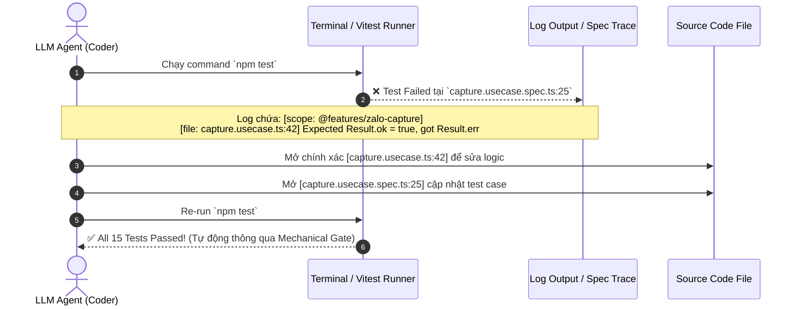

Dưới đây là **Preview Kiến trúc Setup cho Logging & Testing** của dự án `quick_zalo`, được thiết kế tối ưu hóa cho việc **AI Agent / LLM tự phát hiện, khoanh vùng và sửa bug nhanh nhất có thể**.

---

## 📂 1. Preview Cấu trúc Thư mục Setup (Folder Layout)

Các file quản lý Log và Test được sắp xếp theo đúng các Path Alias (`@domain`, `@infra`, `@features`...) đã khai báo tại [wxt.config.ts](file:///home/stveve/Documents/workspace/Sales/extension/quick_zalo/wxt.config.ts#L7-L14):

```
quick_zalo/
├── tests/                           # 🧪 Tầng 2 & 3: Integration & E2E Tests (Tập trung)
│   ├── browser/                     # Vitest Browser Mode (Test React UI, Chrome Storage, API)
│   │   ├── popup.browser.spec.tsx
│   │   └── storage.browser.spec.ts
│   ├── e2e/                         # Standalone Playwright Tests (Test Extension Unpacked thực tế)
│   │   └── extension-flow.e2e.spec.ts
│   └── setup.ts                     # Khởi tạo mock / môi trường test
│
├── src/                             # 🚀 Source code chính dự án
│   ├── domain/                      # Business Entities & Rules (Pure TypeScript)
│   │   └── zalo/
│   │       ├── zalo-message.vo.ts
│   │       └── zalo-message.vo.spec.ts  # ⚡ Tầng 1: Co-located Unit Test (Đi kèm mã nguồn)
│   │
│   ├── infra/                       # Infrastructure & Adapters
│   │   ├── logging/                 # 🪵 QUẢN LÝ LOG TẬP TRUNG (Single Source of Truth cho Logger)
│   │   │   ├── logger.ts            # Evlog / Custom Wrapper chính
│   │   │   ├── types.ts             # Schema AgenticLogEntry (trace_id, scope, decision_reason)
│   │   │   ├── formatters.ts        # Formatter tối ưu cho LLM đọc terminal
│   │   │   └── index.ts             # Export logger instance chuẩn hóa
│   │   ├── browser/                 # Chrome Storage & Messaging Adapters
│   │   └── messaging/
│   │
│   ├── features/                    # Feature Modules (Use-cases)
│   │   └── zalo-capture/
│   │       ├── capture.usecase.ts
│   │       └── capture.usecase.spec.ts  # ⚡ Co-located Unit Test cho use-case
│   │
│   ├── entrypoints/                 # Chrome Extension Entrypoints
│   │   ├── background.ts            # Service Worker (Log scope: '@entrypoints/background')
│   │   ├── content.ts               # Content Script (Log scope: '@entrypoints/content')
│   │   └── popup/                   # Popup Interface
│   │
│   └── shared/                      # Utility & Contracts dùng chung
│       └── kernel/
│           ├── result.ts            # Result<T, E> Pattern (Tránh nổ throw/catch ngầm)
│           └── result.spec.ts
│
├── vitest.config.ts                 # ⚙️ Cấu hình Vitest (Unit & Browser Mode)
├── playwright.config.ts             # ⚙️ Cấu hình Playwright E2E
└── package.json
```

---

## 🔍 2. Cơ chế giúp LLM "Nhận diện Điểm Bug trong 3 Giây"

Khi LLM đọc log hoặc chạy test, nó không phải đoán mò hay dùng `grep` khắp dự án nhờ 3 quy chuẩn sau:

### A. Định danh vị trí Bug qua Log Schema (`AgenticLogEntry`)
Mọi log phát ra trong bất kỳ file nào đều tuân theo chuẩn output:

```text
[14:20:05.123] [ERROR] [trace: tr_9a8f21] [scope: @features/zalo-capture] [file: capture.usecase.ts:42]
  Message: Failed to parse Zalo DOM message container
  Decision Reason: Selector '#zalo-chat-body' returned null (DOM structure changed)
  Payload: { attempts: 3, url: "https://chat.zalo.me" }
```

**Cách LLM đọc & khoanh vùng ngay lập tức**:
1. **File & Line Nổ Lỗi**: `src/features/zalo-capture/capture.usecase.ts` dòng **42**.
2. **Lý do logic (`decision_reason`)**: Selector `#zalo-chat-body` bị `null`.
3. **Trace luồng (`trace_id`)**: `tr_9a8f21` cho phép lọc toàn bộ diễu tiến log từ Content Script bắn sang Background trước khi nổ lỗi.

---

### B. Nguyên tắc Đặt Test: Co-located vs Centralized

1. **Co-located Tests (Đặt NGAY CẠNH file nguồn)**:
   - Áp dụng cho: Tầng 1 Unit Test (`*.spec.ts` nằm cùng thư mục với `*.ts`).
   - **Lợi ích LLM**: Khi LLM được giao sửa file `capture.usecase.ts`, nó tự động thấy file `capture.usecase.spec.ts` bên cạnh. LLM có thể đọc spec để hiểu Yêu cầu (Contract) và tự cập nhật test case đồng thời.

2. **Centralized Tests (`tests/` ở gốc dự án)**:
   - Áp dụng cho: Tầng 2 Browser Test và Tầng 3 E2E Test.
   - **Lợi ích LLM**: Tránh làm bẩn output build của WXT, giúp LLM phân biệt rõ test nào chạy nhanh (Unit), test nào cần môi trường Trình duyệt thực tế (Browser/E2E).

---

### C. Bắt lỗi minh bạch với `Result<T, E>` Pattern
Để LLM không bị dính bẫy "Silent Exception" (nuốt lỗi ngầm trong `try/catch`), mọi hàm xử lý logic đều trả về dạng Result:

```typescript
// Ví dụ khi Unit Test bắt lỗi
const result = await captureUseCase.execute(input);

// LLM Test Assertion cực kỳ rõ ràng:
expect(result.ok).toBe(true); 
// Nếu fail -> terminal in ra chính xác: result.error = { code: 'PARSE_FAILED', message: '...' }
```

---

## 🔄 3. Luồng LLM Debug & Tự Kiểm Chứng (Self-Debugging Loop)



---

## 🎯 Tóm tắt Vị trí Quản lý

| Thành phần | Vị trí Thư mục | Mục đích chính cho Debug LLM |
| :--- | :--- | :--- |
| **Logger Core & Types** | `src/infra/logging/` | Cung cấp `logger` instance duy nhất, định dạng log kèm `trace_id` & `scope` |
| **Unit Tests** | Co-located tại `src/**/*.spec.ts` | Test chạy ngay tức thì (<1s) cạnh mã nguồn |
| **Browser & E2E Tests** | `tests/browser/` & `tests/e2e/` | Test giao diện UI, Chrome Storage, và toàn bộ Extension trong Chrome thật |
| **Test Config** | `vitest.config.ts` & `playwright.config.ts` | Khai báo môi trường runner, V8 coverage |

