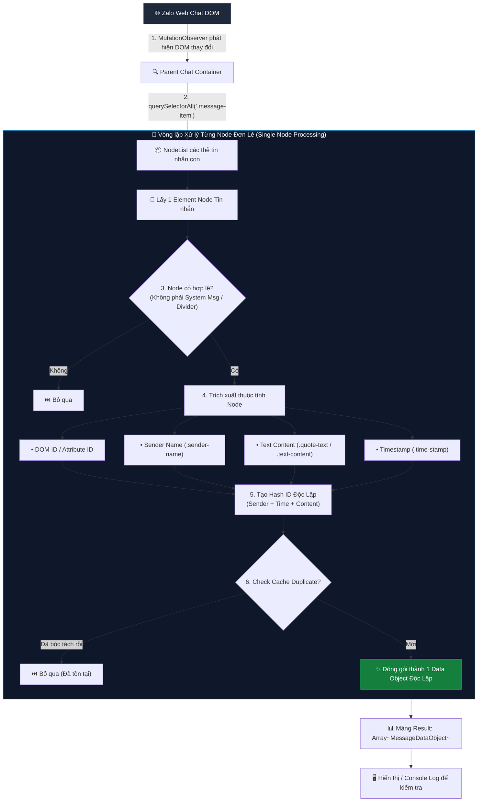
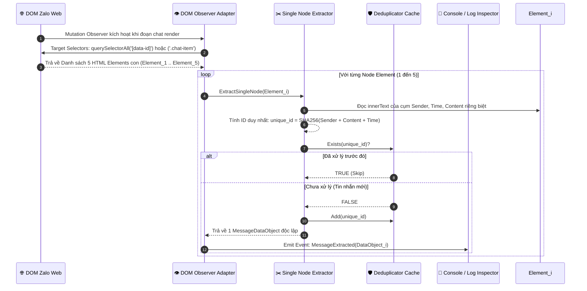
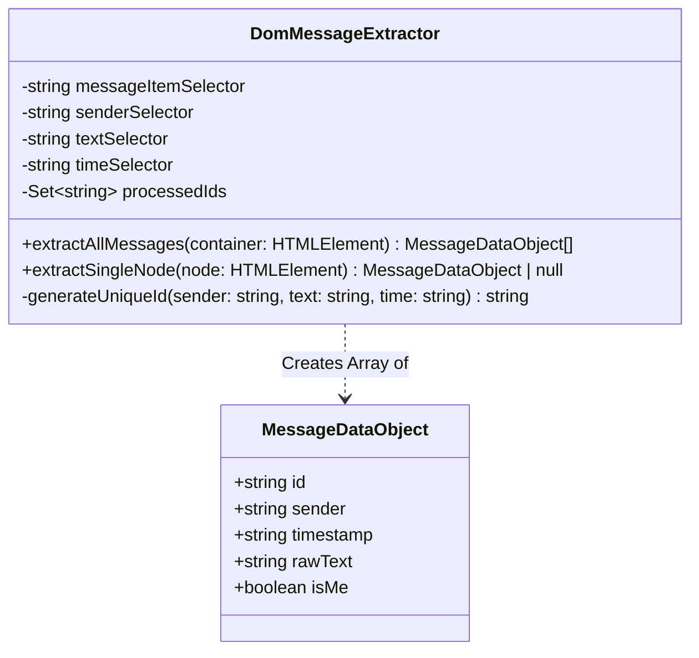

Cảm ơn bạn đã làm rõ mục tiêu thực tế! Vấn đề bạn nêu ra: **"Dữ liệu của nhiều tin nhắn trên trình duyệt bị gộp nén thành 1 Data Object duy nhất"** là một sự cố rất phổ biến khi cào dữ liệu DOM nếu chỉ truy vấn vào thẻ cha (Parent Container) thay vì phân tách thẻ con (Single Message Item Node).

Dưới đây là **Bản thiết kế & Phân tích Kiến trúc tập trung đúng vào Chức năng Bóc tách & Phân biệt Tin nhắn Độc lập**, được điều chỉnh tinh gọn, loại bỏ các tầng không cần thiết để giúp bạn dễ hiểu và triển khai ngay.

---

## 🔍 1. Phân Tích Nguyên Nhân Bị Gộp Nén Tin Nhắn & Giải Pháp

```
❌ NGUYÊN NHÂN BỊ GỘP NÉN (Gặp phải khi làm sai Selector):
Query Selector chọn vào Chat List Wrapper (Container Tổng)
└── <div> (Container cha)
    ├── <div>Tin nhắn 1: "Chào bạn"</div>    ┐
    ├── <div>Tin nhắn 2: "Giá 5 triệu"</div>  ├─► innerText() lấy toàn bộ -> 1 Object duy nhất ❌
    └── <div>Tin nhắn 3: "SĐT: 0912..."</div> ┘

--------------------------------------------------------------------------------

✅ GIẢI PHÁP TÁCH ĐỘC LẬP (Individual Node Extraction):
Query Selector chọn chính xác từng Message Bubble Element
└── <div> (Container cha)
    ├── <div class="msg-item"> -> Extractor -> Data Object #1 { id: "msg_1", text: "Chào bạn" }
    ├── <div class="msg-item"> -> Extractor -> Data Object #2 { id: "msg_2", text: "Giá 5 triệu" }
    └── <div class="msg-item"> -> Extractor -> Data Object #3 { id: "msg_3", text: "SĐT: 0912..." }
```

---

## 🏗️ 2. Biểu Đồ Kiến Trúc Luồng Bóc Tách Tách Biệt (Flowchart)

Sơ đồ mô tả luồng bóc tách từ cây DOM Zalo Web ra thành **Mảng các Data Object độc lập (`Array<MessageDataObject>`)**:



---

## ⏱️ 3. Biểu Đồ Luồng Tương Tác Kỹ Thuật (Sequence Diagram)

Mô tả chi tiết từng micro-step để tách biệt các tin nhắn hiển thị đồng thời trên màn hình:



---

## 🧩 4. Cấu Trúc Data Object Trả Về (Data Schema)

Để bạn dễ dàng kiểm tra xem module có đang hoạt động chuẩn và bóc tách từng tin nhắn hay không, mỗi tin nhắn bóc ra sẽ là **1 Object hoàn chỉnh độc lập**, không bị gộp chung:

### 📦 Mảng Kết Quả Đã Phân Tách (`MessageDataObject[]`):

```json
[
  {
    "id": "zalo_msg_9a8b1c_1722079000",
    "sender": "Nguyễn Văn A",
    "timestamp": "17:55 - 27/07/2026",
    "raw_text": "Dự án bên em đang sẵn phòng 5tr6 full đồ nha anh.",
    "is_me": false
  },
  {
    "id": "zalo_msg_3d4e5f_1722079015",
    "sender": "Bạn",
    "timestamp": "17:55 - 27/07/2026",
    "raw_text": "Cho mình xin địa chỉ cụ thể với?",
    "is_me": true
  },
  {
    "id": "zalo_msg_7g8h9i_1722079030",
    "sender": "Nguyễn Văn A",
    "timestamp": "17:56 - 27/07/2026",
    "raw_text": "Địa chỉ: Ngõ 139/8 Nguyễn Ngọc Vũ, Cầu Giấy ạ.",
    "is_me": false
  }
]
```

---

## 📐 5. Biểu Đồ Lớp Module Tinh Gọn (Class Diagram)

Cấu trúc code TypeScript nhỏ gọn, chỉ tập trung đúng 2 nhiệm vụ: **Tách Node** và **Trả về Object**:



---

## 🔑 6. 3 Kỹ Thuật Cốt Lõi Ngăn Chặn Bug "Gộp Tin Nhắn"

| STT | Kỹ thuật | Cách triển khai cụ thể | Công dụng |
| :--- | :--- | :--- | :--- |
| **1** | **Strict Item Selector** | Chọn thẻ con thấp nhất đại diện cho 1 bong bóng chat (vd: `.chat-item` hoặc `[data-id]`), **tuyệt đối không** dùng `.innerText` trên container cha `.chat-list-body`. | Tách biệt hoàn toàn Ranh giới (Boundary) giữa các tin nhắn. |
| **2** | **Child Query Scope** | Trong mỗi node tin nhắn, chỉ gọi `node.querySelector('.text-content')` chứ không gọi `document.querySelector()`. | Tránh việc lấy nhầm text của tin nhắn nằm kế bên. |
| **3** | **Unique Fingerprint (ID)** | Tạo ID = `Hash(Sender + Time + Content)`. Giữ 1 danh sách `Set<string>` lưu các ID đã bóc. | Giúp phân biệt chính xác 100% từng tin nhắn khác nhau và tránh bóc lặp tin nhắn cũ. |

---

## 📁 7. Preview Kiến Trúc Thư Mục Thực Tế (Layer Tree Folder Structure)

Dựa trên quy chuẩn **Clean Architecture + WXT Framework** của dự án `quick_zalo`, dưới đây là cây thư mục thực tế sẽ triển khai cho tính năng **Bóc tách & Deduplicate Tin nhắn Zalo Web**:

```txt
quick_zalo/
├── src/
│   ├── domain/                                 # 🧠 Pure Business Logic (0 Browser/WXT dependencies)
│   │   └── message-extraction/                 # Core domain bóc tách & dedup tin nhắn
│   │       ├── entities/
│   │       │   └── message-data-object.ts      # Entity / Value Object MessageDataObject
│   │       ├── services/
│   │       │   ├── deduplicator-cache.ts       # Hash SHA-256 / Cache fingerprint ngăn trùng tin nhắn
│   │       │   └── message-fingerprint.ts      # Hàm tạo Unique Fingerprint (Sender + Time + Content)
│   │       └── message-extraction.test.ts      # Co-located Vitest Unit Test cho Domain logic
│   │
│   ├── app/                                    # 🎯 Application Layer (Use Cases & Ports)
│   │   └── ports/
│   │       ├── message-extractor.port.ts       # Interface IMessageExtractor & IDomObserver
│   │       └── message-repository.port.ts      # Interface lưu trữ / forward tin nhắn
│   │
│   ├── infra/                                  # ⚙️ Infrastructure Adapters (DOM Parsing & Browser APIs)
│   │   └── extraction/
│   │       ├── dom-message-extractor.ts        # Implement IMessageExtractor (querySelectorAll & Child Scope Query)
│   │       ├── dom-observer-adapter.ts         # MutationObserver lắng nghe thẻ cha Zalo Chat Container
│   │       └── dom-message-extractor.test.ts   # Co-located Vitest test giả lập DOM (JSDOM / HappyDOM)
│   │
│   ├── shared/                                 # 🤝 Contracts, Types & Kernel Utilities
│   │   └── kernel/
│   │       └── result.ts                       # Standard Result<T, E> Pattern (Ok / Err)
│   │
│   ├── composition/                            # 🔌 Dependency Injection (DI) & Wiring
│   │   └── content-container.ts                # Khởi tạo & Inject DomExtractor + Deduplicator vào Content Script
│   │
│   └── entrypoints/                            # 🚀 WXT Extension Shell (0 business logic)
│       └── content/                            # Content Script chạy trực tiếp trên Zalo Web (chat.zalo.me)
│           ├── index.ts                        # Entrypoint bootstrap (gọi content-container.ts)
│           └── components/                     # Highlighting overlay UI trên DOM (nếu cần)
│
└── tests/                                      # 🧪 Centralized Integration & E2E Tests
    └── e2e/
        └── message-extraction.spec.ts          # Playwright E2E test trên môi trường Chrome Extension giả lập
```

### 🎯 Quy Tắc Ranh Giới Phụ Thuộc & Path Aliases (`@domain`, `@app`, `@infra`, `@shared`, `@composition`)

| Tầng Layer | Alias | Trách nhiệm chính & Ranh giới phụ thuộc (Dependency Boundaries) |
| :--- | :--- | :--- |
| **Domain Core** | `@domain/` | **Pure TypeScript Only.** Định nghĩa `MessageDataObject`, logic tạo Hash Fingerprint và Cache Deduplicator. **Cấm import** DOM, `browser`, WXT, React hay `@infra`. |
| **Application Ports** | `@app/` | Định nghĩa các Interface/Port (`IMessageExtractor`, `IDomObserver`). Đóng vai trò hợp đồng giữa Domain và Infrastructure. |
| **Infrastructure** | `@infra/` | Implement các Port từ `@app`. Thực thi querySelector trên `HTMLElement`, `MutationObserver` và trả về `Result<T, E>`. |
| **Shared Kernel** | `@shared/` | Chứa kiểu dữ liệu chung như `Result<T,E>`, `Evlog` logger schema, `Message` discriminated unions. |
| **Composition DI** | `@composition/` | Wiring container để khởi tạo và inject các adapter vào runtime script. |
| **WXT Entrypoints** | `@entrypoints/` | Shell giao tiếp với Chrome/WXT API (`defineContentScript`). Không trực tiếp chứa logic nghiệp vụ. |

---

### 🎯 Tóm lại quy trình Step-by-Step cho bạn triển khai:
1. **Lấy danh sách node con:** Dùng `querySelectorAll` để bắt mảng các Element đại diện cho 1 tin nhắn.
2. **Duyệt từng node:** Dùng vòng lặp `for...of` hoặc `Array.from().map()` để tách dữ liệu cho **duy nhất node đó**.
3. **Đóng gói Object:** Trả về đối tượng `MessageDataObject` đơn lẻ.
4. **Log/Push ra UI:** Đưa từng Object vào Mảng kết quả để bạn dễ quan sát và bắt lỗi lập tức.