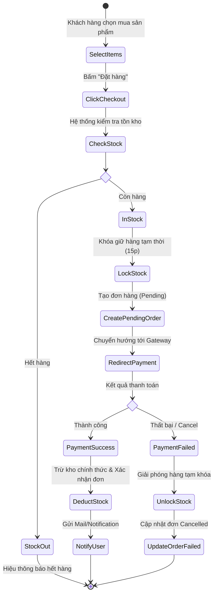
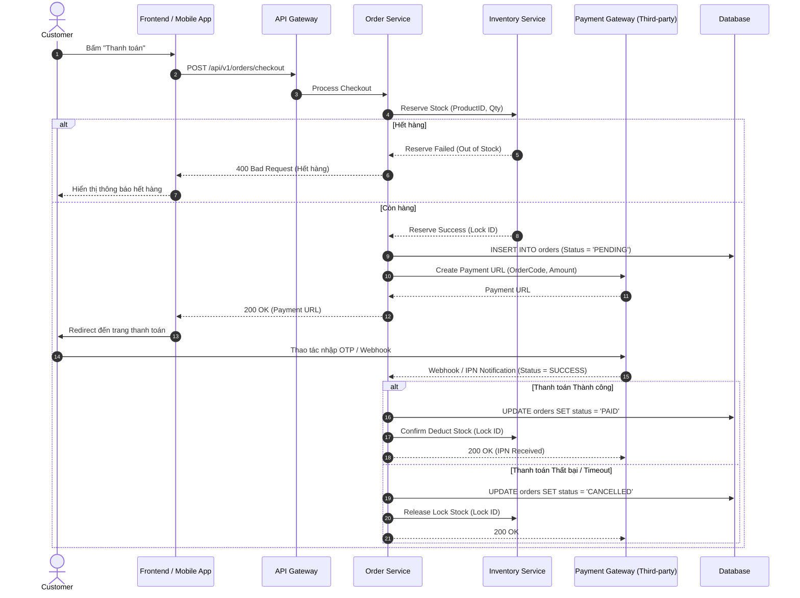
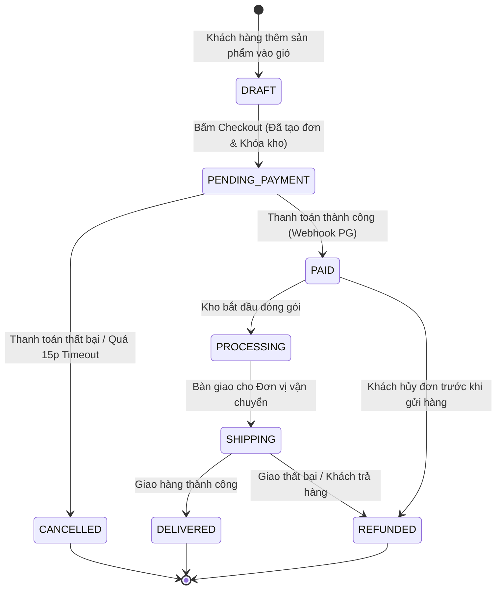

---

# 📚 PHẦN 1: BẢNG THUẬT NGỮ & KHÁI NIỆM CỐT LÕI (GLOSSARY)

| Thuật ngữ Tiếng Anh | Tiếng Việt | Định nghĩa ngắn gọn & Dễ hiểu |
| :--- | :--- | :--- |
| **SDLC** *(Software Development Life Cycle)* | Vòng đời Phát triển Phần mềm | Quy trình chuẩn hóa gồm các giai đoạn từ Lập kế hoạch $\rightarrow$ Phân tích $\rightarrow$ Thiết kế $\rightarrow$ Lập trình $\rightarrow$ Kiểm thử $\rightarrow$ Triển khai & Bảo trì. |
| **SA&D** *(System Analysis & Design)* | Phân tích & Thiết kế Hệ thống | Giai đoạn chuyển hóa nhu cầu nghiệp vụ thô (What) thành giải pháp kỹ thuật có cấu trúc (How) trước khi bắt tay vào viết code. |
| **BRD** *(Business Requirements Document)* | Tài liệu Yêu cầu Nghiệp vụ | Tài liệu mô tả góc nhìn của Business/Client: Mục tiêu kinh doanh, bài toán cần giải quyết, không chứa chi tiết kỹ thuật. |
| **SRS** *(Software Requirements Specification)* | Tài liệu Đặc tả Yêu cầu Phần mềm | Tài liệu kỹ thuật mô tả toàn bộ chức năng, giao diện, dữ liệu và các ràng buộc phi chức năng dành cho Dev & Tester. |
| **Use Case** | Trường hợp Sử dụng | Tập hợp các bước tương tác giữa Người dùng (Actor) và Hệ thống để hoàn thành một mục tiêu nghiệp vụ cụ thể. |
| **Functional Decomposition** | Phân rã Chức năng | Phương pháp chia nhỏ một hệ thống lớn/phức tạp thành các hệ thống con (Subsystem), mô-đun và chức năng nhỏ dễ quản lý. |
| **Activity Diagram** | Sơ đồ Hoạt động | Sơ đồ biểu diễn luồng công việc (Workflow), các nhánh rẽ điều kiện (Decision Points) và tính toán song song (Parallel execution). |
| **Sequence Diagram** | Sơ đồ Tuần tự | Sơ đồ mô tả chi tiết trật tự tương tác theo thời gian (Message Passing) giữa các thành phần/lớp (Client, Service, Database, Third-party). |
| **State Diagram** | Sơ đồ Trạng thái | Sơ đồ diễn tả các trạng thái (States) của một đối tượng dữ liệu trong suốt vòng đời và các sự kiện (Events) làm chuyển đổi trạng thái đó. |
| **Architecture Blueprint** | Bản vẽ Kiến trúc Hệ thống | Sơ đồ tổng thể mô tả cấu trúc các thành phần (Services, UI, DB, Cache, Broker), cách chúng giao tiếp và phân bổ hạ tầng. |
| **NFR** *(Non-Functional Requirements)* | Yêu cầu Phi Chức năng | Các chỉ tiêu chất lượng của hệ thống: Hiệu năng (Performance), Bảo mật (Security), Khả năng mở rộng (Scalability), Độ sẵn sàng (Availability). |
| **Edge Cases & Exceptions** | Ngoại lệ & Kịch bản Biên | Các tình huống bất thường, rủi ro phát sinh hoặc điều kiện ranh giới mà hệ thống phải có cơ chế fallback xử lý (vd: mất mạng, hết hàng đồng thời). |

---

# 🛣️ PHẦN 2: FRAMEWORK 5 BƯỚC PHÂN TÍCH & THIẾT KẾ (MACRO $\rightarrow$ MICRO)

```
[Bước 1: Scope & Overview]  -->  Context Diagram / Use Case Diagram / System Boundary
            │
            ▼
[Bước 2: Process & Detail Flow]  -->  Use Case Spec + Activity Diagram + Sequence Diagram
            │
            ▼
[Bước 3: State & Data Modeling]  -->  State Diagram / ERD / Data Dictionary
            │
            ▼
[Bước 4: Non-Functional & Edge Cases]  -->  NFR Metrics Matrix + Exception Handling Table
            │
            ▼
[Bước 5: Architecture Mapping]  -->  Component Diagram + Deployment Architecture
```

---

### 🔹 Bước 1: Scope & Overview (Xác định Ranh giới & Tổng quan)
- **Mục tiêu:** Định hình "Bức tranh tổng thể", biết rõ hệ thống làm gì, không làm gì (Out of Scope), ai là người dùng.
- **Cách thực hiện:**
  1. **System Boundary (Ranh giới Hệ thống):** Đặt ranh giới giữa phần mềm cần xây dựng với thế giới bên ngoài (User, Hệ thống bên thứ 3).
  2. **Actor Identification:** Xác định ai/cái gì tương tác với hệ thống (Human Actor như Customer, Admin; hoặc System Actor như Payment Gateway, SMS Service).
  3. **Functional Decomposition Diagram (FDD):** Phân rã chức năng từ cấp cao (Level 0) xuống Level 1, Level 2.
  4. **Use Case Diagram tổng quan:** Gom nhóm các Use Case theo module chức năng.
- **Sơ đồ sử dụng:** *Context Diagram, Functional Decomposition Diagram, Use Case Diagram.*

---

### 🔹 Bước 2: Process & Detail Flow (Chi tiết hóa Luồng Nghiệp vụ & Tương tác)
- **Mục tiêu:** Làm sáng tỏ cách thức vận hành bên trong của từng Use Case từ logic nghiệp vụ đến tương tác kỹ thuật.
- **Cách thực hiện:**
  1. **Use Case Specification:** Viết mô tả chuẩn cho từng Use Case (Brief description, Pre-conditions, Post-conditions, Main Flow, Alternative Flow).
  2. **Activity Diagram (Luồng nghiệp vụ):** Vẽ sơ đồ thể hiện luồng thao tác của người dùng và các quyết định rẽ nhánh ($If/Else$) của hệ thống.
  3. **Sequence Diagram (Luồng tương tác kỹ thuật):** Chuyển Activity Diagram thành Sequence Diagram. Thể hiện rõ giao tiếp giữa các layer: `UI/Client` $\rightarrow$ `API Gateway` $\rightarrow$ `Backend Service` $\rightarrow$ `Database` / `External API`.
- **Sơ đồ sử dụng:** *Activity Diagram (Nghiệp vụ), Sequence Diagram (Kỹ thuật).*

---

### 🔹 Bước 3: State & Data Modeling (Mô hình hóa Dữ liệu & Vòng đời Trạng thái)
- **Mục tiêu:** Đảm bảo tính toàn vẹn dữ liệu (Data Integrity) và nhất quán trạng thái đối với các đối tượng có quy trình xử lý phức tạp.
- **Cách thực hiện:**
  1. **State Machine / State Diagram:** Liệt kê tất cả các trạng thái hợp lệ ($Draft, Pending, Paid, Shipped, Cancelled...$) của Entity chính. Xác định các điều kiện (Guards) và hành động (Actions) kích hoạt sự chuyển đổi trạng thái (Transition).
  2. **Conceptual & Logical Data Model:** Thiết kế Sơ đồ Quan hệ Dữ liệu (ERD) và Từ điển Dữ liệu (Data Dictionary).
- **Sơ đồ sử dụng:** *State Diagram (Statechart), ERD (Entity Relationship Diagram).*

---

### 🔹 Bước 4: Non-Functional & Edge Cases (Chủ động Nhận diện Ngoại lệ & NFR)
- **Mục tiêu:** Xây dựng hệ thống bền bỉ (Resilient), sẵn sàng cho môi trường Production thực tế.
- **Cách thực hiện:**
  1. **Edge Cases Identification:** 
     - *Validation Error:* Dữ liệu đầu vào sai định dạng/thiếu.
     - *System Timeout:* Third-party API không phản hồi trong $X$ giây.
     - *Concurrency / Data Race:* 2 người dùng cùng bấm đặt chiếc vé cuối cùng tại cùng 1 millisecond.
     - *Network Interruption:* Đang thanh toán thì rớt mạng.
  2. **NFR Definition:** Quy định rõ các thông số kỹ thuật (Latency $< 200ms$, Throughput $1000 TPS$, Availability $99.99\%$, Security OWASP Top 10).
- **Sơ đồ / Bảng:** *Exception Handling Matrix, NFR Checklist.*

---

### 🔹 Bước 5: Architecture Mapping (Định hình Kiến trúc Bàn giao Dev)
- **Mục tiêu:** Chuyển giao bức tranh thiết kế hoàn chỉnh sang mô hình triển khai kỹ thuật cho đội ngũ Software Engineer & DevOps.
- **Cách thực hiện:**
  1. Gom nhóm các logic liên quan thành các Component/Service độc lập.
  2. Thể hiện luồng giao tiếp synchronous (REST/gRPC) hoặc asynchronous (RabbitMQ/Kafka).
  3. Mapping các thành phần vào hạ tầng triển khai (Cloud/On-Premise, Container/Kubernetes).
- **Sơ đồ sử dụng:** *Component Diagram, Deployment Diagram, High-Level Architecture (HLA).*

---

# 🛒 PHẦN 3: VÍ DỤ MINH HỌA THỰC TẾ (END-TO-END CASE STUDY)

**Bài toán:** "Luồng Đặt hàng & Thanh toán e-Commerce" *(E-Commerce Checkout & Payment Flow)*.

---

### 1. Scope & Use Case (Bước 1)
- **Actor:** Khách hàng (Customer), Hệ thống Thanh toán (Payment Gateway - VNPay/Stripe), Hệ thống Kho (Inventory Service).
- **Use Case chính:** `UC01 - Checkout & Pay Order`

---

### 2. Activity Diagram - Luồng Nghiệp vụ (Bước 2)



---

### 3. Sequence Diagram - Luồng Kỹ thuật Chi tiết (Bước 2)



---

### 4. State Diagram - Vòng đời Trạng thái Đơn hàng (Bước 3)



---

### 5. Xử lý Ngoại lệ & Điều kiện Biên (Bước 4)

| Mã Ngoại lệ | Ngữ cảnh / Kịch bản (Edge Case) | Cơ chế Xử lý (Handling Mechanism) |
| :--- | :--- | :--- |
| **EX-01: Race Condition** | $N$ người dùng cùng bấm mua $1$ món hàng cuối cùng tại cùng $1$ thời điểm. | Sử dụng **Distributed Lock (Redis Redlock)** hoặc **Optimistic Locking** ở DB level khi Reserve Stock. |
| **EX-02: Payment Timeout** | Khách chuyển tiền thành công ở ngân hàng nhưng Webhook từ Payment Gateway bị nghẽn mạng không đến được Order Service. | Xây dựng cơ chế **Reconciliation Cronjob (Đối soát chủ động)**: Định kỳ $5$ phút query API của Payment Gateway để cập nhật trạng thái đơn treo. |
| **EX-03: Double Payment** | Người dùng cố tình spam bấm nút "Thanh toán" 2 lần liên tiếp. | Áp dụng **Idempotency Key** tại API Gateway/Order Service. Chỉ xử lý $1$ request duy nhất với idempotency key đó trong $30$ giây. |

---

# 📋 PHẦN 4: TIÊU CHÍ ĐÁNH GIÁ & CHECKLIST CHẤT LƯỢNG TÀI LIỆU (DEFINITION OF DONE)

Một bộ tài liệu SA&D đạt chuẩn **"Đủ - Đúng - Sạch - Dễ hiểu"** cần vượt qua Checklist sau:

### 1. Tính Đầy đủ (Completeness)
- [ ] 100% Business Requirements từ BRD được map tương ứng vào các Use Cases / Functional Specs.
- [ ] Mọi Use Case đều có đủ luồng chính (Main Flow), luồng phụ (Alternative Flow) và luồng lỗi (Exception Flow).
- [ ] Mọi đối tượng chính đều có State Diagram và Data Dictionary đi kèm.

### 2. Tính Chính xác & Nhất quán (Consistency & Accuracy)
- [ ] Tên gọi Actor, Entity, State, API Endpoint thống nhất từ đầu đến cuối tài liệu (không dùng lúc gọi `Customer`, lúc gọi `User`).
- [ ] Trạng thái trong State Diagram khớp 100% với giá trị Enum lưu dưới Database và logic xử lý trong Sequence Diagram.
- [ ] Không có "đường cụt" (Dead-end) trên Activity Diagram hay State Diagram.

### 3. Sẵn sàng cho Development & Testing (Dev/Tester Readability)
- [ ] **Dành cho Dev:** Sequence Diagram chỉ rõ Input/Output Data, HTTP Method, API Endpoint, Error Code.
- [ ] **Dành cho Tester:** Đủ thông tin Pre-condition, Test Data, Expected Result cho mọi Edge Case để viết Test Cases.
- [ ] NFR được lượng hóa bằng con số cụ thể (ví dụ: `Response time < 500ms at 99th percentile`), không ghi chung chung như "hệ thống phải chạy nhanh".

---

# 🛠️ PHẦN 5: LỘ TRÌNH HỌC TẬP & CÔNG CỤ (TOOLS & METHODOLOGY)

### 1. Bộ Công cụ Chuyên nghiệp (Recommended Toolstack)

- **Diagramming as Code (Ưu tiên số 1):** 
  - **PlantUML / Mermaid.js:** Vẽ sơ đồ bằng code markdown. Dễ lưu trữ vào Git, dễ review diff khi refactor và quản lý phiên bản (Version Control).
- **GUI Visual Diagramming:**
  - **Draw.io (diagrams.net):** Đơn giản, miễn phí, mạnh mẽ, phù hợp vẽ architecture & process flow.
  - **Miro / Lucidchart:** Tuyệt vời cho làm việc nhóm (Collaboration), Workshop Brainstorming, Event Storming.
  - **Enterprise Architect (EA) / Visual Paradigm:** Dùng cho các hệ thống cực lớn cấp tập đoàn (Enterprise-grade UML modeling).

---

### 2. Lộ trình Nâng cao Kỹ năng SA&D (Career Roadmap)

```
[Giai đoạn 1: Foundations]
 └── Nắm vững UML 2.5 standard (Activity, Sequence, State, Class, Component Diagram).
 └── Học cách viết Use Case Specification chuẩn IEEE.

[Giai đoạn 2: Data & Systems Thinking]
 └── Học Data Modeling (Relational Normalization 3NF & NoSQL Document Modeling).
 └── Hiểu về RESTful API Design, Event-Driven Architecture, Message Queues.

[Giai đoạn 3: Domain & Advanced Architecture]
 └── Tìm hiểu Domain-Driven Design (DDD): Bounded Context, Strategic Design, Event Storming.
 └── Rèn luyện tư duy NFR: Scalability, Availability, Security, High Concurrency.
```

---

### 💡 Lời khuyên Thực tế từ kinh nghiệm 15+ năm:

1. **"Code-first is a trap, Design-first is investment":** Đừng vội viết code khi vẽ sơ đồ luồng còn mờ nhạt. 1 giờ thiết kế sai trên giấy chỉ tốn 10 phút sửa, nhưng 1 kiến trúc sai khi đã code tốn hàng tuần refactor.
2. **Luôn bắt đầu từ "User Value" trước khi sang "Technical Detail":** Vẽ Activity Diagram cho Business hiểu trước, sau đó mới chi tiết hóa thành Sequence Diagram cho Dev.
3. **Coi Edge Cases là "First-Class Citizen":** 80% thời gian sự cố Production đến từ những kịch bản ngoại lệ mà SA/BA bỏ qua lúc phân tích. Hãy chủ động đặt câu hỏi *"Nếu hệ thống sập ở bước này thì sao?"* (What-if Analysis) cho mọi bước trong Sequence Diagram.