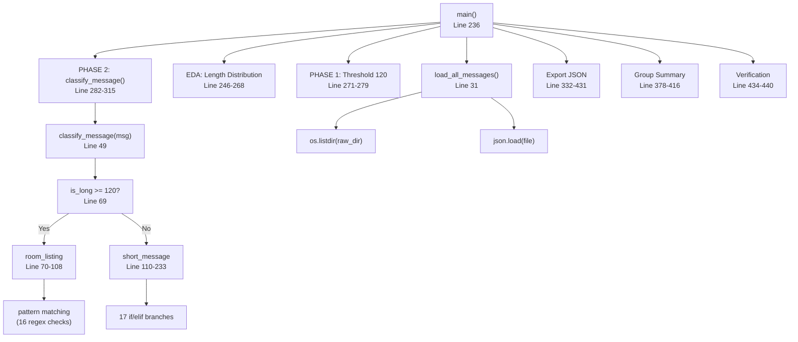
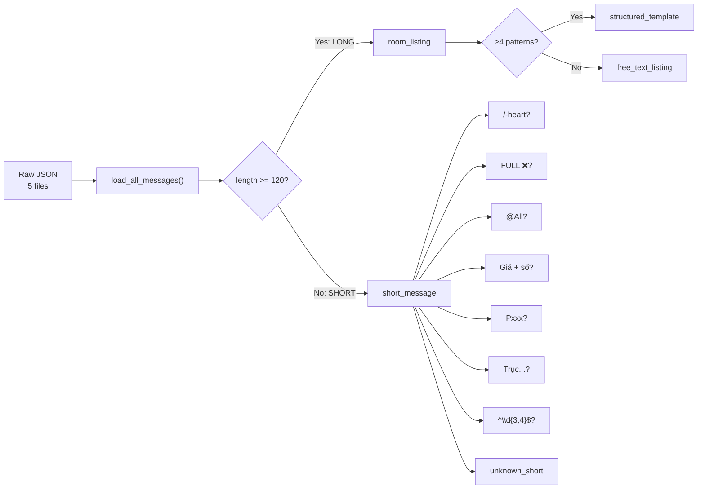

# Scope Document — Hệ Thống Phân Loại Tin Nhắn Zalo

**Date**: 2026-07-29
**Status**: Initial
**Language**: Tiếng Việt

---

## §1: Problem Summary

Hệ thống phân loại tin nhắn Zalo hiện tại được triển khai dưới dạng **monolithic script** (`classify_messages.py`, 449 dòng) với toàn bộ logic nghiệp vụ — từ loading dữ liệu, phân loại, thống kê đến xuất báo cáo — nằm trong **một file duy nhất**. Điều này dẫn đến hàng loạt vấn đề về maintainability, testability, và khả năng mở rộng.

**Vấn đề cốt lõi**: Không có sự phân tách rõ ràng giữa các tầng (data loading, classification business logic, reporting, export), khiến hệ thống khó bảo trì, khó kiểm thử, và dễ phát sinh lỗi khi mở rộng.

---

## §2: Entry Point

| Thông tin | Giá trị |
|---|---|
| **File chính** | `/home/stveve/Documents/workspace/Sales/extension/quick_zalo/Docs/Data/code_python/classify_messages.py` |
| **Loại** | Python script (monolithic) |
| **Dòng code** | 449 lines |

---

## §3: Scope Definition

### 3.1 Problem Area

1. **Architecture**: Monolithic pattern — toàn bộ code trong 1 file, 0 module hóa
2. **Classification Logic**: Dùng threshold cứng (120 chars) + rule-based pattern matching
3. **Testing**: 0% unit test coverage
4. **Data Pipeline**: Load → Classify → Export lẫn lộn, không tách biệt
5. **Error Handling**: Không có xử lý exception (bare `open()`, không try-catch)
6. **Config**: Hard-coded paths, threshold, patterns
7. **Classification Granularity**: 16 categories chỉ đáp ứng được ~97.7% messages, còn 2.3% unknown_short

### 3.2 Boundary

**In Scope**:
- File `classify_messages.py` (449 dòng)
- 5 JSON files trong `Docs/Data/Raw/` (3 groups: 95_home, TNR, sky_groub)
- Output files trong `Docs/Data/result/`
- Classification business logic & pattern definitions
- Data flow từ raw JSON → classification → export

**Out of Scope**:
- Zalo Extension frontend/backend code
- Các module khác của quick_zalo project

---

## §4: Impact Analysis

### 4.1 Direct Impact

| Thành phần | Mô tả ảnh hưởng |
|---|---|
| **classify_messages.py** (toàn bộ) | Không test được từng module riêng lẻ; một bug nhỏ có thể crash toàn bộ pipeline |
| **Classification logic** (dòng 49-233) | Không thể unit-test riêng; phụ thuộc vào threshold cứng 120; pattern matching dùng raw regex |
| **Data loading** (dòng 31-47) | Không có validation, không xử lý malformed JSON, không retry |
| **Export module** (dòng 333-431) | 5 file output được sinh ra cùng lúc, không có validation output schema |
| **Report generation** | Báo cáo markdown phải maintain riêng, không đồng bộ với script |

### 4.2 Indirect Impact

| Thành phần | Mô tả ảnh hưởng |
|---|---|
| **Future ML integration** | Nếu cần thêm ML-based classification, kiến trúc hiện tại không cho phép plug-in |
| **Multi-source support** | Thêm nguồn dữ liệu mới đòi hỏi sửa script gốc |
| **Custom reporting** | Người dùng muốn tùy chỉnh báo cáo phải đọc và sửa script |
| **Scaling** | Xử lý 10k+ messages sẽ rất chậm do không có batch processing hay streaming |
| **Collaboration** | Nhiều người cùng phát triển dễ conflict do code trong 1 file |

---

## §5: Call Chain (Hiện Trạng)



### Classification Flow Detail



---

## §6: Data Flow

### 6.1 Input

```
Raw/
├── 95_home/zalo-messages-....json          [504 messages, group 95 Home]
├── TNR/zalo-messages-...-214807.json       [577 messages]
├── TNR/zalo-messages-...-220148.json       [635 messages]  --> Tổng TNR: 1,212
└── sky_groub/
    ├── zalo-messages-...-213709.json       [894 messages]
    └── zalo-messages-...-214101.json       [557 messages]  --> Tổng Sky: 1,451
```

Mỗi message có cấu trúc:
```json
{
  "id": "message-frame_XXX",
  "data_raw": "nội dung tin nhắn text..."
}
```

### 6.2 Output

| File | Nội dung |
|---|---|
| `classification_summary.json` | Summary categories + patterns + stats |
| `classification_all_messages.json` | Toàn bộ messages đã phân loại (≈2.3MB) |
| `classification_by_group.json` | Phân loại theo group chat |
| `length_distribution.json` | Phân bố độ dài |
| `bao-cao-phan-loai-chi-tiet.md` | Báo cáo markdown chi tiết |

### 6.3 Dependencies

- Python 3.8+ (stdlib only: `json`, `os`, `re`, `collections`)
- **Không có** requirements.txt, virtual environment, hay dependency management

---

## §7: Affected Components

### 7.1 Files

```
📄 classify_messages.py (449 lines) — TOÀN BỘ HỆ THỐNG
📁 Raw/ (5 JSON files) — Data source
📁 result/ (4 JSON + 1 MD) — Output
```

### 7.2 Functions/APIs

| Function | Lines | Responsibility | Vấn đề |
|---|---|---|---|
| `main()` | 236-449 | Orchestration + EDA + Export | Quá tải: 213 dòng cho 3+ responsibilities |
| `load_all_messages()` | 31-47 | Load data | Không validation, không error handling |
| `classify_message()` | 49-233 | Core business logic | 184 dòng, 17 if/elif branches, threshold cứng |
| (inline) EDA | 246-268 | Length distribution | Trộn lẫn với orchestration |
| (inline) Export | 332-431 | 5 file outputs | Trộn lẫn, không separation |

---

## §8: Root Cause Analysis

### 8.1 Root Cause #1: Monolithic Architecture

<evidence>
  <file>classify_messages.py</file>
  <finding>Tất cả code (data loading, classification, EDA, export, reporting) nằm trong 1 file duy nhất — không có module hóa, không có separation of concerns.</finding>
  <impact>Không thể test riêng từng component; một bug nhỏ ảnh hưởng toàn bộ pipeline; khó mở rộng thêm classification rules.</impact>
</evidence>

### 8.2 Root Cause #2: Hard-coded Threshold & Patterns

<evidence>
  <file>classify_messages.py</file>
  <line>28</line>
  <finding>LONG_THRESHOLD = 120 là constant cứng. Các pattern templates (dòng 74-103) là regex cứng trong code. Không có config file hay parameter injection.</finding>
  <impact>Muốn thay đổi threshold hay thêm pattern phải sửa code gốc; không thể A/B test thresholds.</impact>
</evidence>

### 8.3 Root Cause #3: 0% Test Coverage

<evidence>
  <file>classify_messages.py</file>
  <finding>Không có test file nào (*.test.py), không có test cho classify_message() — hàm quan trọng nhất.</finding>
  <impact>Mọi thay đổi classification logic đều tiềm ẩn rủi ro regression; không thể verify pattern matching accuracy.</impact>
</evidence>

### 8.4 Root Cause #4: No Separation of Concerns

<evidence>
  <file>classify_messages.py</file>
  <finding>Hàm main() (dòng 236-449) làm tất cả: EDA, classification, export, group analysis. class_count logic nằm lẫn trong main().</finding>
  <impact>Khó đọc, khó debug, khó maintain — 213 dòng cho ít nhất 4 responsibilities.</impact>
</evidence>

### 8.5 Root Cause #5: Fragile Classification Logic

<evidence>
  <file>classify_messages.py</file>
  <line>49-233</line>
  <finding>164 dòng với 17 if/elif branches, pattern matching dựa trên regex heuristic thuần túy. Không có scoring, không có confidence weighting, không có fallback strategy thông minh.</finding>
  <impact>2.3% unknown_short (72 messages) không được phân loại; free_text_listing chỉ dựa trên đếm pattern ≥4.</impact>
</evidence>

### 8.6 Root Cause #6: No Error Handling

<evidence>
  <file>classify_messages.py</file>
  <line>42-45</line>
  <finding>Mở và đọc JSON không có try-catch, không kiểm tra cấu trúc dữ liệu (missing 'messages' key, malformed JSON).</finding>
  <impact>Script crash ngay nếu có file hỏng; không retry, không graceful degradation.</impact>
</evidence>

---

## §9: Classification Weaknesses Analysis

### 9.1 Threshold 120 Characters

| Issue | Detail |
|---|---|
| **False Negatives** | Tin nhắn thông tin phòng ngắn (<120 chars) bị xếp nhầm vào short_message. Ví dụ: các tin "Mã: A1180..." ngắn (dòng 637-647 trong báo cáo, 195 chars — đúng là room listing nhưng pattern_count <4 → free_text) |
| **False Positives** | Tin nhắn dài không phải room info nhưng ≥120 chars vẫn vào room_listing |
| **Arbitrary threshold** | 120 chars là heuristic; không có data-driven basis |

### 9.2 Pattern Matching

| Issue | Detail |
|---|---|
| **Biased toward TNR template** | 16 patterns phần lớn được xây dựng từ TNR template (Mã, Địa chỉ, Giá, Nội thất, Dịch vụ, Lưu ý...) |
| **95 Home & Sky groups** | Có cấu trúc khác (/-rose, 🌹%, Hxxx), vẫn detect được nhưng nhiều tin rơi vào free_text |
| **Duplicate messages** | Phát hiện message trùng lặp (ví dụ ID 1785152835937 == 1784980148511) nhưng script không xử lý |
| **No NLP/semantic** | 100% rule-based, không có khả năng hiểu ngữ nghĩa |

### 9.3 Category Hierarchy

Hiện tại chỉ có 2 cấp: `category/sub_category`. Thiếu taxonomy structure:
- Không có grouping logic (ví dụ: tất cả "room_info" types gom lại)
- `unknown_short` = catch-all cho mọi thứ không match, mất thông tin
- Không có multi-label (một tin có thể vừa là room info vừa là price follow-up)

---

## §10: Confidence Assessment

| Hạng mục | Confidence | Lý do |
|---|---|---|
| Phân tích monolithic | 95% | Rõ ràng từ cấu trúc file |
| Root causes | 90% | Có evidence cụ thể tại từng dòng |
| Classification weaknesses | 85% | Dựa trên phân tích pattern và data mẫu |
| Data statistics | 100% | Đã chạy thống kê trên toàn bộ dataset |
| **Overall** | **90%** | — |

---

## §11: Derived Requirements (from analysis)

### Functional Requirements

1. **FR-1**: Tách data loading thành module riêng (hỗ trợ multiple formats)
2. **FR-2**: Tách classification engine thành module pluggable (rule-based + future ML)
3. **FR-3**: Tách reporting/export thành module riêng (hỗ trợ multiple output formats)
4. **FR-4**: Thêm config layer (threshold, patterns, paths) — YAML/JSON config
5. **FR-5**: Thêm error handling & validation pipeline

### Non-Functional Requirements

6. **NFR-1**: 100% unit test coverage cho classification logic
7. **NFR-2**: Mỗi module < 150 LOC
8. **NFR-3**: Single Responsibility Principle — mỗi class/hàm một nhiệm vụ
9. **NFR-4**: Easy to extend — thêm pattern mới không cần sửa core logic

---

## §12: Open Questions

1. Có cần support streaming/large dataset (100k+ messages)?
2. Có cần tích hợp ML (ví dụ: fine-tune PhoBERT cho classification)?
3. Threshold 120 có nên được thay bằng dynamic threshold (dựa trên data distribution)?
4. Có cần deduplication messages giữa các groups?
5. Output format: có cần thêm CSV, Excel support?
6. Có cần REST API wrapper cho classification service?
7. File free_text_listing (32 tin) có cần được review thủ công để tạo patterns mới?

---

## §13: Next Actions

1. ✅ **HIỆN TẠI**: Scope document hoàn thành — context ready
2. ⏳ Thiết kế kiến trúc mới (Clean Architecture / Modular Monolith)
3. ⏳ Refactor code thành modules
4. ⏳ Thêm unit tests (pytest)
5. ⏳ Thêm config management
6. ⏳ Thêm error handling
7. ⏳ Thêm logging

---

**Document Status**: Context Complete — No Code Changes Made

*Generated by context-before-fix skill analysis*
