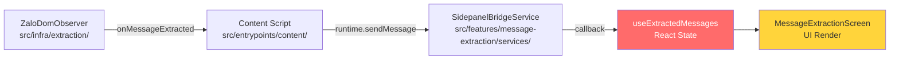
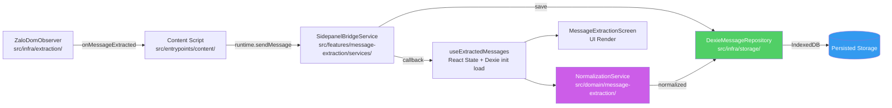

# Scope Document — Module Chuẩn Hóa Dữ Liệu & Lưu Trữ IndexedDB + Dexie.js

**Date**: 2026-07-28
**Status**: Initial
**Feature**: `data-normalization-storage`

---

## §1: Problem Summary

Hiện tại, toàn bộ tin nhắn Zalo Web sau khi trích xuất bởi `ZaloDomObserver` chỉ được lưu trong **In-Memory React State** (qua hook `useExtractedMessages`) tại Sidepanel UI. Dữ liệu **không được persist** — khi đóng Sidepanel, refresh tab, hoặc restart Extension, toàn bộ dữ liệu đã trích xuất bị mất. Thêm vào đó:

- Chưa có cơ chế chuẩn hóa dữ liệu (normalization) từ `rawText` (dạng text thô DOM) sang cấu trúc dữ liệu có tổ chức.
- Không có tầng lưu trữ bền vững cho extracted messages.
- Deduplication hiện tại (`MessageDeduplicator`) hoạt động in-memory với capacity 2000 items, mất khi reset.
- Xuất dữ liệu chỉ qua manual JSON download — không có cơ chế truy vấn lại.

**Mục tiêu**: Xây dựng module chuẩn hóa dữ liệu (`data normalization layer`) kết hợp với tầng lưu trữ IndexedDB qua Dexie.js, cho phép persist extracted messages, truy vấn hiệu quả, và chuẩn hóa dữ liệu đầu vào.

---

## §2: Entry Point

### Phân tích Entry Point

| Type | Component | Vai trò |
|------|-----------|---------|
| **Data Source** | `ZaloDomObserver` (`src/infra/extraction/zalo-dom-observer.ts`) | Sinh dữ liệu `ZaloMessage` từ DOM realtime |
| **Transport** | `content/index.ts` → `browser.runtime.sendMessage` | Gửi message qua Runtime Bus |
| **Consumer** | `SidepanelBridgeService` → `useExtractedMessages` | Nhận và lưu trong React State |
| **Domain Entity** | `ZaloMessage` (`src/domain/message-extraction/entities/zalo-message.entity.ts`) | Entity cốt lõi cần persist |

### Entry Flow Diagram

```txt
ZaloDomObserver (content script)
  → onMessageExtracted / onMessagesBatchExtracted
  → browser.runtime.sendMessage({ type: 'event', name: 'zalo.message.extracted', payload: ZaloMessage })
  → SidepanelBridgeService.subscribeExtractedMessages (sidepanel UI)
  → useExtractedMessages (React State — IN MEMORY, KHÔNG PERSIST)
```

---

## §3: Scope Definition

### 3.1 Problem Area

- **Area A — Storage Layer (`src/infra/storage/`)**: Chưa tồn tại. Cần tạo mới module lưu trữ IndexedDB + Dexie.js.
- **Area B — Domain Data Model (`src/domain/message-extraction/`)**: Entity `ZaloMessage` hiện tại chỉ gồm raw text. Cần mở rộng cho normalized data.
- **Area C — Application Ports (`src/app/ports/`)**: Chỉ có `IKeyValueStore` cho chrome.storage. Cần port mới cho message repository.
- **Area D — Normalization Pipeline**: Chưa có business logic để normalization raw text → structured data.
- **Area E — Composition & Wiring (`src/composition/`)**: Cần inject storage adapter mới vào các composition root.

### 3.2 Boundary

**IN SCOPE:**
1. Xây dựng `src/infra/storage/` module mới với Dexie.js cho IndexedDB operations.
2. Định nghĩa port `IMessageRepository` trong `src/app/ports/` cho CRUD messages.
3. Implement adapter `DexieMessageRepository` trong `src/infra/storage/`.
4. Xây dựng domain normalization service trong `src/domain/message-extraction/` (hoặc sub-module).
5. Viết co-located unit tests cho storage adapter & normalization service.
6. Update `src/composition/` để wire storage adapter vào feature layer.
7. Cập nhật `useExtractedMessages` hook để load persisted data từ IndexedDB.
8. Update `SidepanelBridgeService` để lưu messages vào storage.

**OUT OF SCOPE (Phase sau):**
- Sync dữ liệu qua cloud / Chrome Storage sync.
- Real-time collaboration.
- Phân trang hay virtual scrolling cho danh sách messages.
- Export tính năng mới (hiện tại chỉ JSON download, giữ nguyên).

---

## §4: Impact Analysis

### 4.1 Direct Impact

| Component | File | Tác động |
|-----------|------|----------|
| `useExtractedMessages` | `src/features/message-extraction/hooks/useExtractedMessages.ts:53-121` | Cần thay đổi logic để load từ IndexedDB + persist khi nhận message mới |
| `SidepanelBridgeService` | `src/features/message-extraction/services/sidepanel-bridge.service.ts` | Cần lưu messages vào storage thay vì chỉ forward |
| `ZaloMessage` entity | `src/domain/message-extraction/entities/zalo-message.entity.ts:12-19` | Có thể cần mở rộng thêm field cho normalized data |
| `composition/content-container.ts` | `src/composition/content-container.ts:1-10` | Thêm DI cho storage adapter |
| `composition/sidepanel-container.ts` | `src/composition/sidepanel-container.ts` | Thêm DI cho storage adapter |
| `indexeddb-adapter.ts` (logging) | `src/infra/logging/indexeddb-adapter.ts:1-214` | Pattern tham khảo (cần thay thế bằng Dexie.js) |

### 4.2 Indirect Impact

| Component | File | Tác động |
|-----------|------|----------|
| `MessageDeduplicator` | `src/domain/message-extraction/services/deduplicator.service.ts:5-49` | Có thể cần persist state hoặc thay bằng Dedexie-based dedup |
| `MessageExtractionScreen` | `src/features/message-extraction/MessageExtractionScreen.tsx:9-97` | UI có thể cần loading state khi load từ IndexedDB |
| `config-service.adapter.ts` | `src/infra/config/config-service.adapter.ts:12-121` | Có thể cần config cho storage capacity |
| `AppConfig` domain | `src/domain/config/config.entity.ts` | Thêm field cho storage config nếu cần |
| `package.json` | `package.json:18-34` | Thêm dependency `dexie` |
| Background entrypoint | `src/entrypoints/background/index.ts:4-53` | Có thể cần listen messages từ content để persist |
| Content entrypoint | `src/entrypoints/content/index.ts:49-144` | Có thể cần persist tại content script thay vì gửi sang background |
| `HomeDashboard.tsx` | `src/ui/components/shell/HomeDashboard.tsx` | Hiển thị số lượng messages đã lưu |

### 4.3 Data Flow bị Ảnh Hưởng

**Current Flow (all in-memory):**
```txt
Content Script (ZaloDomObserver)
  → Runtime Message (zalo.message.extracted)
  → Sidepanel UI (useExtractedMessages React State - IN MEMORY)
  → Mất khi close sidepanel
```

**Target Flow (persisted):**
```txt
Content Script (ZaloDomObserver)
  → Runtime Message (zalo.message.extracted)
  → Background / Sidepanel
  → DexieMessageRepository.save(message)
  → IndexedDB (persisted)
  → useExtractedMessages loads from IndexedDB on mount
  → NormalizationService.normalize(rawText) → Structured Data
  → Stored + cached in React state + IndexedDB
```

### 4.4 API Contracts Cần Định Nghĩa Mới

<!-- To be created in @app/ports/ -->
```typescript
// MessageRepository Port
interface IMessageRepository {
  save(message: NormalizedMessage): Promise<Result<NormalizedMessage, StorageError>>;
  saveBatch(messages: NormalizedMessage[]): Promise<Result<number, StorageError>>;
  findByConversation(name: string): Promise<Result<NormalizedMessage[], StorageError>>;
  findAll(options?: QueryOptions): Promise<Result<PaginatedResult<NormalizedMessage>, StorageError>>;
  deleteByConversation(name: string): Promise<Result<number, StorageError>>;
  getStats(): Promise<Result<StorageStats, StorageError>>;
}
```

---

## §5: Call Chain

### Current Call Chain (before change)



### Target Call Chain (after change)



---

## §6: Data Flow

### 6.1 Input

- **Source**: `ZaloMessage` entity từ `zalo-dom-observer.ts`
- **Format hiện tại**:
  ```typescript
  interface ZaloMessage {
    id: string;                    // DOM ID hoặc hash
    conversationName: string;      // Tên cuộc trò chuyện
    sender: string;                // Người gửi
    isSelf: boolean;               // True nếu là user
    timestamp: string;             // "HH:mm" dạng text
    rawText: string;               // Nội dung thô (chưa chuẩn hóa)
    position?: 'top' | 'bottom';   // Vị trí trong DOM scan
  }
  ```

### 6.2 Output (Target)

- **Storage**: IndexedDB database với Dexie.js ORM
- **Normalized Data Structure** (mở rộng từ ZaloMessage):
  ```typescript
  interface NormalizedMessage {
    id: string;                    // UUID hoặc hash (primary key)
    conversationName: string;      // Tên cuộc trò chuyện
    sender: {
      name: string;                // Tên người gửi (chuẩn hóa)
      phone?: string;              // SĐT nếu có
      isSelf: boolean;             // Người dùng hay đối tác
    };
    content: {
      raw: string;                 // Raw text gốc
      normalized: string;          // Text đã chuẩn hóa
      type: 'text' | 'product' | 'order' | 'contact' | 'unknown'; // Phân loại
      metadata?: Record<string, unknown>; // Thông tin chi tiết (mã SP, số lượng, giá...)
    };
    conversation: {
      name: string;
      id?: string;                 // Conversation ID (nếu có)
    };
    timing: {
      original: string;            // "HH:mm" gốc từ DOM
      parsed?: Date;               // Date parsed (nếu parse được)
      extractedAt: string;         // ISO timestamp khi extract
    };
    position?: 'top' | 'bottom';
    tags?: string[];               // Tags cho filter/search
  }
  ```

### 6.3 Database Schema (Dexie.js Target)

```typescript
class NormalizedMessageDatabase extends Dexie {
  messages: Dexie.Table<NormalizedMessage, string>;
  conversations: Dexie.Table<{ id: string; name: string; lastActive: Date; count: number }, string>;

  constructor() {
    super('QuickZaloDB');
    this.version(1).stores({
      messages: '&id, conversationName, [conversationName+timestamp], sender.name',
      conversations: '&id, name, lastActive',
    });
  }
}
```

### 6.4 Dependencies (Hiện tại & Cần thêm)

**Existing (no change):**
- `react@^18.3.1`
- `react-dom@^18.3.1`
- `vitest@^4.1.10`
- `typescript@^5.4.5`
- `wxt@^0.19.0`

**New dependencies cần thêm:**
- `dexie@^4.0.0` — IndexedDB ORM
- `dexie@types/dexie` (nếu cần)

---

## §7: Affected Components

### 7.1 Files (Đầy đủ)

#### Cần Tạo Mới

| File | Mục đích |
|------|----------|
| `src/infra/storage/dexie-database.ts` | Khởi tạo Dexie database instance, schema definition |
| `src/infra/storage/message-repository.adapter.ts` | Implement IMessageRepository với Dexie |
| `src/infra/storage/conversation-repository.adapter.ts` | Repository cho conversation metadata |
| `src/infra/storage/index.ts` | Barrel exports cho storage module |
| `src/app/ports/message-repository.port.ts` | Port interface IMessageRepository |
| `src/domain/message-extraction/services/normalization.service.ts` | Normalization business logic |
| `src/domain/message-extraction/entities/normalized-message.entity.ts` | Entity cho normalized data |
| `src/infra/storage/message-repository.adapter.test.ts` | Unit test cho repository |
| `src/domain/message-extraction/services/normalization.service.test.ts` | Unit test cho normalization |

#### Cần Sửa

| File | Thay đổi |
|------|----------|
| `src/features/message-extraction/hooks/useExtractedMessages.ts` | Thêm init load từ storage + save gọi repository |
| `src/features/message-extraction/services/sidepanel-bridge.service.ts` | Inject IMessageRepository, gọi save khi nhận message |
| `src/composition/sidepanel-container.ts` | Wire DexieMessageRepository + NormalizationService |
| `src/composition/content-container.ts` | (nếu persist ở content layer) |
| `src/composition/background-container.ts` | (nếu persist ở background layer) |
| `src/features/message-extraction/MessageExtractionScreen.tsx` | Thêm loading state, hiển thị storage status |
| `package.json` | Thêm `dexie` dependency |

### 7.2 Contracts / APIs

| Contract | Type | Trạng thái |
|----------|------|------------|
| `IMessageRepository` | Port Interface (new) | `@app/ports/message-repository.port.ts` — Cần tạo |
| `NormalizedMessage` | Domain Entity (new) | `@domain/message-extraction/entities/` — Cần tạo |
| `INormalizationService` | Domain Interface (new) | `@domain/message-extraction/services/` — Cần tạo |
| `zalo.message.saved` | Runtime Event (optional) | Có thể thêm event mới để thông báo save thành công |
| `IKeyValueStore` | Existing Port | `@app/ports/storage.port.ts` — Không đổi, dùng cho config |

---

## §8: Evidence

<evidence>
  <file>src/features/message-extraction/hooks/useExtractedMessages.ts</file>
  <line>54</line>
  <finding>Messages stored entirely in React useState, no persistence layer. `useState<ZaloMessage[]>([])` — dữ liệu mất khi component unmount.</finding>
</evidence>

<evidence>
  <file>src/features/message-extraction/hooks/useExtractedMessages.ts</file>
  <line>58-65</line>
  <finding>useEffect registers SidepanelBridgeService listener. Messages flow from content script → listener → setState. Không có storage layer nào ở giữa.</finding>
</evidence>

<evidence>
  <file>src/features/message-extraction/services/sidepanel-bridge.service.ts</file>
  <line>16-46</line>
  <finding>Service chỉ đóng vai trò forward listener. Nhận message từ runtime → gọi callback. Không persist data.</finding>
</evidence>

<evidence>
  <file>src/domain/message-extraction/entities/zalo-message.entity.ts</file>
  <line>12-19</line>
  <finding>ZaloMessage entity chỉ có 6 fields cơ bản. `rawText` là string thô, chưa qua normalized. Không có structured content.</finding>
</evidence>

<evidence>
  <file>src/domain/message-extraction/services/deduplicator.service.ts</file>
  <line>6</line>
  <finding>MessageDeduplicator dùng `Set<string>` in-memory với maxCapacity = 2000 items. Không persist — reset khi page reload.</finding>
</evidence>

<evidence>
  <file>src/infra/logging/indexeddb-adapter.ts</file>
  <line>9-214</line>
  <finding>Existing IndexedDB adapter dùng raw IDB API (open/transaction/objectStore). Không dùng Dexie.js. Pattern có thể tham khảo cho fallback + graceful degradation.</finding>
</evidence>

<evidence>
  <file>src/app/ports/storage.port.ts</file>
  <line>1-5</line>
  <finding>Port hiện tại chỉ có `IKeyValueStore` — get/set/remove key-value. Không đủ cho message CRUD operations với query capabilities.</finding>
</evidence>

<evidence>
  <file>src/infra/browser/storage.ts</file>
  <line>1-18</line>
  <finding>BrowserStorage implements IKeyValueStore qua chrome.storage.local. Chỉ dùng cho config persistence (~10KB). Không phù hợp cho message storage (có thể lên đến hàng MB).</finding>
</evidence>

<evidence>
  <file>src/entrypoints/content/index.ts</file>
  <line>69-86</line>
  <finding>Content script tạo ZaloDomObserver với callbacks chỉ log + forward message qua runtime.sendMessage. Không persist tại content layer.</finding>
</evidence>

<evidence>
  <file>package.json</file>
  <line>18-34</line>
  <finding>Không có dependency `dexie` trong package.json. Cần thêm mới.</finding>
</evidence>

<evidence>
  <file>src/composition/content-container.ts</file>
  <line>1-10</line>
  <finding>Content container rất đơn giản (chỉ extractDom()). Cần mở rộng cho storage injection.</finding>
</evidence>

<evidence>
  <file>Docs/tree_work.md</file>
  <line>85-86</line>
  <finding>Tree work đã định nghĩa `src/infra/storage/` directory trong cấu trúc mục tiêu. Tuy nhiên directory chưa được tạo trên disk.</finding>
</evidence>

---

## §9: Confidence Assessment

- **Overall Confidence**: 90%

### Chi tiết

| Hạng mục | Confidence | Ghi chú |
|-----------|-----------|---------|
| Entry Point Identification | 95% | Flow đã rõ: ZaloDomObserver → content script → sidepanel bridge → React state |
| File Inventory | 95% | Đã scan toàn bộ 30+ files liên quan |
| Impact Map | 90% | Đã map đầy đủ direct & indirect impacts |
| Architecture Alignment | 85% | Giải pháp phải align với Clean Architecture + Ports & Adapters pattern hiện có |
| Data Model Design | 80% | NormalizedMessage structure cần được review với user |
| Storage Strategy | 85% | Dexie.js là lựa chọn phù hợp, pattern IndexedDB đã có sẵn trong codebase (infra/logging) |

### Uncertainty Flags

| Flag | Mô tả | Action Needed |
|------|-------|---------------|
| `UQ-01` | Content script vs Background: persist ở đâu? | Cần quyết định architecture — content script (có thể bị kill) hay background SW (ổn định hơn) |
| `UQ-02` | Normalization scope: chỉ text hay phân loại nội dung (product/order/contact)? | Cần user clarify business requirements |
| `UQ-03` | Storage capacity: sync vs local IndexedDB? Giới hạn bao nhiêu messages? | Cần config value thống nhất |
| `UQ-04` | Conversation ID: hiện tại không có, chỉ có conversation name (dễ trùng) | Cần strategy xử lý conversation identity |

---

## §10: Open Questions

1. **Storage Location Strategy**: Nên persist messages ở **Content Script** (isolated, nhưng có thể bị kill bởi Chrome) hay **Background Service Worker** (ổn định hơn, nhưng cần message forwarding)? Hay **Sidepanel UI** (đơn giản nhất nhưng chỉ hoạt động khi sidepanel open)?

2. **Normalization Business Rules**: Cần chuẩn hóa những gì từ `rawText`?
   - Detect patterns: số điện thoại, mã sản phẩm, địa chỉ, giá tiền, số lượng?
   - Categorize messages: text, product inquiry, order, contact info?
   - Extract structured metadata? (VD: "Mã L07 giá 5tr6" → { productCode: "L07", price: 5600000 })

3. **Sync Strategy**: Cần sync giữa các phiên làm việc không? Hay chỉ local IndexedDB cho 1 máy?

4. **Storage Limits**: Nên đặt capacity bao nhiêu cho IndexedDB? (Mặc định: 5.000 messages?)

5. **Conversation Identity**: Hiện tại conversation chỉ có `name` (string) — dễ bị trùng. Cần thêm `conversationId` từ DOM? Hay dùng composite key `name + extractedAt`?

6. **Migration Path**: Cần xử lý dữ liệu cũ (in-memory) khi nâng cấp lên storage? Hiện không có dữ liệu cũ để migrate.

7. **Reactivity**: Khi storage thay đổi (background saves), Sidepanel UI cần được notify? Dùng Runtime Message hay polling?

8. **Testing Environment**: Dexie.js + IndexedDB tests có thể chạy trong Vitest Node environment không? Cần `fake-indexeddb` package?

---

## Reference Files (Đã đọc và phân tích)

| File | Dòng | Nội dung chính |
|------|------|----------------|
| `src/domain/message-extraction/entities/zalo-message.entity.ts` | 12-19 | ZaloMessage interface (id, conversationName, sender, isSelf, timestamp, rawText, position) |
| `src/domain/message-extraction/services/deduplicator.service.ts` | 5-49 | MessageDeduplicator — in-memory Set, max 2000 items |
| `src/infra/extraction/zalo-dom-observer.ts` | 24-120 | ZaloDomObserver — khởi tạo observer, scan DOM, emit messages |
| `src/infra/extraction/zalo-message-parser.ts` | 83-185 | parseMessageNode — DOM → ZaloMessage entity |
| `src/entrypoints/content/index.ts` | 49-144 | Content script entry — tạo observer, forward messages qua runtime |
| `src/features/message-extraction/services/sidepanel-bridge.service.ts` | 15-140 | Bridge service — subscribe messages từ runtime cho sidepanel UI |
| `src/features/message-extraction/hooks/useExtractedMessages.ts` | 53-121 | Hook React — in-memory state, merge messages, filter, export |
| `src/infra/logging/indexeddb-adapter.ts` | 9-214 | Existing IndexedDB adapter (raw API, ring buffer pattern, fallback) |
| `src/infra/browser/storage.ts` | 1-18 | BrowserStorage implements IKeyValueStore (chrome.storage.local) |
| `src/app/ports/storage.port.ts` | 1-5 | IKeyValueStore port interface (get/set/remove) |
| `src/composition/content-container.ts` | 1-10 | Content DI container |
| `package.json` | 18-34 | Dependencies — chưa có dexie |
| `Docs/tree_work.md` | 85-86 | infra/storage/ directory định nghĩa trong target structure |

---

## Pattern References (Cần Follow)

### Existing Pattern: IndexedDB Raw API (for reference)
- **File**: `src/infra/logging/indexeddb-adapter.ts`
- **Key patterns**: Graceful degradation (in-memory fallback), queue storage, FIFO eviction, circuit breaker
- **Cần cải tiến**: Thay raw API bằng Dexie.js cho type-safety, query capabilities, reactiveness

### Existing Pattern: Ports & Adapters
- **File**: `src/app/ports/storage.port.ts` + `src/infra/browser/storage.ts`
- **Key patterns**: Interface → Implementation separation, DI via composition root, Result<T,E> error handling

### Existing Pattern: Co-located Testing
- **File**: `src/domain/message-extraction/services/deduplicator.service.test.ts`
- **Key patterns**: Vitest, pure function testing, no mock needed cho domain logic

---

**Document Status**: Context Complete — No Code Changes Made
**Next Phase**: Ready for Fix & Implementation Planning
