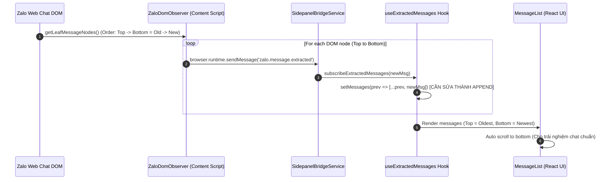

# Context Analysis: Fix Message Extraction Order & UX Scroll Issue

> **Feature**: `message-extraction-order-fix`  
> **Date**: 2026-07-28  
> **Status**: Scoped (Context Analysis Completed — NO Code Changes Made)

---

## 1. Problem Summary (Tóm tắt Vấn đề)

Người dùng báo cáo sự cố về mặt trải nghiệm (UX) và tính chính xác của dữ liệu khi trích xuất tin nhắn Zalo Web:
1. **Trật tự hiển thị và lưu trữ bị đảo ngược (Reverse Order Bug):**
   - Các tin nhắn trích xuất ra bị xếp ngược: Tin nhắn mới nhất nằm ở đầu danh sách (Phía trên), tin nhắn cũ hơn nằm ở cuối danh sách (Phía dưới).
   - Ngược lại hoàn toàn với quy chuẩn giao diện ứng dụng Chat (Zalo, Messenger, Telegram): **Tin nhắn cũ ở trên, tin nhắn mới ở dưới**.
2. **Gây tréo ngoeo khi cuộn (UX Friction on Scroll):**
   - Khi cuộn tin nhắn cũ hơn trong Zalo Web hoặc khi trích xuất lần tiếp theo, người kiểm tra phải lướt lên trên (scroll up) để đọc tiếp đoạn chat cũ thay vì thói quen lướt xuống (scroll down) theo luồng thời gian.
   - Khi có thêm tin nhắn mới, danh sách bị xáo trộn thứ tự nếu tự động thêm vào đầu mảng.

---

## 2. Entry Point & Root Cause Analysis (Điểm Đầu & Nguyên nhân Gốc)

### 2.1. Điểm khởi phát (Entry Point):
- Hook [`useExtractedMessages.ts`](file:///home/stveve/Documents/workspace/Sales/extension/quick_zalo/src/features/message-extraction/hooks/useExtractedMessages.ts#L13-L25) quản lý state `messages`.

### 2.2. Nguyên nhân kỹ thuật (Technical RCA):
1. **Cơ chế Chèn Mảng (Array Prepend Bug) tại [`useExtractedMessages.ts:20`](file:///home/stveve/Documents/workspace/Sales/extension/quick_zalo/src/features/message-extraction/hooks/useExtractedMessages.ts#L20):**
   ```ts
   // Hiện tại (SAI):
   setMessages((prev) => [newMsg, ...prev]);
   ```
   - DOM Observer quét các node tin nhắn trong khung chat Zalo từ **Trên xuống Dưới** (tương ứng từ **Cũ đến Mới**).
   - Khi đẩy từng tin nhắn qua `browser.runtime.sendMessage`, hook nhận lần lượt `[Tin_Cũ_1, Tin_Cũ_2, Tin_Mới_3]`.
   - Do dùng `[newMsg, ...prev]` (Prepending), kết quả mảng `messages` trong state trở thành: `[Tin_Mới_3, Tin_Cũ_2, Tin_Cũ_1]`. Tin mới nhất nhảy lên vị trí 0 (Đầu bảng UI).

2. **Chưa hỗ trợ Tự động Cuộn xuống (Auto-Scroll to Bottom) tại [`MessageList.tsx`](file:///home/stveve/Documents/workspace/Sales/extension/quick_zalo/src/features/message-extraction/components/MessageList/MessageList.tsx#L44-L50):**
   - Khung chứa `MessageList` sử dụng `overflowY: 'auto'` đơn thuần, không có cơ chế cuộn xuống dưới cùng khi có tin nhắn mới hoặc khi vừa mở Sidepanel, làm trải nghiệm giống danh sách tin tức thay vì khung chat.

3. **Xuất file JSON bị ngược thứ tự thời gian (`export-json.ts`):**
   - File JSON xuất ra ghi nhận mảng `messages` theo thứ tự của state. Nếu state bị ngược, file JSON kết xuất kiểm tra cũng bị đảo ngược thứ tự thời gian.

---

## 3. Call Chain & Data Flow (Luồng Gọi & Luồng Dữ liệu)



---

## 4. Affected Components & Impact Analysis (Phân tích Ảnh hưởng)

| File / Component | Vị trí Line | Mức độ | Ảnh hưởng Trực tiếp / Gián tiếp |
|:---|:---|:---|:---|
| [`useExtractedMessages.ts`](file:///home/stveve/Documents/workspace/Sales/extension/quick_zalo/src/features/message-extraction/hooks/useExtractedMessages.ts#L15-L21) | L15-L21 | **Trực tiếp** | Hàm `setMessages` đang dùng `[newMsg, ...prev]`. Cần sửa thành chèn theo thứ tự thời gian/DOM (`[...prev, newMsg]`). |
| [`MessageList.tsx`](file:///home/stveve/Documents/workspace/Sales/extension/quick_zalo/src/features/message-extraction/components/MessageList/MessageList.tsx#L44-L50) | L44-L50 | **Trực tiếp** | Cần thêm `ref` cuộn mượt xuống đáy container (`scrollIntoView` hoặc `scrollTop = scrollHeight`) để ưu tiên hiển thị tin nhắn mới nhất ở góc nhìn ban đầu. |
| [`export-json.ts`](file:///home/stveve/Documents/workspace/Sales/extension/quick_zalo/src/features/message-extraction/utils/export-json.ts#L3-L23) | L3-L23 | **Gián tiếp** | Khi `messages` state chuẩn thứ tự từ Cũ $\rightarrow$ Mới, file JSON xuất ra tự động đúng thứ tự хронологи chuẩn. |
| [`zalo-dom-observer.ts`](file:///home/stveve/Documents/workspace/Sales/extension/quick_zalo/src/infra/extraction/zalo-dom-observer.ts#L61-L77) | L61-L77 | **Gián tiếp** | Kiểm tra hàm `forceScanCurrentChat` bảo đảm việc quét lại (Rescan) xóa cache và trả tin nhắn theo thứ tự DOM chuẩn. |

---

## 5. Evidence & Code References (Bằng chứng Kỹ thuật)

1. **Thao tác chèn ngược mảng:**
   - Link: [`useExtractedMessages.ts:L20`](file:///home/stveve/Documents/workspace/Sales/extension/quick_zalo/src/features/message-extraction/hooks/useExtractedMessages.ts#L20)
   ```typescript
   return [newMsg, ...prev]; // Causes reverse order UI
   ```
2. **Container danh sách tin nhắn:**
   - Link: [`MessageList.tsx:L45-L49`](file:///home/stveve/Documents/workspace/Sales/extension/quick_zalo/src/features/message-extraction/components/MessageList/MessageList.tsx#L45-L49)
   ```tsx
   <div style={{ padding: '12px 16px', flex: 1, overflowY: 'auto' }}>
     {messages.map((msg) => (
       <MessageCard key={msg.id} message={msg} />
     ))}
   </div>
   ```

---

## 6. Confidence Assessment (Đánh giá Độ tin cậy)

- **Độ tin cậy Scope:** `95%` (Rất cao).
- **Lý do:** Đã xác minh chính xác nguyên nhân gốc tại dòng code `[newMsg, ...prev]` trong `useExtractedMessages.ts` và cơ chế hiển thị mảng tại `MessageList.tsx`.

---

## 7. Next Steps (Hướng Phục hồi & Sửa chữa cho Phase Fix)

1. **Sửa thứ tự lưu state tin nhắn:**
   - Thay đổi logic `setMessages` trong `useExtractedMessages.ts` để nạp tin nhắn theo thứ tự lũy tiến từ Cũ đến Mới (`[...prev, newMsg]`).
2. **Cải tiến UX cuộn danh sách:**
   - Bổ sung `useRef` và `useEffect` trong `MessageList.tsx` để tự động cuộn xuống cuối (Bottom) khi khởi tạo hoặc khi có thêm tin nhắn mới.
3. **Chạy Unit/Integration Tests:**
   - Kiểm tra `useExtractedMessages` hook và kiểm thử giao diện bằng Vitest để đảm bảo 100% Typecheck & Test suit đều green.

---

> **Tuyên bố:** *NO CODE CHANGES WERE MADE DURING THIS ANALYSIS STEP. Scope document is saved at `docs/context-to-work/message-extraction-order-fix/scope.2026-07-28.md`.*
