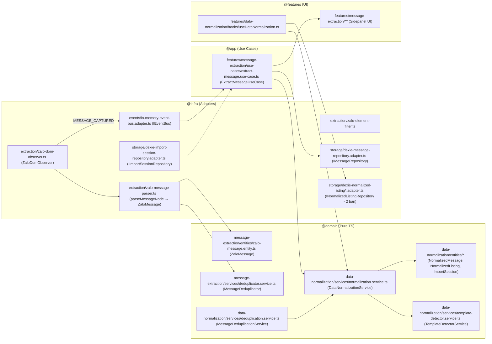

# Scope Document — Skill Tạo Tài Liệu Docs cho Module Chức Năng

**Date**: 2026-08-01
**Status**: Initial
**Feature Name**: `module-docs-generation-skill`
**Mục đích**: Khai thác các tài liệu hỗ trợ sẵn có để xây dựng skill sinh tài liệu docs cho module chức năng, dựa trên 2 module điển hình (`message-extraction`, `data-normalization`) và module mới kết hợp.

---

## §1: Problem Summary

Người dùng cần xây dựng một **skill tạo tài liệu docs cho các module chức năng** của project `quick_zalo`. Hai module điển hình được chọn làm chuẩn tham chiếu:

1. **`message-extraction`** — trích xuất tin nhắn Zalo Web (có đầy đủ bộ spec đã hoàn thành).
2. **`data-normalization`** — chuẩn hóa dữ liệu tin nhắn (có code domain/infra nhưng **chưa có spec suite**).

Hai module này đang được phát triển **kết hợp** để tạo module mới — cầu nối đã tồn tại ở tầng app (`ExtractMessageUseCase` gọi `DataNormalizationService`). Nhiệm vụ hiện tại: **chỉ khai thác & liệt kê tài liệu hỗ trợ** (docs, skill chuẩn, cấu trúc code) — không sửa code, không đề xuất giải pháp.

**Phát hiện chính**:
- Hệ sinh thái tài liệu hỗ trợ **đã rất đầy đủ**: skill `feature-spec-designer` (6 bước, template, validator, checklist) + 3 bộ spec suite mẫu (`message-extraction`, `logging-and-testing`, `quick-search-verification`) + `tree_work.md` + AGENTS.md + `src/infra/AGENTS.md`.
- **Khoảng trống (gap)**: `data-normalization` chưa có spec suite dù đã có code ở cả domain, infra, features, tests — minh chứng rõ nhất cho nhu cầu của skill mới.
- **Bất nhất chuẩn tài liệu**: `quick-search-verification/spec.md` dùng format khác (Glossary + PHẦN 1..N, authored bởi Solutions Architect) so với chuẩn 6-step của `feature-spec-designer` (FR/NFR + Validation Gates + Quality Score).

---

## §2: Entry Point

| # | Entry Point | Loại | Đường dẫn |
|---|---|---|---|
| 1 | Skill chuẩn cha: `feature-spec-designer` | Skill | `.agents/skills/feature-spec-designer/SKILL.md` (workspace root) |
| 2 | Skill `feature-spec-designer` (bản project) | Skill | `quick_zalo/.agents/skills/feature-spec-designer/` |
| 3 | Skill `mermaid-diagrams` | Skill | `quick_zalo/.agents/skills/mermaid-diagrams/` + workspace copy |
| 4 | Skill `context-before-fix` (skill hiện tại) | Skill | `quick_zalo/.agents/skills/context-before-fix/` |
| 5 | Spec mẫu hoàn chỉnh #1 | Spec | `Docs/Specs/message-extraction/spec.md` (388 dòng, Quality 1.00) |
| 6 | Spec mẫu hoàn chỉnh #2 | Spec | `Docs/Specs/logging-and-testing/spec.md` (762 dòng, Quality 1.00) |
| 7 | Spec mẫu #3 (format khác) | Spec | `Docs/Specs/quick-search-verification/spec.md` |
| 8 | Cây kiến trúc & quy trình bắt buộc | Doc | `Docs/tree_work.md` |
| 9 | Routing Index & Dependency Boundaries | Doc | `AGENTS.md` (root) |
| 10 | Quy chuẩn tổ chức module tầng infra | Doc | `src/infra/AGENTS.md` |
| 11 | Code module điển hình #1 | Code | `src/domain/message-extraction/`, `src/infra/extraction/`, `src/features/message-extraction/` |
| 12 | Code module điển hình #2 | Code | `src/domain/data-normalization/`, `src/infra/storage/`, `src/features/data-normalization/` |
| 13 | Cầu nối kết hợp 2 module | Code | `src/app/features/message-extraction/use-cases/extract-message.use-case.ts` |

---

## §3: Scope Definition

### 3.1 Problem Area

- Hệ thống **tài liệu hỗ trợ** (supporting docs) cho việc tạo docs module: skills, templates, standards, spec mẫu, architecture tree.
- Cấu trúc **2 module điển hình** qua 4 tầng: `domain` → `app` → `infra` → `features`.
- Điểm **kết hợp 2 module** để tạo module mới.

### 3.2 Boundary

**In-Scope**:
- Liệt kê & mô tả toàn bộ tài liệu hỗ trợ tìm được (đường dẫn chính xác).
- Map cấu trúc code của 2 module điển hình (file + symbol chính).
- Xác định call chain & data flow giữa 2 module.
- Ghi nhận gaps/bất nhất giữa các chuẩn tài liệu hiện có.

**Out-of-Scope**:
- Thiết kế hoặc viết skill mới (chỉ cung cấp nguyên liệu).
- Sửa code, tạo branch, chạy test.
- Đề xuất giải pháp fix.

---

## §4: Impact Analysis

### 4.1 Direct Impact (thành phần trực tiếp liên quan tới skill docs mới)

| Thành phần | Vai trò với skill mới |
|---|---|
| `feature-spec-designer` (6-step workflow) | Workflow sinh spec chuẩn — nền tảng cho skill mới |
| `knowledge/feature-spec-rules.md` (standards) | Quy tắc bắt buộc: path `Docs/Specs/{feature-name}/`, Parent-Child Boundary, zero horizontal slicing, double-quote Mermaid |
| `templates/spec.md.template`, `diagram.md.template`, `clarification.md.template` | Template output có sẵn |
| `loop/spec-checklist.md`, `data/quality-rules.yaml`, `scripts/spec-validator.py` | Cơ chế đánh giá chất lượng (Gate ≥ 80%) |
| `Docs/Specs/message-extraction/*` | Bộ docs mẫu hoàn chỉnh cho module "trích xuất tin nhắn" |
| `Docs/Specs/logging-and-testing/*` | Bộ docs mẫu thứ 2 (cross-reference table đầy đủ) |
| `Docs/tree_work.md` | Yêu cầu đồng bộ cây kiến trúc khi thêm module |
| `src/features/registry.ts` | Yêu cầu đăng ký moduleMeta (bắt buộc khi tạo module mới) |

### 4.2 Indirect Impact (bị ảnh hưởng gián tiếp khi skill mới được dùng)

| Thành phần | Mức ảnh hưởng | Ghi chú |
|---|---|---|
| `src/domain/data-normalization/` (6 file source) | Cao | **Chưa có spec** — là ứng viên đầu tiên cho skill mới |
| `src/domain/message-extraction/` (2 file source) | Trung bình | Đã có spec COMPLETED; có thể cần re-sync nếu module thay đổi |
| `src/infra/storage/` | Trung bình | Chứa adapter của cả 2 module (dexie-*) |
| `src/app/features/message-extraction/use-cases/extract-message.use-case.ts` | Cao | Điểm kết hợp 2 module — phải được phản ánh chính xác trong docs |
| `Docs/tree_work.md` | Trung bình | Bắt buộc cập nhật khi thêm module mới kết hợp |
| `src/features/registry.ts` | Trung bình | Bắt buộc đăng ký module mới |
| Các skill khác (`mermaid-diagrams`, `e2e-zalo-testing`, `log-analyzer`) | Thấp | Tài liệu tham chiếu chéo, không đổi hành vi |

---

## §5: Call Chain

### 5.1 Call Chain 2 module điển hình (domain → app → infra → features)

### 5.2 Điểm kết hợp 2 module (module mới)

- `ExtractMessageUseCase` (app layer) là **cầu nối duy nhất** giữa 2 module: nhận sự kiện `MESSAGE_CAPTURED` (từ `ZaloDomObserver` qua `IEventBus`) → gọi `DataNormalizationService.normalize({id, data_raw})` → lưu `NormalizedMessage` qua `DexieMessageRepository`.
- Tại **domain layer, 2 module hoàn toàn độc lập**: `message-extraction` không import gì; `data-normalization` chỉ import nội bộ (`normalization.service` import `template-detector.service` + entities).
- Cả 2 module đều **không có index.ts** riêng — import trực tiếp theo đường dẫn file (`@domain/data-normalization/services/normalization.service`).

---

## §6: Data Flow

### 6.1 Input

| Input | Nguồn | Định dạng |
|---|---|---|
| Sự kiện DOM `mouseup`/`selectionchange` | Zalo Web (`chat.zalo.me`) | DOM Event |
| Tin nhắn thô | `ZaloDomObserver` → `parseMessageNode` | `ZaloMessage` (id, conversationName, sender, isSelf, timestamp, rawText, position) |
| File JSON thô khi import | User (Sidepanel) | `RawJsonInputFile` → `RawJsonInputMessage` ({id, data_raw}) |

### 6.2 Output

| Output | Đích | Định dạng |
|---|---|---|
| `MESSAGE_CAPTURED` event | `IEventBus` (InMemoryEventBusAdapter) | Domain Event |
| `NormalizedMessage` | `DexieMessageRepository` → IndexedDB table `normalized_messages` | 19 trường legacy |
| `NormalizedListing` | `DexieNormalizedListingRepository` (2 bản) → table `normalized_listings` | 30+ trường (templateFamily, priceRange, commission, axis, policies...) |
| `ImportSession` | `DexieImportSessionRepository` → table `import_sessions` | Metadata phiên import |

### 6.3 Dependencies

- `QuickZaloDexieDB` (dexie v3): 4 table `normalized_messages`, `normalized_listings`, `import_sessions`, `messages` (`src/infra/storage/dexie-database.ts`).
- `EvlogLogger` + `DualTransportDispatcher` (ring buffer IndexedDB/ChromeStorage) — tầng logging dùng chung toàn hệ thống.
- `InMemoryEventBusAdapter` (port `IEventBus` từ `@shared/kernel/event-bus.interface`).
- `ConfigService` (port `IConfigService`) — điều khiển bật/tắt Full Extraction.

---

## §7: Affected Components

### 7.1 Files — Hệ thống tài liệu hỗ trợ (supporting docs)

| File | Vai trò | Ghi chú |
|---|---|---|
| `.agents/skills/feature-spec-designer/SKILL.md` | Skill chuẩn cha (v1.2.0, 6-step) | Workspace root + bản project tại `quick_zalo/.agents/skills/` |
| `knowledge/feature-spec-rules.md` | Standards.md — storage isolation, Level 0/1/2, Mermaid rules, clarification rules | 102 dòng |
| `knowledge/mermaid-rules.md` | Quy tắc Mermaid chi tiết | Chưa đọc sâu trong lượt này |
| `templates/spec.md.template` | Template spec tổng hợp | — |
| `templates/diagram.md.template` | Template diagram doc (.md) | — |
| `templates/clarification.md.template` | Template câu hỏi làm rõ (3-5 MCQ) | — |
| `loop/spec-checklist.md` | Checklist đánh giá Quality Score | — |
| `data/quality-rules.yaml` | Luật chất lượng | — |
| `scripts/spec-validator.py` | Validator tự động | — |
| `Docs/Specs/message-extraction/spec.md` | Spec mẫu COMPLETED (Quality 1.00) | 388 dòng |
| `Docs/Specs/message-extraction/architecture-overview.md` | Level 0 Black Box mẫu | 87 dòng |
| `Docs/Specs/message-extraction/submodule-decomposition.md` | Level 1/2 White Box mẫu | 81 dòng |
| `Docs/Specs/message-extraction/{normalizations,use-cases,clarification-log}.md` | Bộ hồ sơ hỗ trợ mẫu | 56/143 dòng |
| `Docs/Specs/logging-and-testing/spec.md` | Spec mẫu thứ 2 (762 dòng) + `diagrams/{c4,flowchart,sequence,erd,class,state}.md` | Cross-reference table đầy đủ |
| `Docs/Specs/quick-search-verification/spec.md` | Spec mẫu format KHÁC (Glossary + PHẦN) | Status APPROVED |
| `Docs/tree_work.md` | Cây kiến trúc + quy trình 3 bước bắt buộc | 221 dòng |
| `AGENTS.md` (root) | Routing Index, dependency boundaries, must_not | — |
| `src/infra/AGENTS.md` | Anti-monolith, pattern file naming (`*.const.ts`, `*-parser.ts`, `*-filter.ts`, `*.adapter.ts`) | — |
| `docs/context-to-work/` | Thư mục scope documents (convention hiện có) | Có `_achive/` + `quick-search-step1-event-bus/` |

### 7.2 Files — Code 2 module điển hình

**Module `message-extraction` (domain: 2 file, 0 test):**
- `src/domain/message-extraction/entities/zalo-message.entity.ts` — `ZaloMessage`
- `src/domain/message-extraction/services/deduplicator.service.ts` — `MessageDeduplicator` (seenIds, maxCapacity 1000, generateHash/isDuplicate/markSeen)

**Module `data-normalization` (domain: 6 file, 2 test):**
- `src/domain/data-normalization/entities/normalized-message.entity.ts` — `NormalizedMessage`, `ServicePricing`, `RawJsonInputMessage`, `RawJsonInputFile`, `IngestionMetrics`
- `src/domain/data-normalization/entities/normalized-listing.entity.ts` — `NormalizedListing`, `ServiceFees`, `Policy`, `TemplateFamily` (import `ServicePricing` từ entity trên)
- `src/domain/data-normalization/entities/import-session.entity.ts` — `ImportSession`
- `src/domain/data-normalization/services/template-detector.service.ts` — `TemplateDetectorService.detect()`
- `src/domain/data-normalization/services/normalization.service.ts` — `DataNormalizationService` (normalize/normalizeListing/generateContentHash/parsePriceNumeric, ~18 helpers private)
- `src/domain/data-normalization/services/deduplication.service.ts` — `MessageDeduplicationService` (stage-1 dedup, DI-inject DataNormalizationService)

**Infra liên quan:**
- `src/infra/extraction/` — `zalo-dom-observer.ts` (orchestrator, 154 dòng), `zalo-message-parser.ts` (185 dòng), `zalo-element-filter.ts`, `zalo-header-parser.ts`, `zalo-selectors.const.ts`
- `src/infra/storage/` — `dexie-message-repository.adapter.ts` (IMessageRepository), `dexie-normalized-listing-repository.adapter.ts` (mới, constructor-inject db), `dexie-normalized-listing.adapter.ts` (legacy, singleton db — feature hook đang dùng bản này), `dexie-import-session-repository.adapter.ts`, `dexie-database.ts`
- `src/infra/events/in-memory-event-bus.adapter.ts`, `src/infra/browser/*`, `src/infra/config/*`, `src/infra/logging/*`

**App & Features:**
- `src/app/features/message-extraction/use-cases/extract-message.use-case.ts` — cầu nối 2 module
- `src/features/message-extraction/**` — UI (MessageList, SearchBar, useExtractedMessages, sidepanel-bridge, export-json)
- `src/features/data-normalization/**` — UI (JsonUploader, NormalizedCard, ImportMetricsSummary, useDataNormalization)
- `src/features/registry.ts` — bắt buộc đăng ký moduleMeta

---

## §8: Evidence

<evidence>
  <file>.agents/skills/feature-spec-designer/SKILL.md</file>
  <line>19-55</line>
  <finding>6-step workflow bắt buộc (Step 1→6, zero step skipping), End-of-Step Validation Gate, Sub-step 5.1/5.2/5.3, Parent-Child Boundary Consistency, cấm Physical Horizontal Slicing, output tại Docs/Specs/{feature-name}/</finding>
</evidence>
<evidence>
  <file>.agents/skills/feature-spec-designer/knowledge/feature-spec-rules.md</file>
  <line>7-30</line>
  <finding>Storage Isolation Directives: 7 file bắt buộc + diagrams/ (c4, flowchart, sequence, erd, class, state) dạng .md duy nhất</finding>
</evidence>
<evidence>
  <file>.agents/skills/feature-spec-designer/knowledge/feature-spec-rules.md</file>
  <line>50-57</line>
  <finding>Parent-Child Boundary Consistency 100% + Zero Physical Horizontal Slicing — quy tắc chất lượng lõi</finding>
</evidence>
<evidence>
  <file>Docs/Specs/message-extraction/spec.md</file>
  <line>1-7</line>
  <finding>Spec mẫu hoàn chỉnh: Status COMPLETED, Quality Score 1.00/1.00 — cấu trúc 9 section (UR/FR/NFR/USE CASES/MoSCoW/Diagrams/Gherkin/Validation Gates)</finding>
</evidence>
<evidence>
  <file>Docs/Specs/message-extraction/architecture-overview.md</file>
  <line>9-64</line>
  <finding>Mẫu Level 0 Black Box: External Boundaries & Actors + C4 diagram + Parent-Child Boundary Specifications table (IN_DOM_SELECTION, OUT_CLIPBOARD_WRITE, IO_INDEXEDDB_LOOKUP, OUT_ALERT_RENDER)</finding>
</evidence>
<evidence>
  <file>Docs/Specs/message-extraction/submodule-decomposition.md</file>
  <line>16-70</line>
  <finding>Mẫu Level 1/2 White Box: phân rã ExtractionCore thành 7 sub-component + 3-branch execution (Happy/Clarification/Exception) + boundary consistency verification table</finding>
</evidence>
<evidence>
  <file>Docs/Specs/logging-and-testing/spec.md</file>
  <line>31-46</line>
  <finding>Cross-Reference Table chuẩn liệt kê toàn bộ 11 tài liệu của bộ hồ sơ (normalizations, clarification-log, use-cases, architecture-overview, submodule-decomposition, 6 diagrams)</finding>
</evidence>
<evidence>
  <file>Docs/Specs/quick-search-verification/spec.md</file>
  <line>1-40</line>
  <finding>Format spec KHÁC: Glossary table (PHẦN 1) + PHẦN 2 Scope & Overview — không dùng FR/NFR/Validation Gates của feature-spec-designer → bất nhất chuẩn tồn tại</finding>
</evidence>
<evidence>
  <file>Docs/tree_work.md</file>
  <line>108-132</line>
  <finding>Quy trình bắt buộc 3 bước khi thêm module: (1) tạo features/{feature-name} với moduleMeta + Component, (2) đăng ký vào features/registry.ts, (3) cập nhật Docs/tree_work.md</finding>
</evidence>
<evidence>
  <file>src/infra/AGENTS.md</file>
  <line>14-40</line>
  <finding>Pattern tổ chức module infra: *.const.ts/selectors, *-parser/formatter, *-filter/validator, *.adapter.ts (orchestrator); cấm monolithic file >150-200 dòng</finding>
</evidence>
<evidence>
  <file>src/app/features/message-extraction/use-cases/extract-message.use-case.ts</file>
  <line>1-20</line>
  <finding>ExtractMessageUseCase import DataNormalizationService từ @domain/data-normalization — cầu nối duy nhất giữa 2 module (kết hợp tạo module mới)</finding>
</evidence>
<evidence>
  <file>src/domain/data-normalization/</file>
  <line>structure</line>
  <finding>Module có 6 file source + 2 test nhưng KHÔNG có bộ spec trong Docs/Specs/ — gap tài liệu rõ ràng, là ứng viên đầu tiên cho skill mới</finding>
</evidence>
<evidence>
  <file>src/infra/storage/dexie-normalized-listing.adapter.ts</file>
  <line>1-30</line>
  <finding>Hai implementation cho cùng port INormalizedListingRepository (bản legacy không file-header dùng singleton dexieDb; bản mới dexie-normalized-listing-repository.adapter.ts constructor-inject db) — cần phản ánh trong docs</finding>
</evidence>
<evidence>
  <file>src/infra/storage/index.ts</file>
  <line>1-10</line>
  <finding>index.ts chỉ export dexie-database + dexie-message-repository.adapter — thiếu các adapter khác; import trực tiếp đường dẫn là convention hiện hành</finding>
</evidence>
<evidence>
  <file>src/entrypoints/content/index.ts</file>
  <line>1-40</line>
  <finding>Content entrypoint import thẳng @infra/extraction/zalo-dom-observer (bypass composition) trong khi content-container.ts chỉ có extractDom() — lệch với rule "entrypoints chỉ import composition"</finding>
</evidence>
<evidence>
  <file>docs/context-to-work/</file>
  <line>structure</line>
  <finding>Convention scope documents đã tồn tại: docs/context-to-work/{feature-name}/scope.{YYYY-MM-DD}.md, có _achive/ chứa 7 scope docs cũ (data-normalization-approach, export-message-json, classify-messages...)</finding>
</evidence>

---

## §9: Confidence Assessment

- **Overall Confidence: 88%** (trên ngưỡng 60 — proceed)

| Hạng mục | Độ tin cậy | Lý do |
|---|---|---|
| Hệ thống tài liệu hỗ trợ (skills, templates, standards) | 95% | Đã đọc trực tiếp SKILL.md + rules + templates listing |
| Cấu trúc code 2 module domain | 90% | Verify qua explore agent + codegraph (verbatim source) |
| Cấu trúc infra adapters + port mapping | 85% | Xác nhận `implements` qua header files; 1-2 file chưa đọc đầy đủ (`mermaid-rules.md`, `quality-rules.yaml`, `spec-checklist.md`, `spec-validator.py`) |
| Call chain kết hợp 2 module | 90% | `ExtractMessageUseCase` là cầu nối — confirm qua codegraph |
| Gap data-normalization chưa có spec | 95% | Glob Docs/Specs/ chỉ có 3 feature suites, không có data-normalization |

**Uncertainty flags**:
- ⚠️ Nội dung chi tiết `mermaid-rules.md`, `spec-checklist.md`, `quality-rules.yaml`, `spec-validator.py` chưa được đọc — chỉ xác nhận tồn tại qua listing.
- ⚠️ `Docs/Temps/{1-4}.md`, `Docs/Raws/dom_message_extraction_capability.md`, `Docs/Data/code_python/architecture-redesign-proposal.md` tồn tại nhưng chưa phân loại nội dung (có thể là tài liệu hỗ trợ bổ sung).
- ⚠️ Số lượng test files của data-normalization trong `tests/data-normalization/` (6+ spec files) chưa thống kê chính xác.

---

## §10: Open Questions

1. **Phạm vi skill mới**: Skill mới chỉ sinh spec theo chuẩn `feature-spec-designer` (Docs/Specs/{feature-name}/), hay cần sinh thêm loại tài liệu khác (module guide, README module, architecture map kiểu `architecture-map.md` đã thấy trong `_achive/data-normalization-storage/`)?
2. **Module mới kết hợp**: Tên module mới kết hợp `message-extraction` + `data-normalization` là gì? (Ví dụ tiềm năng: `message-extraction-normalization`, hay module "Import & Chuẩn hóa tin nhắn"?) — ảnh hưởng tới feature-name trong skill.
3. **Xử lý bất nhất chuẩn**: `quick-search-verification/spec.md` dùng format khác `feature-spec-designer` — skill mới nên bám chuẩn nào, hay cần cấu hình chọn format?
4. **Có cần tích hợp `feature-spec-designer` sẵn có** (kế thừa template/validator/checklist) hay viết skill độc lập từ đầu?
5. **Đối tượng docs**: Docs cho module mới cần bao gồm cả phần UI (features/) và phần domain/infra, hay chỉ tập trung phần logic?

---

**Document Status**: Context Complete — No Code Changes Made

**NO CODE CHANGES — Context ready for fix phase**
