# Scope Document — Task 1: Shared Event Contracts & In-Memory Event Bus (Quick Search Step 1)

**Date**: 2026-07-31
**Status**: Initial
**Feature**: `quick-search-step1-event-bus` (Bước 1 / Task 1 của `Docs/Specs/quick-search-verification/quick_search_implementation_plan.md`)
**Phạm vi kèm theo**: Cơ chế cấu hình (`isFullExtractionEnabled`) & pipeline trích xuất tin nhắn hiện tại (context cho Task 2)

---

## §1: Problem Summary

Triển khai **Task 1 — Shared Event Contracts & In-Memory Event Bus Interface** chưa hoàn thành: **3 file implementation đang THIẾU hoàn toàn** trong khi test contract (TDD red) đã tồn tại:

| # | File cần tạo (theo plan) | Trạng thái | Test ràng buộc contract |
|---|---|---|---|
| 1 | `src/shared/contracts/events/message-events.contract.ts` | ❌ THIẾU (folder `events/` rỗng) | `in-memory-event-bus.adapter.test.ts:3-7` |
| 2 | `src/shared/kernel/event-bus.interface.ts` | ❌ THIẾU | `extract-message.use-case.test.ts:3` |
| 3 | `src/infra/events/in-memory-event-bus.adapter.ts` | ❌ THIẾU (folder chỉ có test) | `in-memory-event-bus.adapter.test.ts:2` |

**Phát hiện quan trọng (toàn feature)**: Không chỉ Task 1 — **toàn bộ feature `quick-search` đang ở trạng thái test-đỏ**: 6 test files đã được viết (Task 1, 2, 3, 4, 6, 9 + test mở rộng của Task 5) nhưng **mọi implementation tương ứng đều chưa tồn tại**:

- `src/infra/events/in-memory-event-bus.adapter.test.ts` (Task 1)
- `src/app/features/message-extraction/use-cases/extract-message.use-case.test.ts` (Task 2)
- `src/domain/quick-search/services/{ring-buffer,message-matcher}.service.test.ts` (Task 3 & 4; `entities/`, `value-objects/` rỗng)
- `src/app/features/quick-search/use-cases/verify-selection.use-case.test.ts` (Task 6)
- `src/ui/controllers/ui-overlay.controller.test.ts` (Task 8)
- `src/infra/listeners/dom-selection.listener.test.ts` (Task 7)
- `src/composition/quick-search.container.test.ts` (Task 9)
- `src/infra/storage/dexie-message-repository.adapter.test.ts` (đã mở rộng thêm `findByHash`, `findByAddressAndPrice`, `findByRawData` — adapter hiện hữu **chưa implement** 3 method này, Task 5)

→ Hệ quả: `npm run typecheck` và `npm run test` hiện tại sẽ **FAIL** vì nhiều test import các file không tồn tại (chưa chạy verify — skill cấm chạy test; suy luận từ import path không resolve được).

**Phạm vi user yêu cầu**: "sửa lại cấu hình và cơ chế trích xuất tin nhắn" = cờ `isFullExtractionEnabled` (nguồn từ config module) + pipeline trích xuất phát event qua Event Bus — tức Task 1 làm nền tảng, Task 2 tiêu thụ.

---

## §2: Entry Point

1. **Contract test chính (Task 1)**: `src/infra/events/in-memory-event-bus.adapter.test.ts` — định nghĩa chính xác API bắt buộc:
   - `InMemoryEventBusAdapter` (class, no-arg constructor, `src/infra/events/in-memory-event-bus.adapter.ts`)
   - `MESSAGE_EVENT_TYPES.MESSAGE_CAPTURED` / `MESSAGE_EVENT_TYPES.CONVERSATION_CHANGED`
   - `MessageCapturedPayload` = `{ rawContent: string; senderId: string; timestamp: number; conversationId: string }`
   - `ConversationChangedPayload` = `{ conversationId: string }`
   - `subscribe<T>(event, handler): () => void` — trả về unsubscribe fn (TC-02)
   - `publish<T>(event, payload): void` — **đồng bộ** (TC-01 expect handler gọi ngay sau publish; container test đọc `getSnapshot()` ngay sau publish)
   - Error isolation: handler throw → không làm đứt các subscriber khác, ghi `console.error` (TC-03)
2. **File đích**: 3 files liệt kê ở §1.
3. **File kề cận bị chặn (blocking)**: `src/shared/contracts/errors.ts` — đang THIẾU export `StorageError` (class, vì test dùng `toBeInstanceOf`) trong khi 2 test import từ đây.

---

## §3: Scope Definition

### 3.1 Problem Area
- `@shared/contracts/events/` — tạo `message-events.contract.ts`
- `@shared/kernel/` — tạo `event-bus.interface.ts` (`IEventBus`)
- `@infra/events/` — tạo `in-memory-event-bus.adapter.ts`
- (Kề cận) `@shared/contracts/errors.ts` — bổ sung `StorageError`

### 3.2 Boundary
**IN-SCOPE (Task 1)**:
- 3 files contracts/event-bus trên, tuân thủ 100% signature do test ràng buộc
- Tuân thủ: `Result<T,E>` không bắt buộc cho EventBus (test không yêu cầu), zero `any`, strict types
- Kiểm chứng: `npm run typecheck` (nếu chỉ chạy riêng phần liên quan — xem Open Question 1)

**OUT-OF-SCOPE (các Task sau — KHÔNG làm trong Task 1)**:
- Task 2: `extract-message.use-case.ts` (consumer `IEventBus` + `MESSAGE_EVENT_TYPES`)
- Task 3/4: `ring-buffer.service.ts`, `message-matcher.service.ts`, `buffered-message.entity.ts`, `selection-fragment.vo.ts`
- Task 5: `ports/message-repository.port.ts`, mở rộng `dexie-message-repository.adapter.ts` + schema Dexie (`messages` table, index `hash`)
- Task 6: `verify-selection.use-case.ts`, DTO
- Task 7: `dom-selection.listener.ts`; Task 8: UI overlay components + controller
- Task 9: `quick-search.container.ts`, tích hợp `entrypoints/content/index.ts`

---

## §4: Impact Analysis

### 4.1 Direct Impact (tiêu thụ trực tiếp contracts Task 1)
| Consumer | File | Cách tiêu thụ |
|---|---|---|
| Test Task 1 | `src/infra/events/in-memory-event-bus.adapter.test.ts:2,7` | import adapter + contract |
| Test Task 2 | `src/app/features/message-extraction/use-cases/extract-message.use-case.test.ts:3,5,45` | `IEventBus` (mock publish/subscribe), `MESSAGE_EVENT_TYPES` |
| Test Task 9 | `src/composition/quick-search.container.test.ts:16,110,134` | `MESSAGE_EVENT_TYPES` publish MESSAGE_CAPTURED / CONVERSATION_CHANGED |

### 4.2 Indirect Impact (Task sau, sẽ phụ thuộc contract này)
- **Task 2** — `src/app/features/message-extraction/use-cases/extract-message.use-case.ts` (THIẾU): `new ExtractMessageUseCase({ eventBus, messageRepository })`; `execute({ rawContent, senderId, conversationId, isFullExtractionEnabled })` → luôn `publish(MESSAGE_CAPTURED)`, chỉ `save` khi flag true; result `{ isFullExtracted, savedMessageId? }`
- **Task 9** — `src/composition/quick-search.container.ts` (THIẾU): subscribe `MESSAGE_CAPTURED` → `RingBufferService.push` (biến đổi payload → `BufferedMessageEntity`, `sanitizedContent` = lowercase theo container test:115); subscribe `CONVERSATION_CHANGED` → `clear()`; expose `eventBus`, `ringBufferService`, ... qua `QuickSearchContainerInstance`; `bootstrapQuickSearchContainer({ isFullExtractionEnabled, messageRepository, debounceMs })`; `destroy()`
- **Cấu hình (nguồn flag)**: `AppConfig.features.moduleStatuses['message-extraction']` — mặc định `true` (`config.validator.ts:23-25`); toggle qua `useModuleManagement.toggleModule` (`use-module-management.ts:33-58`) → `UpdateConfigUseCase` → `ConfigService.updateConfig` (`config-service.adapter.ts:55-88`) → `BrowserStorage('local')` key `APP_CONFIG`; đồng thời `SidepanelBridgeService.toggleObserver` gửi runtime message `zalo.observer.toggle` → `content/index.ts:122-128`
- **Cơ chế trích xuất hiện tại** (sẽ được refactor ở Task 2): `entrypoints/content/index.ts:69-86` — `ZaloDomObserver` với callback `onMessageExtracted` gửi runtime message `zalo.message.extracted`; `onConversationChanged` (option `zalo-dom-observer.ts:18-22`) **chưa được dùng** trong content script hiện tại (chỉ có 2 callbacks: onMessageExtracted, onMessagesBatchExtracted) → khe hở để phát `CONVERSATION_CHANGED`
- **Blocking kề cận**: `src/shared/contracts/errors.ts` — thiếu `StorageError` làm 2 test fail (`verify-selection.use-case.test.ts:13`, `dexie-message-repository.adapter.test.ts:8`)
- **Sync Gate (AGENTS.md)**: `Docs/tree_work.md:89` đã có mục `quick-search/`; `src/features/registry.ts` chưa có entry quick-search (module content-script, chưa có UI card — xác nhận nhu cầu khi Task 8/9)

### 4.3 API Contracts bị ảnh hưởng
- **KHÔNG break** contract hiện hữu: `IMessageBus`/`RuntimeMessageBus` (`@app/ports/message-bus.port.ts`, `@infra/browser/runtime-bus.ts`) và `Message` union (`messages.ts:6-18` với event `zalo.message.extracted`) — Event Bus mới là **in-memory, nội bộ Content Script**, tách biệt hoàn toàn khỏi runtime bus
- `Message` union KHÔNG cần sửa cho Task 1
- Lưu ý đặt tên tránh nhầm: folder `@shared/contracts/events/` (mới) vs file `@shared/contracts/events.ts` (đã tồn tại, chứa `PageCapturedEvent`)

---

## §5: Call Chain

```mermaid
flowchart LR
    subgraph Config["Cấu hình (isFullExtractionEnabled)"]
        UI["Sidepanel useModuleManagement.toggleModule"] --> UC["UpdateConfigUseCase"]
        UC --> CFG["ConfigService.updateConfig"]
        CFG --> ST["BrowserStorage('local') / APP_CONFIG"]
        UI --> BR["SidepanelBridgeService.toggleObserver"]
        BR --> RT["runtime msg 'zalo.observer.toggle'"]
        RT --> CONTENT["content/index.ts :122"]
    end

    subgraph Task1["TASK 1 (mới)"]
        C1["message-events.contract.ts<br/>(MESSAGE_EVENT_TYPES, payloads)"]
        C2["event-bus.interface.ts (IEventBus)"]
        AD["in-memory-event-bus.adapter.ts<br/>(Set&#60;Function&#62;, error-isolated)"]
    end

    subgraph Task2["TASK 2 (consumer — chưa làm)"]
        OBS["ZaloDomObserver"] --> EX["ExtractMessageUseCase.execute"]
        EX -->|"publish MESSAGE_CAPTURED"| AD
    end

    subgraph Task9["TASK 9 (consumer — chưa làm)"]
        AD -->|"subscribe"| RB["RingBufferService.push"]
        AD -->|"CONVERSATION_CHANGED → clear"| RB
    end

    OBS -->|"onConversationChanged"| EX
```



**Chuỗi hiện tại (chưa có Task 1/2/9)**:
`ZaloDomObserver.scanContainer` (`zalo-dom-observer.ts:90-119`) → `onMessageExtracted` → `browser.runtime.sendMessage('zalo.message.extracted')` (`content/index.ts:70-77`)

**Chuỗi sau Task 1 + 2 + 9 (đích)**:
`ZaloDomObserver` → `ExtractMessageUseCase.execute` → `eventBus.publish(MESSAGE_CAPTURED)` → container subscriber → `RingBufferService.push`; `CONVERSATION_CHANGED` → `clear()`; bôi đen → `DOMSelectionListener` → `VerifySelectionUseCase` → UI Overlay (Task 6-8)

---

## §6: Data Flow

### 6.1 Input (payloads contract)
```typescript
MessageCapturedPayload   = { rawContent: string; senderId: string; timestamp: number; conversationId: string }
ConversationChangedPayload = { conversationId: string }
```
- Event names: `MESSAGE_EVENT_TYPES.MESSAGE_CAPTURED`, `MESSAGE_EVENT_TYPES.CONVERSATION_CHANGED` (giá trị string chưa bị ràng buộc bởi test — xem Open Question 3)
- `publish` đồng bộ, không trả Promise; `subscribe` trả `() => void` (unsubscribe)

### 6.2 Output
- Handler nhận đúng typed payload; unsubscribe loại bỏ handler khỏi listener set
- Handler lỗi → `console.error` + tiếp tục phát cho các handler khác (không throw ra ngoài)

### 6.3 Dependencies
- **0 dependency browser API** (pure TypeScript, chạy trong RAM Content Script)
- Pattern đề xuất từ plan: `Set<Function>` quản lý listeners; tránh memory leak bằng cleanup fn trả về từ `subscribe`
- Không dùng `Result<T,E>` cho EventBus (không yêu cầu bởi test/plan)

---

## §7: Affected Components

### 7.1 Files
| Vai trò | Đường dẫn |
|---|---|
| TẠO MỚI | `src/shared/contracts/events/message-events.contract.ts` |
| TẠO MỚI | `src/shared/kernel/event-bus.interface.ts` |
| TẠO MỚI | `src/infra/events/in-memory-event-bus.adapter.ts` |
| SỬA (kề cận, blocking) | `src/shared/contracts/errors.ts` (thêm `StorageError`) |
| Tham chiếu (không sửa) | `src/infra/events/in-memory-event-bus.adapter.test.ts` |
| Tham chiếu (không sửa) | `src/app/features/message-extraction/use-cases/extract-message.use-case.test.ts` |
| Tham chiếu (không sửa) | `src/composition/quick-search.container.test.ts` |
| Context (Task 2 sau này) | `src/entrypoints/content/index.ts`, `src/infra/extraction/zalo-dom-observer.ts`, `src/ui/hooks/use-module-management.ts`, `src/infra/config/config-service.adapter.ts`, `src/domain/config/config.validator.ts`, `src/features/message-extraction/services/sidepanel-bridge.service.ts` |

### 7.2 Functions/APIs bắt buộc (theo test)
- `InMemoryEventBusAdapter` (class): `subscribe<T>(event: string, handler: (payload: T) => void): () => void`; `publish<T>(event: string, payload: T): void`
- `IEventBus` (interface): `publish`, `subscribe` (mock `extract-message.use-case.test.ts:10-13` yêu cầu `subscribe` trả về fn)
- `MESSAGE_EVENT_TYPES`: `{ MESSAGE_CAPTURED: string; CONVERSATION_CHANGED: string }` (const enum / as const)
- `MessageCapturedPayload`, `ConversationChangedPayload` (readonly-friendly types)

---

## §8: Evidence

```xml
<evidence>
  <file>src/infra/events/in-memory-event-bus.adapter.test.ts</file>
  <line>2,7</line>
  <finding>Import InMemoryEventBusAdapter từ './in-memory-event-bus.adapter' (KHÔNG TỒN TẠI) và MESSAGE_EVENT_TYPES/MessageCapturedPayload/ConversationChangedPayload từ '../../shared/contracts/events/message-events.contract' (KHÔNG TỒN TẠI). TC-01/02/03 định nghĩa contract: subscribe→unsubscribe fn, publish đồng bộ, error-isolation qua console.error.</finding>
</evidence>
<evidence>
  <file>src/app/features/message-extraction/use-cases/extract-message.use-case.test.ts</file>
  <line>3,5,10-13,45</line>
  <finding>Import IEventBus từ '@shared/kernel/event-bus.interface' (THIẾU). Mock eventBus { publish, subscribe: () => fn }. ExtractMessageUseCase nhận options { eventBus, messageRepository }; execute({ rawContent, senderId, conversationId, isFullExtractionEnabled }); luôn publish MESSAGE_CAPTURED, save chỉ khi flag true.</finding>
</evidence>
<evidence>
  <file>src/composition/quick-search.container.test.ts</file>
  <line>8,16,70-84,98-118,120-139,141-154,256-272</line>
  <finding>Import 'linkedom' parseHTML (transitive dep, KHÔNG khai báo trong package.json). Container cần expose: eventBus, ringBufferService, messageMatcherService, messageRepository, verifySelectionUseCase, uiOverlayController, domSelectionListener; destroy(); publish MESSAGE_CAPTURED → push vào RingBuffer (sanitizedContent lowercase); CONVERSATION_CHANGED → clear.</finding>
</evidence>
<evidence>
  <file>src/shared/contracts/errors.ts</file>
  <line>1-5</line>
  <finding>Chỉ có union AppError (VALIDATION/NOT_FOUND/PERMISSION/INFRA). KHÔNG export StorageError — nhưng verify-selection.use-case.test.ts:13 và dexie-message-repository.adapter.test.ts:8 import { StorageError } và dùng toBeInstanceOf(StorageError) → cần class.</finding>
</evidence>
<evidence>
  <file>src/infra/storage/dexie-message-repository.adapter.ts</file>
  <line>10-124</line>
  <finding>Adapter hiện chỉ có save/saveBatch/findExistingHashes/findAll/clearAll/count. Test mở rộng (dexie-message-repository.adapter.test.ts:64-275) yêu cầu findByHash/findByAddressAndPrice/findByRawData — CHƯA implement (Task 5). Schema Dexie version(2) chưa có table 'messages'/index 'hash' (dexie-database.ts:13-14).</finding>
</evidence>
<evidence>
  <file>src/domain/config/config.validator.ts</file>
  <line>23-25</line>
  <finding>DEFAULT_APP_CONFIG.features.moduleStatuses = { 'message-extraction': true } — nguồn mặc định của cờ isFullExtractionEnabled.</finding>
</evidence>
<evidence>
  <file>src/ui/hooks/use-module-management.ts</file>
  <line>22,33-58</line>
  <finding>toggleModule('message-extraction') → updateConfig(features.moduleStatuses) + bridge.toggleObserver(nextState) → runtime message 'zalo.observer.toggle'. Cơ chế "sửa lại cấu hình" hiện tại.</finding>
</evidence>
<evidence>
  <file>src/entrypoints/content/index.ts</file>
  <line>69-86,122-128</line>
  <finding>ZaloDomObserver khởi tạo với onMessageExtracted→sendMessage('zalo.message.extracted'); onConversationChanged của observer CHƯA được truyền; toggle observer qua message zalo.observer.toggle. Nơi Task 2/9 sẽ đấu nối Event Bus.</finding>
</evidence>
<evidence>
  <file>src/infra/extraction/zalo-dom-observer.ts</file>
  <line>18-22,82-88</line>
  <finding>Options gồm onConversationChanged (optional) — đã có khả năng phát sự kiện đổi conversation (đầu nối CONVERSATION_CHANGED).</finding>
</evidence>
<evidence>
  <file>Docs/tree_work.md</file>
  <line>89</line>
  <finding>Đã có entry 'quick-search/ # Quick Search & DB Verification Feature Module (RAM Buffer & 2-Step DB Check)' — cây kiến trúc đã cập nhật. registry.ts chưa có quick-search.</finding>
</evidence>
<evidence>
  <file>git status</file>
  <line>-</line>
  <finding>6 test files + folder contracts/events/ (rỗng) + errors.ts đều là thay đổi chưa commit từ 2026-07-31 — bằng chứng phiên trước đã viết test (TDD red) và dừng lại.</finding>
</evidence>
```

---

## §9: Confidence Assessment

- **Overall Confidence: 90%** (đã verify bằng read_file + grep toàn bộ references; không chạy test do guardrail skill)
- Chắc chắn (85-100%):
  - 3 file Task 1 chưa tồn tại; contract chính xác do 3 test files ràng buộc
  - `StorageError` thiếu trong `errors.ts` (blocking kề cận)
  - `publish` đồng bộ, `subscribe` trả unsubscribe fn, error-isolation qua console.error
  - Nguồn cờ config = `moduleStatuses['message-extraction']`
- Uncertainty flag (60-85%):
  - Giá trị string cụ thể của `MESSAGE_EVENT_TYPES` (test chỉ dùng key, không assert value)
  - Kết quả chạy thực tế của `npm run test` (không chạy do skill cấm — dự đoán fail vì import path không resolve)
  - Cách wiring `isFullExtractionEnabled` trong production (container nhận function — ai truyền từ config là chưa được đặc tả)

---

## §10: Open Questions

1. **Phạm vi triển khai**: Chỉ tạo 3 file Task 1, hay triển khai kèm các consumer tối thiểu (Task 2 `extract-message.use-case.ts`, Task 3 `ring-buffer.service.ts` + `buffered-message.entity.ts`) để `npm run test` chuyển từ đỏ sang xanh? (Nếu chỉ Task 1, suite vẫn fail do 6 test files khác import file thiếu.)
2. **StorageError design**: Thêm class `StorageError extends Error` vào `src/shared/contracts/errors.ts` (phù hợp `toBeInstanceOf`), hay mở rộng union `AppError` kèm `reason`? (2 test hiện hữu yêu cầu class)
3. **Giá trị event names**: `MESSAGE_EVENT_TYPES.MESSAGE_CAPTURED` = `'message.captured'`? `CONVERSATION_CHANGED` = `'conversation.changed'`? (Test không assert — cần chốt quy ước đặt tên kebab-case như `Message` union hiện tại)
4. **linkedom**: `quick-search.container.test.ts:8` import `linkedom` (chỉ là transitive dep) — có khai báo chính thức vào `devDependencies` không? (Liên quan Task 9, không chặn Task 1)
5. **Sync Gate**: Feature quick-search hiện không có UI card ở Sidepanel — có cần đăng ký `src/features/registry.ts` ở giai đoạn nào (Task 8/9) hay giữ là module content-script thuần?
6. **`verify-selection.use-case.test.ts` contract drift**: test dùng `new RingBufferService(10)` (Task 6) trong khi `ring-buffer.service.test.ts` dùng `new RingBufferService()` (Task 3) — constructor cần optional capacity (mặc định 10) để cả 2 pass. (Chỉ để ghi nhận, thuộc Task 3.)

---

**Document Status**: Context Complete — No Code Changes Made
**Next step**: Chờ user trả lời Open Questions 1-3 trước khi vào fix phase (Task 1 implementation).
