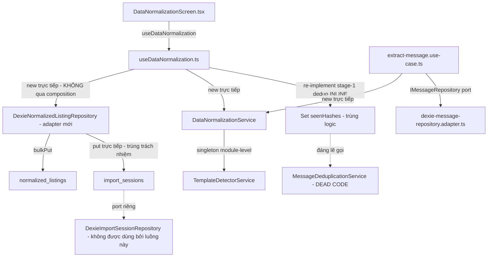

# Scope Document — Đối chiếu Pattern: data-normalization.md vs Code thực tế

**Date**: 2026-08-02
**Status**: Initial
**Loại tác vụ**: Pattern audit (CHỈ DOCUMENT — không sửa code)
**Nguồn đối chiếu**: `Docs/Module-Capabilities/data-normalization.md` (sinh bởi module-docs-generation-skill, 2026-08-01)
**Phương pháp**: codegraph (source verbatim + blast radius) + 2 explore agents (Evlog patterns, registry/UI structure) + read trực tiếp

---

## §1: Problem Summary

Tài liệu `data-normalization.md` mô tả module data-normalization là **functional module** với kết luận Pattern Check:
**⚠️ LỆCH PATTERN KIẾN TRÚC — F3 FAIL (không Evlog), F4 WARN (UI lẫn trong features/), C1/C2 OK.**

Khai thác code thực tế cho thấy **3 kết luận của doc cần hiệu chỉnh**:

1. **F3 FAIL (không Evlog)** — ĐÚNG về sự thật (0 logger), NHƯNG mức độ lệch chỉ nằm ở **feature boundary**; domain & storage của module consistent với chuẩn toàn dự án (mọi domain service và mọi Dexie adapter đều không log).
2. **F4 WARN (UI trong features/)** — **Doc kết luận SAI hướng**: UI trong `src/features/` là **pattern chuẩn của dự án** (message-extraction cũng vậy, cũng bị WARN y hệt tại `message-extraction.md:68`). Lệch pattern THẬT là **nested thư mục `ui/`** bên trong feature (bị `.agents/rules/ui-architecture-conventions.md:12` cấm), chứ không phải việc UI tồn tại trong features/.
3. **C2 OK (độc lập qua contract)** — **Doc đánh giá SAI**: consumer thực (`useDataNormalization.ts`) import **concrete adapter từ infra trực tiếp** (bypass port & composition); adapter mới `dexie-normalized-listing.adapter.ts` khai báo `implements INormalizedListingRepository` nhưng **vi phạm contract port** (saveBatch 3 tham số + `Result<any>` + getLatestSession ngoài port + duplicate `ListingQueryOptions` drift).

Ngoài ra còn **4 lệch pattern không được doc ghi nhận**: (a) `MessageDeduplicationService` là **dead code**, stage-1 dedup bị re-implement inline trong hook; (b) `as any` tại 2 vị trí; (c) adapter mới 223 dòng vi phạm anti-monolith (`infra/AGENTS.md`); (d) doc nội bộ mâu thuẫn nhau (`tree_work.md:130` vs `ui-architecture-conventions.md:12`) + `tree_work.md:89` liệt kê `quick-search/` phantom (không tồn tại trong `src/features/`).

---

## §2: Entry Point

| Hạng mục | Giá trị |
|---|---|
| Tài liệu gốc | `Docs/Module-Capabilities/data-normalization.md` (79 dòng, section 7 "Architecture Pattern Check") |
| Khu vực khảo sát | `src/domain/data-normalization/`, `src/infra/storage/dexie-*.adapter.ts`, `src/features/data-normalization/`, `src/app/use-cases/message-extraction/extract-message.use-case.ts`, `src/app/ports/*.port.ts` |
| Pattern chuẩn để so sánh | `.agents/rules/ui-architecture-conventions.md`, `.agents/rules/logging-and-observability.md`, `src/infra/AGENTS.md`, `AGENTS.md`, Evlog usage của message-extraction |

---

## §3: Scope Definition

### 3.1 Problem Area
- Tính đúng đắn của 7 tiêu chí Pattern Check trong doc (F1–F4, C1–C2) so với code thực tế.
- Các lệch pattern tồn tại trong module nhưng doc bỏ sót.

### 3.2 Boundary
- **Trong scope**: toàn bộ code thuộc module data-normalization (domain/app/infra/features), pattern chuẩn liên quan (Evlog, feature structure, registry, port contract), docs liên quan (tree_work.md, ui-architecture-conventions.md, infra/AGENTS.md).
- **Ngoài scope**: entities field-level correctness (không đối chiếu từng field entity), test coverage, event contract chi tiết, đề xuất giải pháp fix (skill cấm).

---

## §4: Impact Analysis

### 4.1 Direct Impact (file trong module bị ảnh hưởng bởi lệch pattern)

| File | Lệch pattern |
|---|---|
| `src/features/data-normalization/hooks/useDataNormalization.ts` | Features→infra direct import (line 6), instantiate concrete adapter + service (lines 8–9), 0 Evlog, dedup inline trùng logic domain |
| `src/infra/storage/dexie-normalized-listing.adapter.ts` | saveBatch lệch port (line 135–139), `Result<any>` (line 139), getLatestSession ngoài port (line 197), duplicate ListingQueryOptions (lines 8–18), đọc import_sessions trùng trách nhiệm (line 199), 223 dòng |
| `src/features/data-normalization/ui/DataNormalizationScreen.tsx` | Nested `ui/` folder (vi phạm flat convention), `as any` (line 112) |
| `src/domain/data-normalization/services/deduplication.service.ts` | Dead code toàn file (0 consumer) |
| `src/features/data-normalization/index.ts` | moduleMeta/Component đúng registry contract (không lệch) |

### 4.2 Indirect Impact (pattern chuẩn bị ảnh hưởng / tài liệu bị sai lệch)

| Đối tượng | Ảnh hưởng |
|---|---|
| `Docs/Module-Capabilities/data-normalization.md` | Kết luận F4, C2 cần hiệu chỉnh; thiếu 4 lệch pattern chưa ghi nhận |
| `Docs/Module-Capabilities/message-extraction.md` | Cùng F4 WARN (line 68) — nếu fix F4 cho data-normalization mà không sửa message-extraction thì 2 module bất nhất |
| `Docs/tree_work.md` | Line 89 liệt kê `quick-search/` phantom; line 130 mâu thuẫn với ui-architecture-conventions.md:12 |
| `.agents/rules/ui-architecture-conventions.md` | Là chuẩn "flat" nhưng đang bị vi phạm bởi `ui/` subfolder; xung đột với tree_work.md:130 |
| `src/composition/*` | Composition KHÔNG hề wire feature data-normalization — feature tự `new` adapter/service ở module scope (vòng qua DI) |
| IndexedDB | 2 adapter cùng đọc/ghi bảng `import_sessions` (new listing adapter + DexieImportSessionRepository) — rủi ro inconsistency logic |

---

## §5: Call Chain

**Ghi chú call chain**:
- Registry path (đúng chuẩn): `entrypoints/sidepanel/main.tsx → AppShell → MODULES (registry.ts:33-38) → Component = DataNormalizationScreen`.
- Luồng nạp file (lệch chuẩn DI): hook tự `new DexieNormalizedListingRepository()` + `new DataNormalizationService()` — không đi qua `src/composition/`.

---

## §6: Data Flow

### 6.1 Input
- JSON datarow (`RawJsonInputFile {messages: RawJsonInputMessage[]}`) qua `importJsonFile(file)` — `useDataNormalization.ts:57-64`.
- `MessageCapturedPayload` từ message-extraction → `extract-message.use-case.ts:40-46` (chỉ publish event; normalize khi `isFullExtractionEnabled`).

### 6.2 Output
- `normalizeListing` → `NormalizedListing` (23+ fields) — `normalization.service.ts:56-101`.
- `saveBatch` → `{metrics, session, savedListings}` (chứa `templateBreakdown`, `partialParsedCount`) — `dexie-normalized-listing.adapter.ts:135-188`.
- Bảng IndexedDB: `normalized_listings`, `import_sessions` (ghi từ 2 adapter khác nhau).

### 6.3 Dependencies
- Dexie DB v3 (`QuickZaloExtensionDB`) — `dexie-database.ts:16-21` (4 bảng: normalized_messages, normalized_listings, import_sessions, messages) — **khớp doc**.
- Ports: `INormalizedListingRepository` (2 param saveBatch), `IImportSessionRepository`, `IMessageRepository`.
- Evlog facade `@infra/logging` (không được dùng trong module).

---

## §7: Affected Components

### 7.1 Files

**Trực tiếp (thuộc module)**:
- `src/infra/storage/dexie-normalized-listing.adapter.ts` (mới — 223 dòng)
- `src/infra/storage/dexie-normalized-listing-repository.adapter.ts` (legacy — chỉ test)
- `src/infra/storage/dexie-import-session-repository.adapter.ts`
- `src/features/data-normalization/hooks/useDataNormalization.ts`
- `src/features/data-normalization/ui/DataNormalizationScreen.tsx` (+ components/)
- `src/features/data-normalization/index.ts`
- `src/domain/data-normalization/services/normalization.service.ts`
- `src/domain/data-normalization/services/template-detector.service.ts`
- `src/domain/data-normalization/services/deduplication.service.ts` (dead code)
- `src/app/use-cases/message-extraction/extract-message.use-case.ts`
- `src/app/ports/normalized-listing-repository.port.ts`, `import-session-repository.port.ts`

**Gián tiếp (pattern/docs)**:
- `Docs/Module-Capabilities/data-normalization.md`, `message-extraction.md`, `quick-search.md`
- `Docs/tree_work.md` (lines 88–90, 130)
- `.agents/rules/ui-architecture-conventions.md`
- `src/features/registry.ts`, `src/composition/quick-search.container.ts`, `src/ui/controllers/ui-overlay.controller.ts` (counter-example)

### 7.2 Functions/APIs bị ảnh hưởng
- `DexieNormalizedListingRepository.saveBatch` (adapter mới) — signature lệch port.
- `DexieNormalizedListingRepository.getLatestSession` — method ngoài port.
- `MessageDeduplicationService.deduplicateFileInput` — không ai gọi.
- `DataNormalizationService` — instantiated trực tiếp 2 nơi (hook line 8, use-case line 30).

---

## §8: Evidence

### Lệch pattern 1 — F3 FAIL: kết luận đúng, mức độ lệch cần tinh chỉnh
<evidence>
  <file>src/features/message-extraction/hooks/useExtractedMessages.ts</file>
  <line>17, 99, 105, 113, 120</line>
  <finding>Pattern chuẩn feature hook: import { Evlog } from '@infra/logging' + 4 call sites Evlog.info/debug — data-normalization hook không có call site nào tương đương</finding>
</evidence>
<evidence>
  <file>src/features/data-normalization/hooks/useDataNormalization.ts</file>
  <line>109</line>
  <finding>catch (e) chỉ setError, không Evlog.error — nơi đáng log theo pattern message-extraction</finding>
</evidence>
<evidence>
  <file>src/domain/**</file>
  <line>-</line>
  <finding>0 domain service nào trong toàn repo import Evlog (domain pure by design — AGENTS.md) → data-normalization domain 0 log = CONSISTENT</finding>
</evidence>
<evidence>
  <file>src/infra/storage/dexie-message-repository.adapter.ts</file>
  <line>-</line>
  <finding>Dexie adapter của message-extraction cũng 0 Evlog → storage 0 log = CONSISTENT (infra chỉ log ở extraction boundary: zalo-dom-observer.ts:19,101,143)</finding>
</evidence>

### Lệch pattern 2 — F4 WARN: doc kết luận sai hướng; lệch thật là nested ui/
<evidence>
  <file>Docs/Module-Capabilities/message-extraction.md</file>
  <line>68</line>
  <finding>message-extraction (module_type: functional) cũng có UI trong features/ và cũng bị F4 WARN — UI trong features/ là pattern chung, không phải lệch riêng của data-normalization</finding>
</evidence>
<evidence>
  <file>.agents/rules/ui-architecture-conventions.md</file>
  <line>12, 28-37</line>
  <finding>Quy chuẩn: feature tree FLAT — "{ModuleName}Screen.tsx" ở root feature, KHÔNG lồng thư mục ui/ dư thừa</finding>
</evidence>
<evidence>
  <file>src/features/message-extraction/MessageExtractionScreen.tsx</file>
  <line>1-28</line>
  <finding>Screen đặt thẳng ở feature root (tuân thủ flat convention)</finding>
</evidence>
<evidence>
  <file>src/features/data-normalization/ui/DataNormalizationScreen.tsx</file>
  <line>1-7</line>
  <finding>Screen bị lồng trong thư mục ui/ dư thừa — vi phạm ui-architecture-conventions.md:12 (lệch pattern thực sự của F4)</finding>
</evidence>
<evidence>
  <file>Docs/tree_work.md</file>
  <line>130</line>
  <finding>Bảng dependency có row "features/*/ui" → ngụ ý features ĐƯỢC chứa ui/ — mâu thuẫn với ui-architecture-conventions.md:12 (doc conflict nội bộ)</finding>
</evidence>

### Lệch pattern 3 — C2: doc đánh giá SAI; contract port bị vi phạm
<evidence>
  <file>src/features/data-normalization/hooks/useDataNormalization.ts</file>
  <line>6, 9</line>
  <finding>import { DexieNormalizedListingRepository, IngestionMetricsEx } from '../../../infra/storage/dexie-normalized-listing.adapter' + const repo = new DexieNormalizedListingRepository() — features gọi concrete adapter trực tiếp, bypass port + composition (mâu thuẫn luận điểm C2 của doc)</finding>
</evidence>
<evidence>
  <file>src/app/ports/normalized-listing-repository.port.ts</file>
  <line>30-39</line>
  <finding>Port khai báo saveBatch(listings, dupesInFileCount): Promise&lt;Result&lt;SaveListingBatchResult, AppError&gt;&gt; — 2 tham số</finding>
</evidence>
<evidence>
  <file>src/infra/storage/dexie-normalized-listing.adapter.ts</file>
  <line>34, 135-139</line>
  <finding>implements INormalizedListingRepository nhưng saveBatch có 3 tham số + return Promise&lt;Result&lt;any, AppError&gt;&gt; — signature + kiểu lệch port; `any` vi phạm AGENTS.md must_not</finding>
</evidence>
<evidence>
  <file>src/infra/storage/dexie-normalized-listing.adapter.ts</file>
  <line>8-18</line>
  <finding>Re-declare ListingQueryOptions local với templateFamily thêm '| all' — duplicate interface drift so với port (khác kiểu dữ liệu)</finding>
</evidence>
<evidence>
  <file>src/infra/storage/dexie-normalized-listing.adapter.ts</file>
  <line>197-209</line>
  <finding>getLatestSession() KHÔNG có trong INormalizedListingRepository port — method ngoài contract, hook gọi trực tiếp (line 45)</finding>
</evidence>
<evidence>
  <file>src/infra/storage/dexie-normalized-listing.adapter.ts</file>
  <line>177, 199</line>
  <finding>Adapter listing trực tiếp put/toArray bảng import_sessions — trùng trách nhiệm với DexieImportSessionRepository (IImportSessionRepository port chỉ có 1 caller là dexie-import-session-repository.adapter.ts)</finding>
</evidence>

### Lệch pattern 4 — Dead code + duplication (doc bỏ sót)
<evidence>
  <file>src/domain/data-normalization/services/deduplication.service.ts</file>
  <line>14-44</line>
  <finding>MessageDeduplicationService.deduplicateFileInput — 0 consumer trong src/ (grep toàn repo chỉ thấy định nghĩa + test) → dead code</finding>
</evidence>
<evidence>
  <file>src/features/data-normalization/hooks/useDataNormalization.ts</file>
  <line>74-88</line>
  <finding>Stage-1 dedup re-implement inline (Set seenHashes + dupesInFile++) — logic trùng lặp với MessageDeduplicationService — doc mô tả "useDataNormalization + MessageDeduplicationService" nhưng không flag duplication</finding>
</evidence>

### Lệch pattern 5 — Vi phạm type safety + anti-monolith
<evidence>
  <file>src/features/data-normalization/ui/DataNormalizationScreen.tsx</file>
  <line>112</line>
  <finding>setTemplateFilter(val as any) — vi phạm AGENTS.md "must_not: as any bừa bãi"</finding>
</evidence>
<evidence>
  <file>src/infra/storage/dexie-normalized-listing.adapter.ts</file>
  <line>139</line>
  <finding>Result&lt;any, AppError&gt; — vi phạm type safety</finding>
</evidence>
<evidence>
  <file>src/infra/AGENTS.md</file>
  <line>-</line>
  <finding>Quy chuẩn infra: file > 150-200 dòng hoặc > 2 trách nhiệm phải phân tách — dexie-normalized-listing.adapter.ts = 223 dòng, 3 trách nhiệm (listing CRUD + import session + template metrics)</finding>
</evidence>

### Lệch pattern 6 — Doc nội bộ / registry (bổ sung)
<evidence>
  <file>Docs/tree_work.md</file>
  <line>89</line>
  <finding>Liệt kê quick-search/ dưới features/ nhưng src/features/quick-search/ KHÔNG tồn tại (phantom entry); quick-search.md:7 xác nhận chưa đăng ký registry</finding>
</evidence>

### Xác nhận KHÔNG lệch (doc đúng)
<evidence>
  <file>src/features/registry.ts</file>
  <line>33-38</line>
  <finding>data-normalization đăng ký moduleMeta + Component đúng contract — doc section 1 đúng</finding>
</evidence>
<evidence>
  <file>Docs/tree_work.md</file>
  <line>90</line>
  <finding>Entry "Data Normalization & Dual View Debug Feature Module" — khớp doc</finding>
</evidence>
<evidence>
  <file>src/infra/storage/dexie-database.ts</file>
  <line>16-21</line>
  <finding>QuickZaloExtensionDB v3, 4 bảng, index khớp doc section 3</finding>
</evidence>
<evidence>
  <file>src/domain/data-normalization/services/template-detector.service.ts</file>
  <line>36-56</line>
  <finding>Secondary scoring threshold ≥ 2 — khớp doc section 2</finding>
</evidence>
<evidence>
  <file>src/infra/storage/dexie-normalized-listing-repository.adapter.ts</file>
  <line>12</line>
  <finding>Legacy adapter 2-param saveBatch đúng port; không consumer ngoài test — khớp doc section 5</finding>
</evidence>

---

## §9: Confidence Assessment

| Hạng mục | Confidence | Ghi chú |
|---|---|---|
| F3 (0 Evlog) xác nhận | 95% | Verified bằng grep toàn module + so sánh pattern chuẩn (agent + codegraph) |
| F4 kết luận sai hướng | 90% | Ui-architecture-conventions.md + message-extraction.md:68 là bằng chứng trực tiếp |
| C2 đánh giá sai | 92% | Port source + adapter source đọc verbatim; signature lệch rõ |
| Dead code dedup service | 90% | Grep toàn `src/` chỉ có định nghĩa; tuy nhiên có thể có consumer ngoài src/ (tests) — không tính |
| Anti-monolith 223 dòng | 95% | Đếm trực tiếp file |
| **Overall** | **90%** | Tất cả findings đều có evidence file:line; không có suy đoán không verify |

---

## §10: Open Questions — Resolutions

> Resolutions ghi nhận từ phân tích của user tại `Docs/Temps/6.md` (2026-08-02) + 2 tinh chỉnh verify từ code.

| # | Câu hỏi | Resolution | Nguồn gốc vấn đề (tóm tắt) |
|---|---|---|---|
| 1 | `MessageDeduplicationService` — giữ hay xóa? | **GIỮ — không xóa**. Refactor `useDataNormalization` gọi qua service, loại bỏ logic inline (`Set seenHashes` tại hook) và khôi phục vai trò Domain Service. ⚠️ **Tinh chỉnh**: doc gốc ghi "bộ băm MD5/hash thô" — thực tế là **custom 32-bit string hash** (`generateContentHash`, `normalization.service.ts:16-25`, format `hash_<hex>_<length>`), không phải MD5 — cần cân nhắc collision risk khi tách logic ra | Hook re-implement dedup inline (`useDataNormalization.ts:74-88`) khiến service rớt thành dead code |
| 2 | Adapter mới lệch contract port — sửa theo port hay mở rộng port? | **Chính thức mở rộng Port** (không bóp adapter về 2 tham số). Cập nhật `INormalizedListingRepository` (hoặc tạo port riêng cho Session) phản ánh nhu cầu thực (`IngestionMetricsEx` + `ImportSession`), đồng thời **loại bỏ `Result<any>`** để đảm bảo type safety | Nhu cầu "nạp file JSON" phát sinh metrics theo template + import session; tác giả mở rộng adapter (3 tham số + `getLatestSession`) nhưng **quên đồng bộ ngược port** (`normalized-listing-repository.port.ts:39`) |
| 3 | Hook tự `new` service/adapter — chuyển DI? | **Tạo `data-normalization.container.ts` trong `src/composition/`** theo pattern `quick-search.container.ts`, chịu trách nhiệm khởi tạo + inject Port Instance vào Feature Hook | Lập trình viên chọn shortcut: import concrete class từ `@infra` vào `@features` (`useDataNormalization.ts:8-9`), bỏ qua DI container |
| 4 | `tree_work.md:130` vs `ui-architecture-conventions.md:12` — chuẩn nào? | **`ui-architecture-conventions.md` là Single Source of Truth** (cấm nested `ui/`, bắt buộc flat). Đưa `DataNormalizationScreen.tsx` ra root feature + cập nhật `tree_work.md` cho khớp | `tree_work.md:130` ngụ ý cho phép `features/*/ui` trong khi quy chuẩn chính thức cấm lồng `ui/` thừa |
| 5 | `tree_work.md:89` phantom `quick-search/` — sửa doc hay tạo thư mục? | **Giữ nguyên đăng ký** trong `tree_work.md`; tạo wrapper `src/features/quick-search/` khi làm nhiệm vụ wiring Quick Search. ⚠️ **Tinh chỉnh**: không phải "kế hoạch treo" — functional core đã tồn tại đầy đủ (`src/domain/quick-search/`, `src/app/use-cases/quick-search/`, `src/composition/quick-search.container.ts`, UI overlay `ui-overlay.controller.ts`); chỉ thiếu **wrapper UI feature** + registry entry | Đăng ký kiến trúc trước khi triển khai phần features/ |
| 6 | Fix F4 có sửa luôn message-extraction? | **Đồng bộ cả 2 module** (data-normalization + message-extraction) khi chuẩn hóa cấu trúc thư mục + tài liệu, đảm bảo nhất quán 100% cây `src/features/` | Cả 2 đều bị `module-docs-generation-skill` đánh WARN F4 do skill không nhận diện đúng mô hình Feature-First (UI trong features/ là pattern chuẩn dự án) |

**Ghi chú chuyển giao fix phase** (ưu tiên đề xuất):
1. Mở rộng port + bỏ `any` (Q2) — nền tảng cho Q1 và Q3.
2. Refactor hook dùng `MessageDeduplicationService` (Q1) + tạo composition container (Q3).
3. Flat hóa UI structure (Q4) + đồng bộ F4 cả 2 module (Q6) + wrapper quick-search (Q5) — các bước này độc lập, có thể song song.

---

**Document Status**: Updated — Resolutions recorded (2026-08-02) — No Code Changes Made
