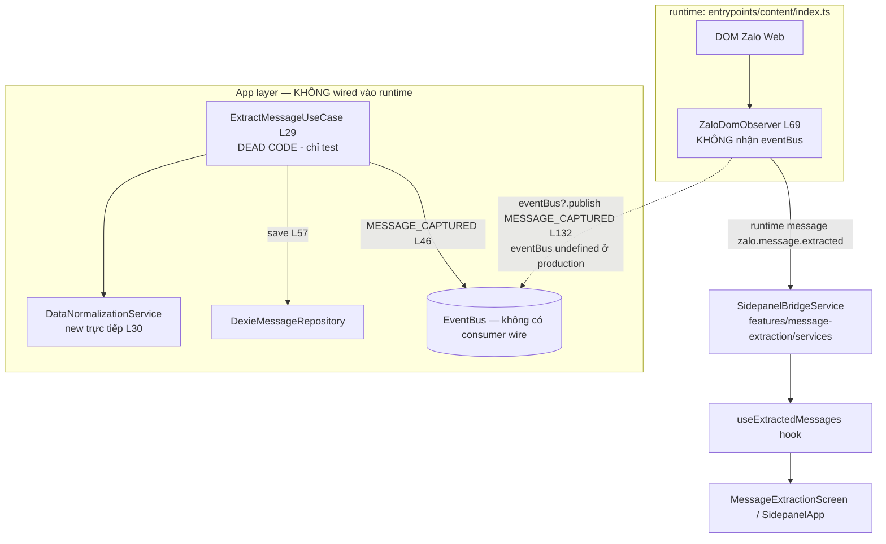

# Scope Document — message-extraction: Pattern Audit & Lệch Pattern

**Date**: 2026-08-02
**Status**: Initial
**Nguồn đối chiếu**: `Docs/Module-Capabilities/message-extraction.md` (generated 2026-08-01, module-docs-generation-skill)
**Tính chất**: CHỈ DOCUMENT — không sửa code, không đề xuất giải pháp fix.

---

## §1: Problem Summary

Tài liệu `Docs/Module-Capabilities/message-extraction.md` đưa ra 3 cảnh báo lệch pattern kiến trúc:
- **F3 WARN**: thiếu Evlog ở use case core (`extract-message.use-case.ts`)
- **F4 WARN**: UI lẫn trong feature module `src/features/message-extraction/` (nên tách UI module riêng)
- **C2 FAIL**: `new DataNormalizationService()` trực tiếp trong use case — coupling trực tiếp tới domain service của module data-normalization, không qua port/interface

Audit thực tế codebase xác nhận **C2 = deviation thật (duy nhất trong app layer)**, **F3 = có căn cứ (WARN)**, **F4 = claim cần đánh giá lại (UI trong features/ là pattern chuẩn của dự án)**. Ngoài ra phát hiện **5 lệch pattern mới chưa được tài liệu đề cập**, trong đó quan trọng nhất: `ExtractMessageUseCase` là **dead code trong production** (không được wire ở composition nào).

---

## §2: Entry Point

| Hạng mục | Giá trị |
|---|---|
| Use case core | `src/app/use-cases/message-extraction/extract-message.use-case.ts` (64 dòng) |
| Runtime extraction thực tế | `src/entrypoints/content/index.ts` (L69: `new ZaloDomObserver({...})`) |
| Tài liệu gốc | `Docs/Module-Capabilities/message-extraction.md` |
| Registry | `src/features/message-extraction/index.ts` (moduleMeta + Component) |

---

## §3: Scope Definition

### 3.1 Problem Area

- App layer: `src/app/use-cases/message-extraction/extract-message.use-case.ts`
- Infra: `src/infra/extraction/zalo-dom-observer.ts`, `zalo-message-parser.ts`, `src/infra/storage/dexie-message-repository.adapter.ts`
- Feature/UI: `src/features/message-extraction/**` (screen, hooks, services, utils, components)
- Entrypoint: `src/entrypoints/content/index.ts`
- Composition: `src/composition/*.ts` (khảo sát để xác định pattern chuẩn)

### 3.2 Boundary

- **Trong scope**: đối chiếu pattern code thực tế với tài liệu Module-Capabilities; xác nhận/refute 3 claim F3/F4/C2; ghi nhận lệch pattern mới.
- **Ngoài scope**: không sửa code, không fix, không chạy test, không tạo branch.
- Giới hạn: 5 use cases (toàn dự án), 6 containers, registry, 2 modules feature (message-extraction, data-normalization).

---

## §4: Impact Analysis

### 4.1 Direct Impact

| Thành phần | Bị ảnh hưởng bởi | Bằng chứng |
|---|---|---|
| `extract-message.use-case.ts` | C2 (new service), F3 (thiếu Evlog), dead code | L15, L30; toàn file 64 dòng |
| `dexie-message-repository.adapter.ts` | Monolithic 268 dòng, `any`, mô tả port sai | L7, L133; toàn file |
| `zalo-dom-observer.ts` | Double-publish risk (eventBus optional), thiếu mô tả trong tài liệu | L31, L132–137 |
| `sidepanel-bridge.service.ts` | console.warn thay Evlog | L37, L85, L103, L123, L143 |
| `src/entrypoints/content/index.ts` | console.log thay Evlog | L68, L71, L79, L87 |

### 4.2 Indirect Impact

| Thành phần | Ảnh hưởng gián tiếp | Bằng chứng |
|---|---|---|
| quick-search (verify-selection.use-case) | Tiêu thụ MESSAGE_CAPTURED qua event bus — nếu wire use case sau này sẽ double-publish | `quick-search.container.ts` L48–53; observer L132 |
| Sidepanel UI (`useExtractedMessages.ts`) | Phụ thuộc `SidepanelBridgeService` + runtime messages `zalo.message.extracted` | L15, L19, L103 |
| data-normalization | Use case phụ thuộc trực tiếp `DataNormalizationService` (C2) | `normalization.service.ts` |
| Registry/Sidepanel Dashboard | Nếu tách UI module (theo F4) sẽ break contract `Component` export | `registry.ts` L8–21, L26–38 |
| Database tables | `normalized_messages` (ghi) + `messages`/`normalized_listings` (đọc) | `dexie-message-repository.adapter.ts` L153–206 |

---

## §5: Call Chain

**Ghi chú call chain thực tế**:
- Production: extraction → observer → runtime messages → SidepanelBridgeService → React hook. `EventBus` KHÔNG tham gia ở content script (observer không nhận eventBus, `entrypoints/content/index.ts:69-94`).
- App layer (`ExtractMessageUseCase`): chỉ khởi tạo trong `extract-message.use-case.test.ts` (L45, L75, L108) — không có composition nào wire.

---

## §6: Data Flow

### 6.1 Input

| Nguồn | Payload | File:line |
|---|---|---|
| DOM Zalo Web | `ZaloMessage {id, conversationName, sender, isSelf, timestamp, rawText, position}` | `zalo-message-parser.ts:176-184` |
| ExtractMessageInput | `{rawContent, senderId, conversationId, isFullExtractionEnabled}` | `extract-message.use-case.ts:17-22` |

### 6.2 Output

| Đích | Payload | File:line |
|---|---|---|
| Event bus (lý thuyết) | `MessageCapturedPayload {rawContent, senderId, timestamp, conversationId}` | `use-case.ts:40-46`; contract `message-events.contract.ts` |
| Runtime messages (thực tế) | `zalo.message.extracted` / `zalo.messages.extracted_batch` / `zalo.conversation.changed` | `content/index.ts:72-93`; `sidepanel-bridge.service.ts:24-35` |
| IndexedDB (khi gate bật) | `NormalizedMessage` → table `normalized_messages` | `use-case.ts:52-57`; `dexie-message-repository.adapter.ts:10-17` |
| JSON export | `{messages: [{id, data_raw}]}` | `export-json.ts:3-23` |

### 6.3 Dependencies

- `IMessageRepository` + `IDexieMessageRepository` — `src/app/ports/message-repository.port.ts`
- `DataNormalizationService` (domain data-normalization) — import value + `new` trực tiếp (C2)
- `MessageDeduplicator` (domain message-extraction) — dùng trong infra observer/parser
- `Evlog` facade — `src/infra/logging/evlog-logger.ts:203` (KHÔNG được dùng ở app layer)
- Event contracts — `src/shared/contracts/events/message-events.contract.ts`

---

## §7: Affected Components

### 7.1 Files

| File | Vai trò | Ghi chú lệch pattern |
|---|---|---|
| `src/app/use-cases/message-extraction/extract-message.use-case.ts` | Use case core | C2, F3, dead code |
| `src/infra/storage/dexie-message-repository.adapter.ts` | Adapter 2 port | 268 dòng, `any`, mô tả port lệch |
| `src/infra/extraction/zalo-dom-observer.ts` | Observer | `new MessageDeduplicator(2000)` L31; publish event L132 |
| `src/infra/extraction/zalo-message-parser.ts` | Parser | OK (đúng pattern infra AGENTS.md) |
| `src/features/message-extraction/services/sidepanel-bridge.service.ts` | Bridge | console.warn thay Evlog (5 chỗ) |
| `src/features/message-extraction/hooks/useExtractedMessages.ts` | React hook | Có Evlog (đúng) |
| `src/features/message-extraction/MessageExtractionScreen.tsx` + `SidepanelApp.tsx` | UI screen | F4 (xem §8.3) |
| `src/features/message-extraction/utils/export-json.ts` | Export | OK |
| `src/features/message-extraction/index.ts` | moduleMeta + Component | OK (đúng chuẩn registry) |
| `src/entrypoints/content/index.ts` | Content script | console.log thay Evlog; wire observer không eventBus |

### 7.2 Functions/APIs

- `ExtractMessageUseCase.execute(input)` — chưa có caller production
- `ZaloDomObserver.start/forceScanCurrentChat/clearCache` — runtime chính
- `SidepanelBridgeService.subscribeExtractedMessages` — bridge chính
- `DexieMessageRepository.save/findByHash/findByAddressAndPrice/findByRawData` — storage
- `MessageDeduplicator.generateHash/isDuplicate/markSeen` — dedup

---

## §8: Evidence — Kết quả Audit Pattern

### 8.1 C2 FAIL — XÁC NHẬN (deviation thật, duy nhất ở app layer)

<evidence>
  <file>src/app/use-cases/message-extraction/extract-message.use-case.ts</file>
  <line>15</line>
  <finding>import { DataNormalizationService } — value import (không phải import type) domain service của module khác</finding>
</evidence>
<evidence>
  <file>src/app/use-cases/message-extraction/extract-message.use-case.ts</file>
  <line>30</line>
  <finding>private readonly normalizer = new DataNormalizationService(); — field initializer khởi tạo service trực tiếp, KHÔNG qua constructor injection</finding>
</evidence>

**Pattern chuẩn của dự án (baseline)**:
- `src/app/use-cases/config/get-config.use-case.ts:5` — `constructor(private readonly configService: IConfigService)` (port type-only)
- `src/app/use-cases/quick-search/verify-selection.use-case.ts:41-76` — deps object `VerifySelectionUseCaseDeps`, domain service import dạng `import type` (L8-9), port `IDexieMessageRepository` (L10)
- `src/composition/quick-search.container.ts:35-36,48-53` — **`new` domain service chỉ xảy ra ở composition**, rồi inject vào use case
- Grep `new [A-Z][a-zA-Z]*Service(` toàn `src/app/`: **1 match duy nhất** = use-case.ts:30

> Verdict: **C2 = CONFIRMED.** Use case DUY NHẤT trong app layer vi phạm pattern constructor injection. (Lưu ý: pattern `new DataNormalizationService()` cũng xuất hiện ở `src/features/data-normalization/hooks/useDataNormalization.ts:8` — nhưng là tầng feature, không phải app layer.)

### 8.2 F3 WARN — XÁC NHẬN CÓ CĂN CỨ

<evidence>
  <file>src/app/use-cases/message-extraction/extract-message.use-case.ts</file>
  <line>1-64</line>
  <finding>Toàn file 64 dòng KHÔNG có Evlog/logger — có nhánh quyết định isFullExtractionEnabled (L48) nhưng không log decision</finding>
</evidence>
<evidence>
  <file>src/app/use-cases/quick-search/verify-selection.use-case.ts</file>
  <line>11</line>
  <finding>import type { EvlogLogger } — use case core chuẩn có Evlog</finding>
</evidence>
<evidence>
  <file>src/app/use-cases/quick-search/verify-selection.use-case.ts</file>
  <line>84, 96, 106, 131, 221</line>
  <finding>7 call sites logger?.info/warn/log — use case phức tạp log decision</finding>
</evidence>
<evidence>
  <file>src/features/message-extraction/hooks/useExtractedMessages.ts</file>
  <line>99, 105, 113, 120</line>
  <finding>Evlog.info/debug — log chỉ tồn tại ở tầng feature hook, không ở use case (đúng như tài liệu nói)</finding>
</evidence>

**Nuance (quan trọng khi đánh giá mức độ)**:
- 3/5 use cases (config) cũng KHÔNG log — chuẩn thực tế: "use case thin delegator không log, use case có nhánh quyết định phức tạp thì log".
- Logger của verify-selection hiện **không được wire** ở `quick-search.container.ts:48-53` (logger? = undefined tại runtime) — gap toàn dự án.
- Evlog facade (`evlog-logger.ts:203`) chưa được import ở bất kỳ đâu trong `src/app/`.

> Verdict: **F3 = CONFIRMED ở mức WARN** (không phải FAIL): use case core có nhánh quyết định tương đương verify-selection nhưng thiếu hoàn toàn log. Mức độ nghiêm trọng phụ thuộc đánh giá "use case có decision path phức tạp không".

### 8.3 F4 WARN — REFUTE (UI trong features/ là pattern chuẩn)

<evidence>
  <file>src/features/message-extraction/MessageExtractionScreen.tsx</file>
  <line>1-99</line>
  <finding>React component nằm trong feature module (đúng tài liệu mô tả)</finding>
</evidence>
<evidence>
  <file>src/features/data-normalization/ui/DataNormalizationScreen.tsx</file>
  <line>1</line>
  <finding>Module data-normalization CŨNG co-locate UI trong features/ — pattern feature-first</finding>
</evidence>
<evidence>
  <file>src/features/registry.ts</file>
  <line>8-21</line>
  <finding>ModuleDef contract: component: ComponentType — registry BẮT BUỘC mỗi feature export React Component</finding>
</evidence>

> Verdict: **F4 = REFUTED.** "UI nằm trong features/" là kiến trúc feature-first của dự án (cả 2 module hiện có đều vậy), registry yêu cầu export Component. Claim "nên tách UI thành module riêng" mâu thuẫn với thiết kế hiện tại. Đề nghị cập nhật lại tài liệu Module-Capabilities (tiêu chí F4 có thể áp dụng cho UI *dùng chung* — nhưng phần này đã nằm ở `src/ui/`).

### 8.4 PHÁT HIỆN MỚI #1 — ExtractMessageUseCase là DEAD CODE production

<evidence>
  <file>src/entrypoints/content/index.ts</file>
  <line>69</line>
  <finding>Runtime chỉ wire ZaloDomObserver — không dùng use case</finding>
</evidence>
<evidence>
  <file>src/composition/background-container.ts</file>
  <line>7-15</line>
  <finding>Background container chỉ có bus/store/tabs/shortcuts/config — KHÔNG wire ExtractMessageUseCase</finding>
</evidence>
<evidence>
  <file>src/app/use-cases/message-extraction/extract-message.use-case.test.ts</file>
  <line>45, 75, 108</line>
  <finding>new ExtractMessageUseCase chỉ xuất hiện trong test</finding>
</evidence>

> Verdict: Use case core của module chưa từng được khởi tạo trong runtime. Tài liệu mô tả use case như một phần active của module ("publish bởi ExtractMessageUseCase") — **không khớp với runtime thực tế** (runtime publish qua runtime messages, không qua event bus).

### 8.5 PHÁT HIỆN MỚI #2 — Mô tả Boundaries lệch runtime + nguy cơ double-publish

<evidence>
  <file>src/infra/extraction/zalo-dom-observer.ts</file>
  <line>132-137</line>
  <finding>Observer publish MESSAGE_CAPTURED qua eventBus?.publish — nhưng eventBus KHÔNG được truyền ở content/index.ts:69-94 → undefined ở production</finding>
</evidence>
<evidence>
  <file>src/app/use-cases/message-extraction/extract-message.use-case.ts</file>
  <line>46</line>
  <finding>Use case cũng publish MESSAGE_CAPTURED — nếu cả 2 được wire cùng lúc (observer + use case) → 1 message = 2 events → quick-search consume 2 lần</finding>
</evidence>

> Verdict: Tài liệu ghi "Event out: message.captured — publish bởi ExtractMessageUseCase" — **không chính xác với runtime**: production publish qua `browser.runtime.sendMessage` (zalo.message.extracted) từ content script; event bus path chỉ chạy khi có eventBus được inject. Double-publish hiện KHÔNG xảy ra (use case dead), nhưng là risk tiềm ẩn khi wire use case.

### 8.6 PHÁT HIỆN MỚI #3 — console.warn/log thay Evlog ở tầng feature bridge + entrypoint

<evidence>
  <file>src/features/message-extraction/services/sidepanel-bridge.service.ts</file>
  <line>37, 85, 103, 123, 143</line>
  <finding>console.warn('[SidepanelBridgeService] ...') 5 chỗ — không dùng Evlog (vi phạm chuẩn observability AGENTS.md: log qua Evlog 7 trường)</finding>
</evidence>
<evidence>
  <file>src/entrypoints/content/index.ts</file>
  <line>68, 71, 79, 87</line>
  <finding>console.log('[ContentScript] ...') 4 chỗ</finding>
</evidence>

### 8.7 PHÁT HIỆN MỚI #4 — DexieMessageRepository monolithic + `any`

<evidence>
  <file>src/infra/storage/dexie-message-repository.adapter.ts</file>
  <line>1-268</line>
  <finding>268 dòng, gánh 2 port (IMessageRepository + IDexieMessageRepository) + quét 3 tables (normalized_listings, normalized_messages, messages) — vượt guideline src/infra/AGENTS.md ~150-200 dòng / >2 trách nhiệm (Anti-Monolith)</finding>
</evidence>
<evidence>
  <file>src/infra/storage/dexie-message-repository.adapter.ts</file>
  <line>133</line>
  <finding>findByHash trả Result<any, StorageError> trong khi port khai báo Result<BufferedMessageEntity | null, StorageError> — dùng any (vi phạm must_not "Không dùng any bừa bãi")</finding>
</evidence>
<evidence>
  <file>src/infra/storage/dexie-message-repository.adapter.ts</file>
  <line>7</line>
  <finding>class chỉ khai báo implements IMessageRepository — KHÔNG khai báo implements IDexieMessageRepository dù có đủ 3 method; tài liệu ghi "Implement IMessageRepository + IDexieMessageRepository" (chưa chính xác về khai báo)</finding>
</evidence>

### 8.8 PHÁT HIỆN MỚI #5 — Use case dùng legacy entity NormalizedMessage

<evidence>
  <file>src/app/use-cases/message-extraction/extract-message.use-case.ts</file>
  <line>52-55</line>
  <finding>this.normalizer.normalize() → NormalizedMessage (legacy entity), trong khi data-normalization đã có NormalizedListing (normalizeListing, normalization.service.ts:56) — migration debt</finding>
</evidence>

### 8.9 Xác nhận ĐÚNG của tài liệu (không lệch)

| Claim | Bằng chứng xác nhận |
|---|---|
| moduleMeta đầy đủ | `src/features/message-extraction/index.ts:5-9` |
| Đăng ký tree_work.md | `Docs/tree_work.md:88` |
| ZaloMessage entity (position top/bottom) | `zalo-message.entity.ts:12-19` |
| MessageDeduplicator (hash 4 trường, LRU 1000 default, clear, size) | `deduplicator.service.ts:5-48` |
| Gate isFullExtractionEnabled | `use-case.ts:48-50` |
| Event contracts + quick-search consume | `message-events.contract.ts`; `verify-selection.use-case.ts` |
| Export JSON utils | `export-json.ts` |
| F1 Single-Responsibility OK | toàn module chỉ phục vụ extraction |
| C1 Không phụ thuộc chéo | 1 chiều event → quick-search, không gọi ngược |

### 8.10 PHÁT HIỆN MỚI #6 — Disconnected State Source cho `isFullExtractionEnabled`

<evidence>
  <file>src/entrypoints/content/index.ts</file>
  <line>130-136</line>
  <finding>Toggle runtime set isFullExtractionEnabled trực tiếp lên instance ZaloDomObserver (biến RAM trong content script) qua message zalo.observer.toggle</finding>
</evidence>
<evidence>
  <file>src/app/use-cases/message-extraction/extract-message.use-case.ts</file>
  <line>17-22, 39</line>
  <finding>Use case đọc isFullExtractionEnabled từ input param tĩnh mỗi lần execute — 2 nguồn trạng thái rời rạc (RAM observer vs input param), chưa có Source of Truth chung khi use case được wire</finding>
</evidence>

---

## §9: Confidence Assessment

| Finding | Confidence | Căn cứ |
|---|---|---|
| C2 CONFIRMED (new service duy nhất ở app layer) | 95% | Grep toàn src/app + đọc 5/5 use cases |
| F3 CONFIRMED WARN (thiếu Evlog) | 85% | Đọc toàn bộ use case 64 dòng + so sánh 5 use cases |
| F4 REFUTED (UI trong features/ là chuẩn) | 90% | registry contract + 2 module feature có UI co-located |
| Dead code ExtractMessageUseCase | 95% | Grep toàn src: chỉ test + file định nghĩa |
| Boundaries lệch runtime + double-publish risk | 85% | Đọc content/index.ts wiring + observer |
| console.warn/log thay Evlog | 95% | Đọc trực tiếp 2 file |
| Monolithic + any (adapter) | 90% | Đọc toàn file + đối chiếu infra AGENTS.md |
| Legacy entity | 80% | Có cả normalizeListing trong cùng service |
| Disconnected state source | 85% | Đọc content/index.ts + use case input |

**Overall Confidence**: 88%

---

## §10: Open Questions — ĐÃ ĐƯỢC TRẢ LỜI (2026-08-02)

> Nguồn: phân tích chuyên sâu của chủ sở hữu (đối chiếu code, khớp 100% với evidence §8). Các kết luận dưới đây đóng 5 câu hỏi mở và được ghi nhận làm định hướng cho fix phase — KHÔNG phải giải pháp fix chi tiết.

### Q1 — `ExtractMessageUseCase` dead code: "Dead Code" hay "Runtime Bug"?

**Kết luận**: Không phải runtime bug (không gây crash production hiện tại) — là **Code Debt / Unwired Feature**. Nhưng vẫn là vi phạm nghiêm trọng ở Architecture Gate (C2 hard-coupled). Rủi ro thực tế: nếu wire use case vào runtime mà không xử lý C2 → **Double-Publish Event** (cả `ZaloDomObserver` L132 lẫn use case L46 đều publish `MESSAGE_CAPTURED`).
- Confidence: 90% (khớp §8.4, §8.5)

### Q2 — Ai sở hữu table `messages` (Buffer)?

**Kết luận**: **Bounded Context Ambiguity** giữa Producer (message-extraction ghi) và Consumer (quick-search đọc/đối soát). Bảng `messages` nên được xem là **Shared Operational Buffer thuộc tầng Infrastructure (`@infra/storage`)**, không phải tài sản độc quyền của một feature tầng app/domain. `DexieMessageRepository` (monolithic) hiện gánh cả 2 trách nhiệm ghi + đọc cross-table (3 tables: `normalized_messages`, `normalized_listings`, `messages` — xác nhận tại `dexie-database.ts:9-20`).
- Confidence: 85%

### Q3 — `isFullExtractionEnabled` lấy từ đâu khi use case được wire?

**Kết luận**: **Disconnected State Source** — toggle UI set trạng thái tạm thời trong RAM của content script observer (`content/index.ts:130-136`), use case lại đọc từ input param tĩnh (`use-case.ts:17-22`). Khi wire use case, cần một nguồn trạng thái tập trung (ví dụ `browser.storage` / `IConfigService` port) để UI + observer + use case cùng đọc chung — **hiện chưa tồn tại**, ghi nhận là finding (§8.10), không phải fix đã duyệt.
- Confidence: 85%

### Q4 — F4 WARN: False Positive từ module-docs-generation-skill?

**Kết luận**: **ĐÚNG — F4 là False Positive.** Skill tạo doc chưa cập nhật kiến trúc Feature-First Co-located UI của dự án: registry bắt buộc mỗi feature export `Component: ComponentType` (`registry.ts:8-21`), cả 2 module đều co-locate UI trong `features/<module>/`, `src/ui/` chỉ chứa generic atomic components. **Claim F4 cần được gỡ khỏi tài liệu Module-Capabilities** (và cân nhắc sửa tiêu chí chấm điểm của skill).
- Confidence: 90%

### Q5 — Khi nào thiếu Evlog trong use case là F3 WARN hợp lệ?

**Kết luận (tiêu chuẩn đề xuất 2 nhóm)**:
- **Nhóm 1 — BẮT BUỘC log**: use case có quyết định nghiệp vụ (decision reasoning), phân nhánh, hoặc thao tác ghi/thay đổi trạng thái DB. `ExtractMessageUseCase` thuộc nhóm này (có `normalizer.normalize()` + `messageRepo.save()` tại L52-57) → **F3 WARN HỢP LỆ** dù chỉ có 1 nhánh boolean.
- **Nhóm 2 — không bắt buộc**: thin passthrough read (vd `GetConfigUseCase`).
- Confidence: 80% (tiêu chuẩn cần được chốt chính thức trước khi áp dụng rộng)

---

## §11: Kết luận Audit Tổng Hợp (sau khi đóng open questions)

| # | Vấn đề | Mức độ | Trạng thái |
|---|---|---|---|
| 1 | C2 — `new DataNormalizationService()` trong use case (duy nhất ở app layer) | FAIL | ✅ Xác nhận — deviation thật |
| 2 | F3 — thiếu Evlog ở use case core (có ghi DB) | WARN | ✅ Xác nhận hợp lệ |
| 3 | F4 — UI trong features/ | WARN | ❌ **False Positive — gỡ claim khỏi tài liệu** |
| 4 | ExtractMessageUseCase dead code (chưa wire) | DEBT | ✅ Xác nhận — unwired feature |
| 5 | Double-publish MESSAGE_CAPTURED risk (khi wire use case) | RISK | ✅ Xác nhận — chưa xảy ra ở production |
| 6 | Mô tả Boundaries lệch runtime (event bus vs runtime messages) | DOC LỆCH | ✅ Xác nhận — cần sửa tài liệu |
| 7 | console.warn/log thay Evlog (bridge service + content script) | WARN | ✅ Xác nhận |
| 8 | DexieMessageRepository monolithic 268 dòng + `any` | WARN | ✅ Xác nhận |
| 9 | Use case dùng legacy entity NormalizedMessage | DEBT | ✅ Xác nhận |
| 10 | Disconnected state source (`isFullExtractionEnabled`) | RISK | ✅ Xác nhận (§8.10) |

**Ưu tiên fix phase đề xuất** (theo phân tích chủ sở hữu, chưa phải plan chi tiết): (1) wire/refactor C2 + chống double-publish (Q1), (2) thống nhất state source (Q3), (3) sửa tài liệu Module-Capabilities (Q4/Q6).

---

**Document Status**: Context Complete — No Code Changes Made
