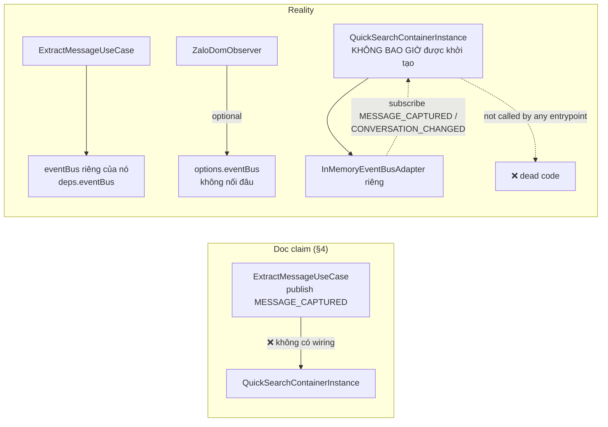

# Scope Document — Quick Search: Pattern Audit & Đối Chiếu Tài Liệu Module-Capabilities

**Date**: 2026-08-02
**Status**: Updated (2026-08-02 — bổ sung resolution cho §10 sau review + bằng chứng git)
**Tài liệu đối chiếu**: `Docs/Module-Capabilities/quick-search.md` (generated_at 2026-08-01, status "verified")
**Phương pháp**: Đối chiếu từng claim trong tài liệu với code thực tế (read file + grep toàn `src/`), trace call chain, map impact, kiểm tra git history.
**Giới hạn**: Chỉ DOCUMENT — không sửa code.

---

## §1: Problem Summary

Tài liệu `quick-search.md` mô tả module Quick Search & DB Verification với trạng thái **"verified"**, nhưng đối chiếu code thực tế cho thấy:

1. Tài liệu ghi nhận **đúng** cấu trúc file, symbol chính, DB schema và 2 WARN pattern (F4, C2).
2. Tài liệu **bỏ sót 9 lệch pattern quan trọng**, trong đó nghiêm trọng nhất: **module là dead code — container không bao giờ được bootstrap từ bất kỳ entrypoint nào**, và **luồng event "ExtractMessageUseCase → QuickSearchContainerInstance" được mô tả trong tài liệu không tồn tại trong code** (2 event bus tách biệt, không có wiring).

Tài liệu đánh giá module "verified" trong khi module **không thể chạy** ở trạng thái hiện tại.

---

## §2: Entry Point

| Vai trò | Đường dẫn |
|---|---|
| Tài liệu cần đối chiếu | `Docs/Module-Capabilities/quick-search.md` |
| Container (điểm gom toàn module) | `src/composition/quick-search.container.ts` |
| Use case trung tâm | `src/app/use-cases/quick-search/verify-selection.use-case.ts` |
| Domain services | `src/domain/quick-search/services/{ring-buffer,message-matcher}.service.ts` |
| Adapter tra cứu DB | `src/infra/storage/dexie-message-repository.adapter.ts` |
| Port contract | `src/app/ports/message-repository.port.ts` |
| UI overlay | `src/ui/controllers/ui-overlay.controller.ts` |

---

## §3: Scope Definition

### 3.1 Problem Area

Toàn bộ feature quick-search: `src/domain/quick-search/**`, `src/app/use-cases/quick-search/**`, `src/composition/quick-search.container.ts`, phần quick-search trong `src/app/ports/message-repository.port.ts` (IDexieMessageRepository), `src/infra/storage/dexie-message-repository.adapter.ts` (findBy*), `src/infra/storage/dexie-database.ts` (table `messages`), `src/ui/controllers/ui-overlay.controller.ts`, `src/infra/listeners/dom-selection.listener.ts`.

### 3.2 Boundary

- **Trong scope**: Đối chiếu claim doc ↔ code; ghi nhận lệch pattern; không đề xuất cách fix (chỉ ghi nhận hiện trạng + tác động).
- **Ngoài scope**: `src/config/shortcuts.config.ts` (chỉ liên quan gián tiếp, xem Open Questions), module message-extraction, data-normalization (chỉ dùng làm baseline pattern so sánh).

---

## §4: Impact Analysis

### 4.1 Direct Impact (claim doc sai hoặc thiếu, ảnh hưởng độ tin cậy tài liệu)

| # | Lệch pattern | Mức độ |
|---|---|---|
| D1 | Module **không bao giờ được bootstrap** — dead code toàn bộ | 🔴 Nghiêm trọng |
| D2 | Luồng event doc mô tả (§4) **không tồn tại** — bus cô lập, không wiring | 🔴 Nghiêm trọng |
| D3 | Step 1 "Khớp Địa chỉ + Giá tiền" **luôn dead** (gọi `null, null, rawContent`) | 🟠 Cao |
| D7 | 3/5 nhóm UI action bị **drop im lặng** trong container | 🟠 Cao |
| D5 | Adapter trả `Result<any, ...>` — phá type contract của port | 🟡 Trung bình |

### 4.2 Indirect Impact (vi phạm quy chuẩn AGENTS.md / convention codebase)

| # | Lệch pattern | Mức độ |
|---|---|---|
| D4 | `@app` import `@infra` (EvlogLogger) — duy nhất trong `src/app`, vi phạm ranh giới layer | 🟡 Trung bình |
| D6 | `implements` clause thiếu `IDexieMessageRepository` (chỉ structural) | 🟡 Trung bình |
| D8 | Không có alias `@ui` — import UIOverlayController bằng relative path, lệch convention | 🟡 Trung bình |
| D9 | Mixed import style: port/adapter/db dùng relative, use case dùng alias | 🟢 Thấp |

### 4.3 Đánh giá chung

- Doc đúng 10/10 về **cấu trúc file & symbol** (xác nhận bằng read).
- Doc **sai 1 luồng dữ liệu quan trọng** (D2) và **thiếu 9 phát hiện** (D1–D9).
- Kết luận doc "status: verified" **không phản ánh trạng thái vận hành thực tế** (module không chạy được).

---

## §5: Call Chain

Chain nội bộ (nếu được bootstrap):
`DOMSelectionListener (debounce 150ms) → VerifySelectionUseCase.execute → MessageMatcherService.match/extractOnTheFlyFromDOM → RingBufferService.getSnapshot → DexieMessageRepository.findByAddressAndPrice → findByRawData → findByHash → UIOverlayController.showCenterAlert/showSuccessToast`

---

## §6: Data Flow

### 6.1 Input
- `MessageCapturedPayload` — chỉ tới bus nội bộ container; **không nguồn publish nào tồn tại** (D2).
- `ConversationChangedPayload` — tương tự, không nguồn publish.
- `VerifySelectionPayload {selectionText, targetElement?: HTMLElement | null}` — từ DOMSelectionListener.

### 6.2 Output
- `VerifySelectionResponse` union (7 variants) → container chỉ render 2: `SHOW_CENTER_ALERT_MODAL`, `SHOW_SUCCESS_TOAST` (D7).
- 5 variants còn lại (`SILENT_PASS_THROUGH`, `SILENT_IDLE`, `SHOW_TOAST_WARNING`, `SHOW_TOAST_INFO`, `SHOW_TOAST_ERROR`) bị nuốt im lặng.

### 6.3 Dependencies
- `IDexieMessageRepository` → `DexieMessageRepository` (chưa bao giờ được instantiate — `new DexieMessageRepository` không xuất hiện ở đâu trong `src/`).
- `DexieMessageRepository` → `QuickZaloDexieDB` v3 (`dexieDb` singleton), table `messages: '&id, &hash, conversationId, capturedAt'` (đúng với doc §3).
- Step 1 `findByAddressAndPrice(null, null, rawContent)` → adapter: cả 3 nhánh (`normalized_listings`, `normalized_messages`, `messages`) đều có `(address ? addrOk : false)` ⇒ **luôn `{found: false}`** khi address = null (D3).

---

## §7: Affected Components

### 7.1 Files

| File | Vai trò | Liên quan lệch pattern |
|---|---|---|
| `src/composition/quick-search.container.ts` | Container DI | D1, D2, D7, D8 |
| `src/app/use-cases/quick-search/verify-selection.use-case.ts` | Use case verify | D3, D4 |
| `src/infra/storage/dexie-message-repository.adapter.ts` | Adapter tra cứu | D5, D6 |
| `src/app/ports/message-repository.port.ts` | Port contract | D5, D9 |
| `src/domain/quick-search/services/message-matcher.service.ts` | Matcher | C2 (doc đã nêu), D9 |
| `src/domain/quick-search/services/ring-buffer.service.ts` | Ring buffer | — (đúng doc) |
| `src/domain/quick-search/entities/buffered-message.entity.ts` | Entity | — (đúng doc) |
| `src/infra/storage/dexie-database.ts` | Dexie schema | D9 (relative import) |
| `src/ui/controllers/ui-overlay.controller.ts` | UI overlay | F4 (doc đã nêu), D7, D8 |
| `src/features/registry.ts` | Feature registry | Thiếu quick-search (doc đã nêu) |

### 7.2 Functions/APIs
- `bootstrapQuickSearchContainer` — không caller (D1).
- `VerifySelectionUseCase.execute` — không caller ngoài container (D1).
- `findByAddressAndPrice` — gọi với tham số null/null làm mất tác dụng (D3).
- `findByHash` — signature `Result<any, ...>` lệch port (D5).

---

## §8: Evidence

<evidence>
  <file>src/composition/quick-search.container.ts</file>
  <line>109</line>
  <finding>D1: bootstrapQuickSearchContainer chỉ được khai báo; grep toàn src/ cho bootstrapQuickSearchContainer|isQuickSearchContainerInitialized|getQuickSearchContainerInstance → 3 matches, tất cả nằm trong chính file này. Không entrypoint nào (content/background/sidepanel) gọi.</finding>
</evidence>

<evidence>
  <file>src/composition/quick-search.container.ts</file>
  <line>34</line>
  <finding>D2: container tạo InMemoryEventBusAdapter PRIVATE riêng (this.eventBus) và subscribe MESSAGE_CAPTURED (line 56) / CONVERSATION_CHANGED (line 71) trên bus đó — không ai publish vào bus này.</finding>
</evidence>

<evidence>
  <file>src/app/use-cases/message-extraction/extract-message.use-case.ts</file>
  <line>46</line>
  <finding>D2: ExtractMessageUseCase publish MESSAGE_CAPTURED lên `this.deps.eventBus` (bus được inject riêng) — không phải bus của quick-search container. Doc §4 mô tả luồng "ExtractMessageUseCase publish → QuickSearchContainerInstance subscribe" là không tồn tại trong code.</finding>
</evidence>

<evidence>
  <file>src/infra/extraction/zalo-dom-observer.ts</file>
  <line>106</line>
  <finding>D2: ZaloDomObserver publish lên `this.options.eventBus?` (optional, không nối vào quick-search bus).</finding>
</evidence>

<evidence>
  <file>src/app/use-cases/quick-search/verify-selection.use-case.ts</file>
  <line>144</line>
  <finding>D3: gọi `findByAddressAndPrice(null, null, matchedEntity.rawContent)` — address=null, priceNumeric=null.</finding>
</evidence>

<evidence>
  <file>src/infra/storage/dexie-message-repository.adapter.ts</file>
  <line>163</line>
  <finding>D3: logic match `return (address ? addrOk : false) && (priceText || priceNumeric ? priceOk : false);` — khi address null thì luôn false. Cùng cấu trúc tại line 180 (normalized_messages) và line 197 (messages buffer). ⇒ findByAddressAndPrice(null,null,X) LUÔN trả {found:false}; Step 1 trong doc §2 ("khớp Địa chỉ + Giá tiền") là dead logic.</finding>
</evidence>

<evidence>
  <file>src/app/use-cases/quick-search/verify-selection.use-case.ts</file>
  <line>11</line>
  <finding>D4: `import type { EvlogLogger } from '@infra/logging/evlog-logger'` — use case DUY NHẤT trong src/app import từ @infra (grep `import.*@infra` trong src/app chỉ 1 file). Vi phạm AGENTS.md: "app/: Chỉ import domain, shared, và ports". Use case khác (ExtractMessageUseCase) không dùng logger — quick-search tạo pattern riêng.</finding>
</evidence>

<evidence>
  <file>src/infra/storage/dexie-message-repository.adapter.ts</file>
  <line>133</line>
  <finding>D5: `findByHash(hash: string): Promise<Result<any, StorageError>>` — lệch port `Result<BufferedMessageEntity | null, StorageError>` (message-repository.port.ts:54). Vi phạm must_not "Không dùng any bừa bãi". Typecheck vẫn pass do structural typing (any assignable) nên lệch này không bị binary gate bắt.</finding>
</evidence>

<evidence>
  <file>src/infra/storage/dexie-message-repository.adapter.ts</file>
  <line>7</line>
  <finding>D6: `export class DexieMessageRepository implements IMessageRepository` — declaration chỉ khai báo IMessageRepository, không khai báo IDexieMessageRepository. Doc §5 claim "1 class duy nhất implement 2 port" chỉ đúng về structural typing, không đúng khai báo tường minh.</finding>
</evidence>

<evidence>
  <file>src/composition/quick-search.container.ts</file>
  <line>83</line>
  <finding>D7: container chỉ xử lý `SHOW_CENTER_ALERT_MODAL` (line 85-86) và `SHOW_SUCCESS_TOAST` (line 87-88). Các action SHOW_TOAST_WARNING (use case line 111), SHOW_TOAST_INFO (line 136), SHOW_TOAST_ERROR (line 151, 175, 197) bị drop im lặng. UIOverlayController cũng không có method showToastWarning/Info/Error (chỉ showCenterAlert/showSuccessToast/mountModeBadge).</finding>
</evidence>

<evidence>
  <file>src/composition/quick-search.container.ts</file>
  <line>11</line>
  <finding>D8: `import { UIOverlayController } from '../ui/controllers/ui-overlay.controller'` — relative path vì wxt.config.ts KHÔNG khai báo alias @ui (7 aliases: @config, @domain, @app, @infra, @shared, @features, @composition). Toàn src chỉ có 1 import từ ui layer (file này).</finding>
</evidence>

<evidence>
  <file>src/app/ports/message-repository.port.ts</file>
  <line>1</line>
  <finding>D9: port dùng relative import (`../../domain/...`, `../../shared/...`) trong khi use cases dùng aliases (`@shared`, `@domain`, `@infra`). Tương tự: dexie-message-repository.adapter.ts (line 1-5), dexie-database.ts (line 2-6).</finding>
</evidence>

<evidence>
  <file>src/features/registry.ts</file>
  <line>26</line>
  <finding>Xác nhận doc: MODULES chỉ có message-extraction + data-normalization; không có quick-search. `src/features/quick-search/` không tồn tại (glob).</finding>
</evidence>

<evidence>
  <file>Docs/tree_work.md</file>
  <line>89</line>
  <finding>Xác nhận doc: `quick-search/ # Quick Search & DB Verification Feature Module (RAM Buffer & 2-Step DB Check)` — tree khai báo nhưng thư mục features/quick-search không tồn tại.</finding>
</evidence>

<evidence>
  <file>src/infra/storage/dexie-database.ts</file>
  <line>20</line>
  <finding>Xác nhận doc §3: `messages: '&id, &hash, conversationId, capturedAt'` trong QuickZaloExtensionDB v3 — chính xác.</finding>
</evidence>

<evidence>
  <file>src/domain/quick-search/services/message-matcher.service.ts</file>
  <line>12</line>
  <finding>Xác nhận doc §7 C2 WARN: `targetElement: HTMLElement | null` trong domain (thêm line 21, 59, 64). Ngoài ra app layer cũng chạm DOM type: verify-selection.use-case.ts:22 `targetElement?: HTMLElement | null` — doc chỉ nêu domain.</finding>
</evidence>

<evidence>
  <file>src/composition/quick-search.container.ts</file>
  <line>93</line>
  <finding>Xác nhận doc §3: `options.debounceMs ?? 150` — DOMSelectionListener debounce 150ms.</finding>
</evidence>

---

## §9: Confidence Assessment

| Phát hiện | Confidence | Căn cứ |
|---|---|---|
| D1 (dead code) | 92% | Grep toàn src, đọc entrypoints content/background/sidepanel |
| D2 (bus cô lập) | 90% | Đọc 3 nơi publish + subscribe; không tìm thấy wiring |
| D3 (Step 1 dead) | 90% | Đọc call site + 3 nhánh logic adapter |
| D4 (app→infra import) | 92% | Grep toàn src/app + AGENTS.md boundary |
| D5 (any) | 95% | Đọc trực tiếp 2 file |
| D6 (implements thiếu port) | 90% | Đọc declaration |
| D7 (drop UI action) | 90% | Đọc container + union type + UIOverlayController |
| D8 (không @ui alias) | 92% | Đọc wxt.config.ts |
| D9 (mixed import) | 70% | Phụ thuộc diễn giải; AGENTS.md không bắt buộc alias nhưng định nghĩa aliases — flag uncertainty |
| Claims doc đúng (structure/schema) | 95% | Read trực tiếp |

**Overall Confidence: 90%** — vượt ngưỡng 60%, proceed to generate doc.

---

## §10: Open Questions — ĐÃ GIẢI QUYẾT (Resolution sau review 2026-08-02)

### ✅ Q1. `QUICK_SEARCH_CONTACT` trong phím tắt có liên quan Quick Search module không?

**RESOLVED — Không liên quan. Naming Collision.**

- `src/config/shortcuts.config.ts:10,49-53` — `QUICK_SEARCH_CONTACT: 'quick-search-contact'`, mô tả "Mở ô tìm kiếm nhanh khách hàng trên Zalo", phím `Alt+Shift+F`.
- `src/entrypoints/background/index.ts:39-48` — khi bấm, Service Worker gửi `{ type: 'SHORTCUT_FOCUS_SEARCH' }` tới tab active — **UI Automation Shortcut** (focus ô tìm kiếm Zalo Web), hoàn toàn khác động cơ Selection Verification & DB 2-Step Check của module `quick-search`.
- **Phát hiện bổ sung (ngoài phạm vi quick-search, đáng ghi nhận)**: `SHORTCUT_FOCUS_SEARCH` chỉ xuất hiện đúng 1 lần trong toàn `src/` (background/index.ts:43 — phía gửi). Content script `src/entrypoints/content/index.ts:107-150` **không có handler** cho message này ⇒ phím tắt Alt+Shift+F hiện **không làm gì** (signal gửi đi nhưng không nơi xử lý).
- Confidence: 95% (verify 2 file + grep toàn src).

<evidence>
  <file>src/config/shortcuts.config.ts</file>
  <line>49</line>
  <finding>Q1: 'quick-search-contact' — "Mở ô tìm kiếm nhanh khách hàng trên Zalo" (Alt+Shift+F) — là shortcut UI automation, không phải module quick-search.</finding>
</evidence>

<evidence>
  <file>src/entrypoints/background/index.ts</file>
  <line>43</line>
  <finding>Q1: gửi SHORTCUT_FOCUS_SEARCH tới tab active; grep toàn src chỉ 1 match (phía gửi) — content script không có handler nhận message này.</finding>
</evidence>

### ✅ Q2. Trạng thái "verified" ↔ thực tế Dead Code

**RESOLVED — Module là WIP bỏ quên ở bước Wiring (không phải lỗi tài liệu cô lập).**

- `bootstrapQuickSearchContainer()` không được gọi từ entrypoint nào (D1); registry chỉ có 2 modules (evidence §8).
- Git history xác nhận: 2 commits duy nhất liên quan — `8874504` `feat(quick-search): implement quick search verification and message extraction specs` (file được tạo tại `src/app/features/quick-search/use-cases/`) và `829371b` `refactor(app): standardize application layer structure and relocate use cases` (di dời sang `src/app/use-cases/quick-search/`). **Không có commit nào thực hiện wiring vào entrypoint/registry.**
- Tài liệu "verified" đánh giá theo tồn tại vật lý của file/symbol, không kiểm thử luồng bootstrap & event wiring.
- **Ý nghĩa**: cần Issue/Task chính thức để (a) wire container vào content script, (b) đăng ký feature registry — **tuy nhiên đây là bước fix, nằm ngoài phạm vi document này**.
- Confidence: 95% (git log + grep).

<evidence>
  <file>git history</file>
  <line>8874504</line>
  <finding>Q2: commit đầu tiên tạo use case tại src/app/features/quick-search/use-cases/verify-selection.use-case.ts; commit 829371b chỉ relocate — không commit nào wire container vào entrypoint.</finding>
</evidence>

### ✅ Q3. Step 1 "Khớp Địa chỉ + Giá" luôn `null, null` — ý định ban đầu?

**RESOLVED — `null, null` tồn tại NGAY TỪ commit đầu tiên; không có lịch sử parse address/price.**

- `git show 8874504:./src/app/features/quick-search/use-cases/verify-selection.use-case.ts:144` — call `findByAddressAndPrice(null, null, matchedEntity.rawContent)` giống hệt hiện trạng ⇒ **không phải regression do refactor**, đây là Stub/Placeholder cố hữu từ spec đầu.
- **Giả thuyết intent (chưa có bằng chứng code/history)**: port signature thiết kế 3 tham số (`address`, `priceNumeric`, `priceText`) gợi ý ý định đối soát theo Địa chỉ + Giá đã parse — nhưng không có parser nào trong module trích xuất address/price từ selection text. Đánh dấu **plausible, chưa xác nhận**.
- Tác động (đã nêu D3): Step 1 luôn trả `{found:false}` → dead logic; toàn bộ việc đối chiếu phụ thuộc Step 2/2b (raw/hash).
- Confidence: 92% (git show xác nhận hiện trạng từ đầu); phần "intent" 65% — là suy luận từ signature.

<evidence>
  <file>git show 8874504</file>
  <line>144</line>
  <finding>Q3: tại commit gốc, use case đã gọi findByAddressAndPrice(null, null, matchedEntity.rawContent) — stub tồn tại từ spec đầu tiên, không có bước parse address/price nào từng tồn tại trong git history.</finding>
</evidence>

### ✅ Q4. Các `SHOW_TOAST_*` bị drop — cố ý hay thiếu sót?

**RESOLVED — Partial Implementation (thiếu sót, không cố ý).**

- Use case thiết kế đủ 7 variants response (union type, verify-selection.use-case.ts:25-39) với message tiếng Việt đầy đủ (IF-03 warning line 111-115, IF-04 info line 136-140, 3× error DB line 151-155/175-179/197-201) — rõ ràng có ý định hiển thị.
- Container chỉ xử lý 2 nhánh (quick-search.container.ts:83-90); `UIOverlayController` không có method `showToastWarning/Info/Error` (chỉ showCenterAlert/showSuccessToast/mountModeBadge — ui-overlay.controller.ts:37-156).
- ⇒ Kiến trúc Use Case hoàn chỉnh nhưng tầng UI/Container mới hoàn thành 2/5 kịch bản hiển thị (Happy Path + Full Alert).
- Confidence: 92% (đối chiếu union type + container + controller).

### ✅ Q5. `findByAddressAndPrice` dùng `toArray()` đọc toàn bộ bảng?

**RESOLVED — Đúng, toàn bộ 6 chỗ đọc `toArray()` + filter JS; rủi ro hiệu năng dài hạn.**

- `dexie-message-repository.adapter.ts:153` (`normalized_listings.toArray()`), `:175` (`normalized_messages.toArray()`), `:192` (`messages.toArray()`); tương tự `findByRawData` tại `:222`, `:236`, `:250`. Không dùng index `where(...)`/`equals(...)` cho tra cứu nội dung (chỉ `findByHash:135` dùng index `&hash`).
- Đánh giá rủi ro: ngắn hạn (dev, vài trăm bản ghi) — chấp nhận được, vài ms; dài hạn (hàng nghìn bản ghi, chạy trong Content Script mỗi lần bôi đen) — tốn RAM/GC, `.filter()` đồng bộ trên main thread có thể gây khựng UI Zalo. Ghi nhận là observation hiệu năng, không phải lệch pattern kiến trúc.
- Confidence: 95% (đọc trực tiếp 6 call site).

---

## §11: Bổ sung sau review (2026-08-02)

| # | Phát hiện mới | Bằng chứng | Confidence |
|---|---|---|---|
| R1 | `SHORTCUT_FOCUS_SEARCH` (Alt+Shift+F) gửi từ background nhưng **không có handler trong content script** — phím tắt tìm kiếm khách hàng hiện vô tác dụng | background/index.ts:43 (duy nhất 1 match trong src) | 92% |
| R2 | Git history xác nhận quick-search chưa bao giờ qua bước wiring (chỉ 2 commits: tạo feature + relocate) | `git log --oneline --all -- src/domain/quick-search src/app/use-cases/quick-search src/composition/quick-search.container.ts` | 95% |
| R3 | `null, null` trong Step 1 là stub nguyên gốc từ commit đầu, không phải regression | `git show 8874504:./src/app/features/quick-search/use-cases/verify-selection.use-case.ts` | 92% |

---

**Document Status**: Context Complete — No Code Changes Made
