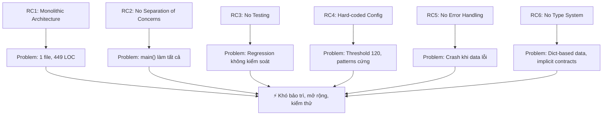
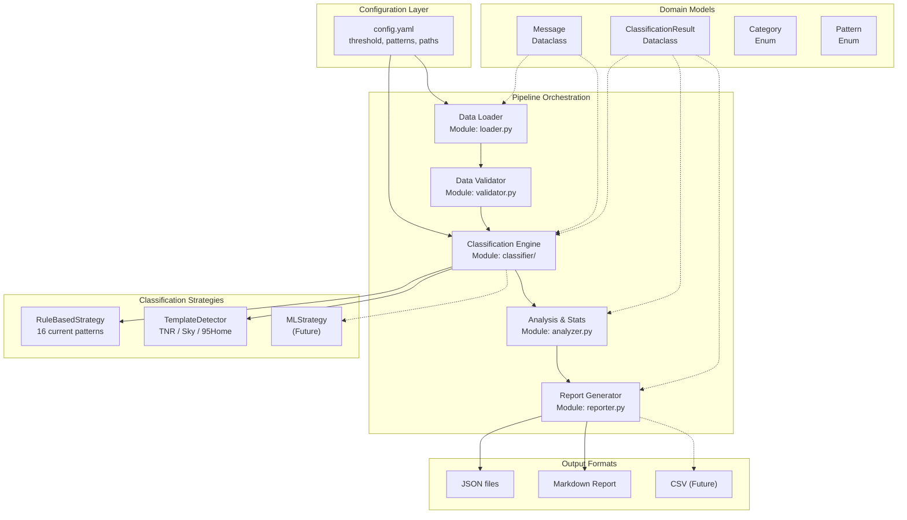
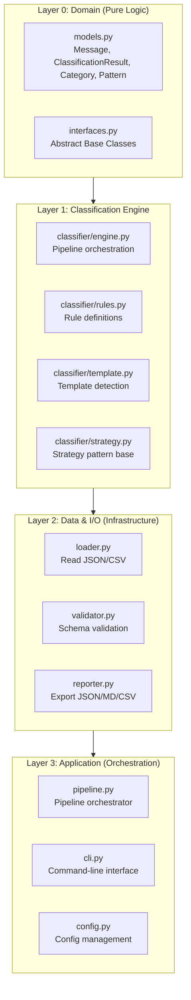
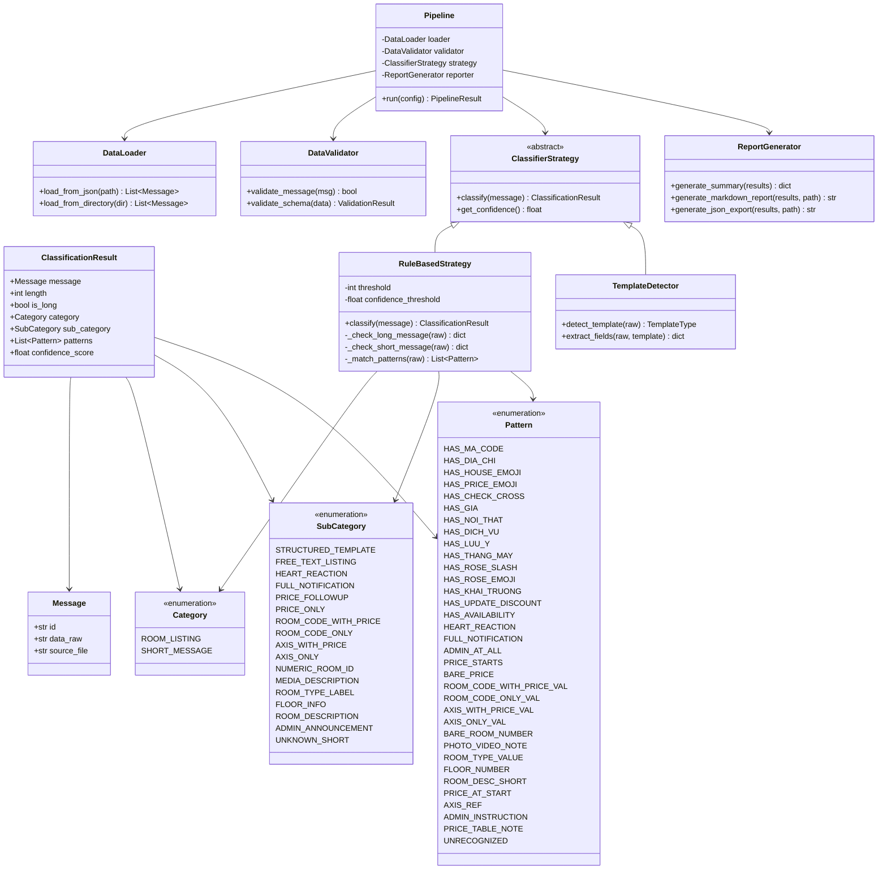
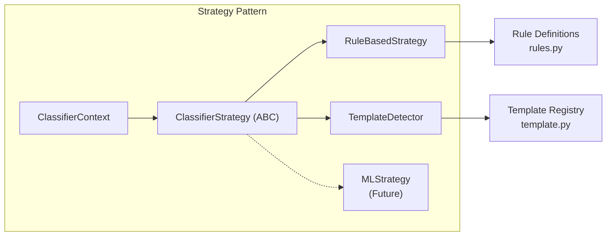
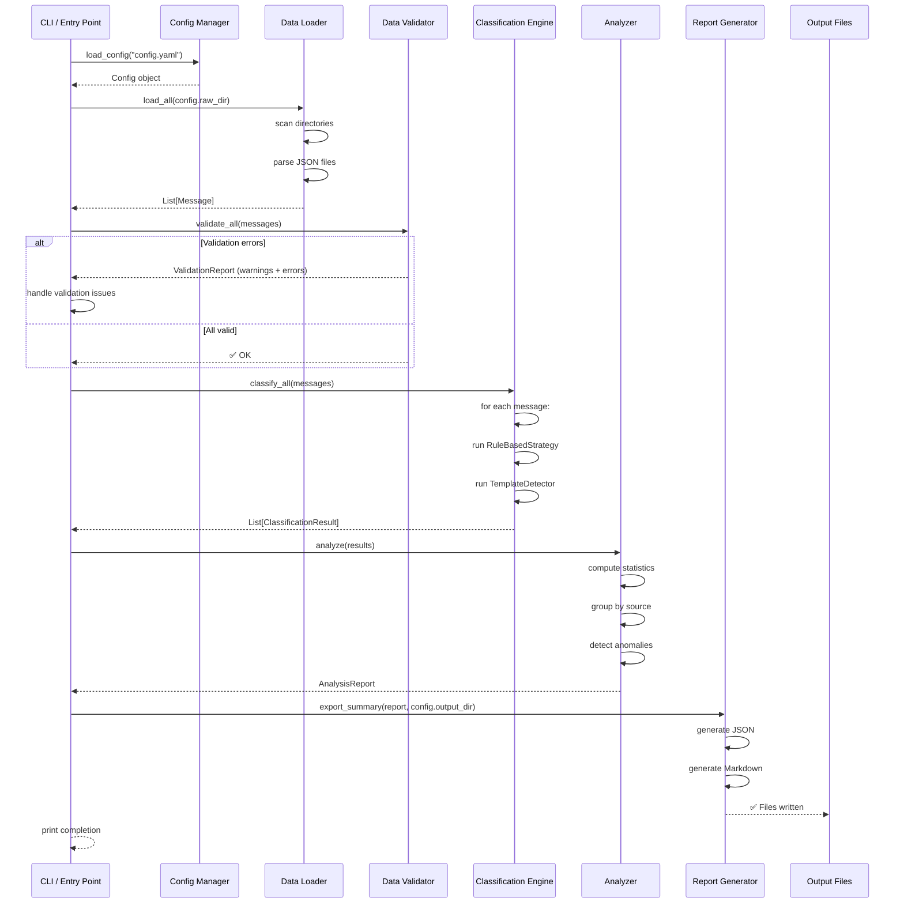
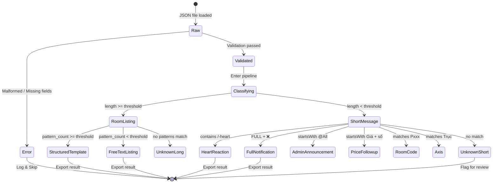
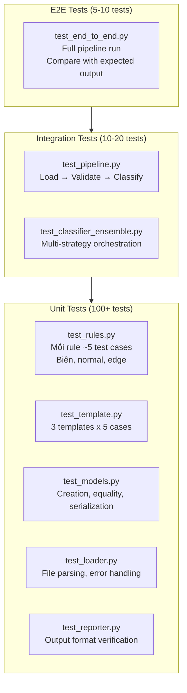
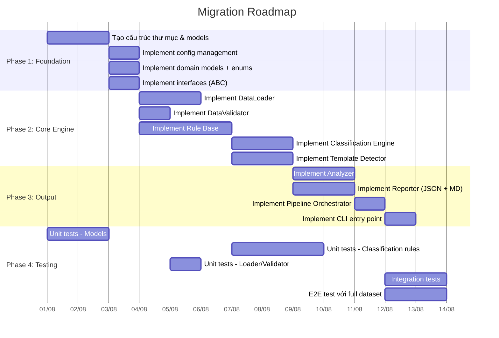
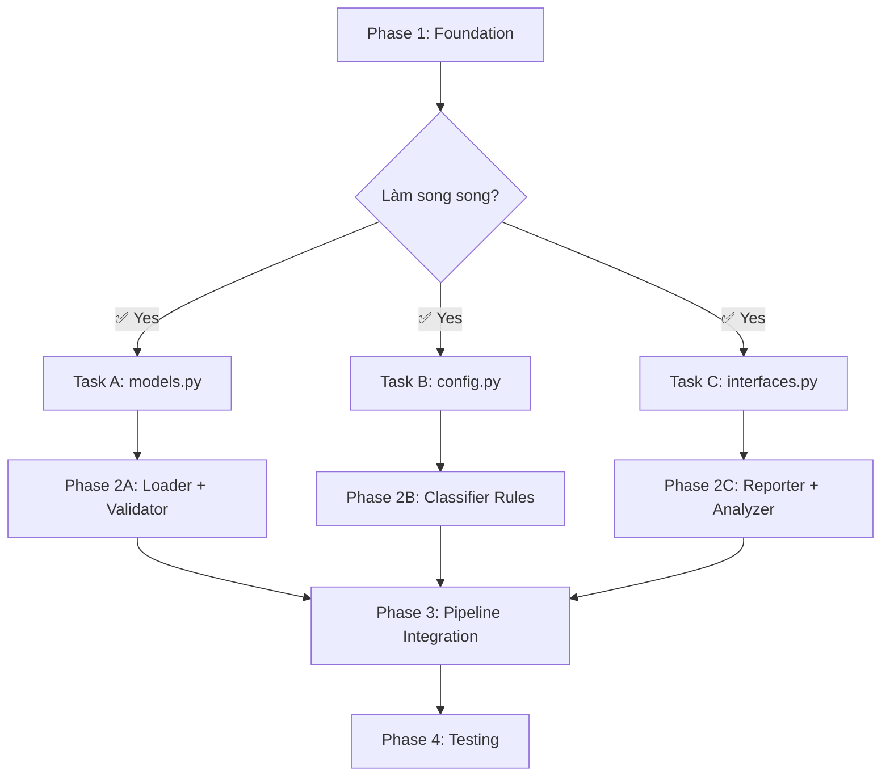

# Đề Xuất Tái Thiết Kế Kiến Trúc — Hệ Thống Phân Loại Tin Nhắn Zalo

**Phiên bản**: 1.0  
**Ngày**: 2026-07-29  
**Mục đích**: Tài liệu phân tích và đề xuất kiến trúc mới cho chức năng phân loại tin nhắn Zalo

---

## Mục Lục

1. [Vấn Đề & Root Cause](#1-vấn-đề--root-cause)
2. [Nguyên Lý Thiết Kế](#2-nguyên-lý-thiết-kế)
3. [Kiến Trúc Đề Xuất](#3-kiến-trúc-đề-xuất)
4. [Component Breakdown](#4-component-breakdown)
5. [Data Flow](#5-data-flow)
6. [Classification Pipeline](#6-classification-pipeline)
7. [Cấu Trúc Thư Mục](#7-cấu-trúc-thư-mục)
8. [Chiến Lược Testing](#8-chiến-lược-testing)
9. [Roadmap Migration](#9-roadmap-migration)

---

## 1. Vấn Đề & Root Cause

### 1.1 Vấn Đề Hiện Tại

Hệ thống hiện tại (`classify_messages.py`, 449 dòng) là **monolithic script** với 3 vấn đề lớn:

1. **🏗️ Kiến trúc**: Mọi thứ trong 1 file — data loading, classification, EDA, export, reporting
2. **🧪 Testability**: 0% unit test coverage. Hàm `classify_message()` (164 dòng, 17 if/elif) không thể test riêng
3. **🔧 Maintainability**: 213 dòng trong `main()` làm 4+ responsibilities. Pattern matching cứng (16 regex inline)

### 1.2 Root Causes



---

## 2. Nguyên Lý Thiết Kế

### 2.1 Architecture Principles

| Nguyên lý                  | Áp dụng                                                              |
| -------------------------- | -------------------------------------------------------------------- |
| **Single Responsibility**  | Mỗi module một nhiệm vụ duy nhất                                     |
| **Separation of Concerns** | Tách data loading, classification, reporting                         |
| **Dependency Inversion**   | Core classification logic không phụ thuộc vào input/output format    |
| **Strategy Pattern**       | Classification strategy có thể swap (rule-based → ML-based)          |
| **Pipeline Architecture**  | Data flow qua các stage rõ ràng: Load → Validate → Classify → Export |
| **Configurable**           | Threshold, patterns, paths từ config file                            |
| **Testable by Design**     | Mỗi module có thể unit-test độc lập                                  |

### 2.2 Module Size Constraints

- Mỗi file: ≤ 200 LOC (trừ config/data files)
- Mỗi class/hàm: ≤ 30 LOC
- Mỗi file test: tương ứng 1:1 với source module

---

## 3. Kiến Trúc Đề Xuất

### 3.1 Tổng Quan



### 3.2 Layered Architecture



### 3.3 Class Diagram



---

## 4. Component Breakdown

### 4.1 Domain Models (`models.py`)

```python
# Mục đích: Định nghĩa data contracts cho toàn bộ hệ thống
# Không phụ thuộc vào bất kỳ module nào khác
# Dùng dataclass + enum để type-safe

@dataclass
class Message:
    id: str
    data_raw: str
    source_file: str

@dataclass
class ClassificationResult:
    message: Message
    length: int
    is_long: bool
    category: Category
    sub_category: SubCategory
    patterns: list[Pattern]
    confidence_score: float
    metadata: dict  # extra info

class Category(Enum):
    ROOM_LISTING = "room_listing"
    SHORT_MESSAGE = "short_message"

class SubCategory(Enum):
    STRUCTURED_TEMPLATE = "structured_template"
    FREE_TEXT_LISTING = "free_text_listing"
    # ... tất cả sub-categories còn lại

class Pattern(Enum):
    HAS_MA_CODE = "has_ma_code"
    HAS_DIA_CHI = "has_dia_chi"
    # ... tất cả patterns còn lại
```

**Lợi ích**:

- Type safety thay vì dict-based (ngăn typo như `result['category']` vs `result['catgeory']`)
- IDE auto-complete
- Dễ dàng thêm field mới

### 4.2 Classification Strategies (`classifier/`)



**Key Design Decisions**:

1. **Strategy Pattern**: Cho phép thêm classification method mới mà không sửa core logic
2. **Confidence Scoring**: Mỗi strategy trả về confidence score thay vì boolean
3. **Template Detection**: Detect template type (TNR/Sky/95Home) trước khi phân tích chi tiết
4. **Composable**: Có thể kết hợp nhiều strategies (ensemble)

### 4.3 Rule-Based Strategy Cải Tiến

```python
# Thay vì 17 if/elif, dùng registry pattern:
RULES: list[ClassificationRule] = [
    LengthBasedThreshold(threshold=120),
    TemplateMatchRule(name="tnr_standard", patterns=[has_ma_code, has_dia_chi, ...]),
    TemplateMatchRule(name="sky_rose", patterns=[has_rose_slash, has_dia_chi, ...]),
    TemplateMatchRule(name="home_95", patterns=[has_rose_emoji, has_commission_percent, ...]),
    HeartReactionRule(),
    FullNotificationRule(),
    PriceFollowupRule(),
    AdminAnnouncementRule(),
    # ... mỗi sub-category là một rule riêng
]

class RuleBasedStrategy:
    def classify(self, message: Message) -> ClassificationResult:
        matching_rules = []
        for rule in self.rules:
            if rule.matches(message):
                matching_rules.append(rule)
                if rule.is_terminal:  # short-circuit cho pattern độc quyền
                    break

        return self._aggregate_results(message, matching_rules)
```

**Lợi ích**:

- Thêm/bớt rule không sửa core engine
- Mỗi rule có test riêng
- Confidence scoring tổng hợp từ nhiều rules
- Short-circuit cho terminal rules (/-heart, @All)

---

## 5. Data Flow

### 5.1 Pipeline Chi Tiết



### 5.2 State Transition cho Mỗi Message



---

## 6. Classification Pipeline

### 6.1 Pipeline Architecture

```python
# pipeline.py — Pipeline orchestrator (SRP)
class ClassificationPipeline:
    def __init__(self, config: Config):
        self.loader = DataLoader()
        self.validator = DataValidator()
        self.strategy = RuleBasedStrategy(config)
        self.analyzer = MessageAnalyzer()
        self.reporter = ReportGenerator(config)

    def run(self) -> PipelineResult:
        # Stage 1: Load
        messages = self.loader.load_all(self.config.raw_dir)

        # Stage 2: Validate
        report = self.validator.validate_all(messages)
        if report.has_errors:
            logger.warning(f"Validation: {len(report.errors)} errors")

        # Stage 3: Classify
        results = [self.strategy.classify(m) for m in messages]

        # Stage 4: Analyze
        analysis = self.analyzer.analyze(results)

        # Stage 5: Export
        self.reporter.export_all(results, analysis)

        return PipelineResult(
            total=len(messages),
            classified=len(results),
            categories=analysis.category_distribution,
            duration=...
        )
```

### 6.2 Confidence Scoring

```python
@dataclass
class ClassificationResult:
    # ... (other fields)
    confidence_score: float  # 0.0 - 1.0
    sub_category_alternatives: list[tuple[SubCategory, float]]

# Scoring logic mới:
# - pattern_count >= 4: confidence = 0.9 + (pattern_count / 100)
# - pattern_count = 2-3: confidence = 0.6 + (pattern_count / 10)
# - pattern_count = 1: confidence = 0.3 + (pattern_count / 10)
# - unknown_short: confidence = 0.1 (auto low)
# - Terminal rules (/-heart, @All): confidence = 0.99
```

---

## 7. Cấu Trúc Thư Mục

### 7.1 Directory Structure (Đề Xuất)

```
code_python/
├── README.md                       # Hướng dẫn sử dụng
├── pyproject.toml                   # Project config (PEP 621)
├── requirements.txt                 # Dependencies (pytest, pyyaml, etc.)
├── config.yaml                     # Configuration file
│
├── src/
│   ├── __init__.py
│   ├── config.py                   # Config loading (YAML)
│   ├── models.py                   # Message, ClassificationResult, Enums
│   ├── interfaces.py               # Abstract base classes
│   │
│   ├── loader.py                   # Data loading module
│   ├── validator.py                # Data validation
│   │
│   ├── classifier/
│   │   ├── __init__.py
│   │   ├── engine.py               # Classification orchestration
│   │   ├── strategy.py             # Base strategy class
│   │   ├── rules/                  # Individual rules
│   │   │   ├── __init__.py
│   │   │   ├── base_rule.py        # Abstract base rule
│   │   │   ├── length_rule.py      # Threshold check
│   │   │   ├── template_rules.py   # TNR, Sky, 95Home patterns
│   │   │   ├── terminal_rules.py   # Heart, Full, @All
│   │   │   ├── short_rules.py      # Price, RoomCode, Axis, etc.
│   │   │   └── registry.py         # Rule registry
│   │   └── template.py             # Template detector
│   │
│   ├── analyzer.py                 # Statistics & analysis
│   ├── reporter.py                 # Export to JSON/MD/CSV
│   │
│   └── pipeline.py                 # Main pipeline orchestration
│
├── tests/
│   ├── __init__.py
│   ├── conftest.py                 # Shared fixtures (sample messages)
│   ├── test_models.py              # Test domain models
│   ├── test_loader.py              # Test data loading
│   ├── test_validator.py           # Test validation
│   ├── test_classifier/
│   │   ├── __init__.py
│   │   ├── test_engine.py          # Test classification orchestration
│   │   ├── test_rules.py           # Test individual rules
│   │   ├── test_template.py        # Test template detection
│   │   └── fixtures/
│   │       ├── tnr_samples.json    # TNR sample messages
│   │       ├── sky_samples.json    # Sky sample messages
│   │       └── home95_samples.json # 95 Home sample messages
│   ├── test_analyzer.py            # Test analysis
│   ├── test_reporter.py            # Test export
│   ├── test_pipeline.py            # Test integration
│   └── test_end_to_end.py          # Test full pipeline
│
├── scripts/
│   └── run_pipeline.py             # CLI entry point
│
└── docs/                           # (Giữ nguyên Docs hiện tại)
```

**Giải thích**:

- `src/`: Thư mục source code chính
- Mỗi module < 200 LOC
- `rules/` tách riêng để dễ test và mở rộng
- `tests/` mirror cấu trúc `src/`
- `conftest.py` chứa sample messages dùng chung

---

## 8. Chiến Lược Testing

### 8.1 Test Pyramid



### 8.2 Test Coverage Targets

| Module         | Coverage Target | Ghi chú                               |
| -------------- | --------------- | ------------------------------------- |
| `models.py`    | 100%            | Pure data classes — dễ test nhất      |
| `classifier/`  | 95%+            | Core business logic — quan trọng nhất |
| `loader.py`    | 90%+            | Input handling, edge cases            |
| `validator.py` | 95%+            | Validation rules                      |
| `analyzer.py`  | 85%+            | Statistics calculation                |
| `reporter.py`  | 85%+            | Output format correctness             |
| `pipeline.py`  | 80%+            | Integration test                      |

### 8.3 Test Data Strategy

```
tests/classifier/fixtures/
├── tnr_structured_sample.json       # TNR template đầy đủ (pattern_count >= 4)
├── tnr_minimal_sample.json          # TNR chỉ có Mã + Địa chỉ (pattern_count < 4)
├── tnr_edge_case.json               # TNR với data_raw bất thường
├── sky_rose_sample.json             # Sky /-rose template đầy đủ
├── sky_heart_sample.json            # /-heart reaction
├── home95_rose_sample.json          # 95 Home 🌹% template
├── home95_free_text.json            # 95 Home free text
├── full_notification.json           # FULL ❌ variants
├── short_followups.json             # Price, Axis, Room Code các loại
├── admin_messages.json              # @All, instruction
└── unknown_edge_cases.json          # Typo, incomplete, hybrid
```

---

## 9. Roadmap Migration

### 9.1 Migration Strategy



### 9.2 Parallel Work Strategy



### 9.3 Risk Mitigation

| Risk                     | Mitigation                                                        |
| ------------------------ | ----------------------------------------------------------------- |
| **Regression**           | Tạo test snapshot từ output hiện tại, verify sau migration        |
| **Mất patterns**         | Tất cả patterns hiện tại đều được migrate qua rule registry       |
| **Performance**          | Dùng pipeline batch processing, profile trước khi optimize        |
| **Incomplete migration** | Chạy song song: script cũ vẫn hoạt động trong quá trình migration |

---

## 10. So Sánh: Hiện Tại vs Đề Xuất

| Tiêu chí                | Hiện tại (Monolithic) | Đề xuất (Modular)            |
| ----------------------- | --------------------- | ---------------------------- |
| **Số files**            | 1                     | 15-20                        |
| **LOC trung bình/file** | 449                   | ~60-150                      |
| **Test coverage**       | 0%                    | 90%+                         |
| **Config**              | Hard-coded            | YAML file                    |
| **Error handling**      | None                  | Try-catch + validation       |
| **Extensibility**       | Sửa code gốc          | Thêm rule/strategy           |
| **Type safety**         | Dict-based            | Dataclass + Enum             |
| **Separate I/O**        | No                    | Yes (Dependency inversion)   |
| **Multiple formats**    | JSON only             | JSON + MD + CSV (extensible) |
| **CLI**                 | None                  | `python run_pipeline.py`     |

---

## 11. Configuration File Design

```yaml
# config.yaml
pipeline:
  raw_dir: '../Raw'
  output_dir: '../result'

classification:
  length_threshold: 120
  template_pattern_threshold: 4
  confidence_threshold: 0.5

  patterns:
    long_message:
      - name: has_ma_code
        regex: '\bMã\s*[: ]'
        weight: 1.0
      - name: has_dia_chi
        regex: 'Địa[ ]?chỉ'
        weight: 1.0
      - name: has_house_emoji
        regex: '[🏠🕌🏡]'
        weight: 0.8
      # ... more patterns

    short_message:
      - name: heart_reaction
        regex: '/-heart'
        terminal: true
      - name: full_notification
        regex: 'FULL.*[❌❌❌❌]'
        terminal: true
      # ... more patterns

logging:
  level: INFO
  format: '%(asctime)s | %(levelname)-8s | %(name)s | %(message)s'
```

**Lợi ích**:

- Thay đổi threshold/thêm pattern mà không cần sửa code
- Multi-environment (dev/staging/prod)
- Version control-friendly

---

## Kết Luận

Kiến trúc đề xuất giải quyết triệt để 6 root causes đã xác định:

1. **Monolithic** → Modular với SRP
2. **No separation** → 3-layer architecture (Domain, Engine, Infrastructure, Application)
3. **No testing** → Test pyramid từ unit → E2E
4. **Hard-coded config** → YAML config management
5. **No error handling** → Validation pipeline + try-catch
6. **No type safety** → Dataclass + Enum

**Kế hoạch migration**: 4 phases ≈ 20 working days, có thể parallel hóa Phase 1 và Phase 2.

---

_Tài liệu được tạo từ phân tích chi tiết codebase và data samples_
_Kết hợp context-before-fix skill + mermaid-diagrams skill_
