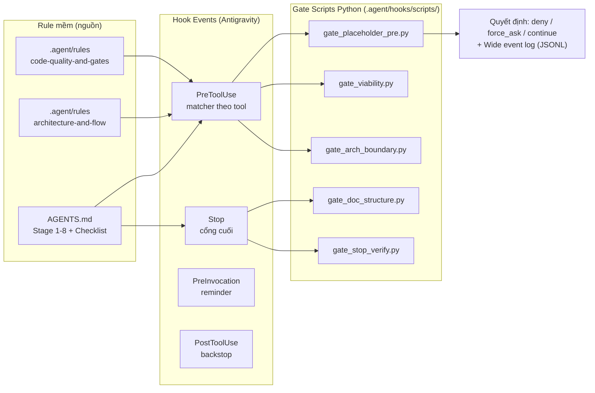

# Danh sách: Rule Mềm → Hooks Gate Script Python

> **Ngày:** 2026-08-05
> **Mục đích:** Danh sách ánh xạ đầy đủ các rule mềm (AGENTS.md + .agent/rules) sang hook gate Python — script nào, event nào, matcher nào, kiểm tra gì, quyết định gì.
> **Tài liệu nguồn:**
>
> - `Docs/Trade-offs/AGENTS.md` — 8-Stage Pipeline + Assurance Checklist (VAL/DES/BQD/CMV/OPS)
> - `.agent/rules/architecture-and-flow.md` — kiến trúc 5 tầng, §3 "enforce bằng lint/CI"
> - `.agent/rules/code-quality-and-gates.md` — Binary Gates OBS/CFG/TST/ARC + đề xuất ZPL/TYP/GRD/NEG
> - `.agent/Knowlades/hooks-standardized.md` — năng lực hook (PreToolUse/PostToolUse/PreInvocation/PostInvocation/Stop)
> - `.agent/Docs/analys/hooks/architecture-redesign-proposal.md` — kiến trúc module cho script Python
> - Skill `logging-best-practices` — wide event cho mọi quyết định gate
>   **Hiện trạng:** `.agent/hooks.json` trống, `.agent/hooks/` rỗng — tài liệu này là blueprint triển khai.

---

## 1. Kiến trúc ánh xạ Rule → Hook (tóm tắt)



**Nguyên tắc chọn:** rule nào có _bằng chứng cơ học_ (nội dung file sắp ghi, đường dẫn, lệnh shell, transcript, cấu trúc doc) → cơ học hóa được. Rule nào chỉ có _ý định/nhận thức_ (Thought Latency, Reverse Probing, tính xác thực phỏng vấn) → giữ soft, chỉ reminder.

**Phân tầng ưu tiên:**

- **P0 — Chặn cứng (deny / force_ask / continue):** 6 gate, ROI cao nhất, tự động 100%.
- **P1 — Cổng tài liệu + backstop kiến trúc:** 8 gate, script đơn giản, chặn thiếu sót hành chính.
- **P2 — Bằng chứng artifact:** 4 gate trong 1 script, chỉ chặn trường hợp "không có bất kỳ bằng chứng nào".

---

## 2. DANH SÁCH ĐẦY ĐỦ: Rule → Hooks Gate Python

### 🥇 P0 — Chặn cứng, tự động 100%

|  Gate ID  | Rule nguồn (mềm)                                                                             | Hook event + matcher                                                                     | Script Python              | Kiểm tra cơ học                                                                                                                                                      | Quyết định khi vi phạm                                        |
| :-------: | -------------------------------------------------------------------------------------------- | ---------------------------------------------------------------------------------------- | -------------------------- | -------------------------------------------------------------------------------------------------------------------------------------------------------------------- | ------------------------------------------------------------- |
| **G0-01** | BQD-2 / ZPL-1 — Zero Placeholder: không TODO, mock data, lorem ipsum ở luồng chính (Stage 5) | `PreToolUse` — matcher `write_to_file\|replace_file_content\|multi_replace_file_content` | `gate_placeholder_pre.py`  | Scan `CodeContent` (write) / `ReplacementChunks` (multi-replace) / `ReplacementContent` (replace) bằng regex `TODO\|FIXME\|XXX\|lorem ipsum\|mock data\|placeholder` | `deny` — reason liệt kê dòng vi phạm                          |
| **G0-02** | BQD-2 — Zero Placeholder lớp 2: full-repo scan trước khi dừng                                | `Stop` (không matcher)                                                                   | `gate_placeholder_stop.py` | `grep -rE` trên `src/`, bỏ qua test fixtures; nếu còn placeholder → `continue`                                                                                       | `continue` — "còn N placeholder, hãy xử lý"                   |
| **G0-03** | DES-2 — AI không tự ý đổi data contract (Stage 5 must_not)                                   | `PreToolUse` — matcher file-edit (3 tool như G0-01)                                      | `gate_contract_lock.py`    | `TargetFile` ∈ `0_contracts/` → bắt buộc hỏi người                                                                                                                   | `force_ask` — bỏ qua Always Allow, người duyệt từng lần       |
| **G0-04** | Stage 4 — Không viết code trước khi GO doc được ký duyệt (Human-only gate)                   | `PreToolUse` — matcher file-edit                                                         | `gate_viability.py`        | `TargetFile` ∈ code paths (`src/`, `1_engine/`, `2_platform_adapters/`, `3_modules/`, `4_presentation/`) VÀ thiếu file `docs/decisions/viability-gate.md` chứa `GO`  | `deny` — "MVP Viability Gate chưa PASS, không được viết code" |
| **G0-05** | Stage 5 — Không bypass test/lint "tạm thời" (must_not)                                       | `PreToolUse` — matcher `run_command`                                                     | `gate_test_bypass.py`      | Regex trên `CommandLine`: `--no-verify`, `--skip-`, `\[skip ci\]`, `describe\.only`, `it\.only`, `test\.skip`                                                        | `deny`                                                        |
| **G0-06** | Stage 5 — Không tin báo cáo "đã xong" của AI khi chưa verify cơ học (must_not)               | `Stop` (không matcher)                                                                   | `gate_stop_verify.py`      | Parse `transcriptPath` (JSONL): lượt cuối có file-edit mà không có `run_command` chứa test/lint/typecheck sau đó → chưa verify                                       | `continue` — "code vừa sửa chưa chạy test"                    |

> ⚠️ **G0-06** là mẫu "Stop Loop Re-entry" chuẩn — cần parse `transcript.jsonl`, phức tạp nhất trong P0 nhưng hoàn toàn khả thi (hooks-standardized §8-Cách 3).

### 🥈 P1 — Cổng tài liệu + backstop kiến trúc

|  Gate ID  | Rule nguồn (mềm)                                                                                                                                                                                                 | Hook event + matcher                                                                | Script Python             | Kiểm tra cơ học                                                                                                                                                                                                                                                                      | Quyết định khi vi phạm                                                     |
| :-------: | ---------------------------------------------------------------------------------------------------------------------------------------------------------------------------------------------------------------- | ----------------------------------------------------------------------------------- | ------------------------- | ------------------------------------------------------------------------------------------------------------------------------------------------------------------------------------------------------------------------------------------------------------------------------------ | -------------------------------------------------------------------------- |
| **G1-01** | DES-1 / NEG-1 — Negative Space ≥ 5 mục, mỗi mục kèm `consequence_of_violation` (Stage 2)                                                                                                                         | `Stop` (hoặc `PostInvocation`)                                                      | `gate_doc_structure.py`   | Parse doc Negative Space: đếm bullet ≥ 5, mỗi mục có mô tả hậu quả                                                                                                                                                                                                                   | `continue` nếu thiếu — liệt kê mục nào                                     |
| **G1-02** | Stage 2 — Must-have ≤ 5 tính năng cốt lõi (must_not)                                                                                                                                                             | `Stop`                                                                              | `gate_doc_structure.py`   | Đếm item gắn nhãn `Must-have` trong MoSCoW                                                                                                                                                                                                                                           | `continue` nếu > 5                                                         |
| **G1-03** | VAL-3 / Stage 1 — Domain Anchor Doc đủ cấu trúc (glossary, stakeholder, persona, edge cases)                                                                                                                     | `Stop`                                                                              | `gate_doc_structure.py`   | Doc chứa: glossary ≥ 10 thuật ngữ, stakeholder map, persona ≥ 3–5 + JTBD, ≥ 5 failure reasons (Reverse Probing), edge cases                                                                                                                                                          | `continue` — reason liệt kê mục thiếu                                      |
| **G1-04** | DES-3 / Stage 3 — ADR tồn tại cho quyết định công nghệ, kèm phần Constraints                                                                                                                                     | `Stop`                                                                              | `gate_doc_structure.py`   | Thư mục ADR có file; mỗi file chứa section "Constraints"                                                                                                                                                                                                                             | `continue` nếu trống                                                       |
| **G1-05** | Stage 5 — Re-feed Domain Anchor Doc mỗi phiên làm việc (chống Semantic Drift)                                                                                                                                    | `PreInvocation` (không matcher)                                                     | `remind_domain_anchor.py` | Đọc file anchor (nếu tồn tại) → trả `injectSteps: [ephemeralMessage]` tóm tắt + đường dẫn                                                                                                                                                                                            | Reminder transient trước mỗi lượt model                                    |
| **G1-06** | OBS-1 / ARC-1 / ARC-2 / ARC-3 / TYP-1 — console.log trần, import ngược tầng, `chrome`/`document`/`window` trong `3_modules/`, `postMessage` trần, `as any`/`@ts-ignore` (architecture-and-flow §3, code-quality) | `PreToolUse` — matcher file-edit                                                    | `gate_arch_boundary.py`   | Scan `CodeContent`: regex `console\.(log\|debug)` (ngoài `telemetry/logger.ts`), import tầng ngược (`1_engine/` ← `3_modules/`...), `chrome\.[a-z]`/`document\.`/`window\.` trong `3_modules/`, `postMessage` ngoài `main-world-bridge.ts`, `as any`/`@ts-ignore`/`@ts-expect-error` | `deny` — backstop tức thì, nhanh hơn chờ CI                                |
| **G1-07** | OBS-2 — `traceId` bắt buộc trong mọi IPC payload (không optional)                                                                                                                                                | `PostToolUse` — matcher file-edit, lọc `TargetFile` = `0_contracts/ipc-payloads.ts` | `gate_traceid.py`         | Scan file sau khi sửa: field `traceId` không bị optional (`traceId?`)                                                                                                                                                                                                                | Backstop — không chặn, ghi wide event log (type checker là lớp chặn chính) |
| **G1-08** | CFG-1 / CFG-1+ — Không có secret/API key trong bundle sau build                                                                                                                                                  | `PostToolUse` — matcher `run_command`, lọc lệnh build                               | `gate_secret_scan.py`     | Regex `sk-`, `AIza`, `ghp_`, `-----BEGIN`, `sk-ant-` trong `dist/`                                                                                                                                                                                                                   | Backstop — ghi log cảnh báo (CI là lớp chặn chính)                         |

### 🥉 P2 — Enforce bằng chứng artifact (một phần)

|  Gate ID  | Rule nguồn (mềm)                                                                                                | Hook event | Script Python      | Kiểm tra cơ học                                                                                      | Quyết định khi vi phạm                       |
| :-------: | --------------------------------------------------------------------------------------------------------------- | ---------- | ------------------ | ---------------------------------------------------------------------------------------------------- | -------------------------------------------- |
| **G2-01** | Stage 5 — Chạy thử staging/production thật, không chỉ localhost                                                 | `Stop`     | `gate_evidence.py` | Transcript có bằng chứng deploy/staging (URL deploy, log deploy, `--load-extension` chạy build thật) | `continue` nếu hoàn toàn không có bằng chứng |
| **G2-02** | Stage 6 — Usability report ≥ 80% hoàn thành core flow trước khi sang Stage 7                                    | `Stop`     | `gate_evidence.py` | Parse `validation-report.md`: có metric completion ≥ 80%                                             | `continue` nếu thiếu con số                  |
| **G2-03** | Stage 8 / GRD-1 — Alerting ≥ 3 chỉ số sống còn (uptime, payment, core flow) + kịch bản Graceful Degradation ≥ 2 | `Stop`     | `gate_evidence.py` | Scan codebase có cấu hình monitoring (sentry, alert config) + ≥ 2 kịch bản fallback test             | `continue` nếu thiếu cấu hình                |
| **G2-04** | Stage 7 — ToS/Privacy Policy được con người duyệt                                                               | `Stop`     | `gate_evidence.py` | Checklist doc có flag "human-reviewed/approved"                                                      | `continue` nếu thiếu flag hành chính         |

---

## 3. Giữ nguyên soft (KHÔNG chuyển thành gate) — kèm lý do

| Rule                                                                                            | Lý do không cơ học hóa                                                   | Hình thức thay thế                                                |
| ----------------------------------------------------------------------------------------------- | ------------------------------------------------------------------------ | ----------------------------------------------------------------- |
| Core Cognitive Principles (Domain Anchoring, Thought Latency 4 signals, Dual Context Ingestion) | Nhận thức không có bằng chứng cơ học — script không "chấm điểm suy nghĩ" | `PreInvocation` reminder (G1-05 mở rộng)                          |
| Stage 1: Phỏng vấn ≥ 5 người thật, không bạn bè/gia đình                                        | Tính xác thực con người không verify bằng script                         | Script chỉ check doc tồn tại (G1-03) — đừng giả vờ kiểm nhiều hơn |
| Stage 4: Quyết định GO/PIVOT/KILL (Human-only)                                                  | Quyết định chiến lược thuộc người — script không thay thế                | Chặn hệ quả: G0-04 (không code trước GO doc)                      |
| Stage 6: Phát hiện Semantic Drift                                                               | Bản chất định tính, cần con người đối chiếu                              | Review checklist thủ công                                         |
| Stage 7: Onboarding ≤ 5 phút, ≤ 5 bước                                                          | Cần đo UX thực tế, không phải check tĩnh                                 | Playwright đo lường (TST-2)                                       |
| Reverse Probing khi viết code                                                                   | Hành vi tư duy                                                           | Reminder transient                                                |
| Stage 2/3: Lý do chọn công nghệ "không vì thói quen"                                            | Ý định không có bằng chứng                                               | Gián tiếp qua ADR (G1-04)                                         |

> ⚠️ **Cảnh báo Goodhart:** với gate P1/P2, script chỉ chặn _thiếu sót hành chính_ (doc thiếu mục, thiếu flag), không biến thành mục tiêu tối ưu — nếu script đếm "doc có 5 bullet" thì AI sẽ viết 5 bullet rỗng nghĩa để qua gate. Chất lượng thật thuộc về review con người.

---

## 4. Kiến trúc thư mục scripts Python — nhóm theo EVENT

Thiết kế theo `architecture-redesign-proposal.md`: Single Responsibility, mỗi module ≤ 200 LOC, config-driven, testable, dependency inversion (gate script mỏng — logic nằm ở `lib/checks/`).

**Nguyên tắc tổ chức:** script được nhóm vào **thư mục theo hook event** (tên snake_case, khớp key event trong hooks.json) — nhìn vào cây thư mục là biết ngay gate nào chạy ở event nào, tránh nhầm matcher/event, dễ review bảo mật theo từng điểm can thiệp.

```
.agent/hooks/
├── hooks.json                     # Cấu hình đăng ký (hiện đang TRỐNG — điền theo mục 5)
├── scripts/
│   ├── pre_tool_use/              # ⚡ EVENT: PreToolUse — chặn ngay trước khi tool chạy
│   │   ├── gate_placeholder_pre.py    # G0-01  (matcher: 3 tool file-edit)
│   │   ├── gate_contract_lock.py      # G0-03  (matcher: 3 tool file-edit) — force_ask
│   │   ├── gate_viability.py          # G0-04  (matcher: 3 tool file-edit)
│   │   ├── gate_test_bypass.py        # G0-05  (matcher: run_command)
│   │   └── gate_arch_boundary.py      # G1-06  (matcher: 3 tool file-edit)
│   │
│   ├── stop/                      # 🛑 EVENT: Stop — cổng cuối, ép chạy tiếp nếu chưa đạt
│   │   ├── gate_placeholder_stop.py   # G0-02  (full-repo scan, timeout 120s)
│   │   ├── gate_stop_verify.py        # G0-06  (parse transcript.jsonl)
│   │   ├── gate_doc_structure.py      # G1-01..04  (Negative Space, MoSCoW, Anchor, ADR)
│   │   └── gate_evidence.py           # G2-01..04  (staging, usability, alerting, ToS)
│   │
│   ├── pre_invocation/            # 💡 EVENT: PreInvocation — reminder trước mỗi lượt model
│   │   └── remind_domain_anchor.py    # G1-05  (injectSteps: ephemeralMessage)
│   │
│   ├── post_tool_use/             # 🔎 EVENT: PostToolUse — backstop sau khi tool xong (không chặn)
│   │   ├── gate_traceid.py            # G1-07  (matcher: file-edit → lọc 0_contracts/ipc-payloads.ts)
│   │   └── gate_secret_scan.py        # G1-08  (matcher: run_command → lọc lệnh build)
│   │
│   ├── post_invocation/           # ⏭️ EVENT: PostInvocation — dự phòng (chưa có gate — G1-01 có thể dời về đây nếu cần force_continue)
│   │
│   ├── lib/                       # 📚 Dùng chung mọi event dir — import qua ../lib/
│   │   ├── __init__.py
│   │   ├── hook_contract.py       # stdin → dataclass payload; emit JSON stdout (camelCase)
│   │   ├── logger.py              # Wide event log (logging-best-practices) — xem mục 6
│   │   ├── config.py              # Load config/rules.yaml
│   │   └── checks/                # Reusable check logic (test độc lập, độc lập event)
│   │       ├── __init__.py
│   │       ├── placeholder.py     # regex scan (dùng chung G0-01/G0-02 — 2 event)
│   │       ├── boundaries.py      # import/console/chrome/postMessage scan (G1-06)
│   │       ├── doc_structure.py   # Negative Space, MoSCoW, Domain Anchor, ADR (G1-01..04)
│   │       └── transcript.py      # parse transcript.jsonl (G0-06, G2-01)
│   ├── config/
│   │   └── rules.yaml             # Regex, đường dẫn, ngưỡng — KHÔNG hardcode trong script
│   └── tests/                     # Mirror theo scripts/ — 1:1 như architecture-redesign-proposal
│       ├── conftest.py            # Fixtures: payload JSON mẫu cho từng event
│       ├── pre_tool_use/
│       │   ├── test_gate_placeholder_pre.py
│       │   ├── test_gate_contract_lock.py
│       │   ├── test_gate_viability.py
│       │   ├── test_gate_test_bypass.py
│       │   └── test_gate_arch_boundary.py
│       ├── stop/
│       │   ├── test_gate_placeholder_stop.py
│       │   ├── test_gate_stop_verify.py
│       │   ├── test_gate_doc_structure.py
│       │   └── test_gate_evidence.py
│       ├── pre_invocation/
│       │   └── test_remind_domain_anchor.py
│       └── post_tool_use/
│           ├── test_gate_traceid.py
│           └── test_gate_secret_scan.py
└── logs/                          # Wide event logs (JSONL) — auto tạo
    └── gates-YYYY-MM-DD.jsonl
```

### Bản đồ Event → Gate (đọc nhanh)

| Thư mục event      | Key trong hooks.json | Gate chứa                          | Vai trò                                                  |
| ------------------ | -------------------- | ---------------------------------- | -------------------------------------------------------- |
| `pre_tool_use/`    | `PreToolUse`         | G0-01, G0-03, G0-04, G0-05, G1-06  | Chặn cứng trước khi tool chạy (deny/force_ask)           |
| `stop/`            | `Stop`               | G0-02, G0-06, G1-01..04, G2-01..04 | Cổng cuối — không cho Agent dừng khi chưa đạt (continue) |
| `pre_invocation/`  | `PreInvocation`      | G1-05                              | Reminder transient mỗi lượt model                        |
| `post_tool_use/`   | `PostToolUse`        | G1-07, G1-08                       | Backstop phát hiện sau khi ghi file/build (không chặn)   |
| `post_invocation/` | `PostInvocation`     | _(trống — dự phòng)_               | Ép tiếp tục/dừng sau mỗi lượt tool call                  |

> 📌 **Quy ước đặt tên:** thư mục dùng snake_case (`pre_tool_use/`), khớp 1-1 với key event camelCase trong hooks.json (`PreToolUse`) — mỗi script trong thư mục event đó chỉ được đăng ký dưới đúng event tương ứng, không bao giờ "trái event" (vd script trong `stop/` không bao giờ xuất hiện ở `PreToolUse`).

**Contract chung mọi gate script** (theo hooks-standardized §7):

- Input: đọc JSON từ **stdin** (`toolCall.args`, `stepIdx`, `conversationId`, `workspacePaths`, `transcriptPath`...)
- Output: **stdout** JSON hợp lệ — `{"decision": "allow|deny|ask|force_ask"|"continue", "reason": "..."}`
- Fail-open: lỗi không xác định → `{"decision": "allow"}` exit 0 (trừ G0-03 contract lock — fail-closed vì bảo mật/contract)
- `timeout` đủ cho scan (G0-02 full-repo cần > 30s — nâng lên 60–120s trong hooks.json)

**rules.yaml (mẫu)** — tách config khỏi code:

```yaml
placeholder:
  patterns: ['TODO', 'FIXME', 'XXX', 'lorem ipsum', 'mock data', 'placeholder']
  exclude_paths: ['**/test*/**', '**/fixtures/**', '**/*.test.*']
  scan_paths: ['src/']
contract_lock:
  protected_dirs: ['0_contracts/']
  decision: 'force_ask'
viability:
  gate_doc: 'docs/decisions/viability-gate.md'
  go_marker: 'GO'
  protected_code_paths:
    ['src/', '1_engine/', '2_platform_adapters/', '3_modules/', '4_presentation/']
test_bypass:
  patterns:
    ['--no-verify', '--skip-', "\\[skip ci\\]", "describe\\.only", "it\\.only", "test\\.skip"]
arch_boundary:
  console_log_regex: "console\\.(log|debug)"
  forbidden_imports: ... # theo architecture-and-flow §3
  ts_ignore: ['as any', '@ts-ignore', '@ts-expect-error']
doc_structure:
  negative_space_min_items: 5
  moscow_must_have_max: 5
  glossary_min_terms: 10
  persona_min: 3
  failure_reasons_min: 5
```

---

## 5. Đăng ký hooks.json (mẫu — điền vào `.agent/hooks.json` đang trống)

> Đường dẫn `command` trong hooks.json khớp trực tiếp thư mục event — `scripts/<event_dir>/<script>.py`.

```json
{
  "gate-p0-placeholder": {
    "enabled": true,
    "PreToolUse": [
      {
        "matcher": "write_to_file|replace_file_content|multi_replace_file_content",
        "hooks": [
          {
            "type": "command",
            "command": "python3 .agent/hooks/scripts/pre_tool_use/gate_placeholder_pre.py",
            "timeout": 30
          },
          {
            "type": "command",
            "command": "python3 .agent/hooks/scripts/pre_tool_use/gate_contract_lock.py",
            "timeout": 10
          },
          {
            "type": "command",
            "command": "python3 .agent/hooks/scripts/pre_tool_use/gate_viability.py",
            "timeout": 10
          },
          {
            "type": "command",
            "command": "python3 .agent/hooks/scripts/pre_tool_use/gate_arch_boundary.py",
            "timeout": 30
          }
        ]
      },
      {
        "matcher": "run_command",
        "hooks": [
          {
            "type": "command",
            "command": "python3 .agent/hooks/scripts/pre_tool_use/gate_test_bypass.py",
            "timeout": 10
          }
        ]
      }
    ]
  },
  "gate-stop-verify": {
    "enabled": true,
    "Stop": [
      {
        "hooks": [
          {
            "type": "command",
            "command": "python3 .agent/hooks/scripts/stop/gate_placeholder_stop.py",
            "timeout": 120
          },
          {
            "type": "command",
            "command": "python3 .agent/hooks/scripts/stop/gate_stop_verify.py",
            "timeout": 60
          },
          {
            "type": "command",
            "command": "python3 .agent/hooks/scripts/stop/gate_doc_structure.py",
            "timeout": 30
          },
          {
            "type": "command",
            "command": "python3 .agent/hooks/scripts/stop/gate_evidence.py",
            "timeout": 30
          }
        ]
      }
    ]
  },
  "remind-domain-anchor": {
    "enabled": true,
    "PreInvocation": [
      {
        "hooks": [
          {
            "type": "command",
            "command": "python3 .agent/hooks/scripts/pre_invocation/remind_domain_anchor.py",
            "timeout": 10
          }
        ]
      }
    ]
  },
  "backstop-traceid-secret": {
    "enabled": true,
    "PostToolUse": [
      {
        "matcher": "write_to_file|replace_file_content|multi_replace_file_content",
        "hooks": [
          {
            "type": "command",
            "command": "python3 .agent/hooks/scripts/post_tool_use/gate_traceid.py",
            "timeout": 10
          }
        ]
      },
      {
        "matcher": "run_command",
        "hooks": [
          {
            "type": "command",
            "command": "python3 .agent/hooks/scripts/post_tool_use/gate_secret_scan.py",
            "timeout": 60
          }
        ]
      }
    ]
  }
}
```

> ⚠️ **Lưu ý matcher:** tên tool phải đúng chính tả theo hooks-standardized §6 (`write_to_file`, `replace_file_content`, `multi_replace_file_content`, `run_command`) — matcher sai = hook chết lặng. Validate theo bảng check mục (11) hooks-standardized.

---

## 6. Logging contract cho gate scripts (logging-best-practices)

Mỗi gate script emit **1 wide event duy nhất** mỗi lần ra quyết định (canonical log line) — không log rải rác, không chuỗi không cấu trúc:

```python
# lib/logger.py — schema thống nhất mọi gate
{
  "event": "hook_gate_decision",        # tên wide event cố định
  "gate_id": "G0-01",                    # định danh gate (mục 2)
  "rule_id": "BQD-2/ZPL-1",              # rule nguồn — trace ngược về AGENTS.md
  "event_dir": "pre_tool_use",           # thư mục event chứa script (mục 4)
  "hook_event": "PreToolUse",
  "tool_name": "write_to_file",
  "target_file": "src/3_modules/a.ts",
  "decision": "deny",                    # allow|deny|force_ask|continue
  "reason": "BLOCKED: TODO placeholder tại dòng 1",
  "conversation_id": "uuid",             # cardinality cao — nối chuỗi với transcript
  "step_idx": 3,
  "duration_ms": 42,
  "timestamp": "2026-08-05T10:00:00Z",
  "commit_hash": "abc1234"               # môi trường — từ env nếu có
}
```

- Ghi vào `.agent/hooks/logs/gates-YYYY-MM-DD.jsonl`, mỗi dòng 1 JSON (append-only).
- 2 mức: `info` (allow) / `error` (deny/force_ask/continue).
- Business context: `rule_id` + `gate_id` giúp trả lời "gate nào chặn rule nào bao nhiêu lần" — đo lường được hiệu quả enforcement, phát hiện gate "chết lặng" do matcher sai.
- Anti-pattern tránh: nhiều log line lẻ trong 1 lần gate (phải gộp), thiếu `conversation_id`, thiếu `decision`.

---

## 7. Lộ trình triển khai

|               Phase                | Nội dung                                                                                                                                   | Gate                              |
| :--------------------------------: | ------------------------------------------------------------------------------------------------------------------------------------------ | --------------------------------- |
|       **1 — P0 (làm ngay)**        | Zero Placeholder 2 lớp, Contract Lock, Viability Gate, chặn bypass test, Stop-verify                                                       | G0-01 → G0-06 (6 script)          |
|    **2 — P1 (sau P0 ổn định)**     | Cổng cấu trúc tài liệu, reminder neo ngữ nghĩa, backstop kiến trúc + traceId + secret                                                      | G1-01 → G1-08 (8 script)          |
| **3 — P2 (chỉ khi P0/P1 ổn định)** | Enforce bằng chứng artifact                                                                                                                | G2-01 → G2-04 (1 script, 4 check) |
|           **Song song**            | Unit test từng gate (fixtures payload mẫu theo hooks-standardized §11), CI chạy test gates, theo dõi log JSONL để phát hiện gate chết lặng | —                                 |

**Tiêu chí hoàn thành mỗi gate:**

- [ ] Script tồn tại, đọc stdin / emit stdout JSON hợp lệ (`jq -e .` pass)
- [ ] Test với input mẫu PASS/FAIL theo đúng bảng check hooks-standardized §11
- [ ] Đăng ký trong `.agent/hooks.json` với matcher + timeout đúng
- [ ] Wide event log xuất hiện đúng `gate_id` + `decision` khi chạy thử
