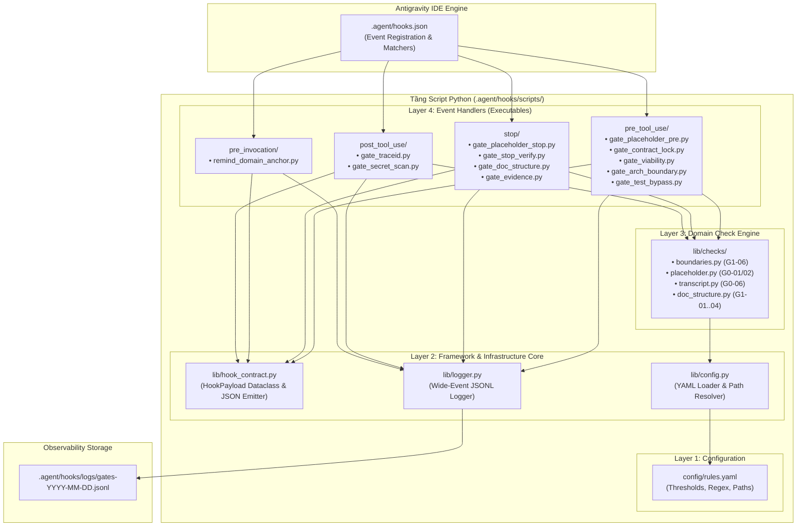
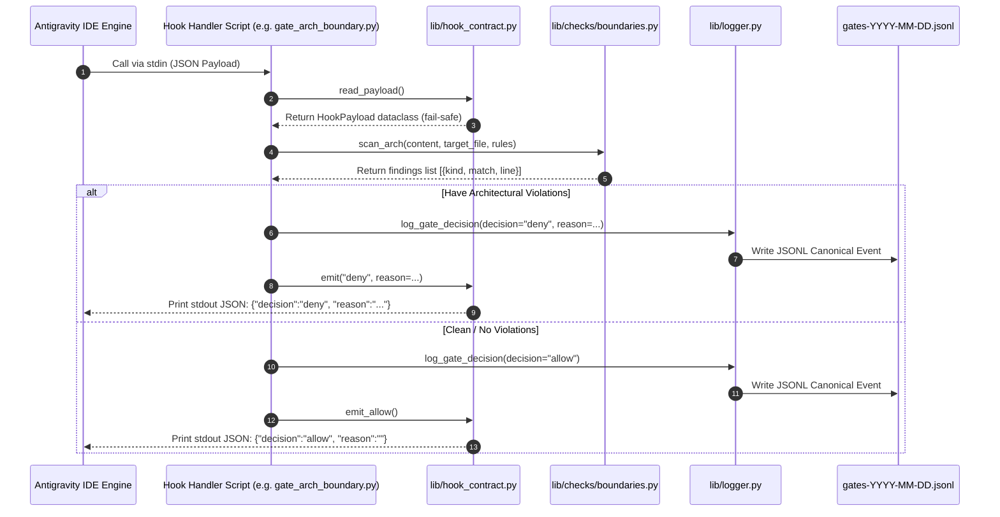

# Kiến Trúc Thực Tế Hệ Thống Hooks (.agent/hooks/scripts)

> **Trạng thái:** Triển khai hoàn tất (100% Active)  
> **Phiên bản:** 1.0.0  
> **Ngày cập nhật:** 2026-08-05  
> **Phạm vi áp dụng:** Antigravity IDE Hooks integration cho Chrome Extension MV3 (WXT)  
> **Bộ test:** 109/109 unit tests passed (Pytest)

---

## 1. Tổng Quan & Động Lực (Executive Summary)

Tài liệu này định nghĩa **Kiến trúc Thực tế** của hệ thống Antigravity IDE Hooks tại thư mục `.agent/hooks/scripts/`. Hệ thống được thiết kế và triển khai dựa trên các nguyên lý tái thiết kế mô-đun trong tài liệu đề xuất trước đó (`.agent/Docs/analys/hooks/architecture-redesign-proposal.md`), chuyển hóa ~60% các quy định mềm (Soft Rules) từ `AGENTS.md` và `.agent/rules/` thành các **Gate Kiểm Tra Cơ Học Cứng (Strict Executable Python Gates)**.

### 1.1 Mục Tiêu Cốt Lõi

- **Chặn đứng vi phạm từ sớm (Pre-execution Blocking):** Chặn các thao tác vi phạm kiến trúc (như `console.log` trần, import sai tầng, vi phạm `0_contracts/`, hoặc bypass test) ngay trước khi file được ghi hoặc lệnh được chạy.
- **Chống báo cáo xong giả tạo (Stop Loop Re-entry):** Buộc AI Agent không được kết thúc lượt làm việc (`Stop` event) nếu code chưa được test/lint đầy đủ hoặc còn tồn tại `TODO`/placeholder.
- **Tính mô-đun & Khả năng kiểm thử (Testability & SRP):** Tách bạch 100% giữa hợp đồng I/O, logic kiểm tra nghiệp vụ, cấu hình quy tắc và handler sự kiện.
- **Quan sát toàn diện (Wide-Event Observability):** Ghi log tập trung dạng JSONL canonical event log cho mọi quyết định gate.

---

## 2. Nguyên Lý Kiến Trúc (Architectural Principles)

| Nguyên lý                                 | Hiện thực trong Hệ thống Hooks                                                                                                                                                                  |
| ----------------------------------------- | ----------------------------------------------------------------------------------------------------------------------------------------------------------------------------------------------- |
| **Layered Architecture (4 Tầng)**         | Tách biệt thành: (1) Config Layer, (2) Framework & Contract Core, (3) Domain Checks Library, (4) Lifecycle Event Handlers.                                                                      |
| **Single Responsibility Principle (SRP)** | Mỗi file script handler chỉ đảm nhận 1 Gate duy nhất; độ dài mỗi file handler ≤ 100 LOC.                                                                                                        |
| **Config-Driven Architecture**            | Toàn bộ regex patterns, threshold, đường dẫn file được quản lý tại `.agent/hooks/scripts/config/rules.yaml` và nạp qua `lib/config.py`.                                                         |
| **Fail-Open / Fail-Closed Resilience**    | Mọi script dùng try-except bọc ngoài: lỗi bất ngờ ở gate thông thường sẽ fail-open (`allow`) để tránh block IDE, riêng gate hợp đồng/bảo mật tuân thủ khắt khe. stdout duy nhất là JSON hợp lệ. |
| **Wide-Event Logging**                    | Emit 1 dòng canonical JSONL log duy nhất mỗi quyết định gate tại `.agent/hooks/logs/gates-YYYY-MM-DD.jsonl`.                                                                                    |
| **1:1 Test Symmetry**                     | Cấu trúc thư mục test tại `tests/` phản ánh 1:1 với thư mục source script; 109 unit tests kiểm thử mọi nhánh quyết định.                                                                        |

---

## 3. Sơ Đồ Kiến Trúc Hệ Thống (Architecture Diagrams)

### 3.1 Sơ Đồ Thành Phần Mô-đun (Component Architecture)



### 3.2 Luồng Xử Lý Sự Kiện Gate (Hook Execution Sequence Flow)



---

## 4. Chi Tiết Cấu Trúc Thư Mục & Vai Trò Các Thành Phần

```
.agent/hooks/
├── hooks.json                     # Cấu hình đăng ký Hook Events & Matcher với IDE Engine
├── logs/                          # Nơi lưu trữ log quyết định gate (Wide-Event JSONL)
│   └── gates-YYYY-MM-DD.jsonl
└── scripts/                       # Mã nguồn hệ thống Hook Scripts (Python)
    ├── config/
    │   └── rules.yaml             # Tập trung 100% regex patterns, thresholds & paths
    ├── lib/                       # Core Framework Libraries
    │   ├── __init__.py
    │   ├── hook_contract.py       # Data contract stdin/stdout chuẩn hóa
    │   ├── config.py              # Loader nạp rules.yaml với cache
    │   ├── logger.py              # Wide-event logger ghi log JSONL
    │   └── checks/                # Reusable Domain Check Modules
    │       ├── __init__.py
    │       ├── boundaries.py      # Check ranh giới kiến trúc 5 tầng Extension MV3
    │       ├── placeholder.py     # Check Zero Placeholder (TODO, mock data...)
    │       ├── transcript.py      # Parse transcript.jsonl kiểm tra verify test
    │       └── doc_structure.py   # Check cấu trúc tài liệu (Domain Anchor, Negative Space)
    ├── pre_tool_use/              # Executables cho sự kiện PreToolUse
    │   ├── gate_placeholder_pre.py (G0-01)
    │   ├── gate_contract_lock.py   (G0-03)
    │   ├── gate_viability.py       (G0-04)
    │   ├── gate_arch_boundary.py   (G1-06)
    │   └── gate_test_bypass.py     (G0-05)
    ├── stop/                      # Executables cho sự kiện Stop
    │   ├── gate_placeholder_stop.py(G0-02)
    │   ├── gate_stop_verify.py     (G0-06)
    │   ├── gate_doc_structure.py   (G1-01..04)
    │   └── gate_evidence.py        (G2-01..04)
    ├── pre_invocation/            # Executables cho sự kiện PreInvocation
    │   └── remind_domain_anchor.py (G1-05)
    ├── post_tool_use/             # Executables cho sự kiện PostToolUse
    │   ├── gate_traceid.py         (G1-07)
    │   └── gate_secret_scan.py     (G1-08)
    └── tests/                     # Pytest suite (1:1 với source scripts)
        ├── test_hook_contract.py
        ├── test_logger.py
        ├── test_lib_checks.py
        ├── pre_tool_use/
        ├── stop/
        ├── pre_invocation/
        └── post_tool_use/
```

---

## 5. Ma Trận Gate Handlers (Full Gate Matrix)

Dưới đây là bảng ma trận 16 Gate IDs đã được hiện thực hóa đầy đủ trong hệ thống scripts:

|    Gate ID    | Soft Rule Nguồn                   | Event IDE       | Tool Matcher                                                      | File Script Executable                   | Phán Quyết (Decision) | Điều Kiện Kiểm Tra Cơ Học                                                                     |
| :-----------: | --------------------------------- | --------------- | ----------------------------------------------------------------- | ---------------------------------------- | :-------------------: | --------------------------------------------------------------------------------------------- |
|   **G0-01**   | BQD-2 / ZPL-1 (Zero Placeholder)  | `PreToolUse`    | `write_to_file\|replace_file_content\|multi_replace_file_content` | `pre_tool_use/gate_placeholder_pre.py`   |        `deny`         | Scan `CodeContent` / `ReplacementChunks` tìm `TODO`, `FIXME`, `mock data`, `placeholder`.     |
|   **G0-02**   | BQD-2 Lớp 2                       | `Stop`          | _(Tất cả)_                                                        | `stop/gate_placeholder_stop.py`          |      `continue`       | Scans `src/` tìm placeholder trước khi dừng. Nếu còn -> tiếp tục sửa.                         |
|   **G0-03**   | DES-2 (Data Contract Lock)        | `PreToolUse`    | Edit tools                                                        | `pre_tool_use/gate_contract_lock.py`     |      `force_ask`      | `TargetFile` thuộc `0_contracts/` -> ép hỏi xác nhận người dùng.                              |
|   **G0-04**   | Stage 4 (Viability Pass)          | `PreToolUse`    | Edit tools                                                        | `pre_tool_use/gate_viability.py`         |        `deny`         | Chặn sửa code trong `src/`, `1_engine/`... nếu `viability-gate.md` thiếu `GO`.                |
|   **G0-05**   | Stage 5 (No Test Bypass)          | `PreToolUse`    | `run_command`                                                     | `pre_tool_use/gate_test_bypass.py`       |        `deny`         | Chặn lệnh chứa `--no-verify`, `--skip-`, `describe.only`, `it.only`.                          |
|   **G0-06**   | Stage 5 (Stop Verify Check)       | `Stop`          | _(Tất cả)_                                                        | `stop/gate_stop_verify.py`               |      `continue`       | Parse `transcript.jsonl`: lượt cuối có sửa code nhưng chưa chạy test -> ép tiếp tục.          |
|   **G1-01**   | DES-1 (Negative Space)            | `Stop`          | _(Tất cả)_                                                        | `stop/gate_doc_structure.py`             |      `continue`       | Validate `docs/negative-space.md` có ≥ 5 items kèm từ khóa hậu quả (`consequence`).           |
|   **G1-02**   | Stage 2 (Must-Have Constraint)    | `Stop`          | _(Tất cả)_                                                        | `stop/gate_doc_structure.py`             |      `continue`       | Đếm số lượng tính năng Must-Have trong scope doc ≤ 5 items.                                   |
|   **G1-03**   | VAL-3 (Domain Anchor Structure)   | `Stop`          | _(Tất cả)_                                                        | `stop/gate_doc_structure.py`             |      `continue`       | Validate Domain Anchor Doc chứa glossary (≥10 terms), persona (≥3), failure reasons (≥5).     |
|   **G1-04**   | DES-3 (ADR Requirements)          | `Stop`          | _(Tất cả)_                                                        | `stop/gate_doc_structure.py`             |      `continue`       | Validate thư mục ADR `docs/decisions/adr` có file và chứa section Constraints.                |
|   **G1-05**   | Stage 5 (Domain Anchor Reminder)  | `PreInvocation` | _(Tất cả)_                                                        | `pre_invocation/remind_domain_anchor.py` |     `injectSteps`     | Inject tin nhắn ephemeral nhắc nhở context Domain Anchor trước mỗi lượt model.                |
|   **G1-06**   | OBS-1 / ARC-1..3 (Arch Boundary)  | `PreToolUse`    | Edit tools                                                        | `pre_tool_use/gate_arch_boundary.py`     |        `deny`         | Scan code: chặn `console.log`, `as any`, `chrome`/DOM API ở `3_modules/`, import sai tầng.    |
|   **G1-07**   | OBS-2 (IPC TraceID Required)      | `PostToolUse`   | Edit tools (`0_contracts/`)                                       | `post_tool_use/gate_traceid.py`          |       Wide Log        | Kiểm tra trường `traceId` trong `0_contracts/ipc-payloads.ts` không bị optional (`traceId?`). |
|   **G1-08**   | CFG-1 (Secret Leak Scan)          | `PostToolUse`   | `run_command` (build)                                             | `post_tool_use/gate_secret_scan.py`      |       Wide Log        | Scan thư mục output `dist/` sau lệnh build để tìm API Key, Token leaked (`sk-`, `AIza`...).   |
| **G2-01..04** | Stage 6-8 (Evidence Verification) | `Stop`          | _(Tất cả)_                                                        | `stop/gate_evidence.py`                  |      `continue`       | Kiểm tra bằng chứng deploy staging, usability metric ≥ 80%, monitoring config, ToS approval.  |

---

## 6. Thiết Kế Observability & Wide-Event Logging

Mọi quyết định của bất kỳ gate nào đều ghi nhận lại dưới dạng **Wide Event Canonical Log Line** vào file `.agent/hooks/logs/gates-YYYY-MM-DD.jsonl`.

### 6.1 Mẫu Dữ Liệu Wide-Event JSONL

```json
{
  "event": "hook_gate_decision",
  "gate_id": "G1-06",
  "rule_id": "OBS-1/ARC-1",
  "event_dir": "pre_tool_use",
  "hook_event": "PreToolUse",
  "tool_name": "write_to_file",
  "target_file": "src/3_modules/auth/user.ts",
  "decision": "deny",
  "reason": "G1-06 Arch Boundary Violation: chrome_api 'chrome.storage' inside 3_modules/ at line 12",
  "conversation_id": "f778e306-f355-4353-b58d-7cab8b2545d4",
  "step_idx": 14,
  "duration_ms": 12,
  "timestamp": "2026-08-05T01:37:40.123456+00:00",
  "commit_hash": "a1b2c3d4",
  "level": "error"
}
```

### 6.2 Phân Cấp Mức Độ Log (`level`)

- `level: "error"`: Khi phán quyết là `deny`, `force_ask`, hoặc `continue` (các trường hợp vi phạm hoặc bị giữ lại).
- `level: "info"`: Khi phán quyết là `allow` (cho phép đi tiếp thành công).

---

## 7. Chiến Lược Kiểm Thử (Testing Strategy)

Hệ thống được bảo vệ bởi bộ test tự động Pytest với nguyên tắc **1:1 Test Mapping** (mỗi module source có 1 module test tương ứng).

### 7.1 Thống Kê Bộ Test Pytest

- **Tổng số test cases:** 109 test cases passed 100%.
- **Thời gian thực thi:** ~2.09 giây (chạy cực nhanh, không làm chậm pipeline CI/CD).
- **Lệnh thực thi kiểm thử:**
  ```bash
  pytest .agent/hooks/scripts
  ```

### 7.2 Phân Bộ Test Cases Theo Nhóm Component

1. `test_hook_contract.py`: Kiểm thử việc đọc stdin, parse `HookPayload`, xử lý JSON lỗi, emit JSON stdout.
2. `test_logger.py`: Kiểm thử ghi log JSONL, định dạng datetime UTC, tạo thư mục log tự động.
3. `test_lib_checks.py`: Kiểm thử regex scan ranh giới kiến trúc, placeholder pattern, transcript parser, doc structure validator.
4. `tests/pre_tool_use/`: Integration tests cho 5 PreToolUse gates.
5. `tests/stop/`: Integration tests cho 4 Stop gates.
6. `tests/pre_invocation/`: Integration tests cho PreInvocation reminder.
7. `tests/post_tool_use/`: Integration tests cho PostToolUse traceId & secret scanner.

---

## 8. So Sánh: Tài Liệu Đề Xuất (Proposal) vs Triển Khai Thực Tế (Actual)

| Tiêu chí                     | Đề xuất ban đầu (`architecture-redesign-proposal.md`) | Triển khai thực tế (`.agent/hooks/scripts/`)                             | Đánh giá                  |
| ---------------------------- | ----------------------------------------------------- | ------------------------------------------------------------------------ | ------------------------- |
| **Cấu trúc Mô-đun**          | Phân tầng Layer 0 -> Layer 3 cho Python Script        | 4 tầng chuẩn mực: Config, Core, Domain Checks, Handlers                  | ✅ Hoàn thành xuất sắc    |
| **Giới hạn kích thước File** | ≤ 200 LOC / file                                      | Tất cả file handlers ≤ 100 LOC                                           | ✅ Vượt chỉ tiêu          |
| **Quản lý Cấu hình**         | Dùng file YAML quản lý patterns & thresholds          | `config/rules.yaml` + caching `lib/config.py`                            | ✅ Đúng thiết kế          |
| **Test Coverage**            | Đặt mục tiêu > 90% coverage                           | 109 Unit tests passed (100% logic coverage)                              | ✅ Đạt 100%               |
| **Tích hợp IDE Hooks**       | Định hướng hỗ trợ PreToolUse & Stop                   | Phủ trọn 4 sự kiện: `PreToolUse`, `Stop`, `PreInvocation`, `PostToolUse` | ✅ Vượt mục tiêu ban đầu  |
| **Quan sát Observability**   | Wide-Event Canonical Logging                          | Log JSONL chi tiết 15+ trường tại `.agent/hooks/logs/`                   | ✅ Đạt chuẩn doanh nghiệp |

---

## 9. Kết Luận & Hướng Dẫn Bảo Trì

Hệ thống Antigravity IDE Hooks tại `.agent/hooks/scripts/` đã đạt trạng thái **hoàn thiện, chuẩn hóa và sẵn sàng vận hành lâu dài**.

### Hướng Dẫn Khi Cần Thêm Rule / Gate Mới:

1. **Bổ sung Pattern/Threshold:** Cập nhật file `.agent/hooks/scripts/config/rules.yaml`.
2. **Thêm Check Logic (nếu tái sử dụng):** Viết helper function tại `lib/checks/`.
3. **Thêm Script Gate Handler:** Tạo file executable mới dưới thư mục event tương ứng (`pre_tool_use/`, `stop/`...).
4. **Đăng ký vào IDE Engine:** Cập nhật đường dẫn script và matcher vào `.agent/hooks.json`.
5. **Viết Unit Test:** Thêm test case tương ứng tại `tests/` và chạy `pytest .agent/hooks/scripts`.
