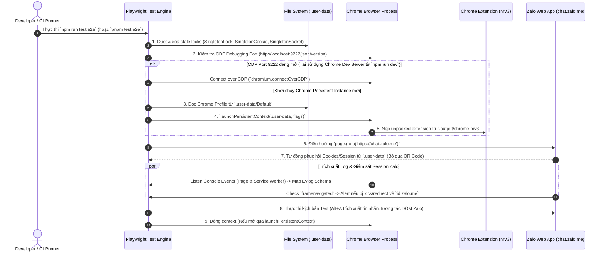

# 🏛️ Architecture Spec: Môi trường Kiểm thử Tự động E2E với Playwright & Persistent Chrome Context (`.user-data`)

> **Mã tài liệu:** `ARCH-E2E-001`  
> **Trạng thái:** Published / Synchronized  
> **Phạm vi:** Tích hợp E2E Testing cho Chrome Extension MV3 (WXT) & Zalo Web Session Preservation  
> **Repository tham chiếu:** Dự án hiện tại (`tests/e2e/fixtures/extension.fixture.ts`, `playwright.config.ts`, `wxt.config.ts`)

---

## 📌 1. Bối cảnh & Mục tiêu Kiến trúc

Khi thực hiện kiểm thử tự động End-to-End (E2E) cho các Chrome Extension Manifest V3 hoạt động trên nền tảng Web App thực tế (chuyên biệt cho Zalo Web `https://chat.zalo.me`), hệ thống gặp phải các thách thức chính:

1. **Phiên đăng nhập phức tạp**: Zalo Web đòi hỏi quét mã QR / xác thực OTP 2FA trên điện thoại. Nếu tạo browser context mới sạch (`ephemeral context`) cho mỗi lần chạy test, kịch bản test sẽ bị nghẽn tại màn hình đăng nhập Zalo.
2. **Khởi chạy Chrome Extension**: Chrome Extension MV3 đòi hỏi môi trường Chrome thực sự có GUI (hoặc `--headless=new`), nạp unpacked extension từ thư mục build (`.output/chrome-mv3`).
3. **Tránh bị Anti-Bot phát hiện**: Zalo Web tự động phát hiện cờ `navigator.webdriver` và vô hiệu hóa/khóa phiên làm việc của trình duyệt tự động.
4. **Giám sát Log Runtime (< 3s RCA)**: Cần thu thập tập trung log từ cả trang Zalo Web lẫn Service Worker của Extension (`background.js`) để phát hiện lỗi ngầm.

Tài liệu này đặc tả kiến trúc giải pháp **Persistent Chrome Context (`.user-data`)** kết hợp **Hybrid CDP Fallback** đồng bộ 100% với cấu hình WXT Dev Runner và Playwright E2E Test Suite của dự án.

---

## 🏗️ 2. Biểu đồ Luồng Kiến trúc (Architectural Sequence Diagram)



---

## 🧱 3. Chi tiết Cấu hình Đồng bộ Codebase

### 3.1 Cấu hình Runner trong Dev (`wxt.config.ts`)

Đồng bộ thiết lập giữa môi trường Development (`npm run dev`) và E2E Testing nhằm chia sẻ chung profile `.user-data`:

```typescript
// wxt.config.ts
import { resolve } from 'node:path';
import { defineConfig } from 'wxt';

export default defineConfig({
  srcDir: 'src',
  entrypointsDir: resolve('src/1_engine'),
  modules: ['@wxt-dev/module-react'],
  webExt: {
    startUrls: ['https://chat.zalo.me'],
    chromiumProfile: resolve('.user-data'),
    keepProfileChanges: true,
    chromiumArgs: ['--remote-debugging-port=9222'],
  },
  manifest: () => ({
    name: 'Sale Extension',
    version: '0.1.0',
    permissions: ['storage', 'tabs', 'scripting', 'alarms', 'sidePanel'],
    host_permissions: ['https://*.zalo.me/*', 'https://chat.zalo.me/*'],
  }),
});
```

---

### 3.2 Cấu hình Concurrency & Execution (`playwright.config.ts`)

File cấu hình quy định các thông số vận hành của Playwright Test Engine:

```typescript
// playwright.config.ts
import { defineConfig, devices } from '@playwright/test';

export default defineConfig({
  testDir: 'tests/e2e',
  testMatch: '**/*.e2e.ts',
  timeout: 60 * 1000,
  expect: { timeout: 10 * 1000 },
  fullyParallel: false,
  workers: 1, // ⚠️ BẮT BUỘC: Giới hạn 1 worker do cắm Profile Lock đơn tiến trình của Chromium
  forbidOnly: !!process.env.CI,
  retries: process.env.CI ? 2 : 0,
  reporter: [['html', { open: 'never' }], ['list']],
  use: {
    trace: 'on-first-retry',
    viewport: { width: 1280, height: 800 },
  },
  projects: [
    {
      name: 'chromium-extension',
      use: { ...devices['Desktop Chrome'] },
    },
  ],
});
```

#### Nguyên tắc vận hành:
* **`workers: 1`**: Chromium sử dụng cơ chế ghi khóa độc quyền (`SingletonLock`) lên thư mục Profile `.user-data`. Nếu cho phép chạy đa tiến trình (`workers > 1`), các tiến trình từ worker thứ 2 sẽ crash ngay lập tức do không chiếm được khóa ghi.

---

### 3.3 Bộ Fixtures Tự động hóa (`tests/e2e/fixtures/extension.fixture.ts`)

`extension.fixture.ts` đóng vai trò là Trạm điều phối chính (Orchestrator) quản lý vòng đời trình duyệt, phiên làm việc Zalo Web và thu thập log.

#### A. Cơ chế Dọn dẹp File Lock Rác (`cleanupStaleLocks`)
Khi quá trình test bị ngắt đột ngột (Ctrl+C, SIGKILL, crash), Chromium không kịp giải phóng file lock. Fixtures sẽ tự động xóa các file rác này trước khi khởi chạy context mới:

```typescript
export function cleanupStaleLocks(userDataDir: string): void {
  const lockFiles = ['SingletonLock', 'SingletonCookie', 'SingletonSocket'];
  for (const file of lockFiles) {
    const filePath = resolve(userDataDir, file);
    if (existsSync(filePath)) {
      try {
        unlinkSync(filePath);
      } catch {
        // Quá trình xóa bị bỏ qua nếu lock file đã bị dọn hoặc bị cấm truy cập
      }
    }
  }
}
```

#### B. Chiến lược Khởi chạy Trình duyệt Kép (Hybrid CDP & Persistent Context)
Hệ thống ưu tiên kết nối vào trình duyệt dev đang chạy sẵn (qua cổng Debug `9222`). Nếu không tìm thấy, hệ thống mới tự khởi chạy Chrome với thư mục dữ liệu `.user-data`:

```typescript
export async function launchExtensionContext(): Promise<BrowserContext> {
  if (sharedContext !== null) return sharedContext;

  const userDataDir = process.env.USER_DATA_DIR || resolve('.user-data');
  const cdpUrl = process.env.CDP_URL || 'http://localhost:9222';
  const EXTENSION_PATH = resolve('.output/chrome-mv3');

  if (!existsSync(EXTENSION_PATH)) {
    throw new Error(`Extension build directory not found at: ${EXTENSION_PATH}. Run 'pnpm build' first.`);
  }

  try {
    const res = await fetch(`${cdpUrl}/json/version`);
    if (res.ok) {
      // Reusing existing Chrome browser session via CDP
      const browser = await chromium.connectOverCDP(cdpUrl);
      sharedContext = browser.contexts()[0] || (await browser.newContext());
      isSharedCdpConnected = true;
      return sharedContext;
    }
  } catch {
    // CDP dev server không sẵn sàng
  }

  cleanupStaleLocks(userDataDir);
  sharedContext = await chromium.launchPersistentContext(userDataDir, {
    channel: process.env.CHROME_CHANNEL || 'chromium',
    headless: process.env.HEADLESS === 'true',
    ignoreDefaultArgs: ['--enable-automation'],
    args: [
      `--disable-extensions-except=${EXTENSION_PATH}`,
      `--load-extension=${EXTENSION_PATH}`,
      '--profile-directory=Default',
      '--disable-blink-features=AutomationControlled',
      '--no-sandbox',
      '--disable-dev-shm-usage',
    ],
  });
  isSharedCdpConnected = false;
  return sharedContext;
}
```

Các tham số Launch quan trọng cho Zalo Web:
* `--disable-blink-features=AutomationControlled`: Ẩn cờ `navigator.webdriver = true` nhằm tránh Zalo Web phát hiện tự động hóa.
* `--profile-directory=Default`: Định hướng Chrome đọc chính xác Profile lưu phiên Zalo Web bên trong `.user-data`.
* `ignoreDefaultArgs: ['--enable-automation']`: Gỡ bỏ thanh thông báo "Chrome is being controlled by automated test software".

---

## 🧪 5. Kịch bản Test Chuyên biệt Zalo Web (`tests/e2e/zalo-extract.e2e.ts`)

Mẫu kịch bản E2E kiểm thử tính năng trích xuất tin nhắn trên giao diện Zalo Web:

```typescript
import { extensionTest as test } from './fixtures/extension.fixture';
import { expect } from '@playwright/test';

test.describe('Zalo Web Extension Integration', () => {
  test('Trích xuất tin nhắn tại khung chat Zalo Web', async ({ context, evlogs }) => {
    // 1. Mở trang Zalo Web
    const page = await context.newPage();
    await page.goto('https://chat.zalo.me');

    // 2. Chờ Zalo Web nạp xong giao diện chính (Sử dụng session từ .user-data)
    await page.waitForSelector('#zalo-chat-body, .main-tab', { timeout: 30000 });

    // 3. Thực thi phím tắt trích xuất tin nhắn (Alt+A)
    await page.keyboard.press('Alt+A');

    // 4. Kiểm tra event log trích xuất thành công
    const hasSuccessLog = evlogs.some(
      (log) => log.rawText.includes('zalo-extract-single-message') || log.decision_reason === 'EXTRACT_SUCCESS'
    );
    expect(hasSuccessLog).toBeTruthy();
  });
});
```

---

## 🛠️ 6. Quy trình Vận hành & Bảo mật

### 6.1 Luồng Khởi tạo Đăng nhập Ban đầu (Initial 1-Time Setup)

1. **Biên dịch Extension**: `pnpm build` (hoặc `npm run build`)
2. **Chạy Dev Server để đăng nhập Zalo**: `npm run dev`
3. Trình duyệt Chrome bật lên trang `https://chat.zalo.me` với profile `.user-data`.
4. Tiến hành **quét mã QR / Đăng nhập thủ công** Zalo Web.
5. Đóng trình duyệt. Phiên đăng nhập Zalo sẽ được lưu cố định tại `.user-data/`.
6. Tất cả các đợt chạy test CLI sau đó (`npm run test:e2e`) sẽ tự động kế thừa phiên đăng nhập Zalo Web.

---

### 6.2 An toàn Bảo mật (`.gitignore`)

> [!CAUTION]
> Thư mục `.user-data` chứa thông tin nhạy cảm (Access Tokens, Cookies, Private Keys Zalo Web). BẮT BUỘC phải giữ `.user-data` trong `.gitignore`.

```gitignore
# Safety Rules
.user-data/
test-results/
playwright-report/
```

---

## 📝 7. Kết luận

Mô hình **Playwright + Chrome Persistent Context (`.user-data`)** đồng bộ giữa `wxt.config.ts` và `extension.fixture.ts` là giải pháp tối ưu nhất để tự động hóa kiểm thử Chrome Extension trên **Zalo Web**. Giải pháp loại bỏ hoàn toàn việc quét mã QR lặp đi lặp lại, chống bị Zalo anti-bot phát hiện, và hỗ trợ thu thập telemetry logs cho RCA (< 3s).
