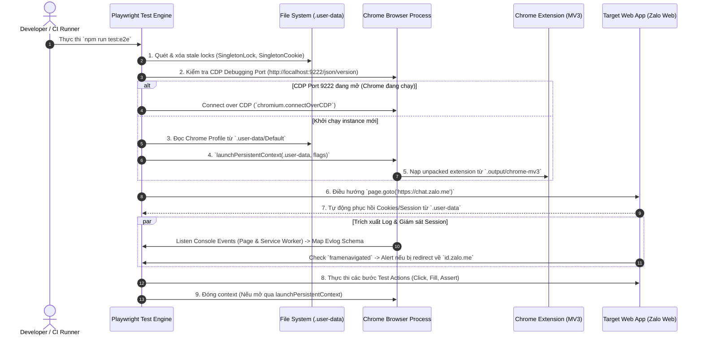

# 🏛️ Architecture Spec: Môi trường Kiểm thử Tự động E2E với Playwright & Persistent Chrome Context (`.user-data`)

> **Mã tài liệu:** `ARCH-E2E-001`  
> **Trạng thái:** Published  
> **Phạm vi:** Tích hợp E2E Testing cho Chrome Extension MV3 (WXT) & Web App Session Preservation  
> **Repository tham chiếu:** `quick_zalo` (`tests/e2e-playwright/`, `playwright.config.ts`)

---

## 📌 1. Bối cảnh & Mục tiêu Kiến trúc

Khi thực hiện kiểm thử tự động End-to-End (E2E) cho các Chrome Extension Manifest V3 hoạt động trên nền tảng Web App thực tế (ví dụ: Zalo Web `chat.zalo.me`), hệ thống gặp phải các thách thức chính:

1. **Phiên đăng nhập phức tạp**: Web App đòi hỏi quét mã QR / OTP / 2FA. Nếu tạo browser context mới sạch (`ephemeral context`) cho mỗi lần chạy test, kịch bản test sẽ bị nghẽn tại màn hình đăng nhập.
2. **Khởi chạy Chrome Extension**: Chrome Extension MV3 đòi hỏi môi trường Chrome thực sự có GUI (hoặc `--headless=new`), nạp unpacked extension từ thư mục build (`.output/chrome-mv3`).
3. **Tránh bị Anti-Bot phát hiện**: Các trang Web App hiện đại tự động phát hiện cờ `navigator.webdriver` và vô hiệu hóa phiên làm việc của trình duyệt tự động.
4. **Giám sát Log Runtime (< 3s RCA)**: Cần thu thập tập trung log từ cả web tab lẫn Service Worker của Extension để phát hiện lỗi ngầm.

Tài liệu này đặc tả kiến trúc giải pháp **Persistent Chrome Context (`.user-data`)** kết hợp **Hybrid CDP Fallback** nhằm giải quyết triệt để các vấn đề trên.

---

## 🏗️ 2. Biểu đồ Luồng Kiến trúc (Architectural Sequence Diagram)



---

## 🧱 3. Chi tiết Các Thành phần Cấu trúc

### 3.1 Cấu hình Concurrency & Execution (`playwright.config.ts`)

File cấu hình quy định các thông số vận hành của Playwright Test Engine:

```typescript
import { defineConfig, devices } from '@playwright/test';

export default defineConfig({
  testDir: './tests/e2e-playwright',
  timeout: 60 * 1000,
  expect: { timeout: 10 * 1000 },
  fullyParallel: false,
  workers: 1, // ⚠️ BẮT BUỘC: Giới hạn 1 worker do cắm Profile Lock đơn tiến trình của Chromium
  forbidOnly: !!process.env.CI,
  retries: process.env.CI ? 2 : 0,
  reporter: [['html', { open: 'never' }], ['list']],
  use: {
    trace: 'on-first-retry',
    viewport: { width: 1280, height: 800 },
  },
  projects: [
    {
      name: 'chromium-extension',
      use: { ...devices['Desktop Chrome'] },
    },
  ],
});
```

#### Nguyên tắc vận hành:
* **`workers: 1`**: Chromium sử dụng cơ chế ghi khóa độc quyền (`SingletonLock`) lên thư mục Profile. Nếu cho phép chạy đa tiến trình (`workers > 1`), các tiến trình từ worker thứ 2 sẽ crash ngay lập tức do không chiếm được khóa ghi vào `.user-data`.

---

### 3.2 Bộ Fixtures Tự động hóa (`tests/e2e-playwright/fixtures.ts`)

`fixtures.ts` đóng vai trò là Trạm điều phối chính (Orchestrator) quản lý vòng đời trình duyệt, phiên làm việc và thu thập log.

#### A. Cơ chế Dọn dẹp File Lock Rác (`cleanupStaleLocks`)
Khi quá trình test bị ngắt đột ngột (Ctrl+C, SIGKILL, crash), Chromium không kịp giải phóng file lock. Fixtures sẽ tự động xóa các file rác này trước khi khởi chạy context mới:

```typescript
function cleanupStaleLocks(userDataDir: string): void {
  const lockFiles = ['SingletonLock', 'SingletonCookie', 'SingletonSocket'];
  for (const file of lockFiles) {
    const filePath = resolve(userDataDir, file);
    if (existsSync(filePath)) {
      try {
        unlinkSync(filePath);
        // Cleaned up stale lock file
      } catch (e) {
        // Warning: Could not remove lock file
      }
    }
  }
}
```

#### B. Chiến lược Khởi chạy Trình duyệt Kép (Hybrid CDP & Persistent Context)
Hệ thống ưu tiên kết nối vào trình duyệt dev đang chạy sẵn (qua cổng Debug `9222`). Nếu không tìm thấy, hệ thống mới tự khởi chạy Chrome với thư mục dữ liệu `.user-data`:

```typescript
export const test = base.extend<ExtensionFixtures>({
  context: async ({}, use) => {
    const pathToExtension = resolve('.output/chrome-mv3');
    const userDataDir = process.env.USER_DATA_DIR || resolve('.user-data');
    const cdpUrl = process.env.CDP_URL || 'http://localhost:9222';

    if (!existsSync(pathToExtension)) {
      throw new Error(`Extension build directory not found at: ${pathToExtension}. Run 'npm run build' first.`);
    }

    let isCdpAvailable = false;
    try {
      const res = await fetch(`${cdpUrl}/json/version`);
      isCdpAvailable = res.ok;
    } catch {
      isCdpAvailable = false;
    }

    let context: BrowserContext;
    let isCdpConnected = false;

    if (isCdpAvailable) {
      // Reusing existing Chrome browser session via CDP
      const browser = await chromium.connectOverCDP(cdpUrl);
      context = browser.contexts()[0] || (await browser.newContext());
      isCdpConnected = true;
    } else {
      cleanupStaleLocks(userDataDir);
      // Launching persistent Chrome context with User Data Dir
      context = await chromium.launchPersistentContext(userDataDir, {
        channel: 'chrome',
        headless: false,
        ignoreDefaultArgs: ['--enable-automation'],
        args: [
          `--disable-extensions-except=${pathToExtension}`,
          `--load-extension=${pathToExtension}`,
          '--profile-directory=Default',
          '--disable-blink-features=AutomationControlled',
          '--no-sandbox',
          '--disable-dev-shm-usage',
        ],
      });
    }

    await use(context);

    if (!isCdpConnected) {
      await context.close();
    }
  },
  // ...
});
```

Các tham số Launch quan trọng:
* `--disable-blink-features=AutomationControlled`: Ẩn cờ `navigator.webdriver = true` nhằm tránh bị phát hiện tự động hóa.
* `--profile-directory=Default`: Định hướng Chrome đọc chính xác Profile mặc định bên trong `.user-data`.
* `ignoreDefaultArgs: ['--enable-automation']`: Gỡ bỏ thanh thông báo "Chrome is being controlled by automated test software".

#### C. Thu thập Log Chuẩn hóa (Evlog Interception)
Fixture đăng ký lắng nghe sự kiện `console` trên cả Web Page lẫn Service Worker của Extension, hỗ trợ phân tích RCA (< 3s):

```typescript
evlogs: async ({ context }, use) => {
  const capturedLogs: EvlogCapturedEntry[] = [];

  const handleConsoleMessage = (msg: { text: () => string }) => {
    const text = msg.text();
    try {
      if (text.includes('trace_id') || text.includes('decision_reason')) {
        const parsed = JSON.parse(text);
        capturedLogs.push({ ...parsed, rawText: text });
      } else {
        capturedLogs.push({ rawText: text });
      }
    } catch {
      capturedLogs.push({ rawText: text });
    }
  };

  context.pages().forEach((p) => p.on('console', handleConsoleMessage));
  context.on('page', (p) => p.on('console', handleConsoleMessage));
  context.serviceWorkers().forEach((sw) => sw.on('console', handleConsoleMessage));

  await use(capturedLogs);
}
```

#### D. Giám sát Bị Đăng xuất Phiên (Single Session Kick Alert)
Zalo Web áp dụng chính sách 1 phiên hoạt động duy nhất per account. Khi bị kick ra trang login (`id.zalo.me`), fixture lập tức cảnh báo:

```typescript
page.on('framenavigated', (frame) => {
  if (frame === page.mainFrame() && frame.url().includes('id.zalo.me')) {
    const logEntry = createEvlogEntry(
      '@e2e/zalo-session-monitor',
      'WARN',
      'SINGLE_CONCURRENT_SESSION_KICKED_BY_ZALO_WEB',
      { redirectedUrl: frame.url(), reason: 'Zalo Web enforces single active session per account.' }
    );
    evlogs.push(logEntry);
  }
});
```

---

## 🛠️ 4. Quy trình Vận hành & Thiết lập Bắt buộc

### 4.1 Luồng Khởi tạo Đăng nhập Ban đầu (Initial 1-Time Setup)

1. **Biên dịch Extension**:
   ```bash
   npm run build
   ```
2. **Khởi chạy UI Interactive Mode của Playwright**:
   ```bash
   npm run test:e2e:ui
   ```
3. Trình duyệt Chrome sẽ tự động bật lên với Profile lưu tại `.user-data`.
4. Tiến hành **quét mã QR / Đăng nhập thủ công** vào Zalo Web (hoặc Web App mục tiêu).
5. Đóng runner. Dữ liệu Session, Cookies, Storage và IndexedDB sẽ được lưu cố định tại `.user-data/Default/`.
6. Mọi lần chạy kiểm thử CLI tiếp theo (`npm run test:e2e`) sẽ tự động kế thừa phiên đăng nhập mà không cần tương tác lại.

---

### 4.2 An toàn Bảo mật (`.gitignore`)

> [!CAUTION]
> Thư mục `.user-data` chứa thông tin nhạy cảm (Access Tokens, Cookies, Private Keys). BẮT BUỘC phải đưa `.user-data` vào `.gitignore`.

```gitignore
# Safety Rules
.user-data/
test-results/
playwright-report/
```

---

## 📊 5. Bảng So sánh Kiến trúc (Trade-offs Analysis)

| Tiêu chí | Ephemeral Context (Playwright Mặc định) | Persistent Context (`.user-data`) (Giải pháp chọn) |
|:---|:---|:---|
| **Thời gian chạy Test Suite** | Chậm (Tốn thời gian đăng nhập lại từ đầu mỗi test) | ⚡ Rất nhanh (Kế thừa ngay phiên làm việc có sẵn) |
| **Hỗ trợ Chrome Extension** | Khó cài đặt extension persistent | 🟢 Tự nhiên, nạp extension thông qua flags |
| **Phù hợp với 2FA/QR Code** | ❌ Phá sản (Không thể tự động quét QR tự động) | ✅ Hoàn hảo (Người dùng đăng nhập 1 lần duy nhất) |
| **Tính độc lập giữa các test** | High (Mỗi test 1 môi trường sạch) | Medium (Dữ liệu test cũ có thể tồn tại trong DB/Storage) |
| **Khả năng chạy trên CI/CD** | Dễ triển khai | Phải nạp Session Cookies mã hóa qua Secrets |

---

## 📝 6. Kết luận & Khuyến nghị

Mô hình **Playwright + Chrome Persistent Context (`.user-data`)** là chuẩn kiến trúc tối ưu cho việc kiểm thử tự động Chrome Extension trên các ứng dụng yêu cầu xác thực phức tạp. Bằng việc kết hợp `workers: 1`, tự động xóa `SingletonLock`, cờ ẩn automation `--disable-blink-features=AutomationControlled`, cùng cơ chế giám sát Evlog, hệ thống đạt độ ổn định cao, bảo tồn dữ liệu người dùng và rút ngắn thời gian phản hồi kiểm thử.
