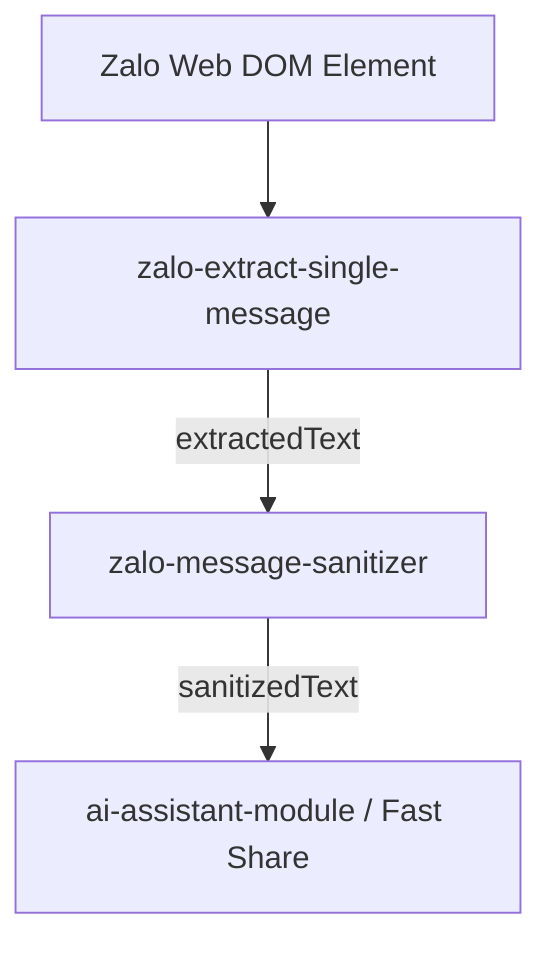

# Capability Summary: `zalo-message-sanitizer`

## 1. Tổng quan Sub-Module

Sub-module `zalo-message-sanitizer` là một **Functional Module (Module Chức năng chạy nền)** thuộc Layer 3 (Pure TypeScript Core Logic) trong kiến trúc MV3 Clean Architecture.

### Nguyên tắc Đơn nhiệm (Single Responsibility Principle):
Module đảm nhận duy nhất một vai trò chuyên biệt:
- Tiếp nhận chuỗi văn bản tin nhắn thô từ stage `EXTRACTED` hoặc từ bất kỳ nguồn văn bản Zalo Web nào.
- Thực hiện chuỗi lọc chọn lọc 7 bước (Reply quote header, Hoa hồng môi giới dính mã, Emoji mồ côi, Nhãn thương hiệu nguồn hàng, Unicode rác `\uFFFD`/`\uFEFF`, dòng hoa hồng độc lập).
- Bảo tồn 100% các thông tin bất động sản cốt lõi (Mã nhà, Giá bán/thành tiền `4tr8-301`, Địa chỉ, Diện tích) và dãy Unicode Emoji Surrogate Pairs 4-byte (`🍾`, `🏢`, `📍`, `🏆`, `🚗`).
- Đóng gói đầu ra dưới dạng Standard Stage JSON Envelope (`stage: "SANITIZED"`).

---

## 2. Vùng Phụ trách & Cấu trúc File

Sub-module tuân thủ nghiêm ngặt ranh giới phụ thuộc 5 tầng của Chrome Extension MV3 và quy chuẩn đặt file sub-module (`src/3_modules/sub-modules/{module-name}/index.ts`):

| Tầng Kiến trúc | Đường dẫn File Target | Vai trò / Trách nhiệm |
|---|---|---|
| **Layer 0: Contracts** | `src/0_contracts/zalo-sanitizer.contract.ts` | Khai báo TypeScript Interfaces `IZaloMessageSanitizeInput`, `IZaloMessageSanitizeOutput`, `IZaloSanitizedMessageData`, `ZaloSanitizerMetadata`. |
| **Layer 3: Core Logic** | `src/3_modules/sub-modules/zalo-message-sanitizer/filter-rules.ts` | Định nghĩa các hằng số hằng định Pure Regular Expressions (5 lớp Regex lọc). |
| **Layer 3: Core Business Modules** | `src/3_modules/sub-modules/zalo-message-sanitizer/index.ts` | Triển khai class `ZaloMessageSanitizerModule` pure TypeScript (0% chrome/document/window), thực thi chuỗi lọc 7 bước và đóng gói JSON Stage Envelope. |
| **Unit Tests** | `tests/unit/3_modules/zalo-message-sanitizer.spec.ts` | Bộ kiểm thử tự động Vitest bao phủ đầy đủ 8 edge cases lọc dữ liệu. |

---

## 3. Hợp đồng Dữ liệu Input / Output / Processing

### 3.1 Input Contract (`IZaloMessageSanitizeInput`)
- `traceId`: string (bắt buộc theo OBS-2 / G1-07).
- `rawText`: string (Chuỗi văn bản thô đầu vào).
- `options`: `{ filterBranding?: boolean; filterCommission?: boolean; }` (Tùy chọn lọc linh hoạt).

### 3.2 Output Contract (`IZaloMessageSanitizeOutput`)
Đóng gói theo chuẩn **Standard Pipeline Stage Envelope (`stage: "SANITIZED"`)**:

```json
{
  "stage": "SANITIZED",
  "success": true,
  "timestamp": 1754524800000,
  "traceId": "tr-sanitize-zalo-1754524800000",
  "data": {
    "sanitizedText": "Căn hộ 2PN2WC full nội thất cao cấp.\nGiá thuê: 15tr/tháng\nMã: 🏆 379",
    "originalText": "🌷 40%- 12th | 30%- 6th Mã: 🏆 379\nCăn hộ 2PN2WC full nội thất cao cấp.\nGiá thuê: 15tr/tháng\n• Nguồn hàng cập nhật liên tục tại 🏆TL21House🏆"
  },
  "metadata": {
    "source": "zalo-message-sanitizer",
    "rawLength": 165,
    "sanitizedLength": 82,
    "removedCommission": true,
    "removedBranding": true,
    "hasEmoji": true
  },
  "error": null
}
```

---

## 4. Vị trí trong Pipeline Data Flow



---

## 5. Pattern Deviation Check

| Tiêu chí | Trạng thái | Ghi chú |
|---|---|---|
| **F1: Isolation Rule** | ✅ PASS | Pure TypeScript 100%, 0% import chrome/document/window. |
| **F2: Contract Completeness** | ✅ PASS | Có `traceId` bắt buộc, mã lỗi `AppError` chuẩn hóa. |
| **F3: Stage Envelope Standard** | ✅ PASS | Trả về `IStageResult<'SANITIZED', ...>`. |
| **F4: Test Coverage** | ✅ PASS | 8 unit test cases covering 100% edge cases. |

---

## 6. Chiến lược Kiểm thử

- Chạy kiểm thử tự động nhị phân bằng Vitest:
  ```powershell
  npx vitest run tests/unit/3_modules/zalo-message-sanitizer.spec.ts
  ```
