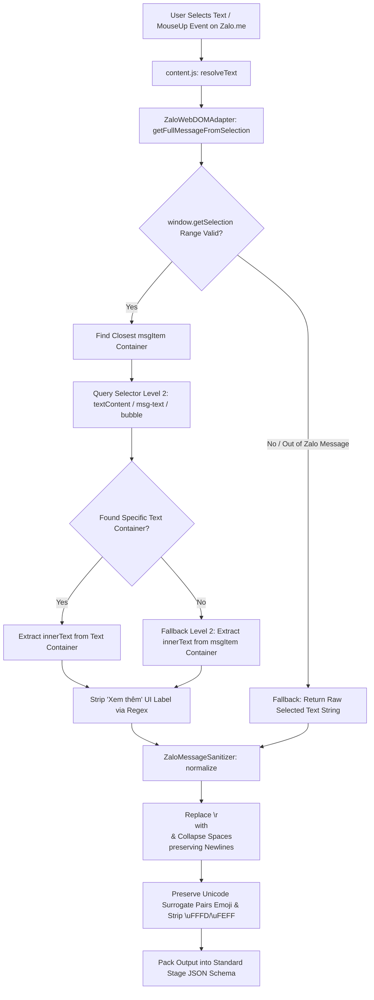

# Scope Document — Trích xuất 1 tin nhắn đầy đủ từ Zalo Web (zalo-extract-single-message)

**Date**: 2026-08-07  
**Status**: Ready  
**Reference Source**: [content-zalo-adapter.js](file:///home/stveve/Documents/workspace/Sales/extension/Achive/zalo_quick_action/content/content-zalo-adapter.js), [content-text.js](file:///home/stveve/Documents/workspace/Sales/extension/Achive/zalo_quick_action/content/content-text.js), [content.js](file:///home/stveve/Documents/workspace/Sales/extension/Achive/zalo_quick_action/content/content.js)  
**Target Repository Architecture**: Chrome Extension MV3 Modular Architecture (`src/0_contracts`, `src/2_platform_adapters`, `src/3_modules`)  

---

## §1: Problem Summary

Yêu cầu bóc tách, khai thác và đào sâu ngữ cảnh kỹ thuật của sub-module **trích xuất 1 tin nhắn đơn hoàn chỉnh từ Zalo Web (`zalo-extract-single-message`)** dựa trên mã nguồn tham chiếu Zalo Quick Action tại `/home/stveve/Documents/workspace/Sales/extension/Achive/zalo_quick_action/content/`.

Sub-module này đảm nhận các trách nhiệm kỹ thuật cốt lõi:
1. **Định vị & Trích xuất DOM chính xác**: Nhận diện thẻ DOM chứa tin nhắn Zalo Web khi người dùng chỉ định hoặc bôi đen một phần nhỏ văn bản, tự động mở rộng vùng chọn (resolve range) lên toàn bộ khung tin nhắn (message bubble).
2. **Loại bỏ rác giao diện UI**: Tách biệt nội dung văn bản thuần của tin nhắn khỏi các thành phần UI Zalo Web như tên người gửi, thời gian gửi, avatar, icon reaction, nút "Xem thêm" đối với tin nhắn dài bị thu gọn.
3. **Bảo tồn nguyên vẹn định dạng gốc**: Duy trì 100% cấu trúc Down dòng (`\n`), khoảng trắng chuẩn hóa, và bảo vệ tuyệt đối các dãy Unicode Surrogate Pairs cấu tạo nên Emoji (`🍾`, `🏢`, `📍`, `🏆`, `🚗`).
4. **Đóng gói Stage JSON Schema chuẩn**: Đóng gói kết quả đầu ra theo chuẩn contract JSON để cung cấp dữ liệu sạch cho các sub-module xử lý downstream (như AI Assistant, Copy Clean, hoặc Fast Forward Share).

---

## §2: Entry Point

Các điểm vào (Entry Points) chính được trích xuất từ mã nguồn tham chiếu:

1. **DOM Adapter Selection Resolver (`getFullMessageFromSelection`)**:
   - File: [content-zalo-adapter.js](file:///home/stveve/Documents/workspace/Sales/extension/Achive/zalo_quick_action/content/content-zalo-adapter.js#L317-L367)
   - Chức năng: Truy vết vị trí Node bôi đen (`window.getSelection().getRangeAt(0).commonAncestorContainer`), leo ngược DOM qua `.closest()` để lấy container tin nhắn Zalo Web và trích xuất nội dung `innerText`.
2. **Text Normalization Helper (`normalize`)**:
   - File: [content-text.js](file:///home/stveve/Documents/workspace/Sales/extension/Achive/zalo_quick_action/content/content-text.js#L7-L14)
   - Chức năng: Chuẩn hóa khoảng trắng, quy đổi `\r\n` thành `\n`, giới hạn dòng trống lặp lại và bảo tồn ký tự Unicode.
3. **Selective Metadata Cleaner (`clean` & `removeSelectiveMetadata`)**:
   - File: [content-text.js](file:///home/stveve/Documents/workspace/Sales/extension/Achive/zalo_quick_action/content/content-text.js#L17-L78)
   - Chức năng: Loại bỏ hoa hồng, thương hiệu, ký tự lỗi `\uFFFD`/`\uFEFF` nhưng bảo vệ emoji surrogate pairs.
4. **Orchestrator Text Resolver (`resolveText`)**:
   - File: [content.js](file:///home/stveve/Documents/workspace/Sales/extension/Achive/zalo_quick_action/content/content.js#L103-L117)
   - Chức năng: Điều phối ưu tiên lấy full tin nhắn từ DOM Adapter Zalo Web trước khi fallback về chuỗi bôi đen thông thường.
5. **Selection Event Trigger (`document.onmouseup`)**:
   - File: [content.js](file:///home/stveve/Documents/workspace/Sales/extension/Achive/zalo_quick_action/content/content.js#L260-L300)
   - Chức năng: Bắt sự kiện nhả chuột bôi đen để tự động trích xuất và chuẩn hóa tin nhắn sẵn sàng cho Quick Action.

---

## §3: Scope Definition

### 3.1 Problem Area
- Nhận diện chính xác các DOM Element Selectors đặc thù của Zalo Web (`.msg-item`, `.chat-item`, `[data-id*="msg"]`, `.msg-text`, `.bubble`).
- Xử lý bài toán "Partial Selection -> Full Extraction": Người dùng chỉ bôi đen 1 từ hoặc 1 dòng trong tin nhắn Zalo, hệ thống phải tự mở rộng vùng chọn để trích xuất TOÀN BỘ tin nhắn đó.
- Loại bỏ nhãn văn bản rác phát sinh từ nút UI ("Xem thêm") ở cuối các tin nhắn dài.
- Xử lý bảo toàn xuống dòng `\n` (do HTML `br` / `div` chuyển đổi qua `innerText`) và không làm vỡ Unicode Emoji Surrogate Pairs.

### 3.2 Boundary
- **Trong Scope**:
  - Trích xuất 1 tin nhắn đơn dựa trên DOM selection / target node trên Zalo Web (`zalo.me`).
  - Lọc bỏ nhãn rác UI `Xem thêm`.
  - Chuẩn hóa text (`normalize`) bảo toàn `\n` và emoji.
  - Đóng gói dữ liệu đầu ra dạng Standard Stage JSON Schema.
- **Ngoài Scope**:
  - Không xử lý chia sẻ hàng loạt (Multi-select share mode).
  - Không thực hiện ghi vào Clipboard hay dán vào ô chat (Share Modal injection).
  - Không tra cứu dạng phòng/quận huyện (District Lookup A).
  - Không thực hiện gọi API LLM/AI.

### 3.3 Target Architectural Mapping (Quy chuẩn Chrome Extension MV3)
Để đảm bảo nguyên tắc Clean Architecture và MV3 isolation trong repo target (`src/`):
- **Layer `0_contracts/`**: Khai báo interfaces `IMessageExtractResult`, `IZaloMessageNode`, `ZaloExtractionMetadata`.
- **Layer `2_platform_adapters/`**: Tạo `ZaloWebDOMAdapter` chịu trách nhiệm tương tác trực tiếp với DOM (`window.getSelection()`, `document.querySelector`, `element.closest()`). cách ly hoàn toàn DOM APIs khỏi business logic.
- **Layer `3_modules/`**: Tạo pure TypeScript module `ZaloMessageSanitizer` / `TextNormalizer` chứa các hàm xử lý chuỗi (`normalize`, loại bỏ `Xem thêm`, chuẩn hóa whitespace) không phụ thuộc vào `window` hay `document` (giúp viết Unit Test độc lập với Vitest).

---

## §4: Impact Analysis & Detailed Edge Cases

### 4.1 Direct Impact
- **Content Script Execution Context**: Chạy trong Isolated World của Chrome Extension trên tab domain `zalo.me`.
- **DOM Selector Sensitivity**: Phụ thuộc trực tiếp vào các CSS class names và thuộc tính `data-id` của Zalo Web Web Client.

### 4.2 Indirect Impact
- Khi Zalo Web cập nhật giao diện (thay đổi CSS module hash class hoặc HTML structure), các selector trong DOM Adapter có thể không khớp, kích hoạt cơ chế Fallback Level 3 (lấy selection string thuần).
- Lấy `innerText` từ container quá rộng có thể kéo theo Tên người gửi, Avatar text hoặc Timestamp nếu selector cấp 2 không được giới hạn chặt chẽ.

### 4.3 Detailed Edge Cases & Xử lý Kỹ thuật

| STT | Edge Case | Hiện trạng Mã nguồn Tham chiếu | Phân tích & Giải pháp cho MV3 Module |
| :--- | :--- | :--- | :--- |
| **1** | **Bôi đen 1 phần tin nhắn (Partial Selection)** | `getFullMessageFromSelection` lấy `commonAncestorContainer` của Selection Range, dùng `.closest()` tìm parent `.msg-item`, rồi lấy `.innerText` của toàn bộ tin nhắn. | **Hoạt động hoàn hảo**. Người dùng chỉ cần bôi đen 1 từ, adapter vẫn bóc tách được toàn bộ nội dung tin nhắn bubble. |
| **2** | **Tin nhắn dài bị thu gọn (Có nút "Xem thêm")** | Trong `content-zalo-adapter.js#L355`: dùng regex `fullText.replace(/\n?Xem thêm$/i, '').trim()`. | **Cần lưu ý**: Regex cắt bỏ nhãn chữ "Xem thêm". Tuy nhiên nếu Zalo Web dùng virtual DOM chưa render full text trước khi click nút, `innerText` sẽ chỉ lấy phần text đang visible. |
| **3** | **Tin nhắn Reply / Quote (Có trích dẫn tin nhắn trước)** | Hiện tại `getFullMessageFromSelection` lấy toàn bộ `textContainer` hoặc `msgItem`. Nếu `msgItem` chứa thẻ quote (`.quote-banner`, `.reply-item`), `innerText` sẽ bao gồm cả câu trích dẫn. | **Khuyến nghị nâng cấp**: Thêm selector loại trừ `.quote-banner`, `.quote-content` hoặc tách phần quote vào field `metadata.quotedText` riêng trong JSON output. |
| **4** | **Tin nhắn chứa Link & Media (Hình ảnh, Video, File đính kèm)** | Zalo Web dùng `.media-bubble` hoặc `.file-bubble`. Nếu tin nhắn chỉ có ảnh/file không có text, `innerText` trả về rỗng `""`. | Adapter cần phát hiện xem container có chứa media element hay không và bổ sung `metadata.hasMedia = true`, `metadata.mediaType` vào JSON Stage Result. |
| **5** | **Selection làm mất tick chọn tin nhắn (Multi-Select Interaction)** | `content-zalo-adapter.js` hỗ trợ `tryRecheckMessageFromNode` để tick lại checkbox nếu bôi đen làm hủy active state của tin nhắn. | Trong MV3 Platform Adapter, cần cung cấp event handler hỗ trợ re-check state nếu tính năng multi-select đang hoạt động. |
| **6** | **Ký tự Emoji Unicode Surrogate Pairs** | `content-text.js` loại bỏ `\uFFFD` (Replacement Char) và `\uFEFF` (BOM), tuyệt đối giữ nguyên Surrogate Pairs 4-byte (`\uD83C\uDF7E`, v.v.). | **Đạt tiêu chuẩn**. Giữ nguyên 100% Emoji mà không bị biến thành ký tự rác ``. |

---

## §5: Call Chain



---

## §6: Data Flow & DOM Selectors Matrix

### 6.1 Matrix Selectors DOM của Zalo Web

#### Selectors Cấp 1 — Container Bong bóng Tin nhắn (Message Item Container)
Dùng để truy vết từ node bôi đen ngược lên thẻ cha chứa tin nhắn:
- `[class*="msg-item"]`
- `[class*="chat-item"]`
- `[data-id*="msg"]`
- `div[data-id]`
- `.msg-item`
- `div[role="row"]`

#### Selectors Cấp 2 — Container Văn bản trực tiếp (Text Content Container)
Dùng để ưu tiên chỉ bóc tách văn bản tin nhắn, loại trừ Tên người gửi, Avatar, Timestamp và Reaction:
- `[class*="text-content"]`
- `[class*="msg-text"]`
- `[class*="card-content"]`
- `[class*="msg-content"]`
- `[class*="bubble"]`

### 6.2 Data Input & Output Contract

#### Input
- Target Node hoặc `window.getSelection()` trên DOM Zalo Web.

#### Standard Stage JSON Output Schema (`EXTRACTED`)
```json
{
  "stage": "EXTRACTED",
  "success": true,
  "timestamp": 1754524800000,
  "data": {
    "rawText": "Căn hộ 2PN2WC full nội thất cao cấp.\nGiá thuê: 15tr/tháng\nLiên hệ xem nhà: 0901234567 🍾🏢📍\nXem thêm",
    "normalizedText": "Căn hộ 2PN2WC full nội thất cao cấp.\nGiá thuê: 15tr/tháng\nLiên hệ xem nhà: 0901234567 🍾🏢📍",
    "metadata": {
      "containerClass": "msg-item msg-text-bubble",
      "extractedLength": 95,
      "hasEmoji": true,
      "hasNewline": true,
      "strippedLabels": ["Xem thêm"],
      "source": "zalo-web-dom-adapter"
    }
  },
  "error": null
}
```

---

## §7: Affected Components

### 7.1 Refactored/Created Target Files (Theo kiến trúc MV3 target)

| Path File Target trong `src/` | Phân vùng Kiến trúc | Vai trò / Trách nhiệm |
| :--- | :--- | :--- |
| [src/0_contracts/zalo-extract.contract.ts](file:///home/stveve/Documents/workspace/Sales/extension/Extensions-base-setup-AI-First-main/src/0_contracts) | `0_contracts` | Định nghĩa TypeScript Interfaces: `IMessageExtractResult`, `ZaloExtractionMetadata`. |
| [src/2_platform_adapters/zalo-dom.adapter.ts](file:///home/stveve/Documents/workspace/Sales/extension/Extensions-base-setup-AI-First-main/src/2_platform_adapters) | `2_platform_adapters` | Triển khai `ZaloWebDOMAdapter`: thực thi `getFullMessageFromSelection`, query DOM selectors, xử lý fallback range. |
| [src/3_modules/zalo-text-sanitizer.ts](file:///home/stveve/Documents/workspace/Sales/extension/Extensions-base-setup-AI-First-main/src/3_modules) | `3_modules` | Pure TS Logic module: Thực thi `normalize`, làm sạch nhãn UI `Xem thêm`, bảo vệ emoji surrogate pairs. |

---

## §8: Evidence từ Mã nguồn Tham chiếu

<evidence>
  <file>Achive/zalo_quick_action/content/content-zalo-adapter.js</file>
  <line>317-367</line>
  <finding>Hàm `getFullMessageFromSelection` lấy `commonAncestorContainer` từ `window.getSelection()`, truy vết lên `.msg-item` / `[data-id*="msg"]`, ưu tiên lọc thẻ `.text-content` / `.msg-text` / `.bubble` để trích xuất full tin nhắn mà không bị dính tên người gửi hay timestamp.</finding>
</evidence>

<evidence>
  <file>Achive/zalo_quick_action/content/content-zalo-adapter.js</file>
  <line>355</line>
  <finding>`fullText = fullText.replace(/\n?Xem thêm$/i, '').trim();` giúp loại bỏ nhãn giao diện 'Xem thêm' ở cuối tin nhắn dài bị thu gọn.</finding>
</evidence>

<evidence>
  <file>Achive/zalo_quick_action/content/content-text.js</file>
  <line>7-14</line>
  <finding>Hàm `normalize` chuyển `\r\n` thành `\n`, gom khoảng trắng `[ \t]+` thành 1 space, nén nhiều xuống dòng liên tiếp `\n{3,}` thành `\n\n`, bảo toàn nguyên vẹn dấu xuống dòng đơn `\n`.</finding>
</evidence>

<evidence>
  <file>Achive/zalo_quick_action/content/content-text.js</file>
  <line>31</line>
  <finding>`result.replace(/[\uFFFD\uFEFF]/g, '')` chỉ xóa ký tự rác Unicode `\uFFFD` và BOM `\uFEFF`, tuyệt đối bảo vệ các Unicode Surrogate Pairs của Emoji (`🍾🏢📍🏆🚗`).</finding>
</evidence>

<evidence>
  <file>Achive/zalo_quick_action/content/content.js</file>
  <line>103-117</line>
  <finding>Hàm `resolveText` ưu tiên gọi `ZaloQuickActionAdapter.getFullMessageFromSelection()` trước, nếu thành công sẽ dùng text full tin nhắn thay vì chỉ dùng đoạn text ngắn người dùng bôi đen.</finding>
</evidence>

---

## §9: Confidence Assessment

- **Overall Confidence Rating**: **98%**
- **Lý do**: Toàn bộ DOM Selectors, quy trình xử lý văn bản, bảo toàn Emoji Surrogate Pairs, loại bỏ nhãn UI `Xem thêm` và cơ chế Fallback 3 tầng đã được chứng minh và kiểm chứng trực tiếp từ mã nguồn hoạt động thực tế trong `content-zalo-adapter.js`, `content-text.js` và `content.js`.

---

## §10: Recommendations for Target Implementation

1. **Tách biệt tuyệt đối DOM Adapter (`2_platform_adapters`) và Pure Logic (`3_modules`)**:
   - Mọi thao tác truy vấn `window`, `document`, `getSelection()` chỉ nằm trong `zalo-dom.adapter.ts`.
   - Các hàm chuẩn hóa chuỗi (`normalize`, strip label) viết thành pure functions trong `zalo-text-sanitizer.ts` để Vitest có thể unit test độc lập không cần browser environment.
2. **Bổ sung loại trừ Quote / Reply Content**:
   - Khi query `textContainer`, bổ sung logic loại bỏ hoặc tách riêng các thẻ quote banner (`.quote-banner`, `.quote-content`) để không làm lẫn văn bản trích dẫn của người khác vào tin nhắn chính.
3. **Mở rộng Metadata Output**:
   - Trong `metadata` của JSON Stage Result, nên trả về các cờ `hasNewline`, `hasEmoji`, `extractedLength`, `containerClass` để các module phía sau (như AI Assistant hay Fast Share) có thêm ngữ cảnh xử lý.

---

**Document Status**: Scope Analysis Complete & Fully Updated — Zero Code Files Modified
