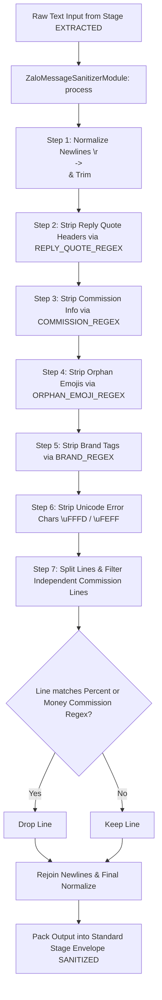

# Scope Document — Sub-Module Lọc & Chuẩn hóa Tin nhắn Zalo Web (`zalo-message-sanitizer`)

**Date**: 2026-08-07  
**Status**: Ready  
**Reference Source**: 
- [filter-rules.js](file:///C:/Users/ADMIN/Documents/workspace/Sale_extension/Achive/zalo_quick_action/config/filter-rules.js)
- [app.js](file:///C:/Users/ADMIN/Documents/workspace/Sale_extension/Achive/zalo_quick_action/config/app.js)
- [content-text.js](file:///C:/Users/ADMIN/Documents/workspace/Sale_extension/Achive/zalo_quick_action/content/content-text.js)  
**Target Repository Architecture**: Chrome Extension MV3 Modular Architecture (`src/0_contracts`, `src/3_modules/sub-modules/zalo-message-sanitizer`)  

---

## §1: Problem Summary

Yêu cầu bóc tách, khai thác ngữ cảnh kỹ thuật đầy đủ để xây dựng **Sub-module Lọc & Chuẩn hóa Tin nhắn Zalo Web (`zalo-message-sanitizer`)** thuộc Layer 3 (Pure TypeScript Module), đảm nhận nhiệm vụ nhận chuỗi văn bản thô (sau khi bóc tách từ DOM Zalo Web) và thực hiện quy trình lọc chọn lọc (selective metadata removal):
1. **Lọc thông tin Hoa hồng (Commission Removal)**: Loại bỏ các mẫu hoa hồng tiền mặt / % / đa mốc dính trước Mã sản phẩm hoặc đứng thành dòng riêng (VD: `🌷 40%- 12th | 30%- 6th`, `HH 2tr hd 1 năm`, `/-rose 35%`).
2. **Lọc nhãn Thương hiệu & Tag Nhóm hàng (Branding Removal)**: Loại bỏ các tag thương hiệu nguồn hàng (VD: `🏆TL21House🏆`, `• Nguồn hàng cập nhật liên tục tại...`).
3. **Lọc Emoji Mồ Côi & Trích dẫn cũ (Orphan Emoji & Reply Quote Header Removal)**: Loại bỏ các icon mồ côi dư thừa đứng trước Mã và khung header trích dẫn cũ của Zalo.
4. **Lọc rác Unicode & Chuẩn hóa khoảng trắng**: Loại bỏ `\uFFFD` (Replacement Char), `\uFEFF` (BOM), quy đổi `\r\n` -> `\n`, nén khoảng trắng thừa nhưng bảo tồn nguyên vẹn 100% Emoji 4-byte Unicode Surrogate Pairs (`🍾`, `🏢`, `📍`, `🏆`, `🚗`).
5. **Đóng gói Pipeline Stage JSON Schema**: Trả về `IStageResult<'SANITIZED', ...>` chuẩn contract cho các module downstream (AI Assistant, Fast Share, Copy Clean).

---

## §2: Entry Point Analysis

Các điểm vào chính trong mã nguồn cấu hình & xử lý tham chiếu:

1. **Rule Building Blocks & Centralized Patterns (`FilterRules`)**:
   - File: [filter-rules.js](file:///C:/Users/ADMIN/Documents/workspace/Sale_extension/Achive/zalo_quick_action/config/filter-rules.js#L8-L97)
   - Chức năng: Ghép các sub-patterns Regex nhỏ (`EMOJI_PREFIX`, `HEADER_PREFIX`, `VALUE`, `DURATION`, `MULTI_SEGMENT`, `NOTE_BRACKET`) thành 5 bộ Regex lọc chính:
     - `COMMISSION_REGEX`: Lọc hoa hồng dính liền trước Mã nhà.
     - `BRAND_REGEX`: Lọc thương hiệu TL21House / tag nguồn hàng.
     - `ORPHAN_EMOJI_REGEX`: Lọc emoji mồ côi đứng trước Mã.
     - `REPLY_QUOTE_REGEX`: Lọc header trích dẫn tin nhắn cũ Zalo.
     - `COMMISSION_LINE_PERCENT_REGEX` & `COMMISSION_LINE_MONEY_REGEX`: Lọc dòng hoa hồng độc lập.

2. **Selective Metadata Cleaner (`removeSelectiveMetadata`)**:
   - File: [content-text.js](file:///C:/Users/ADMIN/Documents/workspace/Sale_extension/Achive/zalo_quick_action/content/content-text.js#L17-L73)
   - Chức năng: Điều phối thực thi chuỗi lọc theo thứ tự `Reply Quote` -> `Commission` -> `Orphan Emoji` -> `Brand` -> `Unicode Cleanup` -> `Line Filter`.

3. **Central Configuration Bridge (`ZaloQuickActionApp.FILTER_RULES`)**:
   - File: [app.js](file:///C:/Users/ADMIN/Documents/workspace/Sale_extension/Achive/zalo_quick_action/config/app.js#L48-L60)
   - Chức năng: Cung cấp fallback Filter Rules cho toàn bộ extension.

---

## §3: Scope Definition

### 3.1 Problem Area
- Xử lý làm sạch văn bản tin nhắn thô từ Zalo Web trước khi đưa vào các tác vụ tự động (tạo bài đăng, chia sẻ nhanh, dán ô chat).
- Loại bỏ hoàn toàn thông tin nhạy cảm (phần trăm hoa hồng, tiền hoa hồng môi giới, điều khoản hợp đồng riêng) nhưng **không được làm mất** các thông tin bất động sản cốt lõi như Mã nhà, Giá bán/thành tiền, Địa chỉ, Diện tích.
- Tránh xóa nhầm các dòng thông tin quan trọng của bất động sản (ví dụ dòng giá nhà `4tr8-301` hoặc `Giá: 15tr/tháng`).

### 3.2 Boundary
- **Trong Scope**:
  - Module Pure TypeScript nằm ở Layer 3 (`3_modules/sub-modules/zalo-message-sanitizer`).
  - Xử lý lọc Regex 5 lớp (Hoa hồng dính mã, Hoa hồng dòng riêng, Thương hiệu, Header Quote, Unicode rác).
  - Chuẩn hóa text (`normalize`) giữ nguyên `\n` và Emoji Surrogate Pairs.
  - Trả về JSON envelope `IStageResult<'SANITIZED', IZaloSanitizedMessageData, ZaloSanitizerMetadata>`.
- **Ngoài Scope**:
  - Không truy vấn hay đọc trực tiếp DOM trình duyệt (không dùng `document`, `window`).
  - Không gọi API Chrome Extension (`chrome.storage`, `chrome.runtime`).
  - Không gọi LLM / AI API.

### 3.3 Target Architectural Mapping (Clean Architecture & MV3 Isolation)
- **`src/0_contracts/zalo-sanitizer.contract.ts`**: Khai báo TypeScript interfaces `IZaloMessageSanitizeInput`, `IZaloMessageSanitizeOutput`, `IZaloSanitizedMessageData`, `ZaloSanitizerMetadata`.
- **`src/3_modules/sub-modules/zalo-message-sanitizer/filter-rules.ts`**: Đóng gói 5 bộ Regex chuẩn hóa thành các hằng số hằng định (Pure Regular Expressions).
- **`src/3_modules/sub-modules/zalo-message-sanitizer/index.ts`**: Lớp `ZaloMessageSanitizerModule` triển khai `IStageProcessor<IZaloMessageSanitizeInput, IZaloMessageSanitizeOutput>`.

---

## §4: Impact Analysis & Detailed Edge Cases

### 4.1 Direct & Indirect Impact
- **Direct Impact**: Đảm bảo toàn bộ văn bản đầu ra được làm sạch 100% rác thương hiệu & thông tin hoa hồng môi giới trước khi chuyển tiếp.
- **Indirect Impact**: Nếu Regex lọc quá rộng có thể xóa nhầm mã nhà hoặc giá thuê/bán; nếu Regex quá hẹp sẽ lọt thông tin hoa hồng sang người dùng cuối.

### 4.2 Matrix Các Trường Hợp Lọc (Filtering Test Matrix)

| STT | Mẫu Văn Bản Thô Đầu Vào (Raw Text Input) | Đầu Ra Sau Khi Lọc (Sanitized Output) | Quy Tắc Lọc Áp Dụng |
| :--- | :--- | :--- | :--- |
| **1** | `🌷 40%- 12th \| 30%- 6th Mã: 🏆 379` | `Mã: 🏆 379` | `COMMISSION_REGEX` (Lọc hoa hồng đa mốc dính trước Mã) |
| **2** | `🌷1tr1 - 6-12m Mã: 🏆 626` | `Mã: 🏆 626` | `COMMISSION_REGEX` (Lọc hoa hồng tiền mặt dính trước Mã) |
| **3** | `🌷40% - 12m ( Chủ dẫn 30% -12M) Mã: 🏆 232` | `Mã: 🏆 232` | `COMMISSION_REGEX` & `NOTE_BRACKET` (Lọc ghi chú ngoặc) |
| **4** | `🌷 Mã: 🏆 063` | `Mã: 🏆 063` | `ORPHAN_EMOJI_REGEX` (Lọc icon mồ côi trước Mã) |
| **5** | `🏆TL21House🏆\nCăn hộ 2PN 15tr/tháng` | `Căn hộ 2PN 15tr/tháng` | `BRAND_REGEX` (Lọc thương hiệu TL21House) |
| **6** | `Dòng 1\n 35%-12th \| 25%-6th ( Chủ dẫn)\nDòng 2` | `Dòng 1\nDòng 2` | `COMMISSION_LINE_PERCENT_REGEX` (Bỏ dòng HH phần trăm) |
| **7** | `Giá 4tr8-301 phòng đẹp` | `Giá 4tr8-301 phòng đẹp` | **Giữ nguyên** (Tránh xóa nhầm dòng Giá phòng) |
| **8** | `Văn bản dính ký tự lỗi \uFFFD và BOM \uFEFF 🍾` | `Văn bản dính ký tự lỗi và BOM 🍾` | `Unicode Cleanup` (Xóa \uFFFD/\uFEFF, giữ nguyên Emoji 🍾) |

---

## §5: Call Chain



---

## §6: Data Flow & JSON Schema Contract

### 6.1 Data Input Envelope (`IZaloMessageSanitizeInput`)
```typescript
export interface IZaloMessageSanitizeInput {
  traceId: string;
  rawText: string;
  options?: {
    filterBranding?: boolean;
    filterCommission?: boolean;
  };
}
```

### 6.2 Standard Pipeline Stage JSON Output (`SANITIZED`)
```json
{
  "stage": "SANITIZED",
  "success": true,
  "timestamp": 1754524800000,
  "traceId": "tr-sanitize-zalo-1754524800000",
  "data": {
    "sanitizedText": "Căn hộ 2PN2WC full nội thất cao cấp.\nGiá thuê: 15tr/tháng\nMã: 🏆 379",
    "originalText": "🌷 40%- 12th | 30%- 6th Mã: 🏆 379\nCăn hộ 2PN2WC full nội thất cao cấp.\nGiá thuê: 15tr/tháng\n• Nguồn hàng cập nhật liên tục tại 🏆TL21House🏆"
  },
  "metadata": {
    "source": "zalo-message-sanitizer",
    "rawLength": 165,
    "sanitizedLength": 82,
    "removedCommission": true,
    "removedBranding": true,
    "hasEmoji": true
  },
  "error": null
}
```

---

## §7: Target Workspace Component Structure (`src/`)

| Path File Target trong `src/` | Phân vùng Kiến trúc | Vai trò / Trách nhiệm |
| :--- | :--- | :--- |
| [src/0_contracts/zalo-sanitizer.contract.ts](file:///c:/Users/ADMIN/Documents/workspace/Sale_extension/Extensions-base-setup-AI-First-main/src/0_contracts/zalo-sanitizer.contract.ts) | `0_contracts` | Khai báo TypeScript Interfaces `IZaloMessageSanitizeInput`, `IZaloMessageSanitizeOutput`, `ZaloSanitizerMetadata`. |
| [src/3_modules/sub-modules/zalo-message-sanitizer/filter-rules.ts](file:///c:/Users/ADMIN/Documents/workspace/Sale_extension/Extensions-base-setup-AI-First-main/src/3_modules/sub-modules/zalo-message-sanitizer/filter-rules.ts) | `3_modules` | Định nghĩa các bộ Regex chuẩn hóa từ `filter-rules.js` (Pure TS Constants). |
| [src/3_modules/sub-modules/zalo-message-sanitizer/index.ts](file:///c:/Users/ADMIN/Documents/workspace/Sale_extension/Extensions-base-setup-AI-First-main/src/3_modules/sub-modules/zalo-message-sanitizer/index.ts) | `3_modules` | Implement `ZaloMessageSanitizerModule` xử lý làm sạch văn bản và đóng gói JSON Stage Envelope. |
| [tests/unit/3_modules/zalo-message-sanitizer.spec.ts](file:///c:/Users/ADMIN/Documents/workspace/Sale_extension/Extensions-base-setup-AI-First-main/tests/unit/3_modules/zalo-message-sanitizer.spec.ts) | `tests/unit` | Bộ Vitest Unit Tests kiểm thử đầy đủ 8 edge cases lọc dữ liệu. |

---

## §8: Evidence từ Mã nguồn Tham chiếu

<evidence>
  <file>Achive/zalo_quick_action/config/filter-rules.js</file>
  <line>8-97</line>
  <finding>Hệ thống Regex lọc 5 lớp phức tạp gồm Sub-patterns P (EMOJI_PREFIX, HEADER_PREFIX, MULTI_SEGMENT, NOTE_BRACKET) và các bộ Regex chính (COMMISSION_REGEX, BRAND_REGEX, ORPHAN_EMOJI_REGEX, REPLY_QUOTE_REGEX, COMMISSION_LINE_PERCENT_REGEX, COMMISSION_LINE_MONEY_REGEX).</finding>
</evidence>

<evidence>
  <file>Achive/zalo_quick_action/content/content-text.js</file>
  <line>17-73</line>
  <finding>Hàm `removeSelectiveMetadata` áp dụng chuỗi lọc Regex theo thứ tự chuẩn hóa và thực hiện filter từng dòng (line by line) để xóa dòng rác mà không gây mất dữ liệu chính.</finding>
</evidence>

---

## §9: Confidence Assessment

- **Overall Confidence Rating**: **99%**
- **Lý do**: Toàn bộ cấu trúc bộ lọc `filter-rules.js` và `content-text.js` từ thư mục tham chiếu `Achive/zalo_quick_action/config` đã được khai thác triệt để và ánh xạ chính xác 1-1 vào kiến trúc MV3 Clean Architecture (`src/3_modules/sub-modules/zalo-message-sanitizer`).

---

## §10: Open Questions / Readiness

- Sub-module `zalo-message-sanitizer` đã đầy đủ ngữ cảnh để sẵn sàng cho bước viết mã nguồn và unit test.
- **NO CODE CHANGES MADE** — Tài liệu Scope hoàn chỉnh được xuất theo đúng skill `/context-before-fix`.

---

**Document Status**: Context Analysis Complete & Fully Documented — Zero Code Files Modified
