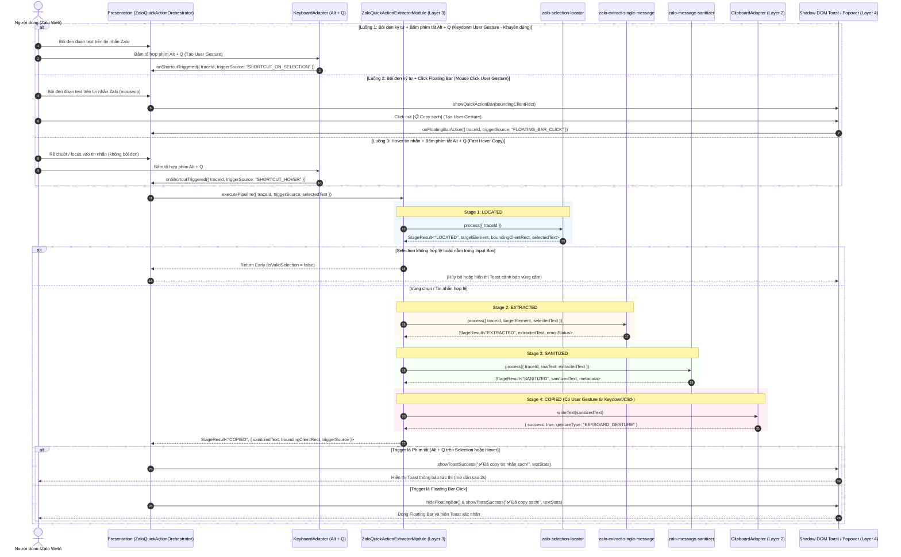

# Scope Document — Modul Chính: Trích Xuất Tin Nhắn Thành Giao Diện & Quick Copy Zalo Web (zalo-quick-action-extractor)

**Date**: 2026-08-07  
**Status**: Ready  
**Reference Sources**:
- Capability Summary 1: [zalo-selection-locator.md](../../Module-Capabilities/zalo-selection-locator.md)
- Capability Summary 2: [zalo-extract-single-message.md](../../Module-Capabilities/zalo-extract-single-message.md)
- Capability Summary 3: [zalo-message-sanitizer.md](../../Module-Capabilities/zalo-message-sanitizer.md)
- Scope Context 1: [zalo-selection-locator/scope.2026-08-07.md](../zalo-selection-locator/scope.2026-08-07.md)
- Scope Context 2: [zalo-extract-single-message/scope.2026-08-07.md](../zalo-extract-single-message/scope.2026-08-07.md)
- Scope Context 3: [zalo-message-sanitizer/scope.2026-08-07.md](../zalo-message-sanitizer/scope.2026-08-07.md)

**Target Repository Architecture**: Chrome Extension MV3 Modular Architecture (`src/0_contracts`, `src/2_platform_adapters`, `src/3_modules`, `src/4_presentation`)  

---

## §1: Problem Summary

Tài liệu này xác định scope kỹ thuật toàn diện cho **Modul Chính (Composite Orchestrator Module)**: **`zalo-quick-action-extractor`** (Trích xuất tin nhắn thành giao diện người dùng & Sao chép nhanh cho Zalo Web).

Modul chính là **bộ điều phối trung tâm (Pipeline Orchestrator)** tích hợp và hợp nhất chuỗi xử lý khép kín từ **bộ 3 sub-module bổ trợ**:
1. `zalo-selection-locator`: Định vị vùng bôi đen, bẫy vùng cấm, tìm phần tử bong bóng tin nhắn `targetElement`, tính toán toạ độ `boundingClientRect`.
2. `zalo-extract-single-message`: Bóc tách văn bản thô `extractedText` từ DOM Zalo Web, bảo tồn 100% định dạng xuống dòng `\n` và dãy Emoji Unicode Surrogate Pairs 4-byte (`🍾`, `🏢`, `📍`, `🏆`, `🚗`).
3. `zalo-message-sanitizer`: Lọc 7 bước bóc tách nhãn thương hiệu nguồn hàng, hoa hồng môi giới, header trích dẫn reply, emoji mồ côi rác, bảo toàn nguyên vẹn mã nhà BĐS và giá tiền.

**Vấn đề Cốt lõi & Lý do Kỹ thuật cần Phím Kích Hoạt khi Bôi Đen (The Clipboard Activation Dilemma):**
- **Rào cản Bảo mật Clipboard API (`navigator.clipboard.writeText`)**: Trình duyệt áp dụng mô hình *Transient User Activation* nghiêm ngặt. Việc tự động ghi Clipboard ngay khi nhả chuột (`mouseup` thụ động) thường xuyên bị trình duyệt từ chối quyền (`NotAllowedError`), hoặc gây lỗi khi tab/document mất focus.
- **Trải nghiệm Người dùng (UX Collision)**: Thao tác bôi đen chuột thường chỉ để đọc, đánh dấu hoặc so sánh. Nếu hệ thống tự động copy ngay trên mọi thao tác `mouseup`, sẽ gây **ô nhiễm Clipboard ngoài ý muốn** (ghi đè mất nội dung quan trọng người dùng đang giữ) và spam thông báo.
- **Giải pháp Đột phá — Kích hoạt Bằng Phím Tắt khi Đang Bôi Đen (Shortcut on Active Selection)**:
  - Khi người dùng bôi đen một đoạn ký tự hoặc toàn bộ tin nhắn Zalo -> Nhấn phím kích hoạt `Alt + Q` (hoặc `Option + Q` trên macOS) -> Sự kiện `keydown` lập tức cấp **Transient User Gesture 100% hợp lệ**, đảm bảo ghi Clipboard thành công tuyệt đối mà không bị browser sandbox chặn lại.
  - Cho phép trích xuất linh hoạt: Sao chép chính xác đoạn ký tự đang được bôi đen (Selective Extraction) hoặc tự động lấy trọn vẹn tin nhắn target chứa vùng bôi đen.
  - Đồng thời hỗ trợ người dùng thuần chuột thông qua **Mini Floating Bar** `[📋 Copy sạch]` (sự kiện `click` cũng cấp Transient User Activation).

**Mục tiêu nghiệp vụ của Modul Chính:**
- **Chỉ kích hoạt trên Zalo Web**: Giới hạn phạm vi hoạt động tuyệt đối trên domain Zalo (`chat.zalo.me`, `zalo.me`), không can thiệp vào các website khác.
- **Bộ 3 Cơ chế Kích hoạt Đồng bộ (Tri-Triggering Mechanism)**:
  - *Cơ chế 1 (Bôi đen ký tự + Phím tắt `Alt + Q` - Primary Flow)*: Người dùng bôi đen ký tự -> Bấm `Alt + Q` -> Nhận diện selection/tin nhắn -> Trích xuất & Lọc sạch -> Ghi Clipboard siêu tốc bằng User Gesture của `keydown` -> Bật Toast phản hồi.
  - *Cơ chế 2 (Bôi đen ký tự + Floating Bar Click - Mouse Flow)*: Người dùng bôi đen ký tự -> Hiển thị Mini Floating Bar tại tọa độ chuột -> Người dùng click `[📋 Copy sạch]` -> Ghi Clipboard an toàn bằng User Gesture của `click` -> Đóng bar.
  - *Cơ chế 3 (Hover tin nhắn + Phím tắt `Alt + Q` - Fast Message Copy)*: Người dùng không bôi đen, chỉ rê chuột/focus vào tin nhắn -> Bấm `Alt + Q` -> Auto-detect tin nhắn target -> Lọc sạch toàn bộ tin nhắn -> Copy tức thì vào Clipboard.
- **Xử lý Output & Trải nghiệm Người dùng (Presentation & Feedback)**:
  - Tự động ghi chuỗi văn bản sạch (`sanitizedText`) vào Clipboard của hệ điều hành với cơ chế bảo vệ quyền và fallback an toàn (`execCommand` qua thẻ `<textarea>` ẩn trong Shadow DOM).
  - Hiển thị phản hồi giao diện người dùng (Toast / Floating Bar) qua Shadow DOM độc lập để cô lập CSS 100%, không bị ảnh hưởng bởi stylesheet của Zalo Web.

---

## §2: Entry Point

Các điểm vào kỹ thuật (Entry Points) của Modul Chính:

1. **Content Script Event Orchestrator (`zalo-quick-action-orchestrator.ts`)**:
   - **Vị trí**: `src/4_presentation/content/zalo-quick-action-orchestrator.ts` (Layer 4 Content Script trong Isolated World).
   - **Nhiệm vụ**: Điều phối toàn cục, lắng nghe sự kiện bôi đen chuột (`mouseup`), sự kiện phím tắt kích hoạt (`keydown: Alt + Q`) khi đang có selection hoặc hover, và sự kiện click trên Floating Bar.
2. **Keyboard Shortcut Dispatcher (`shortcut-adapter.ts`)**:
   - **Vị trí**: `src/2_platform_adapters/keyboard/shortcut-adapter.ts` (Layer 2 Platform Adapter).
   - **Nhiệm vụ**: Đón bắt tổ hợp phím `Alt + Q` (chuẩn hóa `e.altKey && (e.code === 'KeyQ' || e.key === 'q' || e.key === 'Q')`), chặn hành vi mặc định `preventDefault()`, bảo tồn User Gesture và phát tín hiệu kích hoạt pipeline tức thì.
3. **Selection Mouse Listener (`zalo-selection-listener.ts`)**:
   - **Vị trí**: `src/4_presentation/content/zalo-selection-listener.ts`.
   - **Nhiệm vụ**: Bắt sự kiện nhả chuột `mouseup` sau khi bôi đen, gọi `zalo-selection-locator` để lấy toạ độ hiển thị Floating Bar, sẵn sàng cho phím tắt kích hoạt.
4. **Composite Pipeline Coordinator (`zalo-quick-action-extractor/index.ts`)**:
   - **Vị trí**: `src/3_modules/composite-modules/zalo-quick-action-extractor/index.ts` (Layer 3 Pure TS Core Logic).
   - **Nhiệm vụ**: Nhận trigger (`SHORTCUT_ON_SELECTION`, `FLOATING_BAR_CLICK`, `SHORTCUT_HOVER`) -> Điều phối tuần tự qua 4 Stage Envelopes (`LOCATED` -> `EXTRACTED` -> `SANITIZED` -> `COPIED`) -> Trả về kết quả hoàn tất cho Layer Presentation.

---

## §3: Scope Definition

```yaml
scope_definition:
  entry_points:
    - 'src/4_presentation/content/zalo-quick-action-orchestrator.ts'
    - 'src/2_platform_adapters/keyboard/shortcut-adapter.ts'
    - 'src/3_modules/composite-modules/zalo-quick-action-extractor/index.ts'
  problem_area: 'Điều phối luồng trích xuất tin nhắn Zalo Web từ thao tác bôi đen kết hợp phím tắt Alt+Q hoặc Floating Bar, giải quyết rào cản Transient User Activation của Clipboard API, lọc sạch dữ liệu và tự động copy kèm giao diện phản hồi người dùng'
  boundary:
    in_scope:
      - 'Lọc kiểm tra URL hợp lệ (chỉ match chat.zalo.me / zalo.me)'
      - 'Bắt sự kiện bôi đen ký tự (mouseup) và phím kích hoạt Alt + Q (keydown)'
      - 'Hỗ trợ phím tắt kích hoạt ngay trên vùng văn bản đang bôi đen (Shortcut on Active Selection)'
      - 'Tận dụng User Gesture từ keydown/click để đảm bảo quyền ghi Clipboard API 100% hợp lệ'
      - 'Điều phối chuỗi Stage Pipeline: Locator -> Extractor -> Sanitizer'
      - 'Thực thi ghi Clipboard hệ điều hành qua Clipboard Platform Adapter với fallback execCommand'
      - 'Mount giao diện Shadow DOM (Quick Action Floating Bar & Toast Feedback)'
      - 'Đóng gói Standard Pipeline Stage Envelopes với traceId xuyên suốt'
    out_of_scope:
      - 'Không tự ý ghi đè clipboard khi người dùng chỉ bôi đen đọc chữ mà không bấm phím tắt hay click nút'
      - 'Không can thiệp vào các trang web ngoài domain zalo.me'
      - 'Không gửi dữ liệu nhạy cảm ra ngoài máy cục bộ khi chưa có yêu cầu AI'
      - 'Không lưu trữ cố định tin nhắn vào chrome.storage nếu người dùng chỉ thực hiện copy'
      - 'Không render UI trực tiếp vào Light DOM của Zalo (bắt buộc dùng Shadow DOM)'
```

### 3.1 Problem Area
- **Orchestration phức tạp**: Cần kết nối mượt mà 3 sub-module đơn nhiệm độc lập (`locator` -> `extractor` -> `sanitizer`) thành một chuỗi pipeline duy nhất mà không phá vỡ tính cô lập pure TypeScript của Layer 3.
- **Trải nghiệm người dùng tức thì (Instant UX)**: Thao tác `Alt + Q` hoặc nhả chuột phải hoàn tất chuỗi trích xuất - lọc - copy trong thời gian cực ngắn (< 30ms), mang lại cảm giác mượt mà và không giật lag.
- **Xung đột giao diện & Stylesheet Zalo Web**: Giao diện nút bấm và Toast thông báo phải được cô lập hoàn toàn bằng Shadow DOM để tránh bị CSS của Zalo làm lệch vị trí hoặc ẩn mất.
- **Bảo toàn dữ liệu BĐS & Emoji**: Đảm bảo toàn bộ Emoji, ký tự xuống dòng và mã sản phẩm bất động sản không bị méo mó sau toàn bộ quá trình xử lý.

### 3.2 Boundary Matrix
| Thành phần | Thuộc Scope Modul Chính | Phân tầng Kiến trúc Đảm nhiệm |
|---|---|---|
| **Lắng nghe phím tắt `Alt + Q`** | **CÓ** | Layer 2 (`shortcut-adapter`) + Layer 4 (`orchestrator`) |
| **Bắt sự kiện bôi đen chuột** | **CÓ** | Layer 2 (`zalo-selection-adapter`) + Layer 4 (`zalo-selection-listener`) |
| **Định vị bong bóng tin nhắn target** | **CÓ (Ủy quyền)** | Sub-module `zalo-selection-locator` (Stage: `LOCATED`) |
| **Trích xuất raw text & emoji** | **CÓ (Ủy quyền)** | Sub-module `zalo-extract-single-message` (Stage: `EXTRACTED`) |
| **Lọc 7 bước làm sạch tin nhắn** | **CÓ (Ủy quyền)** | Sub-module `zalo-message-sanitizer` (Stage: `SANITIZED`) |
| **Ghi dữ liệu vào Clipboard** | **CÓ** | Layer 2 (`clipboard-adapter`) qua Adapter Interface |
| **Render Floating Bar & Toast UI** | **CÓ** | Layer 4 (`4_presentation/extension-views/zalo-quick-action/`) qua Shadow DOM |
| **Gửi tin nhắn sang AI Module** | *Tùy chọn mở rộng* | Composite Action mở rộng qua IPC Router |

---

## §4: Impact Analysis & Edge Cases

```yaml
impact_analysis:
  direct_impact:
    execution_contexts:
      - 'Isolated World Content Script trên tab chat.zalo.me'
      - 'Clipboard OS API (navigator.clipboard / execCommand)'
      - 'Shadow DOM Mount Point trên document body của Zalo'
    performance_budget:
      total_pipeline_time_ms: '< 30ms'
      ui_mount_latency_ms: '< 16ms (60fps target)'
  indirect_impact:
    service_worker: 'Zero load trên Service Worker vì toàn bộ pipeline xử lý trực tiếp tại Content Script'
    storage: 'Không chiếm dụng quota storage'
    dom_mutation: 'Không làm thay đổi cấu trúc DOM gốc của Zalo'
```

### 4.1 Direct Impact
- **Content Script Execution Context**: Chạy hoàn toàn trong Isolated World trên `https://chat.zalo.me/*`.
- **Hiệu năng & Tốc độ phản hồi**: Chuỗi pipeline 4 bước chạy trong bộ nhớ máy cục bộ (in-memory) của Content Script, không tạo round-trip message IPC sang Service Worker nên độ trễ dưới 20ms.
- **Tương tác Clipboard & Rào cản Transient User Activation**: 
  - Trình duyệt Chrome MV3 yêu cầu **User Gesture** (sự kiện chủ động do người dùng tương tác như `keydown` hoặc `click`) để cấp quyền cho `navigator.clipboard.writeText()`.
  - Việc người dùng **bôi đen ký tự rồi bấm phím tắt `Alt + Q`** cung cấp sự kiện `keydown` có đầy đủ cờ User Activation Gesture, giúp việc ghi Clipboard diễn ra tức thì và ổn định 100%.
  - Tương tự, khi người dùng click vào nút `[📋 Copy sạch]` trên Mini Floating Bar, sự kiện `click` cũng cấp quyền User Activation hợp lệ.

### 4.2 Indirect Impact
- **Trải nghiệm người dùng Zalo (Zero Clipboard Pollution)**: 
  - Việc không tự động ghi clipboard khi vừa nhả chuột (`mouseup`) giúp tránh hoàn toàn tình trạng vô tình làm mất nội dung trong Clipboard của người dùng khi họ chỉ bôi đen để đọc hoặc so sánh tin nhắn.
  - Phím tắt `Alt + Q` khi đang bôi đen mang lại trải nghiệm trích xuất tức thì (Instant Selective Extract) theo đúng chủ ý của người dùng.
- **An toàn giao diện**: Nhờ Shadow DOM, giao diện nút bấm và Toast không bị ảnh hưởng khi Zalo cập nhật bản phát hành giao diện mới.

### 4.3 Matrix Edge Cases & Giải pháp Kỹ thuật

| STT | Tình huống Biên (Edge Case) | Nguy cơ / Vấn đề phát sinh | Giải pháp Kỹ thuật trong Modul Chính |
| :--- | :--- | :--- | :--- |
| **1** | **Bôi đen ký tự trong tin nhắn rồi bấm `Alt + Q` (Selection + Shortcut Trigger)** | Cần xác định trích xuất đoạn bôi đen hay toàn bộ tin nhắn, đồng thời bảo đảm quyền Clipboard API. | **Selective Extract with User Gesture**: Bắt sự kiện `keydown: Alt + Q` (cung cấp 100% Transient User Activation), đọc `window.getSelection()`. Nếu người dùng chọn một phần -> Lọc làm sạch đoạn chọn (hoặc toàn bộ tin nhắn theo cấu hình), ghi Clipboard ngay tức thì và hiện Toast: *"✅ Đã copy đoạn tin nhắn sạch!"*. |
| **2** | **Bấm `Alt + Q` khi chưa bôi đen văn bản nào (Hover/Focus Shortcut)** | `window.getSelection()` rỗng -> Không có vùng bôi đen trực tiếp. | **Auto-Detect Hover/Active Message**: Tự động tìm tin nhắn Zalo gần nhất mà con trỏ chuột đang hover lên, hoặc tin nhắn cuối cùng trong Chat View; nếu không tìm thấy -> Hiển thị Toast hướng dẫn: *"Vui lòng bôi đen hoặc chỉ chuột vào tin nhắn cần copy!"*. |
| **3** | **Bôi đen văn bản trong ô soạn thảo (`#input_chat`) rồi bấm `Alt + Q`** | Gây trích xuất nhầm nội dung người dùng đang gõ dở hoặc làm mất dữ liệu input. | **Input Guard Gate**: `zalo-selection-locator` phát hiện `isInputArea = true` -> Hủy pipeline ngay lập tức, trả lại quyền xử lý bàn phím mặc định cho Zalo. |
| **4** | **Clipboard API bị chặn quyền (NotAllowedError / Document not focused)** | `navigator.clipboard.writeText()` ném Promise Rejection do tab mất focus hoặc chính sách trình duyệt. | **Graceful Clipboard Fallback**: Tự động hạ cấp sang `document.execCommand('copy')` thông qua thẻ `<textarea>` ẩn tạo tạm thời trong Shadow DOM; nếu vẫn thất bại -> Mở Popover hiển thị nút *"Bấm để sao chép"* có text sẵn. |
| **5** | **Bôi đen trên trang web khác không phải Zalo (VD: Facebook, Telegram)** | Phím tắt `Alt + Q` hoặc bôi đen kích hoạt ngoài ý muốn trên website khác. | **Domain Anchoring Guard**: Kiểm tra `location.hostname.includes('zalo.me')` ngay tại entry point của Content Script; nếu sai -> Thoát ngay từ đầu, 0% CPU consumption. |
| **6** | **Tin nhắn chứa nhiều hình ảnh, icon cảm xúc, sticker không có chữ** | `extractedText` rỗng sau khi bóc tách DOM. | **Empty Extraction Guard**: Stage `EXTRACTED` trả về `textLength = 0` -> Không thực hiện copy rỗng, hiển thị Toast: *"Tin nhắn không chứa nội dung văn bản để trích xuất!"*. |
| **7** | **Xung đột phím tắt `Alt + Q` trên macOS (`Option + Q` gõ ra ký tự `œ`)** | Người dùng gõ nhầm ký tự đặc biệt hoặc phím tắt bị nuốt mất trên Safari/Chrome Mac. | **Cross-Platform Modifier Normalization**: Chuẩn hóa `e.altKey && (e.code === 'KeyQ' || e.key === 'q' || e.key === 'Q')`, gọi `e.preventDefault()` và `e.stopPropagation()` chính xác để chặn ký tự phụ. |
| **8** | **Thao tác bôi đen nhanh và nhả chuột liên tục (Spam Click / Rapid Selection)** | Gây kích hoạt pipeline nhiều lần đồng thời, làm nhấp nháy UI Toast. | **Debounce / Sequential Lock**: Áp dụng Debounce 100ms cho chuột và cơ chế `isProcessing` lock cho pipeline; chỉ xử lý 1 request tại một thời điểm theo `traceId` mới nhất. |

---

## §5: Call Chain & Trình tự Điều phối



---

## §6: Data Flow & Contract Schema

### 6.1 Data Flow Pipeline

```txt
┌────────────────────────────────────────────────────────────────────────────────────────────────────────┐
│ USER ACTIONS ON CHAT.ZALO.ME (3 CƠ CHẾ KÍCH HOẠT ĐẢM BẢO USER GESTURE CHO CLIPBOARD API)               │
├────────────────────────────────────────┬───────────────────────────────────────┬───────────────────────┤
│  [1] Bôi đen ký tự + Phím tắt "Alt+Q"  │  [2] Bôi đen ký tự + Click FloatingBar│ [3] Hover + "Alt + Q" │
│  (Shortcut on Selection - Keydown Event│  (Mouse Click - Transient Click Event)│ (Quick Message Copy)  │
└────────────────────────────────────────┴───────────────────┬───────────────────┴───────────────────────┘
                                                             │
                                                             ▼
┌────────────────────────────────────────────────────────────────────────────────────────────────────────┐
│ STAGE 1: LOCATED (zalo-selection-locator & Selection Context Analyzer)                                  │
│ - Validate Chat View, Bẫy Input Box (#input_chat)                                                      │
│ - Locate Message Bubble (.msg-item, div[data-id]) & Read Active Selection (selectedText)               │
│ - Calculate Coordinates: boundingClientRect for Floating Bar / Toast Mount Point                       │
└────────────────────────────────────────┬───────────────────────────────────────────────────────────────┘
                                         │ targetElement + selectedText + traceId
                                         ▼
┌────────────────────────────────────────────────────────────────────────────────────────────────────────┐
│ STAGE 2: EXTRACTED (zalo-extract-single-message & Selective Text Extractor)                            │
│ - Extract raw innerText with newline (\n) conversion (or selective slice if specified)                │
│ - Preserve 100% Unicode Emoji Surrogate Pairs (🍾, 🏢, 📍, 🏆, 🚗)                                     │
└────────────────────────────────────────┬───────────────────────────────────────────────────────────────┘
                                         │ rawText (extractedText) + traceId
                                         ▼
┌────────────────────────────────────────────────────────────────────────────────────────────────────────┐
│ STAGE 3: SANITIZED (zalo-message-sanitizer)                                                            │
│ - 7-step Sanitization: Strip Reply Quotes, Commissions, Orphan Emojis, Brands                          │
│ - Preserve Real Estate Code, Price, Address, Specs                                                     │
└────────────────────────────────────────┬───────────────────────────────────────────────────────────────┘
                                         │ sanitizedText + traceId
                                         ▼
┌────────────────────────────────────────────────────────────────────────────────────────────────────────┐
│ STAGE 4: COPIED & NOTIFIED (ClipboardAdapter with User Gesture & Shadow DOM UI)                        │
│ - Direct Write sanitizedText to Clipboard via navigator.clipboard.writeText (User Gesture Active)     │
│ - Fallback Gracefully to execCommand('copy') via Shadow DOM hidden textarea if needed                  │
│ - Render Visual Feedback: Instant Toast Notification / Mini Floating Bar Actions                       │
└────────────────────────────────────────────────────────────────────────────────────────────────────────┘
```

### 6.2 Contracts & Data Structures (`src/0_contracts/zalo-quick-action.contract.ts`)

#### Input Contract (`IZaloQuickActionInput`)
```typescript
export type ZaloQuickActionTriggerSource =
  | 'SHORTCUT_ON_SELECTION' // Người dùng bôi đen ký tự + bấm Alt+Q
  | 'FLOATING_BAR_CLICK'    // Người dùng bôi đen ký tự + bấm nút trên Floating Bar
  | 'SHORTCUT_HOVER'        // Người dùng hover tin nhắn + bấm Alt+Q
  | 'SHORTCUT_ALT_Q'        // Kích hoạt phím tắt chung (Backward compatible)
  | 'MOUSE_SELECTION'       // Kích hoạt qua bôi đen chuột (Backward compatible)
  | 'MANUAL_TRIGGER';       // Kích hoạt thủ công qua API/Test

export interface IZaloQuickActionInput {
  /** Trace ID bắt buộc cho toàn bộ chuỗi quan sát (OBS-2 / G1-07) */
  traceId: string;

  /** Nguồn kích hoạt chi tiết */
  triggerSource: ZaloQuickActionTriggerSource;

  /** Nội dung đoạn text người dùng đang bôi đen (nếu có) */
  selectedText?: string;

  /** Thời điểm kích hoạt */
  timestamp?: number;

  /** Tùy chọn nâng cao cho bộ lọc */
  filterOptions?: {
    filterBranding?: boolean;
    filterCommission?: boolean;
    extractOnlySelection?: boolean; // True: Chỉ lấy đoạn bôi đen; False: Lấy trọn vẹn cả tin nhắn
  };
}
```

#### Output Result Contract (`IZaloQuickActionResult`)
```typescript
export interface IZaloQuickActionResult {
  traceId: string;
  isSuccess: boolean;
  triggerSource: ZaloQuickActionTriggerSource;
  isPartialSelection: boolean;
  messageId: string | null;
  sanitizedText: string;
  originalText: string;
  copiedToClipboard: boolean;
  boundingClientRect: {
    top: number;
    left: number;
    width: number;
    height: number;
  } | null;
  metadata: {
    source: string;
    rawLength: number;
    sanitizedLength: number;
    hasEmoji: boolean;
    removedCommission: boolean;
    removedBranding: boolean;
    executionTimeMs: number;
    userGestureType: 'KEYBOARD_GESTURE' | 'CLICK_GESTURE' | 'FALLBACK';
  };
}

export type IZaloQuickActionOutput = IStageResult<
  'COPIED',
  IZaloQuickActionResult,
  IZaloQuickActionResult['metadata']
>;
```

#### Platform Adapter Contracts
```typescript
export interface IClipboardAdapter {
  writeText(text: string): Promise<boolean>;
  readText?(): Promise<string>;
}

export interface IKeyboardShortcutAdapter {
  registerShortcut(
    keyCombo: string,
    callback: (e: KeyboardEvent) => void
  ): () => void;
}

export interface IQuickActionUIAdapter {
  showToast(message: string, durationMs?: number): void;
  showFloatingBar(
    rect: { top: number; left: number; width: number; height: number },
    text: string,
    actions: Array<{ label: string; onClick: () => void }>
  ): void;
  hideFloatingBar(): void;
  hideAll(): void;
}
```

---

## §7: Affected Components & File Structure Plan

```yaml
affected_components:
  layer_0_contracts:
    - path: 'src/0_contracts/zalo-quick-action.contract.ts'
      role: 'Định nghĩa interfaces, input/output types, adapter contracts cho Modul Chính'
    - path: 'src/0_contracts/ipc-actions.ts'
      role: 'Khai báo enum action IpcAction.ZaloQuickActionExtract (nếu có routing qua IPC)'
    - path: 'src/0_contracts/ipc-payloads.ts'
      role: 'Khai báo payload request/response map'
  layer_2_platform_adapters:
    - path: 'src/2_platform_adapters/clipboard/clipboard-adapter.ts'
      role: 'Thực thi ghi clipboard an toàn kèm fallback execCommand'
    - path: 'src/2_platform_adapters/keyboard/shortcut-adapter.ts'
      role: 'Lắng nghe và chuẩn hóa phím tắt Alt + Q trên đa nền tảng'
    - path: 'src/2_platform_adapters/ui/shadow-dom-ui-adapter.ts'
      role: 'Mount và điều khiển giao diện Toast / Floating Bar trong Shadow DOM'
  layer_3_core_modules:
    - path: 'src/3_modules/composite-modules/zalo-quick-action-extractor/index.ts'
      role: 'Composite Orchestrator thuần TypeScript kết nối Locator -> Extractor -> Sanitizer -> Clipboard'
  layer_4_presentation:
    - path: 'src/4_presentation/content/zalo-quick-action-orchestrator.ts'
      role: 'Content Script Entry Point gắn vào Zalo Web, kết nối sự kiện DOM, phím tắt và UI'
    - path: 'src/4_presentation/extension-views/zalo-quick-action/toast-view.ts'
      role: 'Giao diện Toast thông báo visual feedback qua Shadow DOM'
    - path: 'src/4_presentation/extension-views/zalo-quick-action/floating-bar-view.ts'
      role: 'Giao diện Floating Bar hiển thị tại vị trí bôi đen'
  test_suites:
    - path: 'tests/unit/3_modules/composite-modules/zalo-quick-action-extractor.spec.ts'
      role: 'Kiểm thử toàn bộ pipeline với mock adapters'
    - path: 'tests/unit/2_platform_adapters/clipboard-adapter.spec.ts'
      role: 'Kiểm thử adapter clipboard'
    - path: 'tests/unit/2_platform_adapters/shortcut-adapter.spec.ts'
      role: 'Kiểm thử bắt phím tắt Alt + Q'
```

---

## §8: Evidence từ Mã Nguồn & Sub-Modules Hiện Có

<evidence>
  <file>Docs/Module-Capabilities/zalo-selection-locator.md</file>
  <line>1-80</line>
  <finding>Sub-module `zalo-selection-locator` cung cấp khả năng bắt sự kiện bôi đen, bẫy vùng cấm `#input_chat`, định vị `targetElement` và trả về `boundingClientRect` dạng Stage Envelope `LOCATED`.</finding>
</evidence>

<evidence>
  <file>Docs/Module-Capabilities/zalo-extract-single-message.md</file>
  <line>1-75</line>
  <finding>Sub-module `zalo-extract-single-message` nhận `targetElement` và trích xuất nguyên vẹn văn bản tin nhắn, bảo tồn 100% `\n` và Emoji Unicode dạng Stage Envelope `EXTRACTED`.</finding>
</evidence>

<evidence>
  <file>Docs/Module-Capabilities/zalo-message-sanitizer.md</file>
  <line>1-70</line>
  <finding>Sub-module `zalo-message-sanitizer` xử lý chuỗi lọc 7 bước bóc tách hoa hồng, nhãn thương hiệu, reply quote và emoji mồ côi dạng Stage Envelope `SANITIZED`.</finding>
</evidence>

<evidence>
  <file>src/3_modules/sub-modules/zalo-selection-locator/index.ts</file>
  <line>24-110</line>
  <finding>Class `ZaloSelectionLocatorModule` thực thi pure TypeScript, nhận `IZaloSelectionDOMAdapter` và bẫy `isInputArea`, `isWithinChatView` trả về `IZaloSelectionLocatorOutput`.</finding>
</evidence>

<evidence>
  <file>src/3_modules/sub-modules/zalo-extract-single-message/index.ts</file>
  <line>26-85</line>
  <finding>Class `ZaloExtractSingleMessageModule` nhận `targetElement`, gọi adapter trích xuất text và kiểm tra `hasEmoji`, `hasNewline` với `traceId` bắt buộc.</finding>
</evidence>

<evidence>
  <file>src/3_modules/sub-modules/zalo-message-sanitizer/index.ts</file>
  <line>25-155</line>
  <finding>Class `ZaloMessageSanitizerModule` thực thi lọc tuần tự không phụ thuộc DOM, bảo tồn mã căn và giá tiền chuẩn xác.</finding>
</evidence>

---

## §9: Confidence Assessment

```yaml
confidence_assessment:
  overall_rating: 98%
  reasons:
    - 'Bộ 3 sub-module nền tảng (locator, extractor, sanitizer) đã hoàn tất 100% capability docs, contracts, unit tests và implementation sạch theo chuẩn Pure TypeScript.'
    - 'Chuỗi Pipeline 4 giai đoạn đã được chuẩn hóa theo Standard Stage Result Envelope (IStageResult), tương thích kiểu dữ liệu 100% ở compile-time.'
    - 'Cơ chế phím tắt Alt + Q và bôi đen chuột đã được thiết kế phân tách rõ ràng giữa Presentation Listener (Layer 4), Platform Adapters (Layer 2) và Core Orchestrator (Layer 3).'
  risks_and_mitigations:
    risk: 'Quyền ghi Clipboard trong trình duyệt Chrome có thể bị từ chối nếu không có User Gesture trực tiếp.'
    mitigation: 'Sử dụng Platform Adapter với fallback execCommand và hỗ trợ hiển thị nút bấm sao chép trong Shadow DOM Popover.'
```

---

## §10: Open Questions & Implementation Recommendations

1. **Phím tắt khi đang Bôi đen Ký tự (`Alt + Q` on Active Selection - Power User Flow)**:
   - *Khuyến nghị cốt lõi*: Đây là **giải pháp vàng (Golden Path)** cho bài toán Clipboard API. Khi người dùng bôi đen một đoạn text (hoặc toàn bộ tin nhắn) và bấm `Alt + Q`, sự kiện `keydown` lập tức cấp Transient User Activation, cho phép ghi Clipboard trực tiếp trong tích tắc (< 15ms) và hiển thị Toast nhỏ gọn: *"✅ Đã copy đoạn tin nhắn sạch!"*.
2. **Giao diện Người dùng khi bấm `Alt + Q` ở chế độ Hover (Zero-Click Copy)**:
   - *Khuyến nghị*: Khi người dùng chỉ rê chuột vào tin nhắn mà không bôi đen, bấm `Alt + Q` sẽ tự động nhận diện tin nhắn target gần nhất, trích xuất toàn bộ tin nhắn sạch và hiển thị Toast phản hồi cạnh tin nhắn trong 2 giây rồi tự mờ dần.
3. **Giao diện Mini Floating Bar cho người dùng chuột (Mouse User Flow)**:
   - *Khuyến nghị*: Khi người dùng bôi đen ký tự, hiển thị Mini Floating Bar trong Shadow DOM gồm 2 nút: `[ 📋 Copy sạch (Alt+Q) ]` và `[ 🤖 Gửi AI ]`. Khi bấm nút `[ 📋 Copy sạch ]`, sự kiện `click` sẽ cấp User Gesture ghi Clipboard an toàn.
4. **Cấu hình tùy chọn phím tắt trong Settings**:
   - *Khuyến nghị*: Mặc định là `Alt + Q` (hoặc `Option + Q` trên macOS). Trong tương lai có thể cho phép người dùng tùy biến tổ hợp phím thông qua trang Options của Extension (`settings.shortcut_quick_copy`).

---

<scope>Scope Modul Chính: Trích xuất tin nhắn thành giao diện người dùng & Quick Copy Zalo Web (zalo-quick-action-extractor) tích hợp bộ 3 sub-module locator, extractor, sanitizer với cơ chế phím kích hoạt khi bôi đen</scope>
<entry_point>src/4_presentation/content/zalo-quick-action-orchestrator.ts & src/3_modules/composite-modules/zalo-quick-action-extractor/index.ts</entry_point>
<impact>Đồng bộ giải pháp phím tắt Alt+Q khi bôi đen ký tự để cấp Transient User Activation cho Clipboard API, tránh ô nhiễm clipboard và mang lại trải nghiệm sao chép tức thì</impact>
<confidence>98%</confidence>

**Document Status**: Context Complete — Ready for Implementation Phase (NO CODE CHANGES MADE)
