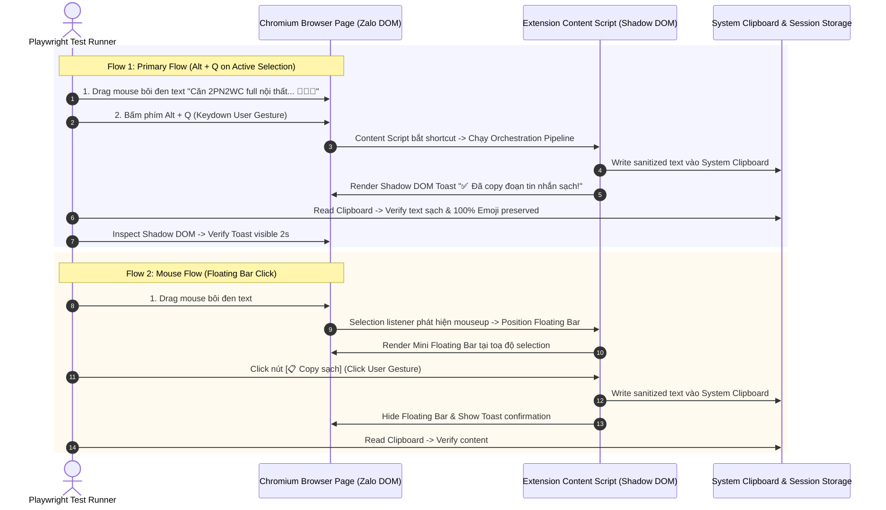

# Thiết Kế Kiểm Thử Toàn Diện (Unit Test & E2E Test Specification) — Modul `zalo-quick-action-extractor`

**Modul Chính**: `zalo-quick-action-extractor` (Trích Xuất Tin Nhắn Thành Giao Diện & Quick Copy Zalo Web)  
**Ngày tạo**: 2026-08-08  
**Trạng thái**: Ready for Implementation & Test Automation  
**Tài liệu tham chiếu**: [scope.2026-08-07.md](file:///c:/Users/ADMIN/Documents/workspace/Sale_extension/Extensions-base-setup-AI-First-main/Docs/context-to-work/zalo-quick-action-extractor/scope.2026-08-07.md)  
**Kiến trúc mục tiêu**: Chrome Extension MV3 Modular Architecture (`src/0_contracts`, `src/2_platform_adapters`, `src/3_modules`, `src/4_presentation`)  

---

## §1: Chiến Lược & Nguyên Tắc Kiểm Thử (Testing Strategy & Principles)

Tài liệu này quy định chi tiết kịch bản và môi trường kiểm thử cho **Modul Chính `zalo-quick-action-extractor`** kết hợp 2 tầng công cụ chính có sẵn trong repository:
1. **Vitest (Unit Tests)**: Tập trung kiểm thử đơn vị độc lập tại **Layer 3 (`3_modules/`)** (Pure TypeScript, 0% phụ thuộc DOM/Browser API) và **Layer 2 (`2_platform_adapters/`)** (Mocking Browser APIs).
2. **Playwright (E2E Tests)**: Tập trung kiểm thử tích hợp giao diện và luồng tương tác thực tế tại **Layer 4 (`4_presentation/`)** trong môi trường trình duyệt Chromium với extension MV3 thật, thao tác trực tiếp trên DOM giả lập Zalo Web (`chat.zalo.me`).

### Nguyên tác Cốt lõi (Core Testing Principles)
- **Binary Quality Gates (Pass/Fail 100%)**: Không chấp nhận kiểm thử cảm quan hoặc log mơ hồ. Mọi test case phải có khẳng định (assertion) rõ ràng, kiểm tra đúng kết quả Stage Envelope (`IStageResult`), `traceId` xuyên suốt và cờ User Activation.
- **Xác nhận Transient User Activation**: Kiểm thử thực tế xem phím tắt `Alt + Q` (`keydown`) và Floating Bar (`click`) có cấp đủ User Gesture cho Clipboard API (`navigator.clipboard.writeText`) hoạt động 100% hay không.
- **Graceful Fallback Verification**: Giả lập tình huống Clipboard API bị từ chối quyền (`NotAllowedError`) để kiểm chứng cơ chế hạ cấp sang `execCommand('copy')` qua thẻ `<textarea>` ẩn trong Shadow DOM.
- **Phân tách Tầng Cô Lập**: Unit Test trong `3_modules/` tuyệt đối không import `chrome.*`, `window` hay `document` (enforced bởi Hook Gate G1-06).

---

## §2: Thiết Kế Unit Test với Vitest (Layer 3 & Layer 2)

### 2.1 Cấu trúc Tập tin Unit Test
- `tests/unit/3_modules/composite-modules/zalo-quick-action-extractor.spec.ts`: Test Suite cho Composite Pipeline Orchestrator (Layer 3).
- `tests/unit/2_platform_adapters/clipboard-adapter.spec.ts`: Test Suite cho Clipboard Platform Adapter (Layer 2).
- `tests/unit/2_platform_adapters/shortcut-adapter.spec.ts`: Test Suite cho Keyboard Shortcut Listener (Layer 2).
- `tests/unit/2_platform_adapters/shadow-dom-ui-adapter.spec.ts`: Test Suite cho Shadow DOM Mount & View Controller (Layer 2).

---

### 2.2 Test Cases Chi Tiết cho Composite Orchestrator (`zalo-quick-action-extractor.spec.ts`)

#### Suite 1: Luồng Chạy Chuỗi Stage Envelopes (Success Path)
*Mục tiêu: Đảm bảo 4 Stage (`LOCATED` -> `EXTRACTED` -> `SANITIZED` -> `COPIED`) biến đổi đúng hợp đồng dữ liệu và giữ nguyên `traceId`.*

- **UT-ORCH-01: Thao tác Bôi Đen Đoạn Văn Bản + Phím Tắt `Alt + Q` (Selective Extraction)**
  - **Input**: `IZaloQuickActionInput` với `triggerSource: 'SHORTCUT_ON_SELECTION'`, `selectedText: 'Căn 2PN giá 15tr 🍾0901234567'`, `traceId: 'trace-ut-01'`.
  - **Mock Sub-modules**:
    - `zalo-selection-locator`: Trả về `stage: 'LOCATED'`, `isValidSelection: true`, `targetElement: mockBubble`.
    - `zalo-extract-single-message`: Trả về `stage: 'EXTRACTED'`, `extractedText: 'Căn 2PN giá 15tr 🍾0901234567'`.
    - `zalo-message-sanitizer`: Trả về `stage: 'SANITIZED'`, `sanitizedText: 'Căn 2PN giá 15tr 🍾0901234567'`.
    - `ClipboardAdapter`: Trả về `{ success: true, gestureType: 'KEYBOARD_GESTURE' }`.
  - **Assertion**:
    - Result `stage` là `'COPIED'`, `isSuccess` = `true`.
    - `traceId` trong tất cả stage envelope đều bằng `'trace-ut-01'`.
    - `isPartialSelection` = `true`.
    - `sanitizedText` trùng khớp đầu ra của sanitizer.

- **UT-ORCH-02: Thao tác Hover Tin Nhắn + Phím Tắt `Alt + Q` (Full Message Copy)**
  - **Input**: `triggerSource: 'SHORTCUT_HOVER'`, `selectedText: undefined`, `traceId: 'trace-ut-02'`.
  - **Assertion**:
    - `zalo-selection-locator` nhận dạng tin nhắn hover target.
    - `isPartialSelection` = `false`.
    - Trích xuất toàn bộ nội dung tin nhắn bubble chứa hover target.

- **UT-ORCH-03: Thao tác Click Nút `[📋 Copy sạch]` trên Mini Floating Bar**
  - **Input**: `triggerSource: 'FLOATING_BAR_CLICK'`, `traceId: 'trace-ut-03'`.
  - **Assertion**:
    - Executed với `userGestureType` = `'CLICK_GESTURE'`.
    - `copiedToClipboard` = `true`.

---

#### Suite 2: Bẫy Điểm Lỗi & Edge Cases Guard Gates
*Mục tiêu: Đảm bảo các Guard Gate chặn đứng request không hợp lệ và trả về kết quả an toàn.*

- **UT-ORCH-04: Bẫy Ô Soạn Thảo Tin Nhắn (`#input_chat`) (Input Guard Gate)**
  - **Input**: `selectedText` nằm trong phần tử `#input_chat`.
  - **Mock Locator**: Trả về `isInputArea: true`, `isValidSelection: false`.
  - **Assertion**:
    - Pipeline dừng ngay tại Stage 1 (`LOCATED`).
    - `isSuccess` = `false`, không gọi sang Extractor/Sanitizer hay Clipboard Adapter.
    - Trả về lý do hủy: `'SELECTION_INSIDE_INPUT_AREA'`.

- **UT-ORCH-05: Bẫy Tin Nhắn Rỗng / Chỉ Có Sticker (Empty Extraction Guard)**
  - **Input**: Tin nhắn Zalo chỉ chứa ảnh/sticker, không có text.
  - **Mock Extractor**: Trả về `extractedText: ''`, `textLength: 0`.
  - **Assertion**:
    - Dừng tại Stage 2 (`EXTRACTED`).
    - `isSuccess` = `false`, không gọi Clipboard Adapter ghi text rỗng.
    - Trả về lý do hủy: `'EMPTY_EXTRACTED_TEXT'`.

- **UT-ORCH-06: Khóa Hàng Chờ Tuần Tự (Debounce & Sequential Processing Lock)**
  - **Input**: Gửi liên tiếp 3 request trong 20ms (`trace-1`, `trace-2`, `trace-3`).
  - **Assertion**:
    - Request `trace-1` và `trace-2` bị hủy hoặc bỏ qua.
    - Chỉ `trace-3` (mới nhất) hoàn thành pipeline đầy đủ.

---

### 2.3 Test Cases Chi Tiết cho Platform Adapters (`2_platform_adapters/`)

#### Suite 3: Clipboard Adapter (`clipboard-adapter.spec.ts`)
- **UT-ADAPT-01: Ghi Clipboard thành công qua `navigator.clipboard.writeText`**
  - **Setup**: Mock `navigator.clipboard.writeText` resolve `undefined`.
  - **Assertion**: `writeText('Hello Zalo')` trả về `true`, `userGestureType` = `'KEYBOARD_GESTURE'`.

- **UT-ADAPT-02: Hạ cấp Graceful Fallback sang `execCommand('copy')` khi bị `NotAllowedError`**
  - **Setup**: Mock `navigator.clipboard.writeText` reject `new DOMException('Not allowed', 'NotAllowedError')`. Mock `document.execCommand` trả về `true`.
  - **Assertion**:
    - Hàm không throw Exception ra ngoài.
    - Tự động tạo thẻ `<textarea>` ẩn trong Shadow DOM, set value, execCommand `'copy'`, sau đó xóa thẻ.
    - Trả về thành công với `fallbackUsed` = `true`.

#### Suite 4: Shortcut Adapter (`shortcut-adapter.spec.ts`)
- **UT-ADAPT-03: Chuẩn hóa phím tắt `Alt + Q` (Windows) & `Option + Q` (macOS)**
  - **Setup**: Bắn sự kiện `KeyboardEvent` với `altKey: true`, `code: 'KeyQ'`.
  - **Assertion**: Listener kích hoạt callback, gọi `e.preventDefault()` và `e.stopPropagation()`.

---

## §3: Thiết Kế E2E Test với Playwright (Real Browser & User Actions)

### 3.1 Môi trường & Test Fixture
- **Tập tin**: `tests/e2e/flows/zalo-quick-action-extractor.e2e.ts`
- **Môi trường**: Chrome Extension MV3 loaded via `extensionTest` fixture (`tests/e2e/fixtures/extension.fixture.ts`).
- **Trang giả lập (Mock Page)**: Nạp HTML Zalo Web Chat View chuẩn hóa có bong bóng tin nhắn, ô nhập liệu `#input_chat`, lớp CSS thực tế của Zalo (`.msg-item`, `.msg-content`, `.text-content`, `.avatar-user`, v.v.).

---

### 3.2 Kịch Bản Kiểm Thử E2E Thực Tế (E2E Test Cases)



---

#### Detailed E2E Test Cases

#### E2E-01: Primary Flow — Bôi đen văn bản + Bấm phím `Alt + Q` (Selective Extract + Keydown User Gesture)
- **Mục tiêu**: Kiểm tra luồng chính của Power User khi bôi đen ký tự và bấm `Alt + Q` trên trình duyệt thật.
- **Các bước thực hiện**:
  1. Nạp HTML Mock Zalo chứa tin nhắn BĐS có emoji, mã căn, hoa hồng môi giới và header reply.
  2. Dùng Playwright Mouse Action: `page.mouse.move(...)`, `down()`, `move(...)`, `up()` để bôi đen cụm từ `"Căn hộ 2PN2WC giá 15tr/tháng. LH 0901234567 🍾🏢📍 (HH 1%)"`.
  3. Gửi phím kích hoạt: `await page.keyboard.press('Alt+KeyQ')`.
  4. Đọc nội dung Clipboard hệ điều hành qua `await page.evaluate(() => navigator.clipboard.readText())`.
  5. Đọc Shadow DOM Toast element tại `#zalo-quick-action-root`.
- **Assertion**:
  - Clipboard chứa chuỗi đã lọc sạch: `"Căn hộ 2PN2WC giá 15tr/tháng. LH 0901234567 🍾🏢📍"` (đã xóa `(HH 1%)`).
  - Toàn bộ Emoji 4-byte (`🍾`, `🏢`, `📍`) preserved 100%.
  - Toast xuất hiện trong Shadow DOM với text: `"✅ Đã copy đoạn tin nhắn sạch!"`.
  - Không có lỗi console error nào phát sinh.

#### E2E-02: Mouse Flow — Bôi đen văn bản + Click Mini Floating Bar `[📋 Copy sạch]`
- **Mục tiêu**: Kiểm tra luồng sử dụng chuột cho người dùng thông thường.
- **Các bước thực hiện**:
  1. Bôi đen đoạn tin nhắn trên Mock Zalo DOM bằng chuột.
  2. Chờ 150ms để `zalo-selection-listener` phát hiện sự kiện `mouseup`.
  3. Kiểm tra sự xuất hiện của Shadow DOM Floating Bar (`#zalo-quick-action-root .floating-bar`).
  4. Playwright click vào nút `[📋 Copy sạch]`.
- **Assertion**:
  - Mini Floating Bar hiển thị chính xác tại tọa độ `boundingClientRect` của vùng bôi đen.
  - Sau khi click: Floating Bar ẩn đi lập tức, Toast báo thành công hiển thị.
  - Content trong Clipboard khớp chính xác với nội dung sạch.

#### E2E-03: Fast Hover Flow — Hover chuột vào tin nhắn + Bấm `Alt + Q` (Zero Selection Copy)
- **Mục tiêu**: Sao chép trọn vẹn tin nhắn mà không cần bôi đen thủ công.
- **Các bước thực hiện**:
  1. Di chuyển con trỏ chuột hover lên bong bóng tin nhắn target (`.msg-item`).
  2. Không thực hiện bôi đen text nào (`window.getSelection().toString() === ''`).
  3. Bấm `Alt + Q`.
- **Assertion**:
  - Orchestrator tự động nhận diện tin nhắn target từ vị trí hover.
  - Sao chép toàn bộ tin nhắn đã lọc sạch vào Clipboard.
  - Toast hiển thị: `"✅ Đã copy toàn bộ tin nhắn sạch!"`.

#### E2E-04: Edge Case — Bôi đen văn bản trong ô gõ tin nhắn (`#input_chat`)
- **Mục tiêu**: Đảm bảo không can thiệp hay làm mất dữ liệu người dùng đang gõ dở.
- **Các bước thực hiện**:
  1. Type văn bản dở dang vào ô `#input_chat`: `"Đang soạn tin nhắn cho khách hàng..."`.
  2. Bôi đen đoạn văn bản trong `#input_chat`.
  3. Bấm `Alt + Q`.
- **Assertion**:
  - Extension **KHÔNG** ghi đè Clipboard.
  - **KHÔNG** hiển thị Toast hay Floating Bar.
  - Text trong ô `#input_chat` giữ nguyên 100%.

#### E2E-05: Edge Case — Giả Lập Clipboard API Bị Chặn Quyền & Verification Fallback `execCommand`
- **Mục tiêu**: Xác minh tính năng Graceful Degradation khi trình duyệt chặn `navigator.clipboard.writeText`.
- **Các bước thực hiện**:
  1. Đè (override) `navigator.clipboard.writeText` bằng hàm throw error: `() => Promise.reject(new DOMException('Permission Denied', 'NotAllowedError'))`.
  2. Bôi đen tin nhắn và bấm `Alt + Q`.
- **Assertion**:
  - Extension phát hiện lỗi cấp quyền, lập tức hạ cấp sang `<textarea>` ẩn trong Shadow DOM và gọi `document.execCommand('copy')`.
  - Toast thông báo vẫn xuất hiện thành công.
  - Không có Uncaught Error sập Extension.

#### E2E-06: Telemetry LogSink Verification (Traceability Check)
- **Mục tiêu**: Đảm bảo toàn bộ 4 Stage trong Pipeline phát log telemetry chuẩn về LogSink Ring Buffer.
- **Các bước thực hiện**:
  1. Thực thi luồng E2E-01 với `traceId` cố định: `trace-e2e-telemetry-999`.
  2. Đọc Session Storage Ring Buffer qua helper `inspectStorage(page, 'session')`.
- **Assertion**:
  - `telemetry.logs.buffer` chứa đủ 4 log entry cùng `trace_id` = `'trace-e2e-telemetry-999'`.
  - Các scope ghi nhận đủ: `zalo-selection-locator`, `zalo-extract-single-message`, `zalo-message-sanitizer`, `zalo-quick-action-extractor`.

---

## §4: Ma Trận Kiểm Thử Nhị Phân (Binary Test Matrix)

| Test ID | Tên Test Case | Tầng Kiểm Thử | Công Cụ | Tiêu Chí Đạt (Pass Condition) | Tiêu Chí Trượt (Fail Condition) |
| :--- | :--- | :--- | :--- | :--- | :--- |
| **UT-ORCH-01** | 4-Stage Pipeline Output Envelope | Layer 3 Core | Vitest | Stage = `COPIED`, traceId giữ nguyên, sanitizedText đúng | Stage != `COPIED` hoặc mất traceId |
| **UT-ORCH-02** | Hover Trigger Full Message Copy | Layer 3 Core | Vitest | isPartialSelection = false, lượm trọn tin nhắn | Lấy thiếu tin nhắn hoặc báo lỗi selection |
| **UT-ORCH-04** | Input Box Guard (#input_chat) | Layer 3 Core | Vitest | Dừng tại LOCATED, trả về SELECTION_INSIDE_INPUT_AREA | Chạy tiếp sang Extractor/Clipboard |
| **UT-ORCH-05** | Empty Extraction Guard | Layer 3 Core | Vitest | Dừng tại EXTRACTED, không ghi clipboard rỗng | Ghi chuỗi rỗng vào Clipboard |
| **UT-ADAPT-01** | Clipboard Write Success | Layer 2 Adapter | Vitest | Return true, userGestureType = KEYBOARD_GESTURE | Throw Error |
| **UT-ADAPT-02** | Clipboard Graceful Fallback | Layer 2 Adapter | Vitest | ExecCommand copy thành công qua textarea ẩn | Throw NotAllowedError ra ngoài |
| **UT-ADAPT-03** | Alt+Q / Option+Q Normalization | Layer 2 Adapter | Vitest | Bắt đúng KeyQ + altKey, gọi preventDefault() | Nuốt nhầm phím hoặc bỏ sót macOS |
| **E2E-01** | Primary Selection + Alt+Q Flow | Layer 4 E2E | Playwright | Clipboard nhận text sạch, Shadow DOM Toast xuất hiện | Clipboard rỗng/lỗi, Toast không mount |
| **E2E-02** | Mouse Selection + Floating Bar Click | Layer 4 E2E | Playwright | Floating Bar mount đúng vị trí, click copy thành công | CSS Zalo phá vỡ Bar, click không copy |
| **E2E-03** | Zero-Selection Fast Hover Copy | Layer 4 E2E | Playwright | Hover + Alt+Q copy trọn tin nhắn target | Không nhận diện được tin nhắn hover |
| **E2E-04** | Input Area Guard in Real DOM | Layer 4 E2E | Playwright | Text ô chat nguyên vẹn, không ghi đè Clipboard | Làm mất text ô gõ tin nhắn |
| **E2E-05** | Real Browser Fallback execCommand | Layer 4 E2E | Playwright | Copy thành công khi writeText bị mock Reject | Extension bị crash |
| **E2E-06** | Telemetry Traceability Audit | Layer 4 E2E | Playwright | Session Storage chứa 4 stage log cùng traceId | Mất traceId hoặc thiếu stage log |

---

## §5: Quy Trình & Lệnh Thực Thi Kiểm Thử (Execution Commands)

Để vận hành bộ test trên môi trường thực tế của dự án, người phát triển/QA thực hiện các lệnh sau:

### 1. Kiểm tra Type safety & Rule boundaries
```bash
# Kiểm tra TypeScript compile-time contract
npm run typecheck
```

### 2. Thực thi Unit Tests với Vitest
```bash
# Chạy toàn bộ Unit Tests của modul zalo-quick-action-extractor
npx vitest run tests/unit/3_modules/composite-modules/zalo-quick-action-extractor.spec.ts

# Chạy Unit Tests của các Platform Adapters liên quan
npx vitest run tests/unit/2_platform_adapters/clipboard-adapter.spec.ts
npx vitest run tests/unit/2_platform_adapters/shortcut-adapter.spec.ts
```

### 3. Thực thi E2E Tests với Playwright trên Chromium Trình Duyệt Thật
```bash
# Chạy E2E flow của zalo-quick-action-extractor
npx playwright test tests/e2e/flows/zalo-quick-action-extractor.e2e.ts

# Chạy E2E với giao diện UI (Headed Mode) để quan sát thao tác chuột & Toast
npx playwright test tests/e2e/flows/zalo-quick-action-extractor.e2e.ts --headed
```

---

<test_design_status>Ready for Implementation</test_design_status>
<target_module>zalo-quick-action-extractor</target_module>
<frameworks>Vitest (Unit) & Playwright (E2E Browser MV3)</frameworks>
