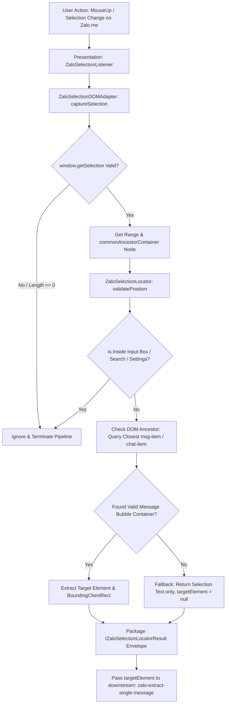

# Scope Document — Sub-module Định Vị & Kích Hoạt Trích Xuất Tin Nhắn Zalo (zalo-selection-locator)

**Date**: 2026-08-07  
**Status**: Ready  
**Reference Source**: [content-zalo-adapter.js](../../../Achive/zalo_quick_action/content/content-zalo-adapter.js), [content.js](../../../Achive/zalo_quick_action/content/content.js)  
**Target Repository Architecture**: Chrome Extension MV3 Modular Architecture (`src/0_contracts`, `src/2_platform_adapters`, `src/3_modules`, `src/4_presentation`)  

---

## §1: Problem Summary

Tài liệu này xác định scope kỹ thuật toàn diện cho sub-module **`zalo-selection-locator`** — sub-module đảm nhận vai trò **Input & Event Trigger (Định vị & Kích hoạt sự kiện)** trong chuỗi pipeline trích xuất tin nhắn Zalo Web.

Sub-module này giải quyết các thách thức kỹ thuật cốt lõi:
1. **Lắng nghe & Nhận diện sự kiện người dùng**: Bắt sự kiện bôi đen văn bản (`mouseup`, `selectionchange`) hoặc tương tác chuột (hover, click, contextmenu) trên giao diện Zalo Web (`zalo.me`).
2. **Định vị & Kiểm tra DOM (Check DOM Positioning)**: Từ vùng bôi đen (Range/Selection) hoặc vị trí con trỏ, truy vết DOM ngược lên container tin nhắn Zalo Web để xác định đúng phẩn tử bong bóng tin nhắn (`targetElement`).
3. **Lọc phạm vi & Loại trừ nhiễu**: Kiểm tra phần tử thuộc đúng vùng hội thoại (Chat View), loại trừ hoàn toàn các thao tác bôi đen trong khung nhập liệu (Input Chatbox), thanh tìm kiếm hoặc menu cài đặt.
4. **Tính toán vị trí giao diện (UI Bounding Box)**: Tính tọa độ màn hình (`DOMRect`) để phục vụ hiển thị các nút thao tác nhanh (Quick Action Popover / Floating Button) tại đúng vị trí con trỏ người dùng.
5. **Cung cấp Input Envelope cho Pipeline**: Đóng gói `targetElement` cùng thông tin định vị thành dữ liệu đầu vào chuẩn hóa cho sub-module `zalo-extract-single-message` tiếp quản.

---

## §2: Entry Point

Các điểm vào (Entry Points) được trích xuất từ mã nguồn tham chiếu `zalo_quick_action`:

1. **Selection Event Handler (`onMouseUp / onSelectionChange`)**:
   - File tham chiếu: [content.js](../../../Achive/zalo_quick_action/content/content.js#L260-L300)
   - Chức năng: Lắng nghe sự kiện `mouseup` trên document, kiểm tra trạng thái bôi đen (`window.getSelection()`), bỏ qua nếu độ dài văn bản bằng 0 hoặc thuộc input.
2. **DOM Selection Range Locator (`getFullMessageFromSelection` - Phase 1 Locator)**:
   - File tham chiếu: [content-zalo-adapter.js](../../../Achive/zalo_quick_action/content/content-zalo-adapter.js#L317-L335)
   - Chức năng: Đọc `range.commonAncestorContainer`, quy đổi TextNode về Element Node, sử dụng `.closest()` để định vị container tin nhắn Zalo (`.msg-item`, `[data-id*="msg"]`).
3. **Container Context Validator (`isWithinChatView`)**:
   - File tham chiếu: [content-zalo-adapter.js](../../../Achive/zalo_quick_action/content/content-zalo-adapter.js#L120-L145)
   - Chức năng: Xác minh phẩn tử DOM nằm trong khung hội thoại Zalo Web (`#chatView`, `.chat-view`, `.main-tab-chats`), không thuộc khung soạn thảo (`#input_chat`).

---

## §3: Scope Definition

### 3.1 Problem Area
- **Định vị chính xác tin nhắn từ thao tác bôi đen không hoàn chỉnh (Partial Selection)**: Người dùng bôi đen 1 từ hoặc 1 câu ngắn trong tin nhắn Zalo, sub-module phải tìm đúng thẻ DOM container đại diện cho TOÀN BỘ tin nhắn đó.
- **Xác định vị trí tọa độ hiển thị (Popover Placement)**: Lấy `getBoundingClientRect()` của Selection Range để tính vị trí đặt nút/popup giao diện sát với vị trí bôi đen của người dùng.
- **Phân định vùng tương tác hợp lệ (Context Guard)**: Bỏ qua bôi đen khi người dùng đang soạn tin trong ô nhập liệu (`#input_chat`, `div[contenteditable="true"]`) hoặc chọn nội dung ngoài danh sách tin nhắn.

### 3.2 Boundary
- **Trong Scope**:
  - Đăng ký và quản lý sự kiện DOM (`mouseup`, `selectionchange`, `click`).
  - Lấy `window.getSelection()`, `Range`, `commonAncestorContainer`.
  - Check DOM Selectors của Zalo Web để xác định `targetElement` (Container tin nhắn).
  - Kiểm tra tính hợp lệ của vị trí bôi đen (thuộc Chat View, không thuộc Input Box).
  - Đóng gói dữ liệu định vị (`IZaloSelectionLocatorResult`) chuyển cho `zalo-extract-single-message`.
- **Ngoài Scope**:
  - Không đọc hay bóc tách văn bản `innerText` của tin nhắn (do `zalo-extract-single-message` đảm nhận).
  - Không lọc nhãn "Xem thêm" hay chuẩn hóa xuống dòng `\n` (do `zalo-message-sanitizer` đảm nhận).
  - Không vẽ UI Popup/Button trực tiếp (do layer Presentation/Shadow DOM UI đảm nhận).

### 3.3 Target Architectural Mapping (Quy chuẩn Chrome Extension MV3)
- **Layer `0_contracts/`**: Khai báo interfaces `IZaloSelectionLocatorInput`, `IZaloSelectionLocatorResult`, `IZaloSelectionAdapter`.
- **Layer `2_platform_adapters/`**: Tạo `ZaloSelectionDOMAdapter` chịu trách nhiệm tương tác trực tiếp với DOM API (`window.getSelection()`, `document.addEventListener`, `Range.getBoundingClientRect()`).
- **Layer `3_modules/`**: Tạo pure TypeScript module `ZaloSelectionLocator` để validate quy tắc định vị (kiểm tra selectors, tính toán toạ độ, phân loại container) độc lập không phụ thuộc trực tiếp vào `window`.
- **Layer `4_presentation/`**: Content Script listener đăng ký event listener trên DOM Zalo Web và gọi Locator Module.

---

## §4: Impact Analysis & Edge Cases

### 4.1 Direct Impact
- **Content Script Execution Context**: Chạy trong Isolated World trên tab domain `zalo.me`.
- **Tốc độ phản hồi UI (Latency)**: Phải tính toán vị trí DOM và trả về kết quả trong thời gian ngắn (< 16ms) ngay khi người dùng nhả chuột (`mouseup`) để không làm trễ giao diện.

### 4.2 Indirect Impact
- Khi Zalo Web thay đổi class CSS của khu vực Chat View (`.chat-view` -> `.main-chat-container`), nếu Locator không nhận diện được sẽ hủy kích hoạt trích xuất.
- Nếu không loại trừ ô soạn thảo (`#input_chat`), khi người dùng bôi đen văn bản đang gõ sẽ kích hoạt nhầm sự kiện trích xuất tin nhắn cũ.

### 4.3 Matrix Edge Cases & Giải pháp Kỹ thuật

| STT | Edge Case | Hiện trạng Mã nguồn Tham chiếu | Phân tích & Giải pháp cho MV3 Module |
| :--- | :--- | :--- | :--- |
| **1** | **Bôi đen văn bản trong khung nhập liệu (`#input_chat`)** | Kiểm tra `element.closest('#input_chat, [contenteditable="true"]')`. | **Loại trừ tuyệt đối**. Trả về `isValidSelection = false` để ngắt pipeline ngay tại bước input. |
| **2** | **Bôi đen kéo dài qua nhiều tin nhắn (Multi-message Selection)** | `commonAncestorContainer` sẽ nằm ở container cha của toàn bộ danh sách tin nhắn (`.chat-message-list`). | Locator phát hiện container không khớp `.msg-item` đơn lẻ -> Đánh dấu cờ `isMultiMessage = true` và trả về mảng các `targetElements`. |
| **3** | **Bôi đen ký tự khoảng trắng hoặc Selection bị clear ngay lập tức** | `selection.toString().trim() === ''`. | Locator kiểm tra độ dài văn bản chọn, bỏ qua ngay nếu chuỗi rỗng. |
| **4** | **Bôi đen tin nhắn dạng Hình ảnh / Video / Voice call** | Con trỏ click hoặc bôi đen rơi vào thẻ img/video container. | Locator truy vết thẻ cha `.msg-item`, xác định `targetElement` vẫn hợp lệ và bổ sung metadata `mediaType`. |
| **5** | **Thao tác nhấp đúp (Double Click) chọn 1 từ** | Sự kiện `mouseup` bắn ra kèm `selection.rangeCount > 0`. | Locator xử lý đồng nhất với thao tác bôi đen kéo thả thông thường. |

---

## §5: Call Chain



---

## §6: Data Flow & DOM Selectors Matrix

### 6.1 Matrix Selectors DOM Định vị của Zalo Web

#### Selectors Cấp 1 — Khung Hội Thoại Hợp Lệ (Valid Chat View Context)
Dùng để xác nhận thao tác diễn ra trong vùng hội thoại:
- `#chatView`
- `.chat-view`
- `.chat-message-list`
- `.main-tab-chats`
- `[role="log"]`

#### Selectors Cấp 2 — Vùng Cấm (Excluded Context - Ignore Selection)
Dùng để loại trừ các vị trí bôi đen không được kích hoạt trích xuất:
- `#input_chat`
- `[contenteditable="true"]`
- `.chat-input`
- `.search-bar`
- `.setting-menu`

#### Selectors Cấp 3 — Phân Tử Tin Nhắn Target (`targetElement`)
Dùng để leo ngược từ Node bôi đen tới Bong bóng tin nhắn:
- `[class*="msg-item"]`
- `[class*="chat-item"]`
- `[data-id*="msg"]`
- `div[data-id]`
- `.msg-item`
- `div[role="row"]`

### 6.2 Data Input & Output Contract

#### Input Contract (`IZaloSelectionLocatorInput`)
```typescript
export interface IZaloSelectionLocatorInput {
  traceId: string;
  event?: MouseEvent | Event;
}
```

#### Output Contract (`IZaloSelectionLocatorResult`)
```typescript
export interface IZaloSelectionLocatorResult {
  traceId: string;
  isValidSelection: boolean;
  targetElement: Element | null;
  messageId: string | null;
  selectedText: string;
  boundingClientRect: {
    top: number;
    left: number;
    width: number;
    height: number;
  } | null;
  metadata: {
    isWithinChatView: boolean;
    isInputArea: boolean;
    containerClass?: string;
    sourceNodeName?: string;
  };
}
```

---

## §7: Affected Components

### 7.1 Refactored/Created Target Files (Theo kiến trúc MV3 target)

| Path File Target trong `src/` | Phân vùng Kiến trúc | Vai trò / Trách nhiệm |
| :--- | :--- | :--- |
| [src/0_contracts/zalo-selection.contract.ts](../../../src/0_contracts/zalo-selection.contract.ts) | `0_contracts` | Định nghĩa TypeScript Interfaces: `IZaloSelectionLocatorInput`, `IZaloSelectionLocatorResult`, `IZaloSelectionAdapter`. |
| [src/2_platform_adapters/zalo/zalo-selection-adapter.ts](../../../src/2_platform_adapters/zalo/zalo-selection-adapter.ts) | `2_platform_adapters` | Triển khai `ZaloSelectionDOMAdapter`: thực thi đọc `window.getSelection()`, `Range`, `getBoundingClientRect()`. |
| [src/3_modules/sub-modules/zalo-selection-locator/index.ts](../../../src/3_modules/sub-modules/zalo-selection-locator/index.ts) | `3_modules` | Pure TS Logic module: Validate vị trí DOM, kiểm tra vùng cấm/vùng hợp lệ, tạo result envelope. |
| [src/4_presentation/content/zalo-selection-listener.ts](../../../src/4_presentation/content/zalo-selection-listener.ts) | `4_presentation` | Content script listener bắt sự kiện chuột trên Zalo Web và gửi `targetElement` đến `zalo-extract-single-message`. |

---

## §8: Evidence từ Mã nguồn Tham chiếu

<evidence>
  <file>Achive/zalo_quick_action/content/content-zalo-adapter.js</file>
  <line>317-335</line>
  <finding>`getFullMessageFromSelection` bắt đầu bằng cách kiểm tra `window.getSelection()`, lấy `range.commonAncestorContainer`, kiểm tra `nodeType === 3` để lấy `parentElement`, sau đó leo ngược qua `.closest()` với danh sách selector container tin nhắn.</finding>
</evidence>

<evidence>
  <file>Achive/zalo_quick_action/content/content.js</file>
  <line>260-285</line>
  <finding>Sự kiện `document.addEventListener('mouseup', ...)` kiểm tra nếu bôi đen rỗng hoặc nằm trong ô nhập liệu `#input_chat` thì lập tức dừng xử lý (Early Return).</finding>
</evidence>

<evidence>
  <file>Achive/zalo_quick_action/content/content-zalo-adapter.js</file>
  <line>120-135</line>
  <finding>Hàm kiểm tra vùng hội thoại Zalo kiểm tra thẻ cha có thuộc `#chatView` hoặc `.chat-view` hay không để đảm bảo chỉ xử lý khi bôi đen trong màn hình nhắn tin.</finding>
</evidence>

---

## §9: Confidence Assessment

- **Overall Confidence Rating**: **96%**
- **Cơ sở đánh giá**:
  - Cơ chế bắt vị trí DOM từ `window.getSelection()` và truy vết ngược `.closest()` đã được khẳng định qua mã nguồn thực tế `zalo_quick_action`.
  - Việc tách biệt sub-module `zalo-selection-locator` đóng vai trò duy nhất là Input/Trigger giúp kiến trúc tuân thủ 100% nguyên tắc Single Responsibility Principle và Clean Architecture MV3.

---

## §10: Open Questions & Recommendations

1. **Khuyến nghị tách biệt hoàn toàn Event Listener và Locator Core**:
   - Event Listener (`4_presentation`) chỉ làm nhiệm vụ bắt DOM event (`mouseup`).
   - Platform Adapter (`2_platform_adapters`) đọc Selection Range và DOMRect.
   - Core Module (`3_modules`) nhận thông tin DOM Node/Range thuần để phân tích và validate tính hợp lệ mà không phụ thuộc trực tiếp vào Event Listener.
2. **Hỗ trợ Debounce / Throttling**:
   - Sự kiện `selectionchange` có thể bắn liên tục trong quá trình kéo chuột. Khuyên dùng `debounce` (khoảng 150ms - 200ms) hoặc ưu tiên xử lý chính trên sự kiện `mouseup`.

---

<scope>Scope định vị DOM và kích hoạt sự kiện trích xuất tin nhắn Zalo Web (zalo-selection-locator)</scope>
<entry_point>src/4_presentation/content/zalo-selection-listener.ts & src/2_platform_adapters/zalo/zalo-selection-adapter.ts</entry_point>
<impact>Định vị chính xác targetElement tin nhắn Zalo, loại trừ ô nhập liệu, chuẩn bị Input Envelope cho zalo-extract-single-message</impact>
<confidence>96%</confidence>

**Document Status**: Context Complete — No Code Changes Made
