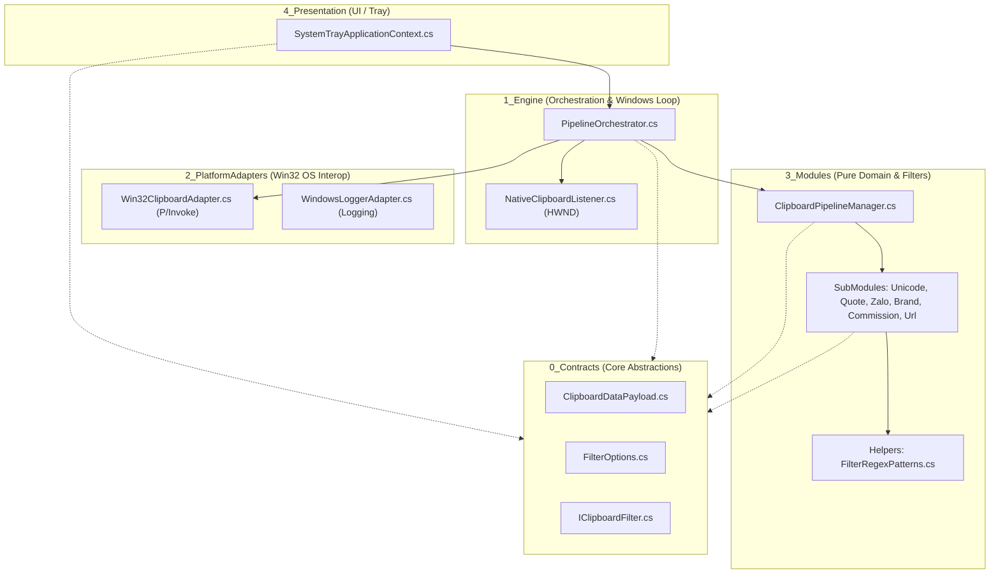

Listed directory test-c%23
Listed directory src
Listed directory tests
Listed directory Docs
Listed directory rules
Listed directory 0_Contracts
Listed directory 1_Engine
Listed directory 2_PlatformAdapters
Listed directory Logging
Listed directory 3_Modules
Listed directory CompositeModules
Listed directory SubModules
Listed directory Helpers
Listed directory 4_Presentation
Listed directory Modules.Tests
Viewed architecture-and-flow.md:1-99
Viewed code-quality-and-gates.md:1-52
Viewed tech-stack-and-conventions.md:1-39
Viewed logging-and-observability.md:1-53
Viewed ClipboardFilterApp.csproj:1-20
Viewed Program.cs:1-53
Viewed ClipboardDataPayload.cs:1-12
Viewed FilterOptions.cs:1-21
Viewed IClipboardFilter.cs:1-25
Viewed NativeClipboardListener.cs:1-41
Viewed PipelineOrchestrator.cs:1-64
Viewed Win32ClipboardAdapter.cs:1-125
Viewed WindowsLoggerAdapter.cs:1-65
Viewed ClipboardPipelineManager.cs:1-58
Viewed BrandRegexFilter.cs:1-42
Viewed CommissionRegexFilter.cs:1-71
Viewed ReplyQuoteFilter.cs:1-20
Viewed UnicodeSanitizerFilter.cs:1-26
Viewed UrlSanitizerFilter.cs:1-35
Viewed ZaloStickerFilter.cs:1-37
Viewed FilterRegexPatterns.cs:1-131
Viewed SystemTrayApplicationContext.cs:1-70
Viewed Modules.Tests.csproj:1-25
Viewed PipelineTests.cs:1-100
Ran command: `dotnet test tests/Modules.Tests/Modules.Tests.csproj`

Dưới đây là báo cáo phân tích toàn diện cấu trúc hiện tại của dự án, các Software Design Pattern đang được áp dụng và danh sách chi tiết các vị trí đang vi phạm hoặc chưa tuân thủ triệt để quy chuẩn kiến trúc.

---

# 📊 BÁO CÁO PHÂN TÍCH KIẾN TRÚC & PATTERN DỰ ÁN

## 1. Cấu Trúc Tổng Quan Của Dự Án

Dự án **OS Clipboard Filter** là ứng dụng Windows Native chạy ngầm dưới System Tray (không có cửa sổ chính), có nhiệm vụ lắng nghe thông điệp OS (`WM_CLIPBOARDUPDATE`), bắt nội dung sao chép (Ctrl+C), lọc bỏ tự động các thông tin rác (hoa hồng, thưởng sale, quote Zalo, tracking URL, chuẩn hóa Unicode...) và ghi đè nội dung sạch trở lại Clipboard.

Hệ thống được thiết kế theo mô hình **Clean Architecture 5 tầng**:



### Bóc tách các thành phần trong thư mục:

| Tầng | Đường dẫn | Trách nhiệm chính |
| :--- | :--- | :--- |
| **0_Contracts** | [`src/0_Contracts/`](file:///c:/Users/ADMIN/Documents/workspace/Sale_extension/Test_modul/test-c%23/src/0_Contracts) | Chứa các giao diện (`IClipboardFilter`), schema tùy chọn (`FilterOptions`), dữ liệu chuyển giao (`ClipboardDataPayload`). Hoàn toàn không phụ thuộc tầng khác. |
| **1_Engine** | [`src/1_Engine/`](file:///c:/Users/ADMIN/Documents/workspace/Sale_extension/Test_modul/test-c%23/src/1_Engine) | Tạo cửa sổ vô hình `HWND` để nhận message `0x031D`, điều phối luồng đọc $\rightarrow$ xử lý $\rightarrow$ chống lặp $\rightarrow$ ghi lại Clipboard. |
| **2_PlatformAdapters** | [`src/2_PlatformAdapters/`](file:///c:/Users/ADMIN/Documents/workspace/Sale_extension/Test_modul/test-c%23/src/2_PlatformAdapters) | Nơi giao tiếp với Win32 Native API (`user32.dll`, `kernel32.dll`) và hệ thống ghi Log xoay vòng. |
| **3_Modules** | [`src/3_Modules/`](file:///c:/Users/ADMIN/Documents/workspace/Sale_extension/Test_modul/test-c%23/src/3_Modules) | Chứa 100% logic xử lý chuỗi Regex nghiệp vụ (Unicode, Zalo, Brand, Hoa hồng, URL tracking). Hoàn toàn độc lập với OS và UI. |
| **4_Presentation** | [`src/4_Presentation/`](file:///c:/Users/ADMIN/Documents/workspace/Sale_extension/Test_modul/test-c%23/src/4_Presentation) | Quản lý icon dưới góc phải màn hình (`NotifyIcon`), ContextMenu Bật/Tắt dịch vụ và Thoát. |
| **Tests** | [`tests/Modules.Tests/`](file:///c:/Users/ADMIN/Documents/workspace/Sale_extension/Test_modul/test-c%23/tests/Modules.Tests) | Bộ kiểm thử xUnit bao phủ 31 test cases thực tế. |

---

## 2. Các Design Pattern Đang Được Sử Dụng

| # | Design Pattern | Vị trí hiện thực trong Codebase | Mục đích & Lợi ích |
| :--- | :--- | :--- | :--- |
| **1** | **Clean Architecture / N-Layer Inversion** | [`src/0_Contracts/`](file:///c:/Users/ADMIN/Documents/workspace/Sale_extension/Test_modul/test-c%23/src/0_Contracts), [`src/3_Modules/`](file:///c:/Users/ADMIN/Documents/workspace/Sale_extension/Test_modul/test-c%23/src/3_Modules) | Tách rời nghiệp vụ lọc chuỗi ra khỏi OS/UI, giúp 100% logic nghiệp vụ có thể Unit Test độc lập không cần Windows GUI. |
| **2** | **Pipes and Filters / Chain of Responsibility** | [`ClipboardPipelineManager.cs`](file:///c:/Users/ADMIN/Documents/workspace/Sale_extension/Test_modul/test-c%23/src/3_Modules/CompositeModules/ClipboardPipelineManager.cs#L9-L38) | Dữ liệu văn bản thô đi qua một chuỗi các filter tuần tự theo `Priority` (`Unicode` $\rightarrow$ `Quote` $\rightarrow$ `Zalo` $\rightarrow$ `Brand` $\rightarrow$ `Commission` $\rightarrow$ `Url`). |
| **3** | **Strategy Pattern** | [`IClipboardFilter.cs`](file:///c:/Users/ADMIN/Documents/workspace/Sale_extension/Test_modul/test-c%23/src/0_Contracts/IClipboardFilter.cs#L6-L24) & các lớp trong `src/3_Modules/SubModules/` | Mỗi bộ lọc là một chiến lược độc lập; có thể thêm, bớt hoặc thay đổi thứ tự filter mà không phải sửa đổi code của các filter khác. |
| **4** | **Observer / Event-Driven Pattern** | [`NativeClipboardListener.cs`](file:///c:/Users/ADMIN/Documents/workspace/Sale_extension/Test_modul/test-c%23/src/1_Engine/NativeClipboardListener.cs#L8-L40) & [`PipelineOrchestrator.cs`](file:///c:/Users/ADMIN/Documents/workspace/Sale_extension/Test_modul/test-c%23/src/1_Engine/PipelineOrchestrator.cs#L23-L28) | Lắng nghe thông điệp Windows ngầm `WM_CLIPBOARDUPDATE` (0x031D) qua hàm `WndProc` và phát sự kiện `ClipboardUpdated` cho Orchestrator. |
| **5** | **Adapter Pattern (Platform Adapter)** | [`Win32ClipboardAdapter.cs`](file:///c:/Users/ADMIN/Documents/workspace/Sale_extension/Test_modul/test-c%23/src/2_PlatformAdapters/Win32ClipboardAdapter.cs#L9-L124) | Chuyển đổi các lời gọi C-style P/Invoke phức tạp và con trỏ unmanaged thành các phương thức C# cấp cao an toàn: `SafeReadClipboardText()` và `SafeWriteClipboardText()`. |
| **6** | **Mediator / Orchestrator Pattern** | [`PipelineOrchestrator.cs`](file:///c:/Users/ADMIN/Documents/workspace/Sale_extension/Test_modul/test-c%23/src/1_Engine/PipelineOrchestrator.cs#L11-L63) | Đóng vai trò nhạc trưởng kết nối Listener, Adapter, PipelineManager và Logging, quản lý cơ chế chống ghi lặp vô hạn (**Anti-loop**). |
| **7** | **Exponential Backoff Retry** | [`Win32ClipboardAdapter.cs:83-123`](file:///c:/Users/ADMIN/Documents/workspace/Sale_extension/Test_modul/test-c%23/src/2_PlatformAdapters/Win32ClipboardAdapter.cs#L83-L123) | Tự động thử lại ghi Clipboard tối đa 5 lần với thời gian chờ tăng theo cấp số nhân ($5 \times 2^i$ ms) khi gặp xung đột Clipboard Lock với ứng dụng khác (`WinError 5`). |
| **8** | **Flyweight / Precompiled Regex Helper** | [`FilterRegexPatterns.cs`](file:///c:/Users/ADMIN/Documents/workspace/Sale_extension/Test_modul/test-c%23/src/3_Modules/SubModules/Helpers/FilterRegexPatterns.cs#L8-L130) | Gom toàn bộ biểu thức chính quy phức tạp thành các `static readonly Regex` có `RegexOptions.Compiled` dùng chung, tránh biên dịch lại Regex nhiều lần. |

---

## 3. Những Vị Trí Đang KHÔNG Tuân Thủ Theo Pattern / Quy Chuẩn

Dưới đây là các điểm vi phạm quy chuẩn thiết kế, rò rỉ tài nguyên, hoặc sai lệch so với tài liệu kiến trúc quy định trong [`.agent/rules/`](file:///c:/Users/ADMIN/Documents/workspace/Sale_extension/Test_modul/test-c%23/.agent/rules):

### 🔴 1. Vi phạm Unmanaged Memory Safety & Memory Leak (Quy tắc ARC-3 / BQD-7)
- **Vị trí**: [`src/2_PlatformAdapters/Win32ClipboardAdapter.cs:96-110`](file:///c:/Users/ADMIN/Documents/workspace/Sale_extension/Test_modul/test-c%23/src/2_PlatformAdapters/Win32ClipboardAdapter.cs#L96-L110)
- **Hiện trạng code**:
  ```csharp
  IntPtr hMem = GlobalAlloc(GMEM_MOVEABLE | GMEM_ZEROINIT, bytesSize);
  if (hMem != IntPtr.Zero)
  {
      IntPtr pMem = GlobalLock(hMem);
      if (pMem != IntPtr.Zero)
      {
          Marshal.Copy(bytes, 0, pMem, bytes.Length);
          GlobalUnlock(hMem);

          if (SetClipboardData(CF_UNICODETEXT, hMem) != IntPtr.Zero)
          {
              return true;
          }
      }
  }
  ```
- **Vấn đề**:
  - Theo chuẩn Win32 API, hệ thống Windows chỉ sở hữu `hMem` **khi `SetClipboardData` thành công**. Nếu `GlobalLock` thất bại hoặc `SetClipboardData` trả về `IntPtr.Zero`, vùng nhớ unmanaged `hMem` đã cấp phát **phải được giải phóng bằng `GlobalFree(hMem)`**.
  - Hiện tại, class hoàn toàn **chưa khai báo `[DllImport("kernel32.dll")] GlobalFree`** và không có khối `try...finally` để thu hồi bộ nhớ khi ghi thất bại $\rightarrow$ **Gây Memory Leak unmanaged**.

---

### 🟡 2. Vi phạm Options Pattern & Đứt Gãy Granular Toggles
- **Vị trí**:
  - Khai báo: [`src/0_Contracts/FilterOptions.cs:13-18`](file:///c:/Users/ADMIN/Documents/workspace/Sale_extension/Test_modul/test-c%23/src/0_Contracts/FilterOptions.cs#L13-L18)
  - Thực thi: [`src/3_Modules/CompositeModules/ClipboardPipelineManager.cs:31-34`](file:///c:/Users/ADMIN/Documents/workspace/Sale_extension/Test_modul/test-c%23/src/3_Modules/CompositeModules/ClipboardPipelineManager.cs#L31-L34)
- **Vấn đề**:
  - `FilterOptions` định nghĩa 6 cờ cấu hình chi tiết (`EnableUnicodeSanitizer`, `EnableReplyQuoteFilter`, `EnableZaloStickerFilter`, `EnableBrandFilter`, `EnableCommissionFilter`, `EnableUrlSanitizer`).
  - Tuy nhiên, trong `ClipboardPipelineManager.Process()`, vòng lặp duyệt qua `_filters` lại **không kiểm tra bất kỳ cờ nào**, luôn kích hoạt toàn bộ các sub-module dù người dùng hoặc cấu hình đặt là `false`.
  - Giao diện `IClipboardFilter` cũng thiếu thuộc tính định danh để mapping tương ứng với cờ cấu hình.

---

### 🟡 3. Vi phạm Ranh Giới Gói Dự Án (Single Project Monolith vs Clean Layers)
- **Vị trí**: [`src/ClipboardFilterApp.csproj`](file:///c:/Users/ADMIN/Documents/workspace/Sale_extension/Test_modul/test-c%23/src/ClipboardFilterApp.csproj#L1-L20)
- **Vấn đề**:
  - Toàn bộ 5 tầng (`0_Contracts`, `1_Engine`, `2_PlatformAdapters`, `3_Modules`, `4_Presentation`) được đặt chung trong **1 project duy nhất** bật sẵn `<UseWindowsForms>true</UseWindowsForms>` và `<AllowUnsafeBlocks>true</AllowUnsafeBlocks>`.
  - Mặc dù chia thư mục rõ ràng, nhưng compiler không thể ngăn chặn cơ học nếu một developer khác vô tình gọi thư viện Windows Forms hoặc P/Invoke bên trong `3_Modules` hay `0_Contracts` (vi phạm tính chất Pure Logic độc lập nền tảng).

---

### 🟡 4. Vi phạm Quản Lý Vòng Đời Đối Tượng & Rò Rỉ Event Handler (Lifecycle / IDisposable)
- **Vị trí**:
  - [`src/Program.cs:44`](file:///c:/Users/ADMIN/Documents/workspace/Sale_extension/Test_modul/test-c%23/src/Program.cs#L44): `_ = new PipelineOrchestrator(...)`
  - [`src/4_Presentation/SystemTrayApplicationContext.cs:31-68`](file:///c:/Users/ADMIN/Documents/workspace/Sale_extension/Test_modul/test-c%23/src/4_Presentation/SystemTrayApplicationContext.cs#L31-L68)
- **Vấn đề**:
  - `PipelineOrchestrator` đăng ký lắng nghe event `_listener.ClipboardUpdated += OnClipboardUpdated;` nhưng class này **không implement `IDisposable`** và không có hàm hủy đăng ký (`-=`).
  - `SystemTrayApplicationContext` kế thừa `ApplicationContext` (vốn cài đặt `IDisposable`) nhưng **không override hàm `Dispose(bool disposing)`**. Khi ứng dụng kết thúc qua các luồng khác, các thành phần GUI unmanaged (`NotifyIcon`, `ContextMenuStrip`) có nguy cơ không được giải phóng triệt để.

---

### 🟡 5. Vi phạm Non-blocking STA Thread trong Logging Adapter (Quy tắc ARC-4)
- **Vị trí**: [`src/2_PlatformAdapters/Logging/WindowsLoggerAdapter.cs:48-62`](file:///c:/Users/ADMIN/Documents/workspace/Sale_extension/Test_modul/test-c%23/src/2_PlatformAdapters/Logging/WindowsLoggerAdapter.cs#L48-L62)
- **Vấn đề**:
  - `WindowsLoggerAdapter.WriteLog` thực hiện ghi file I/O đồng bộ (`File.AppendAllText` trong khối `lock`) ngay trên luồng chính STA Message Loop khi nhận sự kiện `WM_CLIPBOARDUPDATE`.
  - Khi hệ thống có disk I/O nghẽn hoặc copy liên tục với dữ liệu lớn, việc ghi file đồng bộ sẽ làm treo nhẹ Windows Message Pump (vi phạm quy tắc ARC-4).
  - Vị trí thư mục log đang dùng `AppDomain.CurrentDomain.BaseDirectory/logs` thay vì chuẩn `%LocalAppData%/ClipboardFilterApp/logs/` (nếu ứng dụng được cài đặt vào thư mục `Program Files`, ghi log vào `BaseDirectory` sẽ bị hệ thống từ chối cấp quyền `UnauthorizedAccessException`).

---

### 🟢 6. Thiếu Unit Test Tách Biệt Cho Từng Sub-Module
- **Vị trí**: [`tests/Modules.Tests/PipelineTests.cs`](file:///c:/Users/ADMIN/Documents/workspace/Sale_extension/Test_modul/test-c%23/tests/Modules.Tests/PipelineTests.cs)
- **Vấn đề**:
  - Toàn bộ 31 test cases hiện tại là **Integration Test** kiểm tra chuỗi pipeline tổng hợp (`ClipboardPipelineManager.Process()`).
  - Chưa có các bộ Unit Test độc lập (Isolated Tests) cho từng SubModule riêng biệt (`BrandRegexFilterTests`, `CommissionRegexFilterTests`, `UrlSanitizerFilterTests`...) để kiểm tra riêng các trường hợp biên của từng filter.

---

## 4. Bảng Ma Trận Đánh Giá Mức Độ Tuân Thủ

| Tiêu chuẩn / Quy tắc | Trạng thái | Đánh giá & Ghi chú |
| :--- | :---: | :--- |
| **Clean Architecture (Phân tầng & Hướng phụ thuộc)** | ⚠️ **Cảnh báo** | Đạt về mặt cấu trúc thư mục, nhưng bị gộp chung 1 project `.csproj`. |
| **Pipeline & Strategy Pattern** | ⚠️ **Cảnh báo** | Pipeline chạy tốt nhưng chưa kết nối các cờ toggle `FilterOptions`. |
| **Observer & Event-Driven Engine** | ✅ **Đạt** | Bắt `WM_CLIPBOARDUPDATE` chính xác qua `WndProc`. |
| **Unmanaged Memory Management (ARC-3/BQD-7)** | ❌ **Vi phạm** | Thiếu `GlobalFree` khi `SetClipboardData` thất bại. |
| **Anti-looping Mechanism** | ✅ **Đạt** | So sánh chuỗi với `_lastProcessedText` chặn lặp vô hạn chuẩn xác. |
| **Non-blocking STA Message Loop (ARC-4)** | ⚠️ **Cảnh báo** | File I/O trong Logger chạy đồng bộ trên luồng STA. |
| **Unit Test Coverage** | ✅ **Đạt (31/31 Pass)** | Pass 100% test case thực tế, cần bổ sung unit test độc lập cho từng module. |

---

## 5. Đề Xuất Hướng Xử Lý Khắc Phục (Actionable Roadmap)

1. **Khắc phục ngay rò rỉ bộ nhớ unmanaged**: Bổ sung `GlobalFree` vào [`Win32ClipboardAdapter.cs`](file:///c:/Users/ADMIN/Documents/workspace/Sale_extension/Test_modul/test-c%23/src/2_PlatformAdapters/Win32ClipboardAdapter.cs) và bọc logic cấp phát trong `try...finally`.
2. **Kích hoạt tính năng Toggle Filter**: Cập nhật [`ClipboardPipelineManager.cs`](file:///c:/Users/ADMIN/Documents/workspace/Sale_extension/Test_modul/test-c%23/src/3_Modules/CompositeModules/ClipboardPipelineManager.cs) để kiểm tra trạng thái bật/tắt của từng filter theo `FilterOptions`.
3. **Chuẩn hóa Logging**: Chuyển đường dẫn log sang `%LocalAppData%` và áp dụng cơ chế ghi file bất đồng bộ (hoặc hàng đợi non-blocking background queue) để không làm ảnh hưởng luồng STA.
4. **Hoàn thiện IDisposable**: Implement `IDisposable` cho `PipelineOrchestrator` và override `Dispose` trong `SystemTrayApplicationContext`.