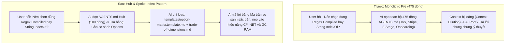

Đây là một hướng tư duy kiến trúc tài liệu **cực kỳ chuẩn xác và hiện đại** (theo mô hình **Hub & Spoke / Modular Context Router**). 

Khi chia nhỏ tài liệu thành một **Index Hub trung tâm (`AGENTS.md`)** và các **vệ tinh chuyên biệt (Satellite Files: Frameworks, Templates, Decision Trees)**, chúng ta đạt được 3 mục tiêu sống còn:
1. **Zero Context Dilution**: Context window không bị rác bởi những thông tin chưa cần dùng đến. AI chỉ nạp đúng 1 file `AGENTS.md` (~1-2KB) làm "bản đồ điều hướng".
2. **On-Demand Context Loading (Nạp ngữ cảnh theo nhu cầu)**: Khi gặp bài toán cụ thể (ví dụ: *so sánh Option A vs B*, hoặc *viết tài liệu ADR*, hoặc *phân tích lỗi sập bộ nhớ*), AI mới tra bảng Routing và `view_file` đúng file template/framework tương ứng.
3. **Triệt tiêu "AI Poof / Flop"**: Mỗi tài liệu con được thiết kế chuyên biệt, có khuôn mẫu (template) và ràng buộc cơ học rõ ràng, AI không thể trả lời chung chung hay suy diễn bay bổng.

---

# 🏛️ I. THIẾT KẾ CẤU TRÚC MODULAR CHO THƯ MỤC `Docs/Trade-off/`

```
Docs/Trade-off/
├── 📄 AGENTS.md                   <-- [INDEX HUB] Role Charter, 4 Depth Signals & Context Routing Matrix
│
├── 📁 frameworks/                 <-- [LÝ THUYẾT & PHƯƠNG PHÁP LUẬN ĐÁNH ĐỔI]
│   ├── decision-reversibility.md  <-- Phân loại Quyết định (Type 1: One-Way vs Type 2: Two-Way Door)
│   ├── trade-off-dimensions.md    <-- 6 Trục Đánh Đổi (Performance, Safety, Simplicity, Modularity,...)
│   └── reverse-probing-guide.md   <-- Failure Mode Analysis & Bóc tách Negative Space
│
├── 📁 templates/                  <-- [KHUÔN MẪU TỰ ĐỘNG HÓA KHI TRẢ LỜI / VIẾT SPEC]
│   ├── adr-trade-off.template.md  <-- Template viết Architecture Decision Record chuẩn đánh đổi
│   ├── problem-framing.template.md<-- Template bóc tách Vấn đề, Ràng buộc Cứng vs Mềm
│   └── option-matrix.template.md  <-- Template bảng so sánh Option A vs Option B
│
└── 📁 playbook-native/            <-- [CẨM NANG ĐÁNH ĐỔI ĐẶC THÙ WINDOWS NATIVE & C#]
    ├── unmanaged-vs-managed.md    <-- Trade-off: Tốc độ P/Invoke vs An toàn GC (.NET)
    ├── sta-vs-async-thread.md     <-- Trade-off: UI Message Loop vs Background Queue
    └── monolithic-vs-modular.md   <-- Trade-off: Gộp chung .csproj vs Tách multi-project
```

---

# 🗺️ II. NỘI DUNG VÀ VAI TRÒ CỦA `AGENTS.md` (INDEX HUB)

File [`Docs/Trade-off/AGENTS.md`](file:///c:/Users/ADMIN/Documents/workspace/Sale_extension/Test_modul/test-c%23/Docs/Trade-off/AGENTS.md) sẽ đóng vai trò **"Tổng đài điều hướng"** siêu nhẹ (~80-120 dòng), cấu trúc gồm 3 phần cốt lõi:

### 1. Kích hoạt Tư duy (Cognitive Activation Block)
- Neo Role: `AI Senior Systems Architect & Technical Trade-off Specialist`.
- 3 Tiên đề bất biến:
  - *Tiên đề 1*: Không có giải pháp hoàn hảo, mọi thứ đều là đánh đổi (Gain vs Pain).
  - *Tiên đề 2*: Phân loại quyết định trước khi làm (Type 1 - Khó đảo ngược vs Type 2 - Dễ đảo ngược).
  - *Tiên đề 3*: Không suy diễn lý thuyết, mọi đánh đổi phải neo vào mã nguồn thực tế.

### 2. Bản đồ Điều phối Ngữ cảnh (Context Routing Matrix)
Bảng tra cứu giúp AI biết **chính xác khi nào cần nạp file nào**:

| Khi gặp Tình huống / Nhiệm vụ này | AI nạp tài liệu vệ tinh này | Mục đích & Sản phẩm đầu ra |
| :--- | :--- | :--- |
| **Cần bóc tách một bài toán/bug phức tạp** | [`templates/problem-framing.template.md`](file:///c:/Users/ADMIN/Documents/workspace/Sale_extension/Test_modul/test-c%23/Docs/Trade-off/templates/problem-framing.template.md) | Phân tách Ràng buộc cứng vs mềm, Negative Space |
| **Phải lựa chọn giữa 2 hay nhiều giải pháp** | [`templates/option-matrix.template.md`](file:///c:/Users/ADMIN/Documents/workspace/Sale_extension/Test_modul/test-c%23/Docs/Trade-off/templates/option-matrix.template.md) + [`frameworks/trade-off-dimensions.md`](file:///c:/Users/ADMIN/Documents/workspace/Sale_extension/Test_modul/test-c%23/Docs/Trade-off/frameworks/trade-off-dimensions.md) | Lập bảng ma trận so sánh 6 chiều |
| **Chuẩn bị chốt quyết định kiến trúc lớn (Type 1)** | [`templates/adr-trade-off.template.md`](file:///c:/Users/ADMIN/Documents/workspace/Sale_extension/Test_modul/test-c%23/Docs/Trade-off/templates/adr-trade-off.template.md) + [`frameworks/decision-reversibility.md`](file:///c:/Users/ADMIN/Documents/workspace/Sale_extension/Test_modul/test-c%23/Docs/Trade-off/frameworks/decision-reversibility.md) | Viết hồ sơ ADR hoàn chỉnh |
| **Đánh giá rủi ro crash/sập hệ thống** | [`frameworks/reverse-probing-guide.md`](file:///c:/Users/ADMIN/Documents/workspace/Sale_extension/Test_modul/test-c%23/Docs/Trade-off/frameworks/reverse-probing-guide.md) | Failure Mode & Threat Modeling |
| **Đánh đổi về Bộ nhớ Win32 / P-Invoke** | [`playbook-native/unmanaged-vs-managed.md`](file:///c:/Users/ADMIN/Documents/workspace/Sale_extension/Test_modul/test-c%23/Docs/Trade-off/playbook-native/unmanaged-vs-managed.md) | Chọn kiểu cấp phát `GlobalAlloc` vs GC Buffer |
| **Đánh đổi về Luồng STA / UI Message Pump** | [`playbook-native/sta-vs-async-thread.md`](file:///c:/Users/ADMIN/Documents/workspace/Sale_extension/Test_modul/test-c%23/Docs/Trade-off/playbook-native/sta-vs-async-thread.md) | Chọn Sync STA vs `Channel<T>` Background Worker |

### 3. Giao thức Thực thi Tinh gọn (Execution Protocol)
- **Bước 1**: Đọc `AGENTS.md` (Hub).
- **Bước 2**: Xác định Task $\rightarrow$ Chỉ mở duy nhất 1-2 file tương ứng trong `frameworks/` hoặc `templates/`.
- **Bước 3**: Điền thông tin theo template, neo thẳng vào codebase thực tế và đưa ra câu trả lời cho User.

---

# 📦 III. CHI TIẾT CÁC TÀI LIỆU VỆ TINH (SATELLITE SPECS)

### 1. Nhóm `frameworks/` (Nguyên lý & Tiêu chí Đánh đổi)
- **`decision-reversibility.md`**: Định nghĩa toán học về Reversibility:
  - *Chi phí đảo ngược (Cost of Reversal)*: Nếu phương án A sai, mất bao nhiêu giờ/ngày để rollback?
  - *Quy tắc cấp quyền*: Type 2 $\rightarrow$ AI tự đề xuất và triển khai; Type 1 $\rightarrow$ Bắt buộc hỏi User phê duyệt.
- **`trade-off-dimensions.md`**: Định nghĩa chuẩn 6 thước đo:
  1. *Hiệu năng & Tài nguyên* (CPU, RAM LOH, Độ trễ).
  2. *Độ tin cậy & An toàn* (Crash, Leak, Race Condition).
  3. *Độ phức tạp nhận thức* (Dễ hiểu, Dễ đọc).
  4. *Tính mở rộng & Độc lập* (SRP, Clean Layering).
  5. *Khả năng kiểm thử cô lập* (Testability).
  6. *Bán kính ảnh hưởng khi lỗi* (Blast Radius).
- **`reverse-probing-guide.md`**: Hướng dẫn kỹ thuật đặt câu hỏi ngược:
  - Giả định hệ thống đã sập 1 tháng sau khi deploy $\rightarrow$ Tìm 3 nguyên nhân sâu xa nhất.

### 2. Nhóm `templates/` (Khuôn mẫu tương tác)
- **`adr-trade-off.template.md`**: Mẫu ADR tinh gọn (Context, Constraints, Options Considered, Decision, Trade-offs Accepted).
- **`option-matrix.template.md`**: Mẫu bảng Markdown có sẵn các cột so sánh định lượng và định tính.
- **`problem-framing.template.md`**: Mẫu bóc tách vấn đề (Problem Statement, Root Cause, Hard Constraints, Non-Goals).

### 3. Nhóm `playbook-native/` (Đặc thù dự án C# Native)
- Chứa các case-study đúc kết từ thực tế dự án này (như bài học về rò rỉ `GlobalFree`, chặn lặp Clipboard Feedback Loop, Logger không block STA).

---

# 🎯 IV. SO SÁNH TRƯỚC VÀ SAU KHI ÁP DỤNG PATTERN



---

# 🚀 V. KẾ HOẠCH TRIỂN KHAI

Nếu bạn duyệt phương án cấu trúc này, mình sẽ thực hiện theo các bước:

1. **Khởi tạo thư mục & các file vệ tinh**:
   - Tạo `Docs/Trade-off/frameworks/` (`decision-reversibility.md`, `trade-off-dimensions.md`, `reverse-probing-guide.md`).
   - Tạo `Docs/Trade-off/templates/` (`adr-trade-off.template.md`, `option-matrix.template.md`, `problem-framing.template.md`).
   - Tạo `Docs/Trade-off/playbook-native/` (`unmanaged-vs-managed.md`, `sta-vs-async-thread.md`).
2. **Cập nhật lại `Docs/Trade-off/AGENTS.md`**:
   - Trở thành file Index Hub điều hướng tinh gọn, chuẩn xác.

Bạn thấy cấu trúc phân bổ này đã hoàn toàn khớp với tầm nhìn của bạn chưa, và có muốn bổ sung thêm nhánh/template nào riêng biệt cho dự án không?