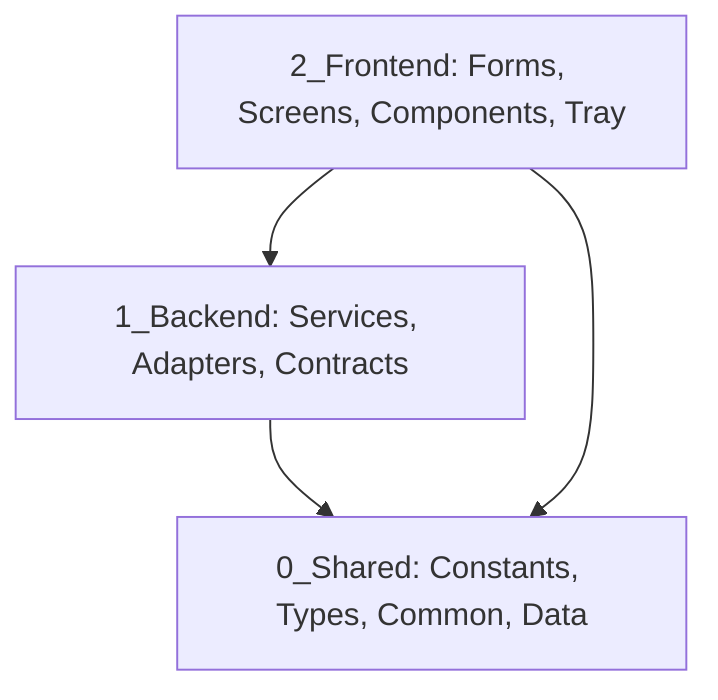

# 02. Architecture & Data Flow Rules

Tài liệu này xác định kiến trúc phân tầng (Clean Layered Architecture), luồng dữ liệu một chiều (Unidirectional Data Flow), và các ranh giới kiến trúc bất biến của dự án `AppForms`.

---

## 1. 🏗️ Phân Tầng Kiến Trúc (Architecture Layers)

Dự án tuân theo quy tắc phụ thuộc nghiêm ngặt: **Tầng bên ngoài phụ thuộc tầng bên trong, tầng bên trong tuyệt đối KHÔNG phụ thuộc tầng bên ngoài.**

### 1.1. `0_Shared/` (Tầng Chia Sẻ Dữ Liệu & Hằng Số)
- **Mục đích**: Chứa các cấu hình bất biến, hằng số toàn cục (`AppConstants.cs`), enum trạng thái (`AppTheme`, `ScreenType`), utility helpers và file dữ liệu mặc định (`0_Shared/Data/schemas.json`, `room_codes.json`).
- **Ràng buộc**: **KHÔNG ĐƯỢC** phụ thuộc vào `1_Backend` hoặc `2_Frontend`.

### 1.2. `1_Backend/` (Tầng Nghiệp Vụ & Dịch Vụ Cốt Lõi)
- **`Contracts/`**:
  - `Interfaces/`: Hợp đồng dịch vụ (`ITextSanitizer`, `IMessageParser`, `ITemplateEngine`, `ISchemaManager`, `ISettingsService`, `IFormConverterService`, `IRoomCodeRepository`).
  - `Entities/`: Thực thể lưu trữ dài hạn (`AppSettings`, `LeadEntity`, `RoomCodeMap`).
  - `Schemas/`: Mô hình schema cấu hình động (`FormatSchema`).
- **`Services/`**: Triển khai logic nghiệp vụ thuần C#, xử lý thuật toán, regex, template, đọc ghi I/O.
- **`Adapters/`**: Kết nối phần cứng, Win32 API (`Win32ClipboardListener`), Diagnostics (`DebugConsole`).
- **`Utils/`**: Công cụ trích xuất text, validation logic.
- **Ràng buộc**: **TUYỆT ĐỐI KHÔNG** tham chiếu thư viện WinForms UI (`System.Windows.Forms.Control`, `Form`, `MessageBox`...).

### 1.3. `2_Frontend/` (Tầng Giao Diện & Trình Diễn)
- **`Forms/`**: Cửa sổ chính (`MainForm.cs`) quản lý Sidebar điều hướng, High DPI scaling, Animation và nhúng Screen.
- **`Screens/`**: Các màn hình tính năng độc lập (`LeadConverter/`, `Settings/`).
- **`Shared/`**: UI Components dùng chung (`ModernButton`, `StatusBadge`), Theme Palette (`AppColors`, `AppFonts`, `AppIconProvider`), và Shared Hooks.
- **`Tray/`**: Quản lý biểu tượng khay hệ thống (`TrayIconManager.cs`).
- **Ràng buộc**: Mọi giao tiếp với Backend **bắt buộc** qua `Hooks` hoặc Service Interfaces được Inject qua Constructor/DI.

---

## 2. 🔄 Luồng Dữ Liệu Chuẩn (Data Flow)

### 2.1. Luồng Tự Động Xử Lý Clipboard (Auto-Convert Flow)
1. `Win32ClipboardListener` phát hiện clipboard thay đổi -> Bắn Event `ClipboardUpdated(text)`.
2. `LeadConverterStateHook` nhận event, gọi `IFormConverterService.Convert(text)`.
3. `FormConverterService` phối hợp:
   - `ITextSanitizer`: Làm sạch chuỗi, chuẩn hóa khoảng trắng/dòng.
   - `ISchemaDetector`: Nhận diện schema phù hợp.
   - `IMessageParser`: Trích xuất các trường thông tin (Tên, SĐT, Số phòng, Ngày...).
   - `ITemplateEngine`: Định dạng văn bản đầu ra theo mẫu được chọn.
4. Hook cập nhật State Model và bắn Event `LeadConverted(result)`.
5. `OutputPreviewBox` và `LeadFieldEditor` lắng nghe Event để re-render giao diện.

### 2.2. Luồng Cấu Hình & Cập Nhật Settings
1. User tương tác với UI trên `SettingsScreen` (chọn Theme, bật Auto-copy, chỉnh phím tắt).
2. Sub-components thông báo `SettingsStateHook`.
3. Hook gọi `ISettingsService.SaveSettings(newSettings)`.
4. `SettingsService` lưu vào file JSON cục bộ (`settings.json`) và kích hoạt `SettingsChanged` event cho toàn hệ thống.
