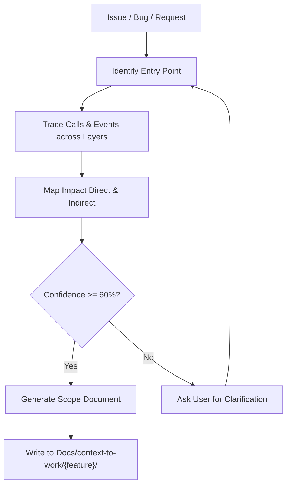

# Scoping Patterns — Cách Trace Relationships

> **Purpose**: Hướng dẫn cách trace relationships và map impact trong codebase Clean 3-layer (0_Shared, 1_Backend, 2_Frontend)
> **Language**: Tiếng Việt
> **Based on**: LLM reasoning + standard file tools

---

## 1. Pattern: Tìm Entry Point

### Khi nào

Khi nhận issue/bug/fix mới → xác định ĐÂU là nơi bắt đầu của vấn đề.

### Cách làm

```yaml
step_1_identify_entry_point:
  ask: 'Vấn đề nằm ở đâu trong kiến trúc 3 tầng?'
  actions:
    - grep keywords từ issue description
    - tìm file/component/service liên quan
    - xác định layer kiến trúc (0_Shared, 1_Backend, 2_Frontend)

  example:
    issue: 'Chuyển đổi sai trường thông tin Số điện thoại'
    entry_point: '1_Backend/Services/MessageParserService.cs'
```

### Entry Point Types trong WinForms AppForms

| Type | Description | Example |
| :--- | :--- | :--- |
| **Service** | Bug trong logic xử lý thuần | `1_Backend/Services/FormConverterService.cs` |
| **Contract** | Thay đổi interface hoặc entity | `1_Backend/Contracts/Entities/LeadEntity.cs` |
| **Hook** | Bug trong state/orchestration | `2_Frontend/Screens/LeadConverter/Hooks/LeadConverterStateHook.cs` |
| **Component** | Bug trong rendering/UI event | `2_Frontend/Screens/LeadConverter/Components/LeadFieldEditor.cs` |
| **Win32 Adapter** | Lỗi tương tác OS clipboard/native | `1_Backend/Adapters/Win32/Win32ClipboardListener.cs` |
| **Shared** | Lỗi enum hoặc shared Result model | `0_Shared/Common/Result.cs` |

---

## 2. Pattern: Trace Function Calls & Event Flow

### Khi nào

Sau khi có entry point → trace xem function/event đó được gọi từ đâu và gọi những gì.

### Cách làm

```yaml
step_2_trace_calls:
  forward_search:
    description: 'Tìm method đó gọi những dependencies nào'
    action: 'grep MethodName( — tìm implementations/dependencies trong 1_Backend và 0_Shared'

  backward_search:
    description: 'Tìm method/event đó được gọi/subscribe từ đâu'
    action: 'grep MethodName hoặc += OnEvent — tìm callers/subscribers trong 2_Frontend'

  dependency_injection_search:
    description: 'Tìm cách service được đăng ký và inject'
    action: "grep IServiceName trong Program.cs hoặc Hook Constructors"
```

### Example trong AppForms

```
Entry: FormConverterService.Convert()

Search: FormConverterService
  → được gọi từ: LeadConverterStateHook.cs
  → gọi: IMessageParserService.Parse(), ISchemaDetectorService.DetectSchema(), ITemplateEngineService.Render()

Search: LeadConverterStateHook.ConversionCompleted
  → được subscribe bởi: LeadConverterScreen.cs, OutputPreviewBox.cs
```

---

## 3. Pattern: Map Impact

### Khi nào

Sau khi trace được call chain → xác định ẢNH HƯỞNG đến các tầng kiến trúc.

### Impact Categories

```yaml
impact_categories:
  direct_impact:
    description: 'File/code trực tiếp liên quan'
    examples:
      - method/class đang có bug
      - file đang được modify

  indirect_impact:
    description: 'File/code bị ảnh hưởng gián tiếp qua Interface hoặc Event'
    examples:
      - caller của method có bug (ví dụ Hook gọi Service)
      - UI Components lắng nghe event phát ra
      - shared contracts/records

  potential_impact:
    description: 'Có thể bị ảnh hưởng kiến trúc'
    examples:
      - DI registrations trong Program.cs
      - Thread safety / UI Invoke (InvokeOnUI)
      - Serialized settings / JSON persistence
```

### Questions để hỏi

1. **Ai gọi method này?** (Upstream callers: Screens, Hooks, Background Listeners)
2. **Method này gọi ai?** (Downstream dependencies: Services, Repositories, Adapters)
3. **Shared contracts/enums nào bị sửa?** (Có ảnh hưởng tới các Screen khác không?)
4. **Có liên quan đến Threading không?** (Có cần `InvokeOnUI` để cập nhật UI không?)
5. **Config/Storage có bị ảnh hưởng không?** (SettingsService, atomic file write?)

---

## 4. Pattern: Verify Findings

### Khi nào

Sau khi có impact map → verify để đảm bảo không miss anything.

### Verification Steps

```yaml
step_4_verify:
  must_do:
    - view_file actual files để confirm findings
    - grep_search để find all occurrences
    - check DI registration và interface implementations

  must_not:
    - không đoán mò
    - không giả định không kiểm chứng
    - không bỏ qua bước xác minh

  confidence_check:
    high: 'Đã verify bằng view_file + grep_search'
    medium: 'Đã grep nhưng chưa xem chi tiết toàn bộ dependencies'
    low: 'Chỉ suy đoán từ mô tả issue'
```

---

## 5. Large Codebase Fallback

### Khi nào

Khi codebase mở rộng → grep/search quá nhiều results.

### Fallback Strategy

```yaml
large_codebase_strategy:
  step_1_limit_scope:
    ask_user: 'Thu hẹp scope theo layer (0_Shared / 1_Backend / 2_Frontend)?'
    action: 'Tập trung vào layer được chỉ định'

  step_2_use_entry_point:
    action: 'Chỉ trace từ entry point dọc theo contract interface'

  step_3_bounded_search:
    max_files: 20
    max_depth: 4
    action: 'Giới hạn search trong phạm vi Screen hoặc Service cụ thể'
```

---

## 6. Workflow Summary



---

## 7. Tools Mapping

| Step | Tool | Usage |
| :--- | :--- | :--- |
| **Identify entry point** | `grep_search`, `find_by_name` | Tìm keywords, class, method |
| **Trace calls & DI** | `grep_search` | Tìm references, interface implementations |
| **Read files** | `view_file` | Kiểm tra nội dung mã nguồn thực tế |
| **Map impact** | LLM reasoning | Phân tích quan hệ giữa các tầng |
| **Verify** | `view_file` + `grep_search` | Xác thực bằng chứng rõ ràng |

---

> **File**: `skills/context-before-fix/knowledge/scoping-patterns.md`
> **Version**: 1.0.0
