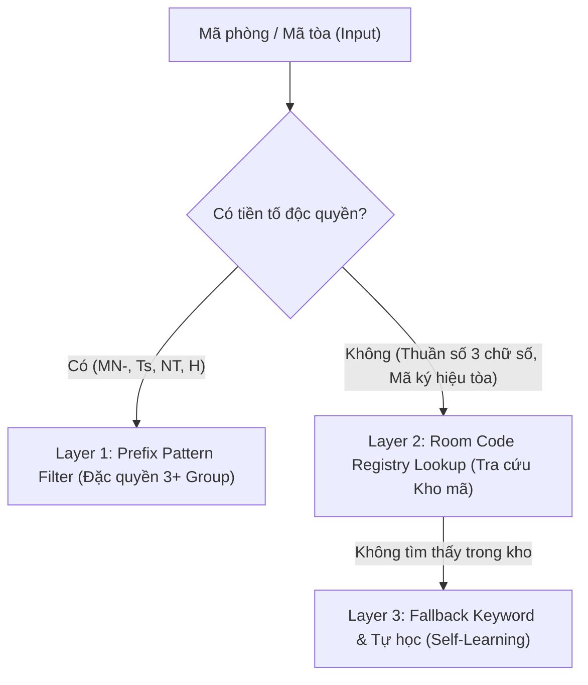
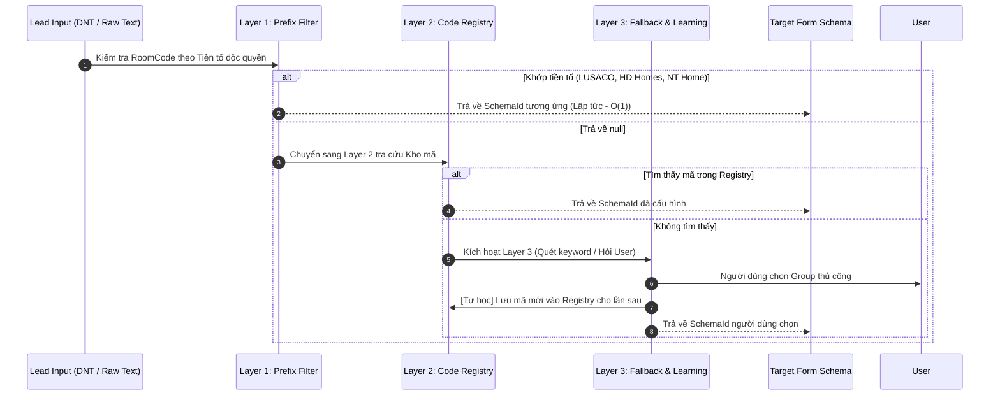

# 📊 TÀI LIỆU PHÂN TÍCH ĐẶC ĐIỂM MÃ PHÒNG & THIẾT KẾ KIẾN TRÚC NHẬN DIỆN ĐA TẦNG (MULTI-LAYER SCHEMA DETECTION)

- **Dự án**: AppForms (Sale Extension Native Desktop)
- **Tài liệu nguồn phân tích**: [zalo-messages-Bắn_Form_qua_đây_nhé-20260812-004239.json](file:///c:/Users/ADMIN/Documents/workspace/Sale_extension/app_native_desktop/app_forms/Docs/zalo-messages-B%E1%BA%AFn_Form_qua_%C4%91%C3%A2y_nh%C3%A9-20260812-004239.json)
- **Mục tiêu**: Bổ sung tầng nhận diện mã theo kho lưu trữ (Code Registry Layer) và đánh giá phương án lưu trữ dữ liệu (JSON vs SQLite).

---

## 1. 🔍 Bối cảnh & Vấn đề Cần Giải Quyết

Khi nhân viên kinh doanh (Sales/CTV) nhận tin nhắn từ form nguồn chung (**Team DNT Home**) hoặc các nhóm chat Zalo, hệ thống cần **tự động chuyển đổi sang đúng Form Schema của Group đối tác đích** dựa trên **Mã phòng / Mã tòa**.

Hiện tại:
- Một số nhóm có **tiền tố nhận diện độc quyền** (như `MN-` của Lusaco, `Ts` của HD Homes, `NT` của NT Home).
- Tuy nhiên, nhiều nhóm khác (như **TL21House**, **TNR HOME**) sử dụng mã dạng **3 chữ số thuần túy** (`410`, `383`, `430`...) hoặc mã ký hiệu tòa (`A355`, `Q160`, `D49`...) **không chứa tiền tố thương hiệu**.
- Nếu chỉ dựa vào regex đơn thuần, hệ thống không thể phân biệt được mã `410` hay `143` thuộc về Group nào nếu có nhiều đối tác cùng dùng dạng mã số này.

👉 **Giải pháp**: Xây dựng **Kiến trúc Nhận diện Đa tầng (Multi-Layer Detection Pipeline)** kết hợp một **Kho lưu trữ Ánh xạ Mã (Room Code Registry)** để quản lý danh mục mã riêng của từng Group.

---

## 2. 🧩 Phân tích Đặc tính Dữ liệu Mã từ Thực tế

Dựa trên 73 tin nhắn trong file log Zalo:



### Chi tiết phân loại mã:
1. **Nhóm mã có tiền tố độc quyền (Layer 1 xử lý ngay):**
   - **LUSACO**: Tiền tố `MN-` hoặc `MN` $\rightarrow$ Ví dụ: `MN-324`, `MN-341`, `Mn35`.
   - **HD Homes**: Tiền tố `Ts` $\rightarrow$ Ví dụ: `Ts007`, `ts12`.
   - **NT HOME**: Tiền tố `NT` $\rightarrow$ Ví dụ: `NT023`, `nt01`.
   - *(Mở rộng: **95 HOME** tiền tố `H` hoặc `95` $\rightarrow$ Ví dụ: `H252`)*.

2. **Nhóm mã cần tra cứu kho lưu trữ (Layer 2 xử lý):**
   - **TL21House**: Toàn bộ mã thuần 3 chữ số (`010`, `042`, `085`, `108`, `178`, `199`, `319`, `383`, `387`, `410`, `430`, `449`, `637`, `721`, `837`, `840`, `921`).
   - **TNR HOME**: Mã ký hiệu tòa (`A355`, `A673`, `A1203`, `Q160`, `D49`, `L48`).
   - **Các đối tác mới sau này**: Bất kỳ mã nào được admin/user khai báo gán cho Group tương ứng.

---

## 3. 🏗️ Thiết kế Kiến trúc Nhận diện Đa Tầng (3-Layer Pipeline)



### Chi tiết nhiệm vụ từng Layer:

- **Layer 1 (Prefix Signature Matching)**:
  - Tốc độ: Cực nhanh ($O(1)$ qua Regex/Prefix string check).
  - Không cần truy vấn ổ đĩa hay database.
  - Phụ trách nhận diện các brand có tiền tố chuẩn quốc tế/cố định.

- **Layer 2 (Code Registry Lookup - Tầng Bổ sung mới)**:
  - Tra cứu trong cấu trúc `Dictionary<string, string>` được nạp sẵn vào RAM khi khởi động.
  - Key: `CleanedRoomCode` (chuẩn hoá chữ thường, bỏ khoảng trắng).
  - Value: `SchemaId` (vd: `tl21_house`, `tnr_home`, `95_home`).
  - Cho phép mỗi Group sở hữu một danh sách không giới hạn các mã đại diện.

- **Layer 3 (Fallback & Self-Learning)**:
  - Nếu mã phòng hoàn toàn mới chưa có trong hệ thống $\rightarrow$ Quét từ khóa trong tin nhắn (`🏆TL21House🏆`, `💛 TNR HOME 🌻`,...).
  - Nếu vẫn không xác định được $\rightarrow$ Để người dùng tự chọn trên UI.
  - **Cơ chế Tự học (Self-Learning)**: Khi người dùng bấm lưu hoặc xuất form, hệ thống hỏi hoặc tự động lưu: *"Gán mã `[Mã]` cho nhóm `[Group]`"* vào Kho lưu trữ của Layer 2. Lần sau gặp lại mã này sẽ nhận diện tự động 100%.

---

## 4. ⚖️ Phân tích Trade-off: Lưu trữ bằng JSON vs SQLite

| Tiêu chí so sánh | Hướng 1: JSON File (`room_codes.json`) | Hướng 2: SQLite (`app_data.db`) | Đánh giá & Khuyến nghị |
| :--- | :--- | :--- | :--- |
| **Quy mô dữ liệu (Scale)** | Phù hợp từ **10 - 20.000 mã** (khoảng $200KB - 2MB$). | Phù hợp từ **hàng chục nghìn đến hàng triệu dòng**. | Hiện tại ứng dụng chỉ có khoảng vài trăm đến vài nghìn mã phòng $\rightarrow$ **JSON vượt trội về độ gọn nhẹ**. |
| **Tốc độ đọc / Tra cứu** | **Siêu nhanh ($O(1)$ trong RAM)**: Đọc 1 lần khi app start vào `Dictionary<string, string>`. | Nhanh, nhưng tốn chi phí I/O query hoặc connection overhead qua ADO.NET. | **JSON thắng** do toàn bộ mã được cache thẳng vào RAM. |
| **Độ phức tạp cài đặt** | Cực kỳ đơn giản (Sử dụng `System.Text.Json` có sẵn trong .NET 6+). Không thêm dependency. | Cần thêm thư viện `Microsoft.Data.Sqlite`, viết migration, quản lý connection lifecycle, locking file. | **JSON thắng** về chi phí maintain code. |
| **Khả năng sửa đổi thủ công / Backup** | Dễ dàng: Người dùng hoặc kỹ thuật có thể mở file JSON bằng Notepad để sửa nhanh hoặc copy backup sang máy khác. | Phải dùng công cụ chuyên dụng (SQLite Browser, DBeaver) để xem/sửa. | **JSON thắng** về tính tiện dụng cho Desktop App nhỏ gọn. |
| **Ghi dữ liệu (Write / Update)** | Ghi đè toàn bộ file khi có mã mới (thời gian ghi $\approx 1 - 3ms$). | Ghi từng bản ghi bằng lệnh `INSERT / UPDATE` với ACID transaction. | Với tần suất ghi thỉnh thoảng của Sale app, việc ghi file JSON hoàn toàn không gây nghẽn. |
| **Đồng bộ / Chia sẻ giữa các máy** | Dễ dàng import/export file `.json` hoặc sync qua Google Drive/OneDrive. | File `.db` dễ bị lock nếu đồng bộ qua cloud sync trực tiếp. | **JSON thắng** trong bài toán chia sẻ tệp cấu hình. |

---

### 💡 KẾT LUẬN & ĐỀ XUẤT LỰA CHỌN (ADR - Architecture Decision)

> **Khuyến nghị**: Sử dụng **JSON File kết hợp In-Memory Cache** làm giải pháp chính thức cho Layer 2.
>
> Để đảm bảo tính mở rộng trong tương lai (nếu sau này hệ thống mở rộng lên hàng chục ngàn căn hộ kèm quản lý hợp đồng/khách hàng cần SQLite), ta sẽ áp dụng **Repository Pattern (`IRoomCodeRepository`)**.
> Nhờ đó, tầng logic `SchemaDetectorService` chỉ giao tiếp qua Interface, sau này có thể đổi từ JSON sang SQLite mà **không phải sửa một dòng code logic nào**!

---

## 5. 📐 Thiết kế Kỹ thuật Chi tiết (Data Contract & Code Specifications)

### 5.1. Cấu trúc File Lưu trữ (`0_Shared/Data/room_codes.json`)

```json
{
  "version": 1,
  "lastUpdated": "2026-08-12T01:50:00Z",
  "groups": {
    "tl21_house": {
      "name": "TL21House",
      "codes": [
        "010", "042", "085", "108", "178", "199", "319", "383", 
        "387", "410", "430", "449", "637", "721", "837", "840", "921"
      ]
    },
    "tnr_home": {
      "name": "TNR HOME",
      "codes": [
        "A355", "A673", "A1203", "Q160", "D49", "L48", "l48"
      ]
    },
    "95_home": {
      "name": "95 HOME",
      "codes": [
        "H252"
      ]
    }
  }
}
```

---

### 5.2. Định nghĩa Interface & Model trong C#

#### 1. Interface Kho lưu trữ (`1_Backend/Contracts/Interfaces/IRoomCodeRepository.cs`)
```csharp
namespace AppForms.Backend.Contracts.Interfaces;

public interface IRoomCodeRepository
{
    /// <summary>
    /// Tra cứu schemaId dựa trên mã phòng (O(1))
    /// </summary>
    string? GetSchemaIdByCode(string roomCode);

    /// <summary>
    /// Thêm hoặc cập nhật một mã phòng cho group
    /// </summary>
    void RegisterCode(string roomCode, string schemaId);

    /// <summary>
    /// Lấy danh sách tất cả các mã của một group
    /// </summary>
    IReadOnlyList<string> GetCodesBySchema(string schemaId);

    /// <summary>
    /// Tải lại dữ liệu từ file lưu trữ
    /// </summary>
    void Reload();
}
```

#### 2. Service Nhận diện Đa Tầng cập nhật (`SchemaDetectorService.cs`)
```csharp
public class SchemaDetectorService : ISchemaDetector
{
    private readonly IRoomCodeRepository _codeRepo;

    public SchemaDetectorService(IRoomCodeRepository codeRepo)
    {
        _codeRepo = codeRepo;
    }

    public string? DetectSchemaId(LeadEntity lead, string? rawText = null)
    {
        var roomCode = lead.RoomCode;
        if (!string.IsNullOrWhiteSpace(roomCode))
        {
            // === LAYER 1: Kiểm tra tiền tố đặc quyền ===
            var l1Result = DetectFromPrefixSignature(roomCode);
            if (l1Result != null) return l1Result;

            // === LAYER 2: Tra cứu trong Code Registry ===
            var l2Result = _codeRepo.GetSchemaIdByCode(roomCode);
            if (l2Result != null) return l2Result;
        }

        // === LAYER 3: Fallback qua TeamName hoặc RawText ===
        if (!string.IsNullOrWhiteSpace(lead.TeamName))
        {
            var detected = DetectFromKeyword(lead.TeamName);
            if (detected != null) return detected;
        }

        if (!string.IsNullOrWhiteSpace(rawText))
        {
            var detected = DetectFromKeyword(rawText);
            if (detected != null) return detected;
        }

        return null;
    }

    private static string? DetectFromPrefixSignature(string code)
    {
        var cleaned = code.Trim();
        if (cleaned.StartsWith("mn", StringComparison.OrdinalIgnoreCase)) return "lusaco";
        if (cleaned.StartsWith("ts", StringComparison.OrdinalIgnoreCase)) return "hd_homes";
        if (cleaned.StartsWith("nt", StringComparison.OrdinalIgnoreCase)) return "nt_home";
        return null;
    }
}
```

---

## 6. 🚀 Kế hoạch Thực thi Đề xuất (Next Steps)

1. **Giai đoạn 1**: Tạo file `room_codes.json` khởi tạo sẵn danh sách mã đã trích xuất từ file log Zalo ([TL21House](file:///c:/Users/ADMIN/Documents/workspace/Sale_extension/app_native_desktop/app_forms/Docs/zalo-messages-B%E1%BA%AFn_Form_qua_%C4%91%C3%A2y_nh%C3%A9-20260812-004239.json#L5), [TNR HOME](file:///c:/Users/ADMIN/Documents/workspace/Sale_extension/app_native_desktop/app_forms/Docs/zalo-messages-B%E1%BA%AFn_Form_qua_%C4%91%C3%A2y_nh%C3%A9-20260812-004239.json#L49), [95 HOME](file:///c:/Users/ADMIN/Documents/workspace/Sale_extension/app_native_desktop/app_forms/Docs/zalo-messages-B%E1%BA%AFn_Form_qua_%C4%91%C3%A2y_nh%C3%A9-20260812-004239.json#L105)).
2. **Giai đoạn 2**: Triển khai `IRoomCodeRepository` và `JsonRoomCodeRepository` trong `1_Backend/Services/`.
3. **Giai đoạn 3**: Tích hợp Layer 2 vào `SchemaDetectorService` và Dependency Injection trong `Program.cs`.
4. **Giai đoạn 4**: Bổ sung tính năng UI cho phép người dùng xem/thêm/sửa danh mục mã theo từng Sàn trong màn hình Settings hoặc Converter.
