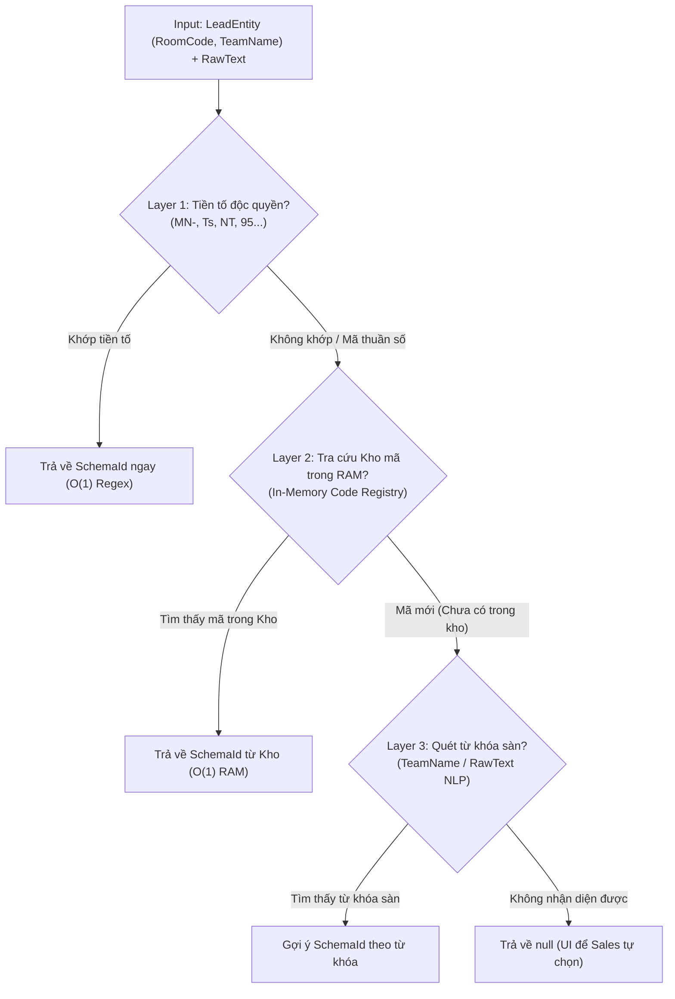
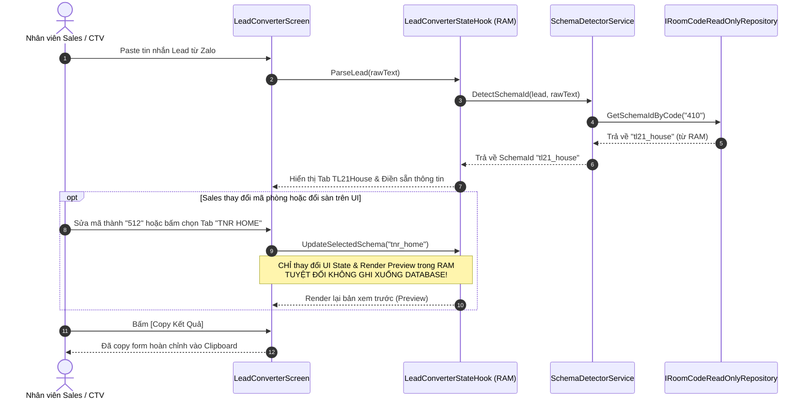
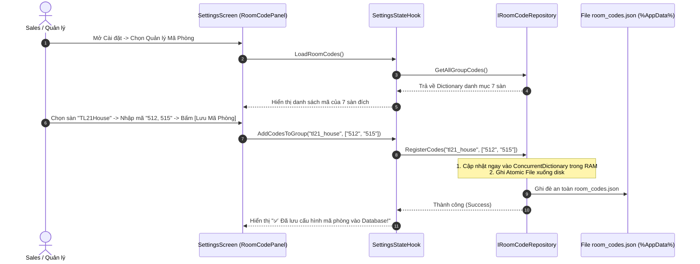

# 🏛️ TÀI LIỆU THIẾT KẾ KIẾN TRÚC & LUỒNG NGHIỆP VỤ: KHO LƯU TRỮ MÃ PHÒNG VÀ NHẬN DIỆN ĐA TẦNG (ROOM CODE REGISTRY & MULTI-LAYER DETECTION)

- **Dự án**: AppForms (Sale Extension Native Desktop)
- **Tác giả**: AI Product & Development Agent (Tuân thủ [Docs/Trade-off/AGENTS.md](file:///c:/Users/ADMIN/Documents/workspace/Sale_extension/app_native_desktop/app_forms/Docs/Trade-off/AGENTS.md) & [2_Frontend/Screens/AGENTS.md](file:///c:/Users/ADMIN/Documents/workspace/Sale_extension/app_native_desktop/app_forms/2_Frontend/Screens/AGENTS.md))
- **Trạng thái**: Approved Design (Sẵn sàng triển khai)
- **File dữ liệu mặc định**: [0_Shared/Data/room_codes.json](file:///c:/Users/ADMIN/Documents/workspace/Sale_extension/app_native_desktop/app_forms/0_Shared/Data/room_codes.json)

---

## 1. 🎯 Bối Cảnh & Mục Tiêu Nghiệp Vụ

### 1.1. Bối cảnh hệ thống
Khi nhân viên kinh doanh (Sales / CTV) nhận tin nhắn từ form nguồn chung (**Team DNT Home**) hoặc các nhóm chat Zalo, hệ thống cần **tự động phân tích và chuyển đổi chính xác sang 1 trong 7 Form Schema đầu ra (Output Form Schemas)**:

```
[INPUT FORMAT]                                  [OUTPUT FORM SCHEMAS (7 SÀN)]
Team DNT Home / Raw Text  ──(Nhận diện Đa tầng)──► 1. TL21House    (tl21_house)
                                                  ► 2. TNR HOME      (tnr_home)
                                                  ► 3. 95 HOME       (95_home)
                                                  ► 4. LUSACO        (lusaco)
                                                  ► 5. HD Homes      (hd_homes)
                                                  ► 6. NT HOME       (nt_home)
                                                  ► 7. A Sky Group   (a_sky_group)
```

> [!IMPORTANT]
> **Quy định về DNT Home**:
> **DNT Home** là định dạng nguồn đầu vào (**Input Format**), **KHÔNG** phải là sàn đích đầu ra (**Output Schema**). Do đó, danh mục mã phòng trong kho lưu trữ chỉ phân bổ cho 7 sàn đích nói trên, tuyệt đối không gán mã đầu ra cho DNT Home.

### 1.2. Mục tiêu kiến trúc
1. **Tự động nhận diện chính xác $\ge 95\%$**: Ngay cả với các mã phòng thuần số 3 chữ số (`010`, `410`, `383`...) hoặc mã ký hiệu tòa (`A355`, `Q160`, `D49`...).
2. **Tốc độ phản hồi tức thời ($< 5\text{ms}$)**: Toàn bộ quá trình tra cứu mã phòng diễn ra trong bộ nhớ RAM ($O(1)$).
3. **Độc quyền phân quyền (Single Source of Mutation)**: Chỉ duy nhất màn hình **Cài đặt (`SettingsScreen`)** có quyền thêm/sửa/xóa mã và lưu xuống database. Màn hình **Chuyển đổi (`LeadConverterScreen`)** hoàn toàn **Read-Only** đối với database.

---

## 2. 🔐 QUY TẮC CỐT LÕI: PHÂN ĐỊNH QUYỀN HẠN DỮ LIỆU (SINGLE SOURCE OF MUTATION)

Để đảm bảo tính toàn vẹn dữ liệu, loại bỏ rác dữ liệu và cách ly tuyệt đối giữa **UI State** và **Persistent State**:

```
┌────────────────────────────────────────────────────────────────────────────────────────┐
│                                PHÂN ĐỊNH TRÁCH NHIỆM                                   │
└───────────────────────────────────────────┬────────────────────────────────────────────┘
                                            │
               ┌────────────────────────────┴────────────────────────────┐
               ▼                                                         ▼
┌──────────────────────────────────────────────┐        ┌──────────────────────────────────────────────┐
│       2_Frontend/Screens/LeadConverter       │        │          2_Frontend/Screens/Settings         │
│   (CHỈ ĐỌC DỮ LIỆU - READ-ONLY CONSUMER)     │        │   (ĐỘC QUYỀN GHI DỮ LIỆU - SOLE MUTATOR)     │
├──────────────────────────────────────────────┤        ├──────────────────────────────────────────────┤
│ • Tra cứu mã phòng (Read-Only Lookup O(1))   │        │ • Xem toàn bộ danh sách mã theo từng Sàn     │
│ • Nhận diện tự động Form Schema              │        │ • Thêm mới mã phòng (đơn lẻ / hàng loạt)     │
│ • Khi Sales sửa mã hoặc đổi Tab trên UI:     │        │ • Xóa mã phòng / Chuyển sàn cho mã           │
│   👉 CHỈ thay đổi LeadState cục bộ trong RAM │        │ • Ghi Atomic File xuống Database             │
│   👉 TUYỆT ĐỐI KHÔNG ghi xuống Database      │        │   (%AppData%\...\room_codes.json)            │
└──────────────────────────────────────────────┘        └──────────────────────────────────────────────┘
```

### Các điều cấm kỵ (Negative Space):
- ❌ **CẤM** tự động lưu ngầm mã mới vào database khi Sales đang thao tác tại `LeadConverterScreen`.
- ❌ **CẤM** đọc file từ ổ cứng đĩa trong hàm `DetectSchemaId`. Mọi thao tác đọc đều lấy từ RAM Cache.
- ❌ **CẤM** ghi đè trực tiếp làm hỏng file dữ liệu khi gặp sự cố mất điện (Bắt buộc dùng cơ chế Atomic File Move).

---

## 3. 💾 THIẾT KẾ KHO LƯU TRỮ MÃ PHÒNG (STORAGE ARCHITECTURE)

### 3.1. Mô hình In-Memory Cache + JSON Persistence
```
[Khởi động App] ──► Đọc %AppData%/room_codes.json (Fallback: 0_Shared/Data/room_codes.json)
                         │
                         ▼
             [In-Memory Hash Registry]
             ConcurrentDictionary<string, string>  (CleanedCode -> SchemaId)
                         │
        ┌────────────────┴────────────────┐
        ▼                                 ▼
[LeadConverterScreen]            [SettingsScreen]
(Read-Only Tra cứu O(1))         (Thêm / Sửa / Xóa)
                                          │
                                          ▼
                                 [Atomic Async Save]
                                 room_codes.json.tmp ──(File.Move)──► room_codes.json
```

### 3.2. Vị trí Lưu trữ Vật lý
1. **Seed Data (Mặc định khi cài app)**:
   - Đường dẫn: `0_Shared/Data/room_codes.json`
   - Nhiệm vụ: Chứa danh mục mã phòng ban đầu đã trích xuất từ 73 mẫu tin nhắn Zalo thực tế.
2. **Runtime Data (Dữ liệu người dùng)**:
   - Đường dẫn: `%AppData%\SaleLeadFormConverter\room_codes.json`
   - Nhiệm vụ: Lưu trữ các cập nhật của người dùng trong quá trình vận hành, không bị mất khi update app.

---

## 4. 🔍 KIẾN TRÚC NHẬN DIỆN ĐA TẦNG (MULTI-LAYER DETECTION PIPELINE)

Hệ thống `SchemaDetectorService` xử lý nhận diện qua 3 tầng tuần tự:



### Phân công nhiệm vụ từng Layer:
1. **Layer 1 - Prefix Pattern Matching ($O(1)$)**:
   - Nhận diện các sàn có tiền tố thương hiệu chuẩn:
     - `MN-`, `Mn`, `mn` $\rightarrow$ `lusaco`
     - `Ts`, `ts` $\rightarrow$ `hd_homes`
     - `NT`, `nt` $\rightarrow$ `nt_home`
     - `95` $\rightarrow$ `95_home`
2. **Layer 2 - Code Registry In-Memory Lookup ($O(1)$)**:
   - Nhận diện các mã thuần số và mã tòa đặc thù:
     - Thuần số 3 chữ số (`010, 042, 108, 383, 410...`) $\rightarrow$ `tl21_house`
     - Ký hiệu tòa (`A355, A673, Q160, D49, L48...`) $\rightarrow$ `tnr_home`
     - Ký hiệu `H252` $\rightarrow$ `95_home`
3. **Layer 3 - Keyword / NLP Fallback ($O(N)$)**:
   - Quét tiêu đề nhóm Zalo hoặc từ khóa trong nội dung tin nhắn (`TL21House`, `TNR HOME`, `LUSACO`, `A Sky Group`...).
4. **UI Fallback**:
   - Nếu cả 3 layer đều không nhận diện được, UI giữ nguyên trạng thái để Sales chọn thủ công trên Tab Bar.

---

## 5. 🔄 THIẾT KẾ LUỒNG NGHIỆP VỤ CHI TIẾT (BUSINESS WORKFLOWS)

### 5.1. Luồng Chuyển đổi Lead (Tại `LeadConverterScreen` - 100% Read-Only)



---

### 5.2. Luồng Quản lý Kho Mã Phòng (Tại `SettingsScreen` - Độc quyền Ghi)



---

## 6. 📐 THIẾT KẾ KỸ THUẬT & DATA CONTRACTS (C# SPECIFICATIONS)

### 6.1. Interface Segregation (Tách biệt quyền hạn)

```csharp
namespace AppForms.Backend.Contracts.Interfaces;

/// <summary>
/// Interface CHỈ ĐỌC - Dành cho SchemaDetectorService và LeadConverterScreen
/// </summary>
public interface IRoomCodeReadOnlyRepository
{
    string? GetSchemaIdByCode(string roomCode);
    IReadOnlyList<string> GetCodesBySchema(string schemaId);
    IReadOnlyDictionary<string, List<string>> GetAllGroupCodes();
}

/// <summary>
/// Interface TOÀN QUYỀN - CHỈ INJECT VÀO SettingsScreen / SettingsStateHook
/// </summary>
public interface IRoomCodeRepository : IRoomCodeReadOnlyRepository
{
    Result RegisterCodes(string schemaId, IEnumerable<string> roomCodes);
    Result RemoveCodes(IEnumerable<string> roomCodes);
    Result Reload();
    Result Save();
}
```

---

### 6.2. Cấu trúc Component Màn hình Cài đặt theo chuẩn `2_Frontend/Screens/AGENTS.md`

```text
2_Frontend/Screens/Settings/
├── Components/
│   ├── SettingsGeneralPanel.cs        # [VIEW] Cài đặt chung (Tên CTV, Clipboard, Tray)
│   └── RoomCodeManagementPanel.cs     # [VIEW] Quản lý mã: Dropdown chọn Sàn, Grid/List mã, Box nhập nhanh
│
├── Hooks/
│   └── SettingsStateHook.cs           # [STATE] Quản lý state Cài đặt & gọi IRoomCodeRepository
│
├── Models/
│   └── RoomCodeGroupViewModel.cs      # [DTO CỤC BỘ] Model hiển thị danh mục mã trên UI Settings
│
└── SettingsScreen.cs                  # [ROOT] Ghép Tab/Layout tổng (< 120 dòng code)
```

---

## 7. 🗄️ BẢNG DANH MỤC MÃ PHÒNG MẶC ĐỊNH (SEED DATA SUMMARY)

Dữ liệu được lưu trữ chính thức tại [0_Shared/Data/room_codes.json](file:///c:/Users/ADMIN/Documents/workspace/Sale_extension/app_native_desktop/app_forms/0_Shared/Data/room_codes.json):

| Sàn Đích (Output Schema) | Schema ID | Danh sách mã phòng mặc định ban đầu (`codes`) |
| :--- | :--- | :--- |
| **TL21House** | `tl21_house` | `010`, `042`, `085`, `108`, `178`, `199`, `319`, `383`, `387`, `410`, `430`, `449`, `637`, `721`, `837`, `840`, `921` |
| **TNR HOME** | `tnr_home` | `A355`, `A673`, `A1203`, `Q160`, `D49`, `L48`, `l48` |
| **95 HOME** | `95_home` | `H252` |
| **LUSACO** | `lusaco` | `MN-324`, `MN-341`, `MN35`, `Mn35` |
| **HD Homes** | `hd_homes` | `Ts007`, `ts12` |
| **NT HOME** | `nt_home` | `NT023`, `nt01` |
| **A Sky Group** | `a_sky_group` | *(Người dùng cấu hình thêm mã qua Settings)* |

> *(Lưu ý: Kho lưu trữ chỉ quản lý danh sách mã chính xác `codes: [...]`, không dùng `prefixHints` để tránh xung đột ký tự giữa các sàn. DNT Home được loại trừ hoàn toàn vì là Form Nguồn Đầu Vào).*

---

## 8. 🏁 KẾ HOẠCH TRIỂN KHAI MÃ NGUỒN (EXECUTION PLAN)

1. **Bước 1 (Backend Contracts & Repo)**:
   - Tạo [IRoomCodeRepository.cs](file:///c:/Users/ADMIN/Documents/workspace/Sale_extension/app_native_desktop/app_forms/1_Backend/Contracts/Interfaces/IRoomCodeRepository.cs) trong `1_Backend/Contracts/Interfaces/`.
   - Tạo `JsonRoomCodeRepository.cs` trong `1_Backend/Services/` với cơ chế In-Memory Cache + Atomic Save.
2. **Bước 2 (Backend Service Integration)**:
   - Cập nhật [SchemaDetectorService.cs](file:///c:/Users/ADMIN/Documents/workspace/Sale_extension/app_native_desktop/app_forms/1_Backend/Services/SchemaDetectorService.cs) để tích hợp Layer 2 tra cứu từ `IRoomCodeReadOnlyRepository`.
   - Đăng ký DI trong [Program.cs](file:///c:/Users/ADMIN/Documents/workspace/Sale_extension/app_native_desktop/app_forms/Program.cs).
3. **Bước 3 (Frontend Refactoring - Settings)**:
   - Refactor `2_Frontend/Screens/Settings/` theo chuẩn Component-Driven & Hook Pattern:
     - Tạo `RoomCodeManagementPanel.cs`
     - Tạo `SettingsGeneralPanel.cs`
     - Tạo `SettingsStateHook.cs`
     - Cập nhật `SettingsScreen.cs` $\le 120$ dòng.
4. **Bước 4 (Testing & Verification)**:
   - Kiểm tra nhận diện 73 mẫu tin nhắn Zalo.
   - Kiểm tra tính độc quyền ghi dữ liệu tại `SettingsScreen`.
