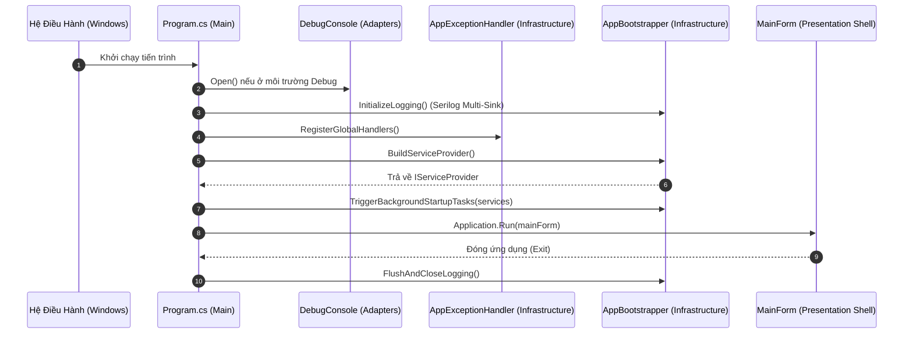

# 🚀 Vòng Đời Ứng Dụng & Entry Point Chuẩn Hóa

## 1. Vấn Đề Khi Để `Program.cs` Phình To
Thông thường trong các dự án WinForms, `Program.cs` dễ trở thành "bãi rác" chứa:
- Cấu hình Serilog & quản lý file Session/Daily Log.
- Khởi tạo và đăng ký hàng chục Service vào IoC Container.
- Bắt lỗi crash và unhandled exceptions.
- Tự động chạy tác vụ nền (Self-healing Desktop shortcut, v.v.).

Điều này vi phạm nguyên lý **Single Responsibility Principle (SRP)**, khiến file Entry Point khó đọc và khó bảo trì.

---

## 2. Luồng Khởi Động Chuẩn Của Hệ Thống

---

## 3. Vai Trò Từng Thành Phần Đã Tách

1. **`Program.cs`**:
   - Đóng vai trò là **Application Entry Point**.
   - Kích thước tinh gọn $\le 50$ dòng code.
   - Chỉ điều phối thứ tự vòng đời: Bật Logger $\to$ Bắt Exception $\to$ Build DI $\to$ `Application.Run(mainForm)` $\to$ Cleanup.

2. **`AppBootstrapper.cs` (`1_Backend/Infrastructure/`)**:
   - Cấu hình Serilog Multi-Sink (`Console`, `Logs/app-.log`, `Logs/Sessions/session-latest.log`).
   - Quản lý archive session log cũ và dọn dẹp log quá hạn.
   - Khởi tạo `ServiceCollection`, đăng ký toàn bộ Services/Screens/Adapters và build `IServiceProvider`.
   - Kích hoạt các background self-healing task không đồng bộ khi khởi động (Desktop Shortcut self-heal).

3. **`AppExceptionHandler.cs` (`1_Backend/Infrastructure/`)**:
   - Đón bắt mọi lỗi crash ngoài ý muốn:
     - `Application.ThreadException` (UI Thread Crash).
     - `AppDomain.CurrentDomain.UnhandledException` (AppDomain Crash).
     - `TaskScheduler.UnobservedTaskException` (Background Task Crash).
     - `AppDomain.CurrentDomain.ProcessExit` (Flush log khi đóng).
