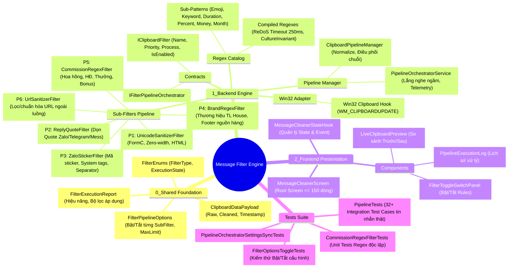
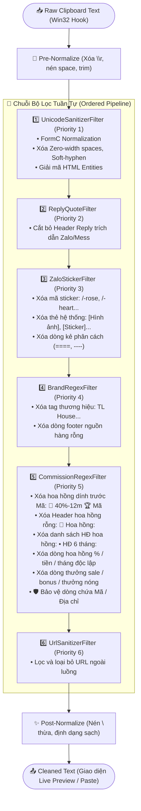
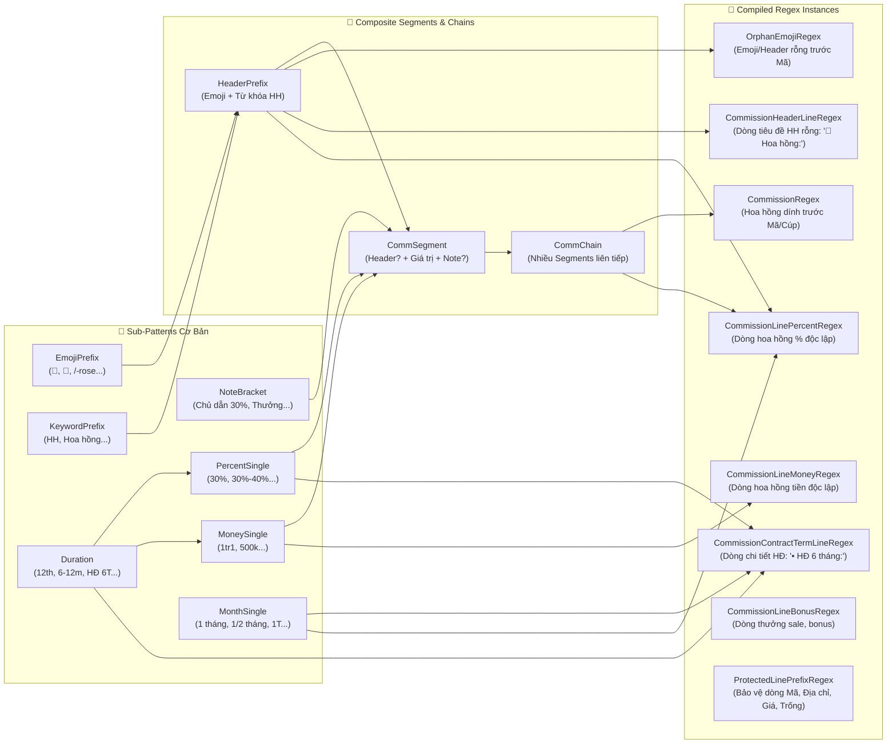
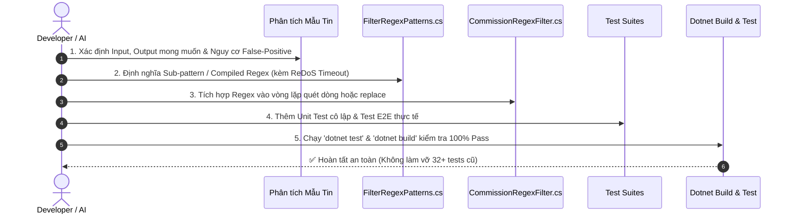

# 🧠 BẢN ĐỒ TƯ DUY & DANH SÁCH PHỤ THUỘC: MODULE MESSAGE FILTER REGEX

- **Tệp tài liệu**: `Docs/Maps/01_Message_Filter_Regex_Mindmap.md`
- **Hệ thống**: Windows Native Desktop C# .NET 6.0 (`app_forms`)
- **Kiến trúc**: Clean 3-Layer Architecture & Component-Driven Pipeline
- **Mục đích**: Cung cấp bức tranh toàn cảnh về cách module lọc tin nhắn và regex được quản lý, phân tầng, thứ tự ưu tiên, danh sách phụ thuộc và quy trình chuẩn khi cần bảo trì/thêm mới Regex.

---

## 1. 🗺️ MINDMAP TỔNG THỂ HỆ THỐNG MESSAGE FILTER



---

## 2. 🔄 LUỒNG THỰC THI PIPELINE & THỨ TỰ ƯU TIÊN (EXECUTION FLOW)

Mỗi đoạn văn bản từ Clipboard sẽ chạy qua một chuỗi Pipeline gồm 6 Sub-Filters được sắp xếp theo `Priority` từ thấp đến cao (thực hiện trước $\to$ sau):



---

## 3. 🧩 BẢN ĐỒ CẤU TRÚC REGEX (`FilterRegexPatterns.cs`)

Hệ thống Regex được xây dựng theo phương pháp **Modular Regex Lego Blocks** (Ghép các Sub-pattern nhỏ thành chuỗi phân đoạn phức tạp):



---

## 4. 📋 DANH SÁCH FILE & PHỤ THUỘC KHI BẢO TRÌ (DEPENDENCY MATRIX)

Khi cần chỉnh sửa, tối ưu hoặc bổ sung Regex mới, dưới đây là danh sách toàn bộ các file liên quan theo thứ tự phân tầng:

| Phân tầng | Đường dẫn File | Trách nhiệm chính | Khi nào cần sửa? |
| :--- | :--- | :--- | :--- |
| **0_Shared** | `0_Shared/Models/MessageFilter/FilterPipelineOptions.cs` | DTO cấu hình Bật/Tắt các bộ lọc | Khi bổ sung SubFilter mới cần có toggle ON/OFF |
| **1_Backend** | `1_Backend/Services/MessageFilter/Helpers/FilterRegexPatterns.cs` | **Trọng tâm Regex**: Chứa Sub-patterns và Compiled Regexes | **Mọi trường hợp thêm pattern hoặc đổi logic Regex** |
| **1_Backend** | `1_Backend/Services/MessageFilter/SubFilters/CommissionRegexFilter.cs` | Sub-Filter xử lý hoa hồng (dính mã, lọc theo dòng) | Khi cần thay đổi luồng quét (line-by-line vs regex replace) |
| **1_Backend** | `1_Backend/Services/MessageFilter/ClipboardPipelineManager.cs` | Engine điều phối toàn bộ chuỗi Pipeline & Normalize | Khi cần thay đổi logic Normalize khoảng trắng hoặc thứ tự bộ lọc |
| **1_Backend** | `1_Backend/Contracts/Interfaces/IClipboardFilter.cs` | Interface chuẩn của mọi SubFilter | Khi cần thay đổi hợp đồng lọc hoặc metadata |
| **Tests** | `Tests/MessageFilter/CommissionRegexFilterTests.cs` | Unit Tests kiểm tra từng Regex/Dòng độc lập | **Bắt buộc**: Viết test case cô lập cho pattern mới |
| **Tests** | `Tests/MessageFilter/PipelineTests.cs` | Integration Tests toàn bộ Pipeline với tin nhắn thật | **Bắt buộc**: Viết test case End-to-End cho tin nhắn đầy đủ |

---

## 5. 🛠️ PLAYBOOK: QUY TRÌNH 5 BƯỚC THÊM/SỬA REGEX MỚI

Khi gặp một mẫu tin nhắn bất động sản mới phát sinh (ví dụ: format hoa hồng mới, mẫu thưởng mới, ký tự sticker lạ), thực hiện theo đúng 5 bước chuẩn hóa sau:



### Chi tiết các bước thực hiện:

### 🔹 Bước 1: Thu Thập & Phân Tích Scope Mẫu Tin
- Ghi lại chuỗi **Input** thô.
- Xác định chuỗi **Expected Output** sau khi lọc.
- Đặt câu hỏi phản biện: *Regex mới có nguy cơ xóa nhầm thông tin hợp lệ không?* (ví dụ: dòng Giá `☘ Giá: 6tr2`, dòng Trống `⌛️ Trống: 1/9`, Điều kiện thuê `📌 HĐ 12 tháng`).

### 🔹 Bước 2: Bổ Sung Pattern vào `FilterRegexPatterns.cs`
- Nếu là thành phần nhỏ (thời gian, đơn vị tiền, từ khóa): Bổ sung vào `Patterns.*`.
- Nếu là Regex hoàn chỉnh: Tạo `public static readonly Regex ...Regex = new(...)`.
- **Quy tắc bắt buộc**:
  - Luôn cấu hình `RegexOptions.Compiled | RegexOptions.CultureInvariant | RegexOptions.IgnoreCase`.
  - Luôn truyền `DefaultRegexTimeout` (`TimeSpan.FromMilliseconds(250)`) để chống ReDoS.

### 🔹 Bước 3: Đấu Nối vào `CommissionRegexFilter.cs`
- Nếu là dạng dính liền trước Mã $\to$ Đặt ở đầu hàm qua `.Replace(text, "")`.
- Nếu là dạng dòng độc lập $\to$ Đặt trong vòng lặp `while ((rawLine = reader.ReadLine()) != null)`:
  ```csharp
  if (FilterRegexPatterns.YourNewRegex.IsMatch(trimmed) &&
      !FilterRegexPatterns.ProtectedLinePrefixRegex.IsMatch(trimmed))
  {
      continue; // Bỏ qua dòng rác
  }
  ```

### 🔹 Bước 4: Viết Test Case Xác Thực
- Mở `CommissionRegexFilterTests.cs` $\to$ Thêm mẫu vào `[Theory] [InlineData(...)]` hoặc viết `[Fact]` mới.
- Mở `PipelineTests.cs` $\to$ Thêm `[Fact] public void TC{XX}_...()` với toàn bộ tin nhắn thật.

### 🔹 Bước 5: Chạy Kiểm Thử Toàn Bộ
- Thực thi lệnh:
  ```powershell
  dotnet test
  dotnet build
  ```
- Đảm bảo **100% Test Passed** và **0 Warning, 0 Error**.

---

## 6. 🛡️ QUY TẮC BẢO VỆ CHỐNG XÓA NHẦM (FALSE-POSITIVE SHIELD)

Để đảm bảo không bao giờ xóa nhầm dữ liệu quan trọng của khách hàng/môi giới, hệ thống áp dụng cơ chế 3 lớp bảo vệ:

1. **Lớp 1 - Regex Tiền Tố Bảo Vệ (`ProtectedLinePrefixRegex`)**:
   - Mọi dòng bắt đầu bằng `Mã:`, `🏆`, `🎖️`, `⭐`, `📍`, `🏢 Địa chỉ`, `☘ Giá`, `⌛️ Trống`, `TL...`, `H...`, `P...` sẽ **không bao giờ** bị xóa bởi các regex lọc thưởng/ghi chú.
2. **Lớp 2 - Định Dạng Dấu Hai Chấm (`:`) Ngược**:
   - `HĐ 6 tháng:` (thời gian trước dấu `:`) $\rightarrow$ Khối hoa hồng $\rightarrow$ **Xóa**.
   - `📌 Điều kiện: HĐ 6 tháng` (thời gian sau dấu `:`) $\rightarrow$ Điều kiện thuê phòng $\rightarrow$ **Giữ lại**.
3. **Lớp 3 - ReDoS & Character Limit Protection**:
   - Giới hạn payload tối đa (`MaxPayloadCharacterLimit = 20,000`).
   - Timeout tối đa 250ms trên mỗi lần khớp mẫu Regex.
