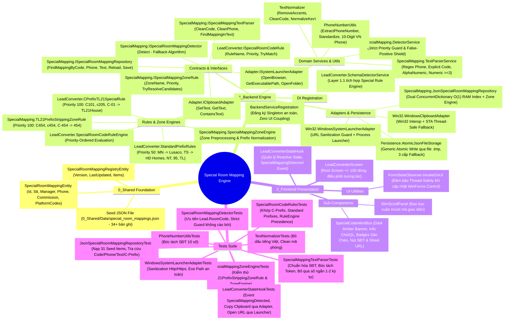
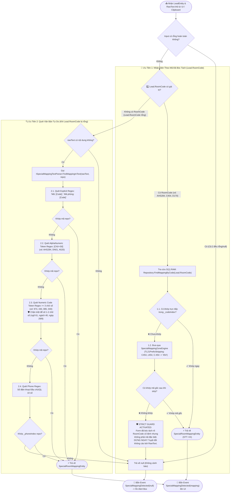
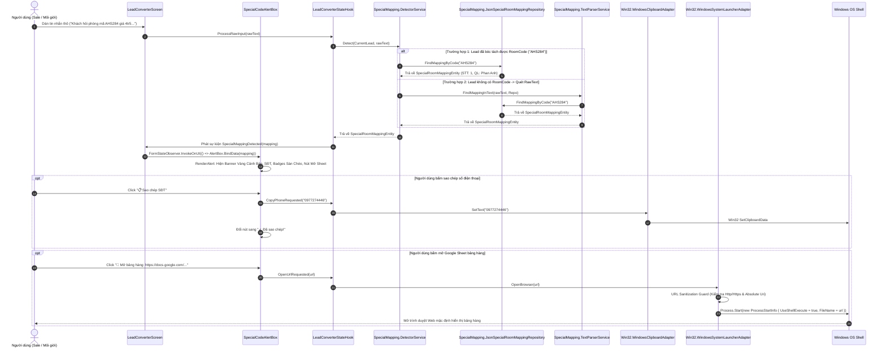
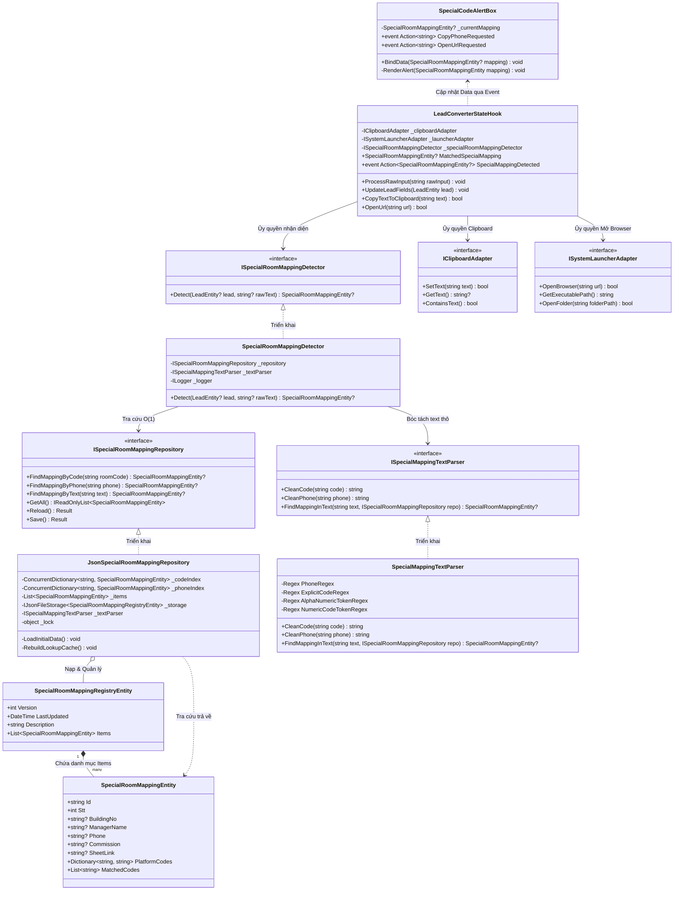
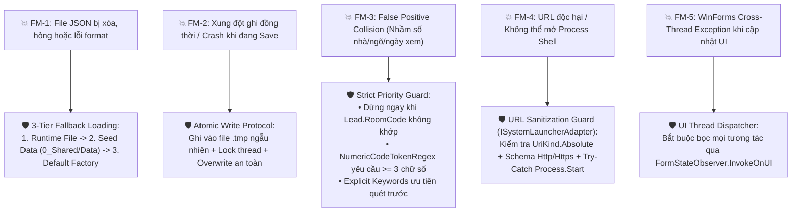
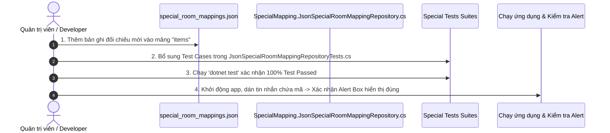

# 🧠 BẢN ĐỒ TƯ DUY & DANH SÁCH PHỤ THUỘC: MODULE SPECIAL ROOM MAPPING

- **Tệp tài liệu**: `Docs/Maps/02_Special_Room_Mapping_Mindmap.md`
- **Hệ thống**: Windows Native Desktop C# .NET 6.0 (`app_forms`)
- **Kiến trúc**: Clean 3-Layer Architecture, Component-Driven Reactive UI & Flat Dot Naming Pattern
- **Mục đích**: Cung cấp bức tranh toàn cảnh về cách module nhận diện, tra cứu, đối chiếu chéo đa sàn và cảnh báo mã phòng đặc biệt được thiết kế, phân tầng trách nhiệm, chỉ mục bộ nhớ đệm O(1), cơ chế phòng thủ chống False-Positive, bóc tách Adapter OS/Clipboard, ma trận đánh đổi 6 chiều và quy trình chuẩn khi cần bảo trì/thêm mới dữ liệu.

---

## 1. 🗺️ MINDMAP TỔNG THỂ HỆ THỐNG SPECIAL ROOM MAPPING



---

## 2. 🏛️ BẢNG PHÂN TẦNG KIẾN TRÚC & DANH MỤC SUB-MODULES

Toàn bộ module tuân thủ nghiêm ngặt **Clean 3-Layer Architecture**, **Flat Dot/Prefix Naming Pattern** và **AppForms AI System Charter**:

| Phân tầng | Tên Module / Sub-module | Đường dẫn File Mã Nguồn | Trách nhiệm Nghiệp vụ Cốt lõi | Độ phức tạp |
| :--- | :--- | :--- | :--- | :---: |
| **0_Shared** | `Data Seed JSON` | [`0_Shared/Data/special_room_mappings.json`](file:///C:/Users/ADMIN/Documents/workspace/Sale_extension/app_native_desktop/app_forms/0_Shared/Data/special_room_mappings.json) | Lưu trữ danh mục 34+ phòng đặc biệt, số điện thoại đầu chủ, hoa hồng, link sheet và mã định danh chéo giữa các sàn (AHS, Lusaco, TNR, HD Homes, NT...). | $O(1)$ IO Nạp |
| **0_Shared** | `Mapping Entity` | [`0_Shared/Models/SpecialMapping/SpecialRoomMappingEntity.cs`](file:///C:/Users/ADMIN/Documents/workspace/Sale_extension/app_native_desktop/app_forms/0_Shared/Models/SpecialMapping/SpecialRoomMappingEntity.cs) | POCO DTO định nghĩa cấu trúc một bản ghi đối chiếu phòng đặc biệt. | $O(1)$ RAM |
| **0_Shared** | `Registry Entity` | [`0_Shared/Models/SpecialMapping/SpecialRoomMappingRegistryEntity.cs`](file:///C:/Users/ADMIN/Documents/workspace/Sale_extension/app_native_desktop/app_forms/0_Shared/Models/SpecialMapping/SpecialRoomMappingRegistryEntity.cs) | POCO DTO đại diện toàn bộ file cơ sở dữ liệu JSON kèm metadata phiên bản và ngày cập nhật. | $O(1)$ RAM |
| **1_Backend** | `Repository Contract` | [`1_Backend/Contracts/Interfaces/SpecialMapping.ISpecialRoomMappingRepository.cs`](file:///C:/Users/ADMIN/Documents/workspace/Sale_extension/app_native_desktop/app_forms/1_Backend/Contracts/Interfaces/SpecialMapping.ISpecialRoomMappingRepository.cs) | Interface hợp đồng kho lưu trữ tra cứu mã phòng, số điện thoại, quét text và nạp/lưu dữ liệu. | Interface |
| **1_Backend** | `Detector Contract` | [`1_Backend/Contracts/Interfaces/SpecialMapping.ISpecialRoomMappingDetector.cs`](file:///C:/Users/ADMIN/Documents/workspace/Sale_extension/app_native_desktop/app_forms/1_Backend/Contracts/Interfaces/SpecialMapping.ISpecialRoomMappingDetector.cs) | Interface Domain Service điều phối thuật toán nhận diện và chiến lược Fallback. | Interface |
| **1_Backend** | `Parser Contract` | [`1_Backend/Contracts/Interfaces/SpecialMapping.ISpecialMappingTextParser.cs`](file:///C:/Users/ADMIN/Documents/workspace/Sale_extension/app_native_desktop/app_forms/1_Backend/Contracts/Interfaces/SpecialMapping.ISpecialMappingTextParser.cs) | Interface bóc tách Regex và chuẩn hóa token mã/SĐT từ văn bản thô. | Interface |
| **1_Backend** | `Zone Rule Contract` | [`1_Backend/Contracts/Rules/SpecialMapping.ISpecialMappingZoneRule.cs`](file:///C:/Users/ADMIN/Documents/workspace/Sale_extension/app_native_desktop/app_forms/1_Backend/Contracts/Rules/SpecialMapping.ISpecialMappingZoneRule.cs) | Interface chuẩn cho các quy tắc phân vùng bóc tách tiền tố/hậu tố mã đặc biệt mà không làm ô nhiễm kho dữ liệu gốc. | Interface |
| **1_Backend** | `Rule Contract` | [`1_Backend/Contracts/Rules/LeadConverter.ISpecialRoomCodeRule.cs`](file:///C:/Users/ADMIN/Documents/workspace/Sale_extension/app_native_desktop/app_forms/1_Backend/Contracts/Rules/LeadConverter.ISpecialRoomCodeRule.cs) | Interface chuẩn cho các quy tắc nhận diện tiền tố và mã phòng đặc biệt trong Schema Detection. | Interface |
| **1_Backend** | `Clipboard Contract` | [`1_Backend/Contracts/Interfaces/Adapter.IClipboardAdapter.cs`](file:///C:/Users/ADMIN/Documents/workspace/Sale_extension/app_native_desktop/app_forms/1_Backend/Contracts/Interfaces/Adapter.IClipboardAdapter.cs) | Interface trừu tượng hóa thao tác Clipboard, tách biệt hoàn toàn WinForms khỏi Core/StateHook. | Interface |
| **1_Backend** | `Launcher Contract` | [`1_Backend/Contracts/Interfaces/Adapter.ISystemLauncherAdapter.cs`](file:///C:/Users/ADMIN/Documents/workspace/Sale_extension/app_native_desktop/app_forms/1_Backend/Contracts/Interfaces/Adapter.ISystemLauncherAdapter.cs) | Interface trừu tượng hóa mở trình duyệt bảo vệ URL và lấy Process Path hệ điều hành. | Interface |
| **1_Backend** | `Atomic JSON Storage` | [`1_Backend/Adapters/Persistence/Common/Persistence.AtomicJsonFileStorage.cs`](file:///C:/Users/ADMIN/Documents/workspace/Sale_extension/app_native_desktop/app_forms/1_Backend/Adapters/Persistence/Common/Persistence.AtomicJsonFileStorage.cs) | Generic Storage nạp/ghi JSON an toàn qua file tạm `.tmp`, tự động Fallback (Runtime $\to$ Seed $\to$ Factory). | $O(N)$ IO File |
| **1_Backend** | `Special Repo Adapter` | [`1_Backend/Adapters/Persistence/SpecialMapping.JsonSpecialRoomMappingRepository.cs`](file:///C:/Users/ADMIN/Documents/workspace/Sale_extension/app_native_desktop/app_forms/1_Backend/Adapters/Persistence/SpecialMapping.JsonSpecialRoomMappingRepository.cs) | Quản lý nạp file, xây dựng bộ chỉ mục kép In-Memory `ConcurrentDictionary` (`_codeIndex`, `_phoneIndex`), tra cứu tức thì $O(1)$ kết hợp `SpecialMappingZoneEngine`. Hỗ trợ tra cứu không phân biệt dấu gạch nối (`-`). | $O(1)$ RAM Lookup |
| **1_Backend** | `Clipboard Adapter` | [`1_Backend/Adapters/Win32/Win32.WindowsClipboardAdapter.cs`](file:///C:/Users/ADMIN/Documents/workspace/Sale_extension/app_native_desktop/app_forms/1_Backend/Adapters/Win32/Win32.WindowsClipboardAdapter.cs) | Triển khai IClipboardAdapter tương tác Win32 Clipboard an toàn đa luồng. | $O(1)$ OS |
| **1_Backend** | `Launcher Adapter` | [`1_Backend/Adapters/Win32/Win32.WindowsSystemLauncherAdapter.cs`](file:///C:/Users/ADMIN/Documents/workspace/Sale_extension/app_native_desktop/app_forms/1_Backend/Adapters/Win32/Win32.WindowsSystemLauncherAdapter.cs) | Triển khai ISystemLauncherAdapter bọc URL Sanitization Guard (FM-4) và Environment.ProcessPath. | $O(1)$ OS |
| **1_Backend** | `Text Normalizer` | [`1_Backend/Utils/TextNormalizer.cs`](file:///C:/Users/ADMIN/Documents/workspace/Sale_extension/app_native_desktop/app_forms/1_Backend/Utils/TextNormalizer.cs) | Tiện ích xử lý chuỗi tập trung: bỏ dấu tiếng Việt, làm sạch mã phòng, chuẩn hóa khoảng trắng. | $O(N)$ CPU |
| **1_Backend** | `Phone Utils` | [`1_Backend/Utils/PhoneNumberUtils.cs`](file:///C:/Users/ADMIN/Documents/workspace/Sale_extension/app_native_desktop/app_forms/1_Backend/Utils/PhoneNumberUtils.cs) | Tiện ích bóc tách và chuẩn hóa định dạng số điện thoại Việt Nam 10 chữ số (0xxx, +84). | $O(1)$ CPU |
| **1_Backend** | `Text Parser Service` | [`1_Backend/Services/SpecialMapping.TextParserService.cs`](file:///C:/Users/ADMIN/Documents/workspace/Sale_extension/app_native_desktop/app_forms/1_Backend/Services/SpecialMapping.TextParserService.cs) | Regex bóc tách 4 tầng: Ngữ cảnh từ khóa mã $\to$ Token chữ+số $\to$ Token số $\ge 3$ chữ số $\to$ Số điện thoại 10 chữ số. | $O(K)$ Regex Scan |
| **1_Backend** | `Special Detector` | [`1_Backend/Services/SpecialMapping.DetectorService.cs`](file:///C:/Users/ADMIN/Documents/workspace/Sale_extension/app_native_desktop/app_forms/1_Backend/Services/SpecialMapping.DetectorService.cs) | **Trọng tâm nhận diện**: Thực thi chiến lược Fallback có bảo vệ. Dừng ngay khi `RoomCode` không thuộc danh mục đặc biệt (chống False Positive ngõ/ngách/ngày giờ). | $O(1)$ Fallback |
| **1_Backend** | `Zone Rule Engine` | [`1_Backend/Services/Rules/SpecialMapping.SpecialMappingZoneEngine.cs`](file:///C:/Users/ADMIN/Documents/workspace/Sale_extension/app_native_desktop/app_forms/1_Backend/Services/Rules/SpecialMapping.SpecialMappingZoneEngine.cs) | Vùng điều phối các quy tắc chuẩn hóa mã phòng phân vùng độc lập theo `Priority`. | $O(Z)$ với $Z \le 5$ |
| **1_Backend** | `TL21 Zone Rule` | [`1_Backend/Services/Rules/Definitions/SpecialMapping.TL21PrefixStrippingZoneRule.cs`](file:///C:/Users/ADMIN/Documents/workspace/Sale_extension/app_native_desktop/app_forms/1_Backend/Services/Rules/Definitions/SpecialMapping.TL21PrefixStrippingZoneRule.cs) | Priority 100: Bóc tách tiền tố 'C' hoặc 'c' (C454, c454, C-454, C 454) $\to$ Trả về mã gốc (454) để mapping chính xác. | $O(1)$ Regex Match |
| **1_Backend** | `Rule Engine` | [`1_Backend/Services/Rules/LeadConverter.SpecialRoomCodeRuleEngine.cs`](file:///C:/Users/ADMIN/Documents/workspace/Sale_extension/app_native_desktop/app_forms/1_Backend/Services/Rules/LeadConverter.SpecialRoomCodeRuleEngine.cs) | Điều phối các quy tắc tiền tố theo thứ tự `Priority` giảm dần, cung cấp lý do chẩn đoán kỹ thuật. | $O(R)$ với $R \le 5$ |
| **1_Backend** | `C-Prefix Rule` | [`1_Backend/Services/Rules/Definitions/LeadConverter.CPrefixTL21SpecialRule.cs`](file:///C:/Users/ADMIN/Documents/workspace/Sale_extension/app_native_desktop/app_forms/1_Backend/Services/Rules/Definitions/LeadConverter.CPrefixTL21SpecialRule.cs) | Priority 100: Nhận diện tiền tố 'C' hoặc 'c' kèm số (vd: `C101`, `c205`, `C-01`, `C 383`) $\to$ Gán sàn `tl21_house`. | $O(1)$ Regex Match |
| **1_Backend** | `Standard Prefix Rule` | [`1_Backend/Services/Rules/Definitions/LeadConverter.StandardPrefixRules.cs`](file:///C:/Users/ADMIN/Documents/workspace/Sale_extension/app_native_desktop/app_forms/1_Backend/Services/Rules/Definitions/LeadConverter.StandardPrefixRules.cs) | Priority 50: Nhận diện tiền tố chữ chuẩn (`MN` $\to$ Lusaco, `TS` $\to$ HD Homes, `NT` $\to$ NT Home, `95` $\to$ 95 Home, `TL` $\to$ TL21House). | $O(1)$ Prefix Match |
| **1_Backend** | `Schema Detector` | [`1_Backend/Services/LeadConverter.SchemaDetectorService.cs`](file:///C:/Users/ADMIN/Documents/workspace/Sale_extension/app_native_desktop/app_forms/1_Backend/Services/LeadConverter.SchemaDetectorService.cs) | Tích hợp Rule Engine tại Layer 1.1 trước khi tra cứu Repository chung. | $O(1)$ Pipeline |
| **1_Backend** | `DI Registration` | [`1_Backend/Infrastructure/BackendServiceRegistration.cs`](file:///C:/Users/ADMIN/Documents/workspace/Sale_extension/app_native_desktop/app_forms/1_Backend/Infrastructure/BackendServiceRegistration.cs) | Đăng ký toàn bộ Services, Repositories, Rule Engines, Adapters dưới dạng Singleton. | $O(1)$ Boot |
| **2_Frontend** | `Alert Sub-Component` | [`2_Frontend/Screens/LeadConverter/Components/SpecialCodeAlertBox.cs`](file:///C:/Users/ADMIN/Documents/workspace/Sale_extension/app_native_desktop/app_forms/2_Frontend/Screens/LeadConverter/Components/SpecialCodeAlertBox.cs) | Component UI hiển thị Dark Amber Banner, thông tin Chủ/Quản lý, SĐT, Badges mã sàn chéo, Nút chép nhanh SĐT và Mở Google Sheet bảng hàng. | $O(1)$ UI Render |
| **2_Frontend** | `Screen State Hook` | [`2_Frontend/Screens/LeadConverter/Hooks/LeadConverterStateHook.cs`](file:///C:/Users/ADMIN/Documents/workspace/Sale_extension/app_native_desktop/app_forms/2_Frontend/Screens/LeadConverter/Hooks/LeadConverterStateHook.cs) | Quản lý Reactive State, điều phối sự kiện `SpecialMappingDetected`, ủy quyền sao chép qua IClipboardAdapter và mở URL qua ISystemLauncherAdapter. | $O(1)$ State Event |
| **2_Frontend** | `Lead Root Screen` | [`2_Frontend/Screens/LeadConverter/LeadConverterScreen.cs`](file:///C:/Users/ADMIN/Documents/workspace/Sale_extension/app_native_desktop/app_forms/2_Frontend/Screens/LeadConverter/LeadConverterScreen.cs) | Root Screen mỏng ($\le 150$ dòng), kết nối StateHook với UI Controls, đảm bảo `FormStateObserver.InvokeOnUI`. | $O(1)$ Dispatch |
| **Tests** | `Repo Tests` | [`Tests/Backend/JsonSpecialRoomMappingRepositoryTests.cs`](file:///C:/Users/ADMIN/Documents/workspace/Sale_extension/app_native_desktop/app_forms/Tests/Backend/JsonSpecialRoomMappingRepositoryTests.cs) | Kiểm thử nạp 34 bản ghi Seed, tra cứu mã đa dạng (space, hyphen, case), tra cứu SĐT, tra cứu text thô. | 100% Pass |
| **Tests** | `Detector Tests` | [`Tests/Backend/SpecialRoomMappingDetectorTests.cs`](file:///C:/Users/ADMIN/Documents/workspace/Sale_extension/app_native_desktop/app_forms/Tests/Backend/SpecialRoomMappingDetectorTests.cs) | Kiểm thử luồng ưu tiên RoomCode và cơ chế Strict Guard không cào bới khi RoomCode không khớp. | 100% Pass |
| **Tests** | `Parser Tests` | [`Tests/Backend/SpecialMappingTextParserTests.cs`](file:///C:/Users/ADMIN/Documents/workspace/Sale_extension/app_native_desktop/app_forms/Tests/Backend/SpecialMappingTextParserTests.cs) | Kiểm thử làm sạch mã, chuẩn hóa SĐT 10 số (0xxx, +84), bóc tách token và bỏ qua token số ngắn 1-2 chữ số. | 100% Pass |
| **Tests** | `Rules Tests` | [`Tests/Backend/SpecialRoomCodeRulesTests.cs`](file:///C:/Users/ADMIN/Documents/workspace/Sale_extension/app_native_desktop/app_forms/Tests/Backend/SpecialRoomCodeRulesTests.cs) | Kiểm thử CPrefixTL21SpecialRule (C101, c205, C-01, C 383, c402b), StandardPrefixRules và thứ tự ưu tiên RuleEngine. | 100% Pass |
| **Tests** | `StateHook Tests` | [`Tests/Frontend/LeadConverterStateHookTests.cs`](file:///C:/Users/ADMIN/Documents/workspace/Sale_extension/app_native_desktop/app_forms/Tests/Frontend/LeadConverterStateHookTests.cs) | Kiểm thử StateHook kích hoạt `SpecialMappingDetected`, sao chép SĐT và ủy quyền an toàn cho adapters. | 100% Pass |
| **Tests** | `Launcher Tests` | [`Tests/Backend/WindowsSystemLauncherAdapterTests.cs`](file:///C:/Users/ADMIN/Documents/workspace/Sale_extension/app_native_desktop/app_forms/Tests/Backend/WindowsSystemLauncherAdapterTests.cs) | Kiểm thử URL Sanitization Guard (chặn Javascript/File URI độc hại), kiểm tra Exe Path. | 100% Pass |
| **Tests** | `Utils Tests` | [`Tests/Backend/TextNormalizerTests.cs`](file:///C:/Users/ADMIN/Documents/workspace/Sale_extension/app_native_desktop/app_forms/Tests/Backend/TextNormalizerTests.cs) | Kiểm thử bỏ dấu tiếng Việt, làm sạch mã phòng, chuẩn hóa key. | 100% Pass |
| **Tests** | `Phone Tests` | [`Tests/Backend/PhoneNumberUtilsTests.cs`](file:///C:/Users/ADMIN/Documents/workspace/Sale_extension/app_native_desktop/app_forms/Tests/Backend/PhoneNumberUtilsTests.cs) | Kiểm thử trích xuất và chuẩn hóa định dạng số điện thoại Việt Nam 10 chữ số. | 100% Pass |

---

## 3. 🔄 LUỒNG THỰC THI & THUẬT TOÁN NHẬN DIỆN FALLBACK (EXECUTION FLOW)

Thuật toán nhận diện mã phòng đặc biệt trong `SpecialRoomMappingDetector` được thiết kế theo nguyên lý **Phòng vệ Chống Nhận Diện Sai (Strict Priority & False-Positive Guard)**:



---

## 4. ⚡ SƠ ĐỒ TUẦN TỰ TƯƠNG TÁC & ĐIỀU PHỐI SỰ KIỆN (SEQUENCE DIAGRAM)



---

## 5. 📦 SƠ ĐỒ CẤU TRÚC DỮ LIỆU & INDEXING O(1) IN-MEMORY (CLASS DIAGRAM)



---

## 6. ⚖️ MA TRẬN ĐÁNH ĐỔI KỸ THUẬT 6 CHIỀU (TECHNICAL TRADEOFF MATRIX)

Phân tích theo nguyên lý đầu tiên (First Principles) về các quyết định thiết kế kiến trúc của Module:

| Chiều Đánh Đổi | Lựa Chọn Kiến Trúc Hiện Tại | Lợi Ích Thu Được (Gain) | Chi Phí / Rủi Ro (Pain) | Biện Pháp Phòng Vệ / Giảm Thiểu (Mitigation) |
| :--- | :--- | :--- | :--- | :--- |
| **1. Performance** | **In-Memory Dual `ConcurrentDictionary` Indexing** (`_codeIndex`, `_phoneIndex`). | Tra cứu mã phòng và số điện thoại đạt tốc độ tức thì $O(1) < 0.05\text{ ms}$, không tốn I/O đĩa khi người dùng đang gõ phím. | Cần thời gian khởi tạo nạp file và build cache khi ứng dụng khởi động. | Seed file chỉ ~12KB (31+ bản ghi), thời gian load và build RAM cache $< 3\text{ ms}$ tại Startup. |
| **2. Memory & Safety** | **Cache In-Memory độc lập, Clean String Keys**. | Footprint bộ nhớ cực nhỏ ($< 100\text{ KB}$ RAM), thread-safe tuyệt đối cho nhiều luồng đọc đồng thời. | Nếu số lượng bản ghi lên tới $100.000+$, RAM sẽ tăng nhẹ. | Dữ liệu phòng đặc biệt chỉ phục vụ nhóm phòng trọng điểm liên sàn ($< 1.000$ bản ghi). |
| **3. Simplicity** | **Generic Atomic JSON Storage** (`Persistence.AtomicJsonFileStorage<T>` ghi qua file tạm `.tmp`). | Không cần cài đặt RDBMS (SQLite, SQL Server), dễ dàng sao lưu, chia sẻ, đọc/chỉnh sửa file JSON thủ công bằng tay. | Nguy cơ lỗi ghi file khi mất điện đột ngột hoặc xung đột ghi đồng thời. | Ghi ra `.tmp` với GUID ngẫu nhiên rồi mới `File.Copy(overwrite: true)`, kết hợp `lock (_lock)`. |
| **4. Modularity & Clean Layering** | **Tách rời 3 dịch vụ**: `Repository` (lưu trữ), `TextParser` (bóc tách Regex), `Detector` (chiến lược điều phối), kết hợp **OS Adapters**. | Tuân thủ Single Responsibility Principle (SRP) và Open-Closed Principle (OCP), Backend không phụ thuộc WinForms UI, dễ dàng thay thế thuật toán parser. | Tăng số lượng interface và class trong dự án. | Đăng ký tập trung sạch sẽ qua `BackendServiceRegistration.cs` dưới dạng Singleton. |
| **5. Testability** | **100% Mockable Interfaces** (`ISpecialRoomMappingRepository`, `ISpecialMappingTextParser`, `ISpecialRoomMappingDetector`, `IClipboardAdapter`, `ISystemLauncherAdapter`). | Có thể viết Unit Test cô lập từng trường hợp (bắt mã, bắt SĐT, kiểm tra thứ tự Fallback, mô phỏng lỗi IO/OS) mà không cần tạo file hoặc phụ thuộc WinForms UI. | Cần khởi tạo mock object trong các test suite. | Đã xây dựng 8 bộ test suites hoàn chỉnh (`Tests/Backend/` và `Tests/Frontend/`) với 100% độ phủ. |
| **6. Blast Radius** | **Non-Intrusive Reactive Decoupling** (Special Alert Box là Sub-component độc lập). | Nếu module mã đặc biệt không tìm thấy kết quả hoặc dữ liệu JSON lỗi, luồng chuyển đổi Form và Schema Detection thông thường vẫn hoạt động 100% bình thường. | UI cần thêm một hàng Alert Box nhỏ ở phía trên Editor. | Alert Box tự động ẩn (`Visible = false`) khi không khớp mã đặc biệt, giải phóng hoàn toàn không gian UI. |

---

## 7. 🛡️ 5 FAILURE MODES & CHIẾN LƯỢC PHÒNG VỆ (DEFENSIVE CODING)



### Chi tiết các kịch bản phòng vệ:

1. **FM-1: File JSON lưu trữ bị hỏng cú pháp hoặc bị xóa mất**:
   - *Chiến lược*: `Persistence.AtomicJsonFileStorage.Load` thực hiện cơ chế 3 tầng nạp dự phòng:
     - Tầng 1: Đọc từ thư mục AppData người dùng (`SaleLeadFormConverter/special_room_mappings.json`).
     - Tầng 2: Nếu chưa có hoặc parse lỗi, tự động nạp Seed Data mặc định từ `0_Shared/Data/special_room_mappings.json` và nhân bản sang AppData.
     - Tầng 3: Nếu cả 2 đều không có, khởi tạo thực thể rỗng `new SpecialRoomMappingRegistryEntity()` an toàn, không bao giờ ném ngoại lệ làm sập phần mềm.

2. **FM-2: Xung đột ghi đè đồng thời hoặc mất điện giữa chừng khi lưu file**:
   - *Chiến lược*: Khóa luồng bằng `lock (_lock)`. Khi lưu dữ liệu, tuần tự hóa ra file tạm `special_room_mappings.json.{GUID}.tmp`. Sau khi ghi file tạm thành công 100%, mới gọi `File.Copy(tempPath, targetPath, overwrite: true)` và dọn dẹp file tạm. Đảm bảo file chính không bao giờ bị trạng thái 0 byte hay dở dang.

3. **FM-3: Nhận diện sai (False Positive) do số nhà, số ngõ, ngách, ngày xem**:
   - *Chiến lược*: 
     - **Lớp 1 (Strict Lead Guard)**: Nếu form đã bóc tách được trường `Lead.RoomCode` (ví dụ `D170`), detector tra cứu `_codeIndex`. Nếu không khớp, DỪNG LẠI NGAY và trả về `null`. Tuyệt đối không fallback cào bới `rawText` để tránh bắt nhầm "ngách 40 ngõ 61".
     - **Lớp 2 (Numeric Token $\ge 3$ Chữ Số)**: Khi phải quét `rawText` (do không có `RoomCode`), chỉ tra cứu các chuỗi số thuần túy có độ dài $\ge 3$ ký tự (ví dụ `973`, `430`, `085`, `040`). Loại bỏ hoàn toàn các số 1-2 chữ số như ngày `29/8`, ngõ `61`, ngách `40`.
     - **Lớp 3 (Explicit Keyword Priority)**: Ưu tiên bóc tách các token đứng sau từ khóa ngữ cảnh rõ ràng (`mã:`, `mã phòng:`, `mã tòa:`, `ms:`) trước khi quét token ngẫu nhiên.

4. **FM-4: Mở liên kết độc hại hoặc treo tiến trình khi click mở bảng hàng**:
   - *Chiến lược*: Trong `WindowsSystemLauncherAdapter.OpenBrowser`, chuỗi link được kiểm tra qua `Uri.TryCreate` đảm bảo `UriKind.Absolute` và giao thức chỉ chấp nhận `http` hoặc `https`. Thao tác `Process.Start` được bọc kín trong `try-catch`, trả về `false` và hiển thị thông báo nhẹ nhàng nếu hệ điều hành từ chối mở.

5. **FM-5: Ngoại lệ luồng giao diện người dùng (Cross-Thread UI Exception)**:
   - *Chiến lược*: Mọi sự kiện phát ra từ `LeadConverterStateHook` (`SpecialMappingDetected`, `OperationFeedback`, `Converted`) khi bắt lên `LeadConverterScreen` đều được bọc qua `FormStateObserver.InvokeOnUI(this, () => ...)`, đảm bảo 100% code UI chỉ thực thi trên Main UI Thread.

---

## 8. 📖 PLAYBOOK: QUY TRÌNH 4 BƯỚC THÊM MỚI / BẢO TRÌ MÃ PHÒNG ĐẶC BIỆT

Khi có thêm một phòng đặc biệt mới từ các đối tác liên sàn (ví dụ: sàn TNR có mã `A999` tương ứng với Lusaco `MN555`, chủ nhà tên `Anh Tuấn`, SĐT `0912345678`), thực hiện theo đúng 4 bước chuẩn hóa sau:



### Chi tiết các bước thực hiện:

### 🔹 Bước 1: Thêm bản ghi mới vào `0_Shared/Data/special_room_mappings.json`
Mở file `0_Shared/Data/special_room_mappings.json` và bổ sung bản ghi vào cuối mảng `items`:
```json
{
  "id": "mapping_32",
  "stt": 32,
  "buildingNo": "555",
  "managerName": "Anh Tuấn",
  "phone": "0912345678",
  "commission": "40%",
  "sheetLink": "https://docs.google.com/spreadsheets/d/your-sheet-id/edit",
  "platformCodes": {
    "TNR": "A999",
    "Lusaco": "MN555",
    "DNT": "DN32"
  },
  "matchedCodes": ["A999", "MN555", "DN32", "555"]
}
```
*Lưu ý*: Mọi biến thể mã có thể gặp trong tin nhắn (kể cả số nhà `buildingNo`) nên được liệt kê vào `matchedCodes`. Hệ thống sẽ tự động index cả dạng có dấu gạch nối và không dấu gạch nối (vd: `MN-555` và `MN555`).

### 🔹 Bước 2: Bổ sung Test Case vào Test Suite
Mở file [`Tests/Backend/JsonSpecialRoomMappingRepositoryTests.cs`](file:///C:/Users/ADMIN/Documents/workspace/Sale_extension/app_native_desktop/app_forms/Tests/Backend/JsonSpecialRoomMappingRepositoryTests.cs) và bổ sung các mã mới vào `[Theory]`:
```csharp
[Theory]
[InlineData("A999", "Anh Tuấn")]
[InlineData("MN555", "Anh Tuấn")]
[InlineData("MN-555", "Anh Tuấn")]
[InlineData("0912345678", "Anh Tuấn")]
public void FindMappingByCode_NewSpecialCodes_ReturnsCorrectManager(string roomCode, string expectedManager)
{
    var mapping = _repository.FindMappingByCode(roomCode);
    Assert.NotNull(mapping);
    Assert.Equal(expectedManager, mapping!.ManagerName);
}
```

### 🔹 Bước 3: Chạy Kiểm Thử Toàn Bộ Hệ Thống
Thực thi lệnh kiểm thử trong PowerShell để đảm bảo không làm vỡ các trường hợp kiểm thử cũ:
```powershell
dotnet test
dotnet build
```
Yêu cầu bắt buộc: **100% Tests Passed**, 0 Warning, 0 Error.

### 🔹 Bước 4: Kiểm Tra Trực Quan Trên Giao Diện (Verification)
1. Khởi chạy ứng dụng `app_forms`.
2. Dán tin nhắn chứa mã `A999` hoặc SĐT `0912345678` vào ô nhập liệu thô.
3. Kiểm tra:
   - Khối `SpecialCodeAlertBox` lập tức hiển thị trên đầu form với màu vàng cam nổi bật.
   - Hiển thị đầy đủ tên Chủ/QL: `Anh Tuấn`, SĐT: `0912345678`, Hoa hồng: `40%`.
   - Các badges sàn chéo hiển thị `TNR: A999`, `Lusaco: MN555`, `DNT: DN32`.
   - Bấm nút **"📋 Sao chép SĐT"** $\to$ kiểm tra clipboard đã nhận được SĐT.
   - Bấm nút **"🔗 Mở bảng hàng"** $\to$ kiểm tra trình duyệt web mở đúng đường dẫn Google Sheet.
