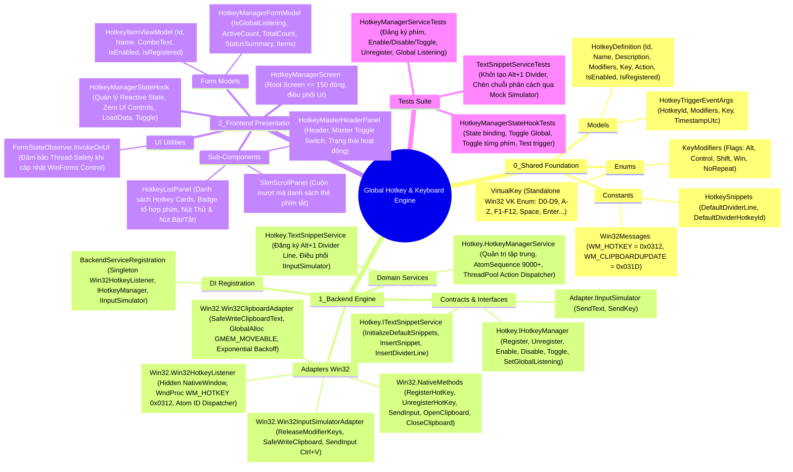
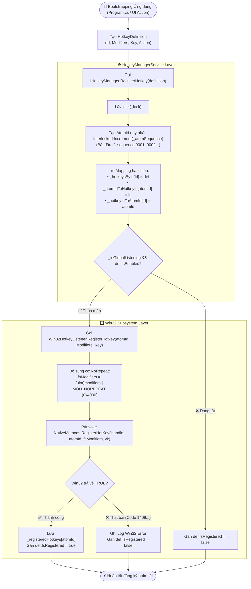
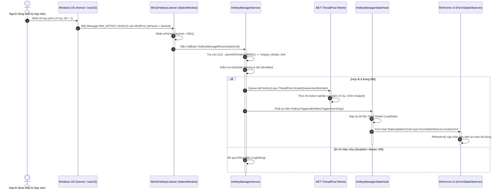
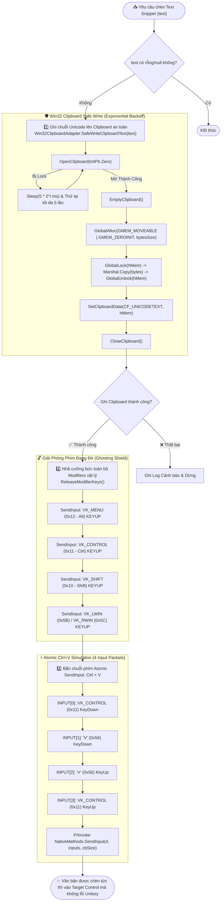
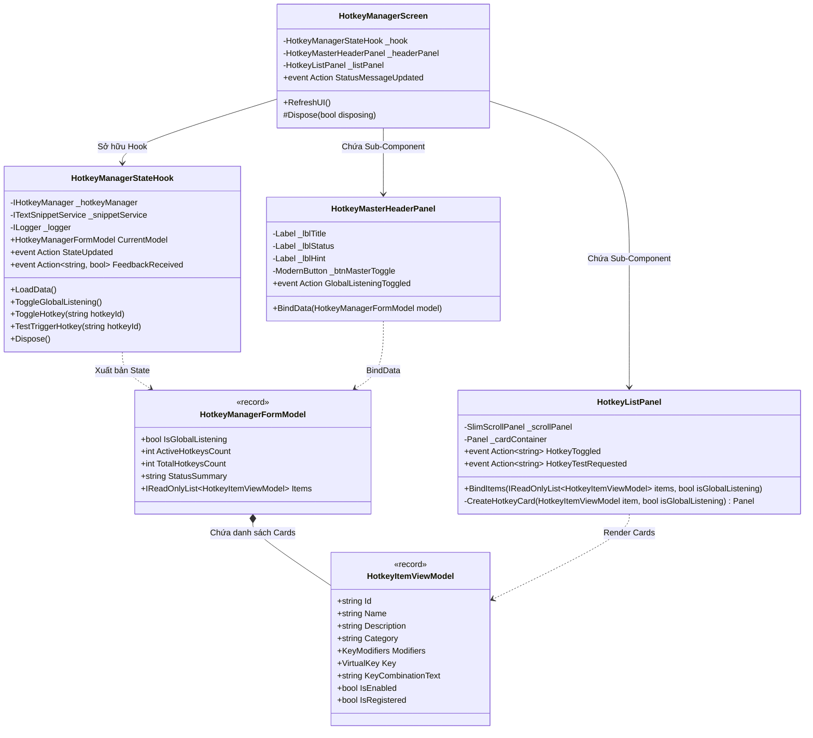
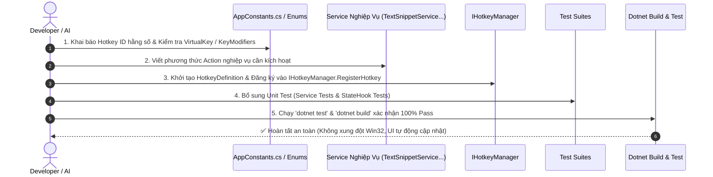
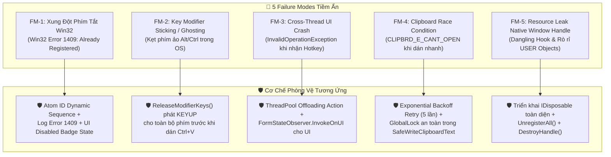

# 🧠 BẢN ĐỒ TƯ DUY & DANH SÁCH PHỤ THUỘC: MODULE KEYBOARD LISTENER & GLOBAL HOTKEY MANAGEMENT

- **Tệp tài liệu**: `Docs/Maps/03_Keyboard_Listener_Hotkey_Mindmap.md`
- **Hệ thống**: Windows Native Desktop C# .NET 6.0 (`app_forms`)
- **Kiến trúc**: Clean 3-Layer Architecture, Component-Driven Reactive UI & Native Win32 Message Pump Hook
- **Mục đích**: Cung cấp bức tranh toàn cảnh về cách module lắng nghe bàn phím, quản trị phím tắt toàn cục (Global Hotkeys), cơ chế mô phỏng gõ phím / chèn mẫu văn bản (Atomic Text Snippets), kiến trúc tách biệt Win32 Interop, ma trận đánh đổi kỹ thuật và quy trình chuẩn khi cần bảo trì/thêm mới phím tắt.

---

## 1. 🗺️ MINDMAP TỔNG THỂ HỆ THỐNG KEYBOARD LISTENER & HOTKEY



---

## 2. 🏛️ BẢNG PHÂN TẦNG KIẾN TRÚC & DANH MỤC SUB-MODULES

Toàn bộ module tuân thủ nghiêm ngặt **Clean 3-Layer Architecture**, **Platform Adapter Pattern** và **AppForms AI System Charter**:

| Phân tầng | Tên Module / Sub-module | Đường dẫn File Mã Nguồn | Trách nhiệm Nghiệp vụ Cốt lõi | Độ phức tạp |
| :--- | :--- | :--- | :--- | :---: |
| **0_Shared** | `Key Modifiers Bitmask` | [`0_Shared/Enums/KeyModifiers.cs`](0_Shared/Enums/KeyModifiers.cs) | Enum bitmask định nghĩa các phím bổ trợ (`Alt = 0x0001`, `Control = 0x0002`, `Shift = 0x0004`, `Win = 0x0008`, `NoRepeat = 0x4000`) theo chuẩn Win32 API. | $O(1)$ RAM |
| **0_Shared** | `Virtual Key Standalone` | [`0_Shared/Enums/VirtualKey.cs`](0_Shared/Enums/VirtualKey.cs) | Enum mã phím ảo độc lập (D0-D9, A-Z, F1-F12, Space, Enter, Backspace, Escape...), không phụ thuộc namespace `System.Windows.Forms`. | $O(1)$ RAM |
| **0_Shared** | `Hotkey Definition Model` | [`0_Shared/Models/Hotkey/HotkeyDefinition.cs`](0_Shared/Models/Hotkey/HotkeyDefinition.cs) | POCO Model lưu cấu hình đầy đủ của một phím tắt: `Id`, `Name`, `Description`, `Category`, `Modifiers`, `Key`, `Action` delegate, `IsEnabled`, `IsRegistered`. | $O(1)$ RAM |
| **0_Shared** | `Hotkey Trigger Event Args`| [`0_Shared/Models/Hotkey/HotkeyTriggerEventArgs.cs`](0_Shared/Models/Hotkey/HotkeyTriggerEventArgs.cs) | DTO chứa thông tin phát ra khi phím tắt được kích hoạt (`HotkeyId`, `Modifiers`, `Key`, `TimestampUtc`). | $O(1)$ Event |
| **0_Shared** | `App Constants` | [`0_Shared/Constants/AppConstants.cs`](0_Shared/Constants/AppConstants.cs) | Định nghĩa hằng số Win32 Messages (`WM_HOTKEY = 0x0312`), ID và nội dung mặc định của Text Snippets. | $O(1)$ Const |
| **1_Backend** | `Hotkey Manager Contract` | [`1_Backend/Contracts/Interfaces/Hotkey.IHotkeyManager.cs`](1_Backend/Contracts/Interfaces/Hotkey.IHotkeyManager.cs) | Interface định nghĩa hợp đồng quản trị phím tắt: Đăng ký, hủy đăng ký, bật/tắt từng phím, bật/tắt toàn cục, phát sự kiện `HotkeyTriggered`. | Interface |
| **1_Backend** | `Text Snippet Contract` | [`1_Backend/Contracts/Interfaces/Hotkey.ITextSnippetService.cs`](1_Backend/Contracts/Interfaces/Hotkey.ITextSnippetService.cs) | Interface quản lý các đoạn văn bản mẫu cần chèn tự động vào ứng dụng active của người dùng. | Interface |
| **1_Backend** | `Input Simulator Contract`| [`1_Backend/Contracts/Interfaces/Adapter.IInputSimulator.cs`](1_Backend/Contracts/Interfaces/Adapter.IInputSimulator.cs) | Interface trừu tượng hóa hành vi mô phỏng gõ bàn phím và gửi chuỗi phím giả lập độc lập hệ điều hành. | Interface |
| **1_Backend** | `Win32 Native Methods` | [`1_Backend/Adapters/Win32/Win32.NativeMethods.cs`](1_Backend/Adapters/Win32/Win32.NativeMethods.cs) | Khai báo P/Invoke Win32 API: `RegisterHotKey`, `UnregisterHotKey`, `SendInput`, `OpenClipboard`, `SetClipboardData`, struct `INPUT`, `KEYBDINPUT`. | $O(1)$ Native |
| **1_Backend** | `Win32 Hotkey Listener` | [`1_Backend/Adapters/Win32/Win32.Win32HotkeyListener.cs`](1_Backend/Adapters/Win32/Win32.Win32HotkeyListener.cs) | Kế thừa `System.Windows.Forms.NativeWindow` tạo cửa sổ ẩn, đón bắt thông điệp `WM_HOTKEY (0x0312)` từ Windows Message Pump, tự động thêm cờ `MOD_NOREPEAT (0x4000)` chống phím lặp, bắn sự kiện `HotkeyMessageReceived(atomId)`. | $O(1)$ OS Pump |
| **1_Backend** | `Win32 Input Simulator` | [`1_Backend/Adapters/Win32/Win32.Win32InputSimulatorAdapter.cs`](1_Backend/Adapters/Win32/Win32.Win32InputSimulatorAdapter.cs) | Thực thi `IInputSimulator` với cơ chế **Atomic Clipboard Paste**: Nhả phím modifier (`ReleaseModifierKeys`), ghi Clipboard an toàn (`SafeWriteClipboardText`), gửi `SendInput` Ctrl+V dán văn bản tức thì. | $O(1)$ Input Stream |
| **1_Backend** | `Win32 Clipboard Adapter` | [`1_Backend/Adapters/Win32/Win32.Win32ClipboardAdapter.cs`](1_Backend/Adapters/Win32/Win32.Win32ClipboardAdapter.cs) | Giao tiếp Win32 Native Memory (`GlobalAlloc`, `GlobalLock`, `CF_UNICODETEXT`), cơ chế Exponential Backoff Retry (5 lần) đảm bảo ghi dữ liệu an toàn ngay cả khi Clipboard bị lock. | $O(N)$ Bytes Copy |
| **1_Backend** | `Hotkey Manager Service` | [`1_Backend/Services/Hotkey/Hotkey.HotkeyManagerService.cs`](1_Backend/Services/Hotkey/Hotkey.HotkeyManagerService.cs) | **Trọng tâm quản trị Hotkey**: Cấp phát mã định danh số học (`_atomSequence` 9000+), tra cứu hai chiều `ConcurrentDictionary`, điều phối Action bất đồng bộ qua `ThreadPool.UnsafeQueueUserWorkItem` tránh block Message Loop. | $O(1)$ Tra cứu RAM |
| **1_Backend** | `Text Snippet Service` | [`1_Backend/Services/Hotkey/Hotkey.TextSnippetService.cs`](1_Backend/Services/Hotkey/Hotkey.TextSnippetService.cs) | Đăng ký snippet phân cách mặc định (`Alt + 1` $\to$ `================================================`), ủy quyền mô phỏng gõ phím cho `IInputSimulator`. | $O(1)$ Service |
| **1_Backend** | `DI Backend Registration`| [`1_Backend/Infrastructure/BackendServiceRegistration.cs`](1_Backend/Infrastructure/BackendServiceRegistration.cs) | Đăng ký Singleton cho `Win32HotkeyListener`, `IHotkeyManager`, `IInputSimulator`, `ITextSnippetService`. | $O(1)$ DI Boot |
| **2_Frontend** | `Hotkey Root Screen` | [`2_Frontend/Screens/HotkeyManager/HotkeyManagerScreen.cs`](2_Frontend/Screens/HotkeyManager/HotkeyManagerScreen.cs) | Root Screen mỏng ($\le 150$ dòng - thực tế 79 dòng), kết nối StateHook với UI Panels, đảm bảo `FormStateObserver.InvokeOnUI`. | $O(1)$ Dispatch |
| **2_Frontend** | `Screen State Hook` | [`2_Frontend/Screens/HotkeyManager/Hooks/HotkeyManagerStateHook.cs`](2_Frontend/Screens/HotkeyManager/Hooks/HotkeyManagerStateHook.cs) | Quản lý Reactive State, biến đổi Entity sang ViewModel, xử lý toggle Master/Individual, chạy thử nghiệm phím tắt, bắn `StateUpdated` và `FeedbackReceived`. | $O(1)$ State Event |
| **2_Frontend** | `Hotkey Form Models` | [`2_Frontend/Screens/HotkeyManager/Models/HotkeyManagerFormModel.cs`](2_Frontend/Screens/HotkeyManager/Models/HotkeyManagerFormModel.cs) | Record DTO định nghĩa trạng thái giao diện: `HotkeyItemViewModel` (từng thẻ) và `HotkeyManagerFormModel` (toàn màn hình). | $O(1)$ RAM |
| **2_Frontend** | `Master Header Panel` | [`2_Frontend/Screens/HotkeyManager/Components/HotkeyMasterHeaderPanel.cs`](2_Frontend/Screens/HotkeyManager/Components/HotkeyMasterHeaderPanel.cs) | Sub-Component hiển thị Header, tóm tắt trạng thái hệ thống và nút công tắc Master Toggle Bật/Tắt toàn cục. | $O(1)$ UI Render |
| **2_Frontend** | `Hotkey List Panel` | [`2_Frontend/Screens/HotkeyManager/Components/HotkeyListPanel.cs`](2_Frontend/Screens/HotkeyManager/Components/HotkeyListPanel.cs) | Sub-Component dạng cuộn (`SlimScrollPanel`) render danh sách các Hotkey Cards kèm Badges tổ hợp phím, nút Thử nghiệm và nút Bật/Tắt. | $O(K)$ Cards Render |
| **Tests** | `Hotkey Service Tests` | [`Tests/Backend/HotkeyManagerServiceTests.cs`](Tests/Backend/HotkeyManagerServiceTests.cs) | Kiểm thử đăng ký phím, tra cứu, Enable/Disable/Toggle, Unregister và công tắc Master Listening. | 100% Pass |
| **Tests** | `Text Snippet Tests` | [`Tests/Backend/TextSnippetServiceTests.cs`](Tests/Backend/TextSnippetServiceTests.cs) | Kiểm thử đăng ký phím tắt Alt+1 mặc định và chèn chuỗi Divider Line qua `MockInputSimulator`. | 100% Pass |
| **Tests** | `StateHook Tests` | [`Tests/Frontend/HotkeyManagerStateHookTests.cs`](Tests/Frontend/HotkeyManagerStateHookTests.cs) | Kiểm thử StateHook nạp dữ liệu ViewModel, đảo trạng thái Master/Individual, và kích hoạt Action thử nghiệm. | 100% Pass |

---

## 3. 🔄 LUỒNG ĐĂNG KÝ & VÒNG ĐỜI XỬ LÝ SỰ KIỆN (EVENT LIFECYCLE & MESSAGE PUMP FLOW)

Hệ thống xử lý phím tắt hoạt động thông qua cơ chế tích hợp sâu với **Windows Message Pump (`WM_HOTKEY = 0x0312`)**, đảm bảo nhận diện phím tức thì ở cấp độ Kernel/OS ngay cả khi ứng dụng đang chạy nền, thu nhỏ xuống Taskbar hoặc người dùng đang làm việc trên ứng dụng khác (Zalo, Chrome, Notepad, Excel...).

### 3.1. Luồng Đăng Ký Phím Tắt (Registration Flow)



---

### 3.2. Luồng Vòng Đời Kích Hoạt Sự Kiện (Trigger & Execution Flow)



---

## 4. ⚡ CƠ CHẾ MÔ PHỎNG GÕ PHÍM & CHÈN TEXT SNIPPETS (`Win32InputSimulatorAdapter`)

### 4.1. Vấn Đề Kỹ Thuật Với Gõ Phím Ký Tự Trực Tiếp (Direct Unicode Key Injection)
- **Vấn đề 1**: Gõ từng ký tự Unicode (`KEYEVENTF_UNICODE`) với các chuỗi dài (như đường kẻ phân cách `====...` hoặc mẫu tin nhắn) làm tốc độ nhập bị chậm, tạo hiệu ứng giật cục.
- **Vấn đề 2**: Xung đột với các bộ gõ tiếng Việt (Unikey, EVKey, OpenKey) ở chế độ Telex/VNI khiến ký tự bị biến dạng (ví dụ `d` biến thành `đ`, `s` biến thành dấu sắc).
- **Vấn đề 3**: Trạng thái **Kẹt Phím Modifier Ảo (Key Modifier Sticking)**: Khi người dùng bấm `Alt + 1`, ngón tay người dùng vẫn đang đè phím `Alt`. Nếu ứng dụng gửi lệnh gõ ngay lập tức, hệ điều hành sẽ hiểu nhầm là `Alt + [Ký tự]` $\to$ kích hoạt menu ứng dụng ngoài ý muốn.

### 4.2. Giải Pháp Toàn Diện: Atomic Clipboard + Ctrl+V Simulation Pipeline



---

## 5. 🎨 THIẾT KẾ STATE HOOK & COMPONENT-DRIVEN UI

Giao diện màn hình Hotkey Manager được xây dựng theo chuẩn **AppForms Component-Driven Architecture**:
- Tách biệt tuyệt đối giữa State Logic (`HotkeyManagerStateHook`) và UI Controls (`UserControl`, `Panel`).
- Màn hình chính [`HotkeyManagerScreen`](2_Frontend/Screens/HotkeyManager/HotkeyManagerScreen.cs) cực kỳ tinh gọn (**79 dòng**, tuân thủ nghiêm ngặt chuẩn $\le 150$ dòng).



---

## 6. 📑 DANH MỤC HOTKEYS HIỆN TẠI & KHẢ NĂNG MỞ RỘNG

### 6.1. Danh Mục Phím Tắt Mặc Định Hiện Có

| Hotkey ID | Tên Nghiệp Vụ | Tổ Hợp Phím | Phân Loại | Hành Vi Chi Tiết (Action) | Trạng Thái Mặc Định |
| :--- | :--- | :---: | :---: | :--- | :---: |
| `snippet_divider_line` | **Chèn dòng kẻ phân cách** | `Alt + 1` | `Snippets` | Tự động dán chuỗi `================================================` tại vị trí con trỏ hiện tại của người dùng. | 🟢 BẬT (Active) |

### 6.2. Danh Mục Phím Tắt Đề Xuất Mở Rộng Trong Tương Lai

| Dự Kiến Hotkey ID | Tên Tính Năng Mở Rộng | Tổ Hợp Phím Đề Xuất | Category | Nghiệp Vụ Tích Hợp |
| :--- | :--- | :---: | :---: | :--- |
| `snippet_greeting_template` | Chèn lời chào khách hàng | `Alt + 2` | `Snippets` | Tự động chèn mẫu lời chào và thông tin liên hệ CTV Sale. |
| `snippet_room_spec_template` | Chèn khung thông số phòng | `Alt + 3` | `Snippets` | Chèn mẫu chuẩn: `📍 Địa chỉ: ... / ☘ Giá: ... / ⌛️ Trống: ...`. |
| `action_clean_clipboard_msg` | Lọc sạch tin nhắn Clipboard | `Ctrl + Shift + C` | `Actions` | Kích hoạt Pipeline lọc hoa hồng/rác của Clipboard ngay lập tức. |
| `action_quick_lead_convert` | Chuyển đổi Lead siêu tốc | `Ctrl + Shift + L` | `Actions` | Bóc tách tin nhắn trên Clipboard và định dạng thành Schema chuẩn. |
| `action_toggle_app_visibility` | Ẩn / Hiện Cửa Sổ Ứng Dụng | `Ctrl + Shift + S` | `Navigation` | Kích hoạt `MainForm` nổi lên trên cùng hoặc ẩn xuống System Tray. |

---

## 7. 🛠️ PLAYBOOK: QUY TRÌNH 5 BƯỚC THÊM PHÍM TẮT / TÍNH NĂNG KÍCH HOẠT MỚI

Khi cần bổ sung một phím tắt toàn cục mới (ví dụ: chèn snippet mới, kích hoạt tính năng chuyển đổi lead, hoặc chụp màn hình), thực hiện theo 5 bước chuẩn hóa sau:



### Chi tiết 5 bước thực hiện:

### 🔹 Bước 1: Khai Báo Định Danh & Hằng Số
- Mở `0_Shared/Constants/AppConstants.cs` $\to$ Bổ sung hằng số định danh:
  ```csharp
  public static class HotkeySnippets
  {
      public const string DefaultDividerLine = "================================================";
      public const string DefaultDividerHotkeyId = "snippet_divider_line";
      public const string GreetingSnippetHotkeyId = "snippet_greeting_template"; // Phím mới
  }
  ```
- Nếu dùng phím đặc biệt chưa có trong `VirtualKey.cs` $\to$ Bổ sung mã ASCII/Win32 Virtual Key tương ứng.

### 🔹 Bước 2: Xây Dựng Action Nghiệp Vụ Cốt Lõi
- Viết hàm thực thi nghiệp vụ trong Domain Service tương ứng (ví dụ `TextSnippetService.cs` hoặc `NavigationService.cs`):
  ```csharp
  public void InsertGreetingSnippet()
  {
      InsertSnippet("Dạ em chào anh/chị ạ! Em gửi anh/chị thông tin phòng bên em:");
  }
  ```

### 🔹 Bước 3: Đăng Ký HotkeyDefinition Vào `IHotkeyManager`
- Khởi tạo `HotkeyDefinition` và gọi `_hotkeyManager.RegisterHotkey(definition)`:
  ```csharp
  var greetingHotkey = new HotkeyDefinition(
      id: AppConstants.HotkeySnippets.GreetingSnippetHotkeyId,
      name: "Chèn lời chào khách",
      description: "Tự động gõ mẫu chào hỏi khách hàng nhanh",
      modifiers: KeyModifiers.Alt,
      key: VirtualKey.D2,
      action: InsertGreetingSnippet,
      category: "Snippets",
      isEnabled: true
  );
  _hotkeyManager.RegisterHotkey(greetingHotkey);
  ```

### 🔹 Bước 4: Viết Test Case Xác Thực Độc Lập
- Mở `Tests/Backend/TextSnippetServiceTests.cs` $\to$ Thêm unit test kiểm tra đăng ký và thực thi action qua `MockInputSimulator`.
- Mở `Tests/Frontend/HotkeyManagerStateHookTests.cs` $\to$ Xác thực `LoadData()` nạp đúng ViewModel và định dạng chuỗi tổ hợp phím (vd: `Alt + 2`).

### 🔹 Bước 5: Chạy Kiểm Thử Toàn Diện
- Thực thi kiểm tra trên terminal:
  ```powershell
  dotnet test
  dotnet build
  ```
- Đảm bảo **100% Test Passed**, không có cảnh báo rò rỉ hoặc lỗi gán Native Handle.

---

## 8. ⚖️ MA TRẬN ĐÁNH ĐỔI KỸ THUẬT & 🛡️ 5 FAILURE MODES PHÒNG NGỪA SỰ CỐ

### 8.1. Ma Trận Đánh Đổi Kỹ Thuật (Technical Trade-offs Matrix)

| Tiêu Chí So Sánh | Win32 `RegisterHotKey` (Lựa chọn của AppForms) | Low-Level Keyboard Hook (`WH_KEYBOARD_LL`) | Polling Loop (`GetAsyncKeyState`) | Raw Input API (`WM_INPUT`) |
| :--- | :--- | :--- | :--- | :--- |
| **Mức độ chiếm dụng CPU** | 🟢 **Gần như 0%** (Event-driven từ OS Message Pump) | 🟡 Thấp (Phải xử lý mọi keypress của toàn hệ thống) | 🔴 **Rất cao** (Vòng lặp vô tận kiểm tra trạng thái) | 🟢 Rất thấp |
| **Độ trễ phản hồi (Latency)** | 🟢 **Tức thì (< 1ms)** | 🟡 1 - 5ms (Phụ thuộc chuỗi hook trong OS) | 🔴 10 - 50ms (Phụ thuộc chu kỳ sleep) | 🟢 Tức thì |
| **Ảnh hưởng gõ phím hệ thống** | 🟢 **Không ảnh hưởng** (Chỉ nuốt tổ hợp phím đã đăng ký) | 🔴 **Nguy hiểm**: Nếu hook handler chạy quá 200ms, Windows sẽ âm thầm tháo bỏ hook | 🟢 Không ảnh hưởng | 🟢 Không ảnh hưởng |
| **Xung đột Antivirus (AV)** | 🟢 **An toàn tuyệt đối** (Win32 API chuẩn của Windows) | 🔴 **Rất dễ bị AV chặn** (Bị nhận diện nhầm là Keylogger) | 🟡 Dễ bị nghi ngờ | 🟢 An toàn |
| **Khả năng nuốt phím (Consume Key)** | 🟢 **Tự động** (Windows không đẩy phím vào app đang focus) | 🟢 Kiểm soát thủ công (Return 1) | 🔴 **Không thể nuốt phím** (App focus vẫn nhận phím) | 🔴 Không thể nuốt phím |
| **Yêu cầu Cửa sổ (Window Handle)** | 🟡 Cần `HWND` (Đã giải quyết bằng hidden `NativeWindow`) | 🟢 Không cần HWND | 🟢 Không cần HWND | 🟡 Cần HWND |

---

### 8.2. Phân Tích Chuyên Sâu 5 Failure Modes (FM) & Cơ Chế Phòng Ngự



#### 🔴 FM-1: Xung Đột Đăng Ký Phím Tắt Win32 (`ERROR_HOTKEY_ALREADY_REGISTERED` - Error 1409)
- **Kịch bản sự cố**: Người dùng chạy đồng thời một ứng dụng khác (Discord, OBS, Geforce Experience, Unikey, Photoshop) đã chiếm trước tổ hợp phím `Alt + 1`.
- **Hậu quả nếu không xử lý**: Hàm `RegisterHotKey` trả về `FALSE`, ứng dụng nếu không kiểm tra sẽ ngộ nhận phím đã bật, người dùng bấm phím không có phản hồi và không rõ lý do.
- **Cơ chế phòng thủ của AppForms**:
  1. [`Win32HotkeyListener`](1_Backend/Adapters/Win32/Win32.Win32HotkeyListener.cs#L60-L63) kiểm tra kết quả `Marshal.GetLastWin32Error()`, ghi log chi tiết mã lỗi `1409`.
  2. Gán cờ `def.IsRegistered = false` trong [`HotkeyManagerService`](1_Backend/Services/Hotkey/Hotkey.HotkeyManagerService.cs#L81).
  3. Giao diện [`HotkeyListPanel`](2_Frontend/Screens/HotkeyManager/Components/HotkeyListPanel.cs#L95) phát hiện trạng thái chưa đăng ký OS để chuyển màu chữ/badge sang màu xám cảnh báo (`AppColors.TextMuted`), bảo vệ ứng dụng không bao giờ bị Crash.

#### 🔴 FM-2: Key Modifier Sticking / Ghosting (Phím Alt / Ctrl Bị Kẹt Ảo Trong Hệ Điều Hành)
- **Kịch bản sự cố**: Khi người dùng nhấn `Alt + 1`, ngón tay cái vẫn đang giữ phím `Alt`. Lúc này `Win32InputSimulatorAdapter` kích hoạt phím `Ctrl + V` để dán dữ liệu. Do phím `Alt` vẫn đang ở trạng thái vật lý `KeyDown`, hệ điều hành sẽ ghi nhận tổ hợp `Ctrl + Alt + V` (hoặc `Alt + V`), gây mở menu View hoặc Paste Special ngoài ý muốn.
- **Hậu quả**: Không dán được nội dung, ứng dụng đích bị nhảy focus hoặc mở các hộp thoại chức năng không mong muốn.
- **Cơ chế phòng thủ của AppForms**:
  - Hàm [`ReleaseModifierKeys()`](1_Backend/Adapters/Win32/Win32.Win32InputSimulatorAdapter.cs#L71-L82) luôn được gọi **trước khi** phát lệnh dán. Hàm này gửi cưỡng bức sự kiện `KEYEVENTF_KEYUP` cho toàn bộ các phím bổ trợ:
    - `0x12` (`VK_MENU` - Alt)
    - `0x11` (`VK_CONTROL` - Ctrl)
    - `0x10` (`VK_SHIFT` - Shift)
    - `0x5B` (`VK_LWIN` - Windows Trái)
    - `0x5C` (`VK_RWIN` - Windows Phải)

#### 🔴 FM-3: Cross-Thread UI Crash Khi Nhận Sự Kiện Hotkey
- **Kịch bản sự cố**: Sự kiện `WM_HOTKEY` được bắt bởi Message Pump của NativeWindow ẩn. Khi phát sự kiện `HotkeyTriggered`, nếu code gọi trực tiếp thay đổi thuộc tính WinForms Control (như `label.Text = ...`), Windows Forms sẽ quăng ngay ngoại lệ nghiêm trọng: `InvalidOperationException: Cross-thread operation not valid: Control accessed from a thread other than the thread it was created on`.
- **Cơ chế phòng thủ của AppForms**:
  1. [`HotkeyManagerService`](1_Backend/Services/Hotkey/Hotkey.HotkeyManagerService.cs#L260-L271) điều phối Action nghiệp vụ nặng vào Worker ThreadPool qua `ThreadPool.UnsafeQueueUserWorkItem`, giải phóng ngay lập tức Native Message Loop.
  2. Mọi thông báo trạng thái hoặc cập nhật StateHook trên giao diện đều được bọc qua [`FormStateObserver.InvokeOnUI`](2_Frontend/Screens/HotkeyManager/HotkeyManagerScreen.cs#L50-L55), tự động kiểm tra `control.InvokeRequired` và `control.IsDisposed` trước khi thực thi.

#### 🔴 FM-4: Clipboard Race Condition & Lock Khi Dán Nhanh Liên Tục
- **Kịch bản sự cố**: Khi người dùng nhấn phím tắt dán liên tục, hoặc đang mở ứng dụng quản lý lịch sử Clipboard (Windows Clipboard History `Win+V`, Ditto, ClipClip), hàm Win32 `OpenClipboard` sẽ trả về `FALSE` do Clipboard đang bị tiến trình khác chiếm giữ độc quyền.
- **Cơ chế phòng thủ của AppForms**:
  - [`Win32ClipboardAdapter.SafeWriteClipboardText`](1_Backend/Adapters/Win32/Win32.Win32ClipboardAdapter.cs#L81-L139) áp dụng thuật toán **Exponential Backoff Retry** (thử lại tối đa 5 lần với thời gian chờ $5 \times 2^i$ ms = 5ms, 10ms, 20ms, 40ms, 80ms).
  - Quản lý bộ nhớ native chặt chẽ: Dùng `GlobalAlloc(GMEM_MOVEABLE | GMEM_ZEROINIT)`, nếu `SetClipboardData` thất bại sẽ lập tức gọi `GlobalFree(hMem)` để tránh rò rỉ bộ nhớ unmanaged.

#### 🔴 FM-5: Resource Leak Native Window Handle & Dangling Win32 Hook
- **Kịch bản sự cố**: Khi đóng form hoặc thoát ứng dụng đột ngột mà không unregister các Hotkey đã đăng ký với Windows Kernel, các tổ hợp phím này sẽ tiếp tục bị hệ điều hành chặn và nuốt phím cho đến khi tiến trình bị hủy hoàn toàn hoặc khởi động lại máy.
- **Cơ chế phòng thủ của AppForms**:
  1. Cả `Win32HotkeyListener` và `HotkeyManagerService` đều cài đặt chuẩn `IDisposable`.
  2. Hàm [`Dispose()`](1_Backend/Adapters/Win32/Win32.Win32HotkeyListener.cs#L117-L130) duyệt qua toàn bộ danh sách phím để gọi `UnregisterHotKey(Handle, atomId)`, sau đó hủy hoàn toàn cửa sổ ẩn qua `DestroyHandle()`.
  3. Xóa sạch các Event Handlers (`HotkeyMessageReceived = null`, `HotkeyTriggered = null`) nhằm tránh rò rỉ tham chiếu đối tượng (Memory Leak qua Event Listener).
