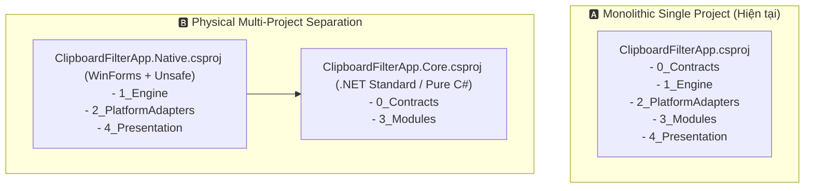

# 🧠 Playbook: Đánh Đổi Monolithic .csproj vs Multi-Project Solution

> **Ngữ cảnh áp dụng:** Khi xem xét cấu trúc Solution, tách gói dự án hoặc phân lập ranh giới vật lý giữa Pure Logic và Windows OS Platform.

---

## 1. Bản Chất Bài Toán

Dự án hiện tại tổ chức Clean Architecture 5 tầng bên trong **1 file `.csproj` duy nhất** (`src/ClipboardFilterApp.csproj`) có bật sẵn `<UseWindowsForms>true</UseWindowsForms>` và `<AllowUnsafeBlocks>true</AllowUnsafeBlocks>`.

---

## 2. Bảng Ma Trận Đánh Đổi

| Tiêu Chí | 🅰️ Phương Án A: Single Project Monolith | 🅱️ Phương Án B: Tách 2 Projects (.Core & .Native) |
| :--- | :--- | :--- |
| **Cơ chế** | Toàn bộ 5 tầng nằm trong 1 project; bảo vệ ranh giới bằng thư mục và CI Linter/Arch Rules. | Tách vật lý thành `ClipboardFilterApp.Core` (Pure C#) và `ClipboardFilterApp.Native` (Windows OS). |
| **Ưu điểm (Gains)** | • Cấu hình cực kỳ đơn giản, build 1 lệnh là xong. • Không bị overhead quản lý nhiều file `.csproj`, dễ refactor tên lớp. | • Compiler **bảo vệ cơ học 100%**: `3_Modules` không thể vô tình gọi `Windows.Forms` hay P/Invoke vì không có reference. • `Core` có thể tái sử dụng cho Linux/Web nếu cần. |
| **Nhược điểm (Pains)** | • Compiler không chặn được nếu dev khác vô tình import `System.Windows.Forms` vào `3_Modules` (phải dựa vào Roslyn Analyzer hoặc Hooks). | • Quản lý nhiều project, cấu trúc solution cồng kềnh hơn cho một ứng dụng nhỏ gọn. |
| **Đánh giá phù hợp** | ✅ **Phù hợp giai đoạn MVP & Hiện tại** (kết hợp với Hooks `.agent/hooks/` để chặn vi phạm). | 🔮 **Cân nhắc khi mở rộng sang v2** (nhiều platform hoặc team đông dev). |
